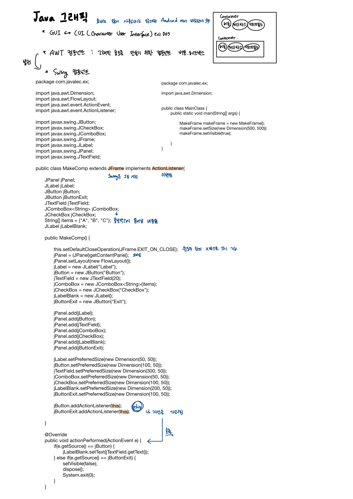
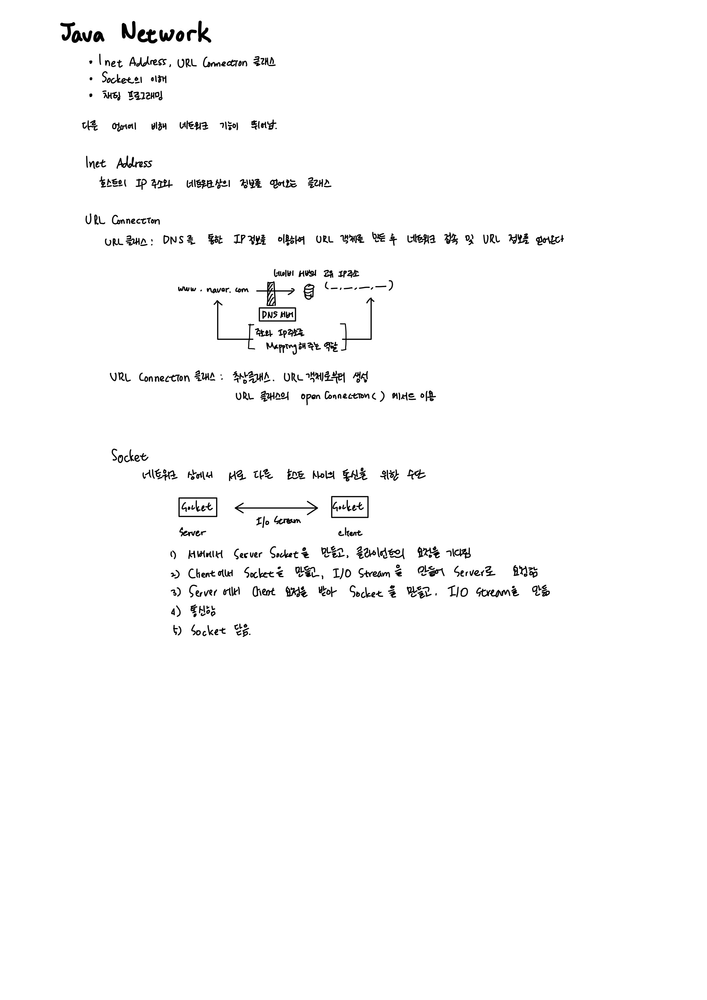

> 개념보충

## 람다식 변환 

`(int a, int b ) -> a > b ? a : b `		

`(String name, int i) -> {System.out.println(name + "=" + i);}`		

`(int x ) -> x * x`

`() -> {return (int)(Math.random()*6) ;}`

`(int[] arr) -> {int sum = 0; for(int i : arr) sum+=i; return sum;}`


</br>


### 람다식으로 정의된 익명객체를  호출하는 방법은 ?

```java
package test.solution28;

import java.util.*;

interface MyFunction {
	public abstract int max(int a, int b);
}

public class Lamda {

	public static void main(String[] args) {
		MyFunction mf = new MyFunction() {

			@Override
			public int max(int a, int b) {
				return a > b ? a : b;
			}
		};
		int big = mf.max(5, 3);
		System.out.println(big); 	//5

	}
}

```

</br>

`public int max(int a, int b) {
				return a > b ? a : b;
			}`

이부분은 `(int a, int b) -> a>b ? a: b ` 와 일치하기 때문에 익명객체로 바꿔주면 ?

```java
package test.solution28;

import java.util.*;
@FunctionalInterface
interface MyFunction {
	public abstract int max(int a, int b);
}

public class Lamda {

	public static void main(String[] args) {
		MyFunction mf = (int a, int b) -> a > b ? a : b;
		int big = mf.max(5, 3);

	}
}
```

람다식 또한 익명 객체,

max() 메서드와 일치한다. 뭐가 ? 람다식의 매개변수 타입, 개수, 반환값이

*`@FunctionalInterface` : 함수형 인터페이스를 올바르게 정의하였는지 확인해준다.*


</br>


## 함수형 인터페이스 타입의 매개변수와 반환타입

```java
package test.solution28;

import java.util.*;

@FunctionalInterface
interface MyFunction {
	void run();
}

class LamdaEx1 {
  
  //매개변수의 타입이 MyFunction
	static void execute(MyFunction f) {
		f.run();
	}

  
  //반환 타입이 MyFunction
	static MyFunction getMyFunction() {
		MyFunction f = () -> System.out.println("f3.run()");
		return f;
	}

	public static void main(String[] args) {
		
		MyFunction f1 = () -> System.out.println("f1.run()");

		MyFunction f2 = new MyFunction() {

			@Override
			public void run() {
				System.out.println("f2.run()");

			}
		};

		MyFunction f3 = getMyFunction();

		f1.run();
		f2.run();
		f3.run();

		execute(f1);
    
    //매개변수에 바로 람다식을 사용 가능하다
		execute(() -> System.out.println("run()"));
	}
}


====================================================================================
f1.run()
f2.run()
f3.run()
f1.run()
run()

```


</br>

## 람다식의 타입과 형변환

람다식을 참조하는 것일 뿐, 람다식의 타입이 함수형 인터페이스의 타입과 일치하는 것이 아님.

람다식은 익명객체 -> 익명객체는 타입이 없다.

람다식은 오직 함수형 인터페이스로만 형변환이 가능

`interface MyFunction{void method();}`

`MyFunction f = (MyFunction)( () -> {} );`  

`MyFunction f = (Object)( () -> {} );`   --> 오류

</br>

### Object 타입으로 형변환 하려면

`MyFunction f = (Object)(MyFunction)( () -> {} );`  
`String str = ((Object)(MyFunction)( () -> {} )).toString();`  

</br>

</br>




