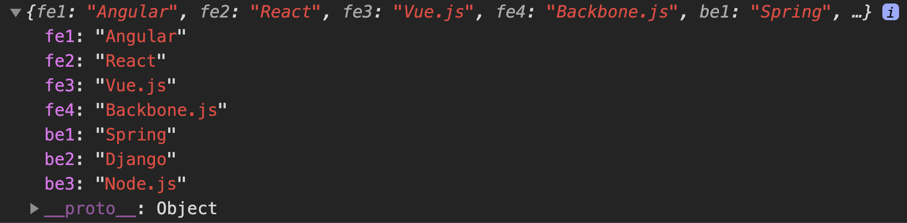
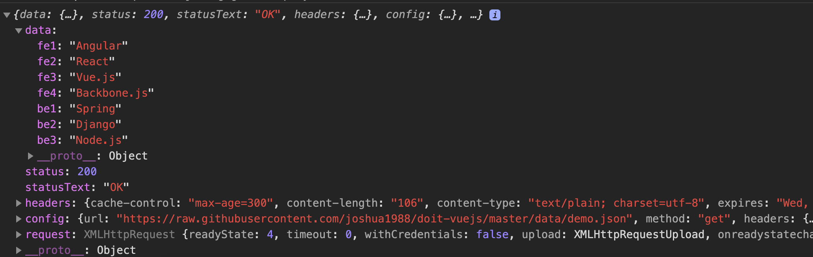
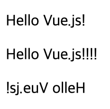
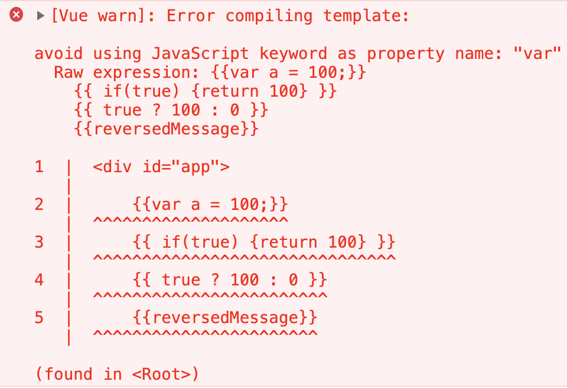
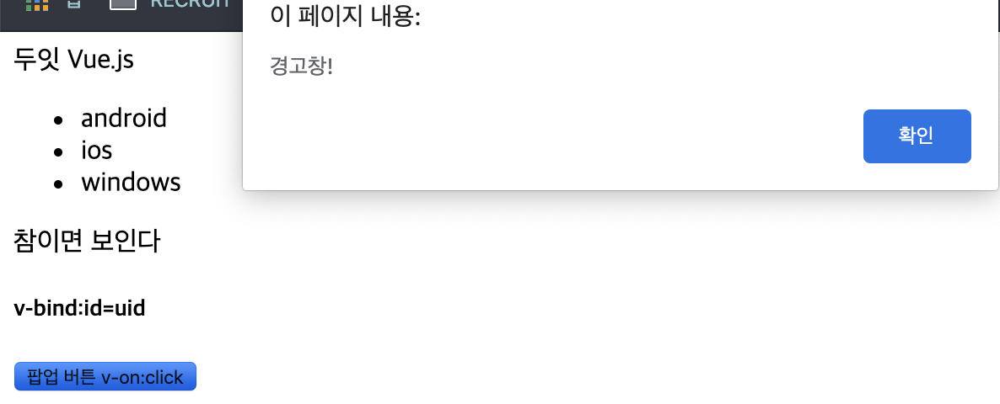
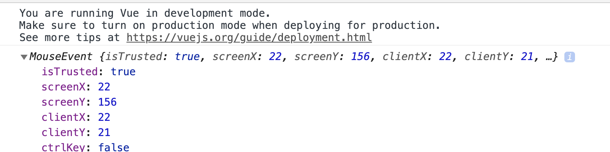
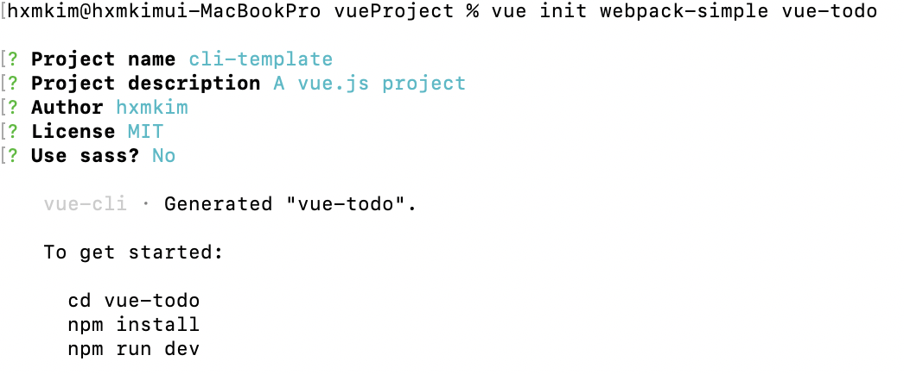
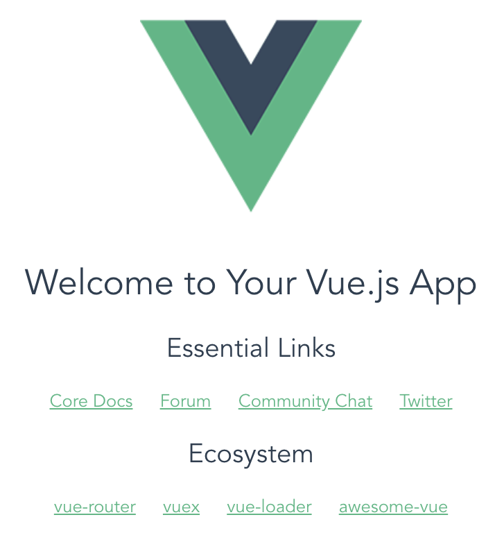
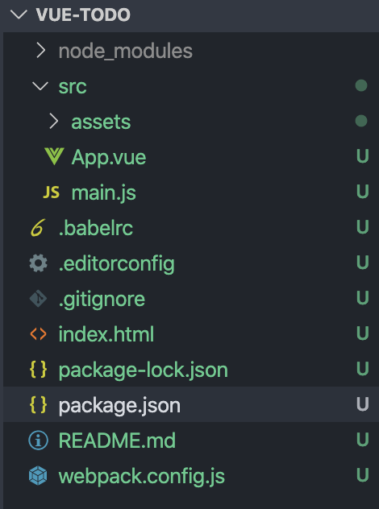

# Vue


## 뷰 컴포넌트 통신

이전에는 한 화면을 하나의 뷰로 취급 : 언제든지 호출이 가능

뷰에서는 컴포넌트 단위로 다루기 때문에 호출이 불가능 ( scope가 독립적 )


### 상위에서 하위 컴포넌트로 데이터 전달 (`props`)

```javascript
Vue.component('child-component',{
        props:['props속성 이름'],
    });
```

```html
<child-component v-bind:props 속성이름 = "상위 컴포넌트의 data속성"></child-component>
```


### 하위에서 상위 컴포넌트로 이벤트 전달 

> 이벤트를 발생 (event emit) 시켜 상위 컴포넌트에 신호를 보낸다.

- 데이터를 전달할 수는 없나 ?  *이벤트 버스*로 가능 ( 단, 단방향 데이터 흐름에 어긋난다.)

- 이벤트 발생 & 수신 형식

  - 수신 : `$emit()` , `v-on:`

    1. `this.$emit('이벤트명');  `
    2. `<child-component v-on:이벤트명="상위 컴포넌트의 메서드 명"></child-compoent>`

    

#### 이밴트버스

- 같은 레벨의 컴포넌트에 참조가 불가능하다 (단방향 규칙 때문)

- 이렇게 되면 강제로 상위 컴포넌트를 만들어 참조해야 할 수 밖에 없다.

- 이를 개선하기 위해 <u>이벤트 버스</u>를 활용한다.

- props를 활용하지 않고도 컴포넌트간에 직접적으로 데이터를 전달 할 수 있다.

  - 하지만 수가 많아지면 구분이 어려워짐
  - 뷰엑스라는 상태관리도구가 필요함.

  ```javascript
  // ===============  기본 형식  ===============
  
  // 이벤트버스를 위한 추가 인스턴스를 별개로 만들어 준다.
  var eventBus = new Vue();
  
  //이벤트를 보내는 컴포넌트  $emit
  method:{
    메서드명 : function(){
      eventBus.$emit('이벤트명', 데이터);
    }
  }
  
  // 이벤트를 받는 컴포넌트  $on
  methods:{
    created:function(){
      eventBus.$on('이벤트명',function(데이터){
        ....
      })
    }
  }
  ```


- ```javascript
   var eventBus = new Vue();
    
      Vue.component('child-component',{
          template:'<div>하위 컴포넌트 영역입니다. <button v-on:click="showLog">show</button></div>',
          methods:{
              showLog:function(){
                  eventBus.$emit('triggerEventBus',100);
              }
          }
    
      })
   	
   new Vue({
         el:'#app',
         created:function(){
             eventBus.$on('triggerEventBus',function(value){
                 console.log('이벤트를 전달 받음 , 전달받은 값 : ' + value)
             })
         }
     })
   ```


## 뷰라우터

  ```html
<!DOCTYPE html>
<html lang="en">

<head>
    <meta charset="UTF-8">
    <meta name="viewport" content="width=device-width, initial-scale=1.0">
    <title>Document</title>
</head>

<body>

    <div id="app">
    <h3>Router 예제</h3>
    <p>
      
  <!-- ==================== 1 ====================-->
        <router-link to="/main">Main Component로 이동</router-link>
        <router-link to="/login">Login Component로 이동</router-link>
    </p>
      
      
 <!-- ==================== 2 ====================-->
    <router-view></router-view>
</div>

</body>


<script src="https://cdn.jsdelivr.net/npm/vue/dist/vue.js"></script>
<script src="https://unpkg.com/vue-router/dist/vue-router.js"></script>
<script>
  
  // ==================== 3 ====================
  // Main, Login 컴포넌트 정의
    var Main = {
        template: '<div>main</div>'
    };
    var Login = {
        template: '<div>Login</div>'
    }

    
  // ==================== 4 ====================
    var routes = [
        {
            path: '/main',
            component: Main
        },
        {
            path: '/login',
            component: Login
        }
    ];

  // ==================== 5 ====================

    var route = new VueRouter({
        routes
    });

  
 // ==================== 6 ====================
    var app = new Vue({
        router
    }).$mount('#app');


</script>

</html>
  ```


### 네스티드 라우터

최소 2개 이상의 컴포넌트를 화면에 나타낼 수 있다.


### 네임드 뷰

>  여러개의 컴포넌트를 동시에 표시하는 라우팅 방식


#### 네스티드 라우터 vs 네임드뷰 ?

> 네스티드 라우터는 자식 관계로 하위 컴포넌트가 표시되는 것,
>
> 네임드 뷰는 같은 레벨에서 여러개가 표시되는 것.	


## 뷰 HTTP 통신

1. ### 뷰 리소스

   ```javascript
   <!DOCTYPE html>
   <html lang="en">
   <head>
       <meta charset="UTF-8">
       <meta name="viewport" content="width=device-width, initial-scale=1.0">
       <title>Document</title>
   </head>
   <body>
       <div id ="app">
           <button v-on:click="getData">프레임워크 목록 가져오기</button>
       </div>
   
   
   <script src="https://cdn.jsdelivr.net/npm/vue/dist/vue.js"></script>
   <script src="https://cdn.jsdelivr.net/npm/vue-resource@1.3.4"></script>
   
   <script>
        new Vue({
            el:'#app',
            methods:{
                getData:function(){
                    this.$http.get(`https://raw.githubusercontent.com/joshua1988/doit-vuejs/master/data/demo.json`).then(function(response){
                        console.log(response);
                      
                      //문자열 형태로 받아오기 때문에 JSON parsing이 필요하다.
                        console.log(JSON.parse(response.data));
                    });
                }
            }
        })
   
   </script>
   </body>
   </html>
   ```

   

2. ### 엑시오스

   뷰 커뮤니티에서 가장 많이 사용되는 http 라이브러리

   <u>Promise 기반</u>의 API형식

```javascript
<!DOCTYPE html>
<html lang="en">
<head>
    <meta charset="UTF-8">
    <meta name="viewport" content="width=device-width, initial-scale=1.0">
    <title>Document</title>
</head>
<body>

    <div id="app">
        <button v-on:click="getData">프레임워크 목록 가져오기</button>
    </div>
    


    <script src="https://cdn.jsdelivr.net/npm/vue/dist/vue.js"></script>
    <script src="https://unpkg.com/axios/dist/axios.min.js"></script>


    <script>

        new Vue({
            el:'#app',
            methods:{
                getData:function(){
                    axios.get('https://raw.githubusercontent.com/joshua1988/doit-vuejs/master/data/demo.json').then(function(response){
                      
                      //객체 형태로 받아오기 때문에 JSON파싱이 필요 없다.
                        console.log(response);
                    })
                }
            }
        })
    </script>
</body>
</html>
```





## 뷰 템플릿

> HTML, CSS 속성 ----- (연결) ----- 뷰 인스턴스에서 정의한 데이터 및 로직
>
> 사용자가 볼 수 있는 HTML 로 변환해주는 속성


1. ### 특징

   Template --> `render()` --> HTML : render함수로 변환되는 과정이 있다. ( 뷰의 반응성이 더해짐 

   )

2. ### 사용 방법 

   1. ES5 에서 뷰 인스턴스의 template속성 활용

      ```html
      <script>
      new Vue({
        template:'<p> Hello {{message}}</p>'
      });
      </script>
      ```

      

   2. ES6에서 싱글파일 컴포넌트체계의 `<template>`

      ```html
      <template>
      	<p>
          hello {{message}}
        </p>
      </template>
      ```

3. ### *템플릿에서 사용*하는 뷰의 속성과 문법.

   - #### 데이터바인딩

     - HTML화면 요소 --- **(연결)** --- 뷰 인스턴스의 데이터 // {{ }}, `v-bind `

     - {{ }} : 텍스트 삽입 방식

     - `v-bind` : 아이디, 클래스, 스타일 등의 (HTML 속성) 연결

       ```html
       <!DOCTYPE html>
       <html lang="en">
       <head>
           <meta charset="UTF-8">
           <meta name="viewport" content="width=device-width, initial-scale=1.0">
           <title>Document</title>
       </head>
       <body>
       
       <div id="app">
           <p v-bind:id="idA">아이디 바인딩</p>
           <p v-bind:class = "classA">클래스 바인딩</p>
           <p v-bind:style="styleA">스타일 바인딩</p>
       
       </div>
       
       <script src="https://cdn.jsdelivr.net/npm/vue/dist/vue.js"></script>
       <script>
           new Vue({
               el:'#app',
               data: {
                   idA : 10,
                   classA : 'container',
                   styleA : 'color:blue'
               }
           });
       
       </script>
       </body>
       </html>
       ```

       

   - #### 자바스크립트 표현식

     ```html
     <div id="app">
         <p> {{message}} </p>
         <p> {{message + "!!!"}}</p>
         <p> {{message.split('').reverse().join('') }}</p>
     </div>
     
     <script src="https://cdn.jsdelivr.net/npm/vue/dist/vue.js"></script>
     <script>
         new Vue({
             el:'#app',
             data: {
                 message:'Hello Vue.js!'
             }
         });
     
     </script>
     ```

     

     - 주의사항 !

       1. JS의 선언문 불가

       2. 분기 구문 사용 불가

          - `{{if (true) {return 100} }}` --> `{{ true ? 100 : 0}}`

            

       3. 복잡한 연산은 인스턴스 안에서 처리하고 화면에는 처리 결과를 나타낼 것.

   - #### 디렉티브

     - 화면 요소를 더 쉽게 조작하기 위해 사용

     - HTML 태그 안에 v- 접두사를 가지는 모든 속성

     - `v-if`,  `v-for`,  `v-show`, `v-bind`, `v-on`,  `v-model`

       - `v-show` : `v-if`와 참 거짓에 따라서 나타낼 것인지 정하지만, if는 태그를 완전 삭제하지만 show는 감추기만 할 뿐.
       - `v-model` : form에서 주로 사용되는 속성, 입력 값을 뷰 인스턴스 데이터와 즉시 동기화함. `<input>`, `<select>`,`<textarea>`태그에만 사용 가능하다.

     - ```html
       <div id="app">
           <a v-if="flag"> 두잇 Vue.js</a>
           <ul>
               <li v-for="systems in systems">{{systems}}</li>
           </ul>
           <p v-show="flag"> 참이면 보인다</p>
           <h5 v-bind:id="uid">v-bind:id=uid</h5>
           <button v-on:click="popupAlert">팝업 버튼 v-on:click</button>
       </div>
       
       <script src="https://cdn.jsdelivr.net/npm/vue/dist/vue.js"></script>
       <script>
           new Vue({
               el:'#app',
               data: {
                   flag:true,
                   systems:['android', 'ios', 'windows'],
                   uid:10
       
               },
               methods:{
                   popupAlert:function(){
                       return alert("경고창!")
                   }
               }
           });
       
       </script>
       ```

       - 

   - #### 이벤트 처리

     - `v-on`

     - `methods`

       - 기본 이벤트 처리

         ```html
         <button v-on:click="clickBtn">클릭</button>
         
         <script>
         clickBtn : function(){
                         return alert('clicked!')
                     },
         </script>
         ```

       - 인자를 받아 오는 경우

         ```html
         <button v-on:click="clickBtn(10)">
           클릭
         </button>
         
         <script>
         clickBtn : function(num){
           return alert('clicked' + num + ' times');
         }
         </script>
         ```

       - event 인자 받아오는 경우

         ```html
         <button v-on:click="clickBtn(10)">
           클릭
         </button>
         
         <script>
         clickBtn : function(event){
         	console.log(event)
         }
         </script>
         ```

         

     

   - #### 고급 템플릿 기법

     - ##### computed속성

       > 데이터 연산들을 정의하는 영역

       - 장점
         1.  data속성 값의 변화에 따라 자동으로 다시 연산한다.
         2. 캐싱 : 화면의 여러곳에 표시해야 할 경우 연산 결과를 가지고 있다가 결과만 표시한다.

       

       - Methods 속성과 computedt속성의 차이

         **methods속성** : 호출할 때만 로직이 실행된다 (수동적 갱신)
         **computed 속성** : 데이터의 값이 변경되면 자동으로 수행된다. (능동적 갱신), 복잡한 반복연산 수행시 유리하다.

     - ##### watch속성

       > 데이터 변화를 감지해 자동으로 특정 로직을 수행.

       **computed** : 내장API 활용 간단한 연산 수행에 적합
       **watch** : 데이터 호출과 같이 시간이 소요되는 비동기 처리에 적합.


## 뷰 프로젝트 구성방법

### 싱글파일 컴포넌트 체계

> `.vue` 파일로 프로젝트 구조를 구성하는 방식.

- 기본구조

  ```vue
  <template>
   HTML태그 적용
  </template>
  
  <script>
    export default{
  		  자바스크립트 내용
      }
  </script>
  
  <style>
    Css스타일 적용
  </style>
  ```

### 뷰 CLI

- 설치

  `sudo npm install -g @vue/cli`

- 뷰 CLI로 프로젝트 생성하기

  `vue init webpack-simple`

  

- `npm insatll`  후, `npm run dev`

  	

- 구조

  

### 뷰 로더

> 웹팩 라이브러리, `.vue` 파일의 내용을 HTML, CSS로 변환해준다.


