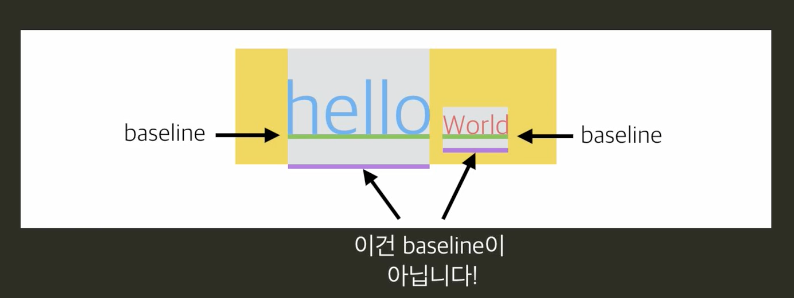

baseline은 vertical-align의 조건들을 충족시키면서 줄의 높이를 최소화 시키는 곳에 위치한다.


'vertical-align:middle;`
    부모태그의 내용의 가운데가 맞추어진다.


### 가로 가운데 정렬

- inline 요소 : `text-align:center;'로 정렬
- block 요소 : 'margin-left:auto; margin-right:auto;`로 정렬

### 세로 가운데 정렬

1. 가짜 요소 더하기

1-1. `vertical-align:middle;`사용

```html
<div class="container">
  <div class="info">
    <h1>Hello!</h1>
    <p>My name is young.</p>
  </div>
</div>
```
```css
.container {
  width: 300px;
  height: 400px;
  background-color: gray;
  text-align: center;
}

.info {
  background-color: lime;
  display: inline-block;
  vertical-align: middle;
}
```


1-2. info를 가운데로 옮기려면 ?
    x가 가운데로 와야한다. --> .helper
    세로길이가 100%인 요소를 만들고 그 요소에도 `vertical-align:middle;` 을 적용한다.

```css
.container { 
	width: 300px;
  height: 400px;
  background-color: gray;
  text-align: center;
}

.helper {
  display: inline-block;
  height: 100%;
  vertical-align: middle;
}

.info {
  background-color: lime;
  display: inline-block;
  vertical-align: middle;
}
```
 


*<u>.info의 가로길이가 100%라면 문제 발생</u>*

​    --> .helper와 .info 사이에 띄어쓰기가 있어서 가로길이 100%인 .info요소는 자리부족으로 다음줄로 이동하기 때문.

- 띄어쓰기 없애는 방법

```html
<div class="container">
        <!-- 스페이스 없애기 -->
	  <div class="helper"></div><div class="info">
    <h1>Hello!</h1>
    <p>My name is young.</p>
  	</div>
</div>
```
- 띄어쓰기 공간만큼 여백을 주는 방법

```css
.helper {
  display: inline-block;
  height: 100%;
  vertical-align: middle;
}

.info {
  background-color: lime;
  display: inline-block;
  vertical-align: middle;
  width: 100%;

  /* 이 경우 띄어쓰기는 5~7px 정도였습니다! */
  margin-left: -7px;
}
```


- 어떤 요소에 `height: 100%;`를 설정하기 위해서는 부모의 `height`가 설정되어 있어야 합니다. 위 경우에는 `.helper`의 부모인 `.container`에 `height`가 설정되어 있었기 때문에 가능했던 것.


### line-height로 해결

`.info`를 인라인 블록으로 설정해주면, `line-height` 속성을 활용해볼 수도 있습니다. 부모인 `.container`에 `height`와 동일한 `line-height`를 준다. (자식에서 `.info`에서 `line-height:normal;` 설정을 안하면 상속되어 400px 넘어가면서 이상한 레이아웃이 나올수도 있다.)


```css
.container {
  width: 300px;
  height: 400px;
  background-color: gray;
  text-align: center;
  line-height: 400px;
}

.info {
  background-color: lime;
  display: inline-block;
  line-height: normal;
    vertical-align: middle;
}
```

