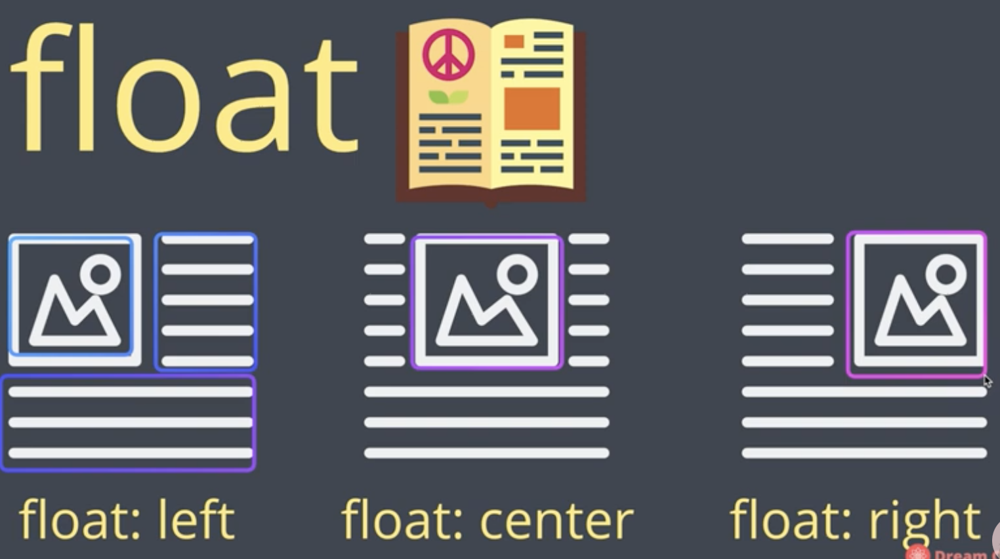
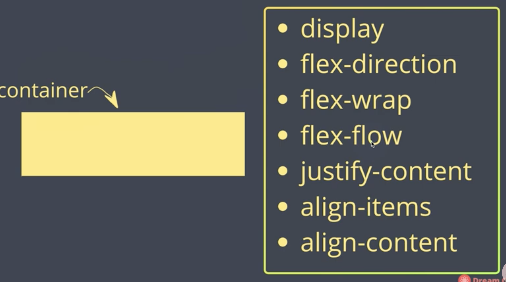
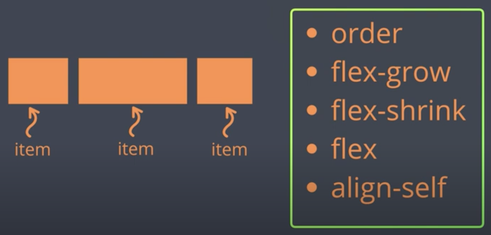
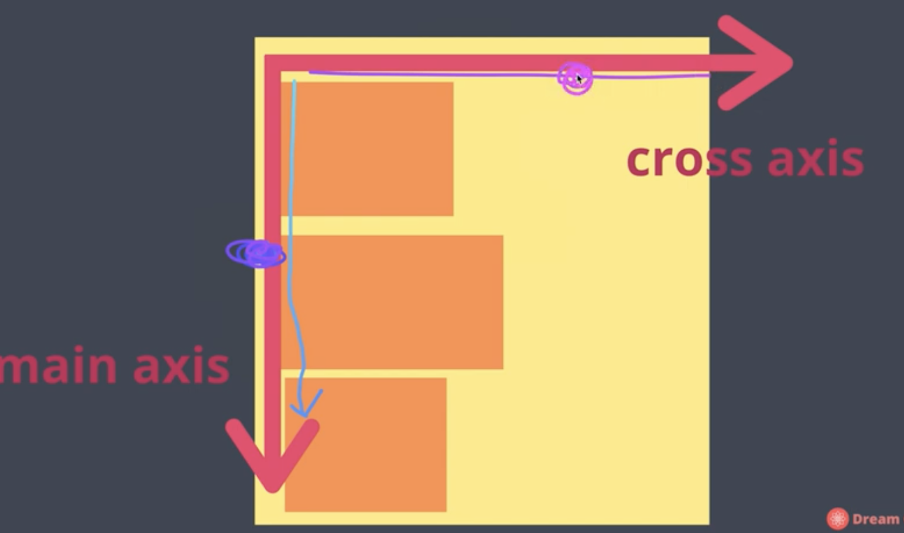

# Selector

```css
/* selector {
  property : value;
} */

* {
  color : green;
}

li {
  
  color : blue;
}

/* 태그에만 한정 */
li #special {
  color: pink;
}

.red{
  background : yellow;
  width : 100px;
  height : 100px;
}

/* : state */
button:hover {
  color : red;
  background:beige;
  
}

/* google로 시작하는 */
a[href^="google"]{
  color : purple;
}


/* .com으로 끝나는 */
a[href $=".com"]{
  color : red;
}
```

<br/> 

# Padding & Margin

```css
.red{
  width : 100px;
  height: 100px;
  background : yellow;
/*   padding: 20px;   
  padding-top : 100px;
  padding-right : 100px;
   */  
  
  /* padding : 20px 20px 200px 300px; */
  
  padding : 20px 0px;
  
/*   padding : 컨텐츠 안에 들어가는 spacing */
  
  margin: 20px;
  /*   컨텐츠 바깥에 들어가는 spacing */
  
  border-width : 2px;
  border-style : solid;
  border-color:pink;
  
/* 한줄로
  border : 2px dashed red; */
}
```


# Div & Span

**HTML**

```html
<!DOCTYPE html>
<html>
<head>
  <meta charset="utf-8">
  <meta name="viewport" content="width=device-width">
  <title>JS Bin</title>
</head>
<body>
  
  
<!--   Block level -->
  <div>1</div>
  <div>2</div>
  <div>3</div>
  
  
<!--   Inline level -->
  <span>1</span>
  <span>2</span>
  <span>3</span>

</body>
</html>
```

<br/>

**CSS**

```css
div, span {
  width : 80px;
  height : 80px;
  margin: 20px;
  background : pink;
  
}

/* span 은 내용이 있어야 표기된다. */

div{
  background : red;
  display : inline;
  
/*   inline : 안의 내용 자체만을 꾸며준다. */
/*            물건의 크기에 맞춰서 변경됨 */
  
/*   inline-block : 블럭을 꾸며준다. */
/*         상자인데 한줄에 여러개  */
}

span{
  background :blue;
  display : block;
}
```


<br/> 

# Position

```css
div, span {
  width : 80px;
  height : 80px;
  margin: 20px;
  background : red;
  
}

.container{
  background : yellow;
  left : 20px;
  top : 20px;
  
/*   기본적으로 position은 static이다.
    1.    따라서 relative 옵션을 주지 않으면 움직이지 않는다. */
  position : relative;
}

.box{
  background : blue;
  left : 20px;
  top : 20px;
  position : sticky;
  
/* 2. position : absolute; */
/*   : 내 아이템과 담겨있는 가장 가꺼이에 있는 박스 안에서 위치 변경이 이루어진다. */
  
/* 3. position : FIXED; */
/*   : fixed는 상자에서 완전히 벗어나 웹 페이지 기준으로 움직인다. */
  
/* 4. position : sticky */
/*   : 스크롤링 할 때, 원래 있어야 할 자리에 그대로 붙어있는다 */

}
```


<br/> 

# FlexBox

박스와 아이템들을 **행 또는 열**로 배치시켜 줄 수 있다.


이전에는

Position, float, table로 정렬했지만 한계가 있었다.


## float




## flexbox

#### 1. 속성값

- 컨테이너 박스에 적용되는 속성값들이 존재

- 각각의 아이템들에 적용할 수 있는 속성값 존재






#### 2. 중심축과 반대축이 있다.

1. 수평 축 기준으로하면 수직축은 반대축이 된다.

   

   <br/> 

2. 수직축이 기준이되면 수평축은 반대축이 된다.

   

 

<br/>


---


##### 1.  컨테이너 적용

```css
.container{
  background: beige;
  height:100vh;
/* vh = viewport height */
  
/*  1. flexbox선언 */
  display : flex;
   
/*  2. flexbox 방향 */
  flex-direction : row;
/*   default값은 row(왼 -> 오) */
/*       오 -> 왼 : row-reverse */
/*   열 기준 */
/*       flex-direction : column; */
/*   반대방향 */
/*       flex-direction : column-reverse */
    
/*  3. flexbox wrapping */
  flex-wrap:wrap;
/*   기본값 : nowrap */
/*      : 아이템들이 더 많이지면 많아져도 한줄에 붙어있다. */
/*  flex-wrap:wrap-reverse; */
/*    거꾸로 */
  
/*  4. flexflow */  
/*   flex-flow : column nowrap; */
/*   위의 2가지를 합친것 */
  
  
/*  5.justify-content */
/*   기본값 */
/*   justify-content :flex-start; */
/*   	 flex-end : 오른쪽 축으로 아이템들을 배치 */
/*     center : 가운데 */
/*   	 space-around :박스를 둘러싸게 공간을 줌. */
/*		 space-evenly : 똑같은 간격을 넣어줌  */
/*     pace-between :  왼쪽과 오른쪽은 딱 맞게, 중간에만 공간
*/
/*------  /* main axis */ --------*/
  
  
/* 6. align-items */
/*   반대축에서 결정 */
align-items:baseline; /* text를 모두 균등하게 해준다. */
align-content : center;
    
}

.item{
    width : 40px;
  height : 40px;
  border : 2px solid black;
  
}

.item1{
  background:#e3f2fd;
}

.item2{
  background:#ab47bc
}
.item3{
  background:#26c6da
}
.item4{
  background:#039be5
}
.item5{
  background:#00838f
}
.item6{
  background:#1de9b6
}
.item7{
  background:#90caf9
}
.item8{
  background:#f48fb1
}
.item9{
  background:#f44336
}
.item10{
  background:#c62828
}
```


##### 2. Item 적용

```css
.container{
  padding-top:20px;
  background: beige;
  height:100vh;
  display : flex;
}

.item{
  width : 40px;
  height : 40px;
  border : 2px solid black;
  
}

.item1{
  background:#e3f2fd;
      flex-grow : 2;
  flex-shrink : 2;

}

.item2{
  background:#ab47bc;
    flex-grow : 1;
  flex-shrink : 1
}
.item3{
  background:#26c6da;
  flex-grow : 1;
    flex-shrink : 1
}


/* 1. flex-grow */
/* 커질때 컨테이너의 사이즈에 따라 줄어들고 커지는 수치 조절 */

/* 2. flex-shrink */

/* 3. flex-basis */
/* 기본값  auto
 grow나 shrink 없이도  사용 (비율) */
 
/* 4. align-self : center; */
/*   : item별로 item들을 정렬 가능 */
```

