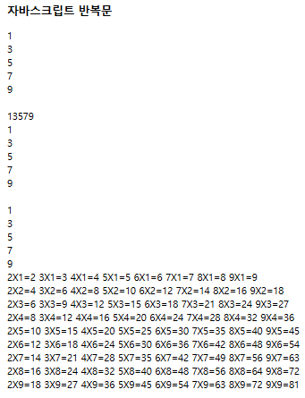

## 반복문

- **for 문**은 **반복 횟수를 명확히 알때** 사용한다.
- **while**문의 경우  반복 횟수를 모를때 사용한다. 조건에 따른 반복 수행 여부 결정할때 사용
- 최초 1번은 무조건 수행후에 조건에 따라 반복 수행 여부를 결정해야 할때 **do while문**을 사용
- 배열의 요소, 객체의 속성을 **순차적**으로 꺼내올때 사용하는 반복문은 **for(var 변수 in 배열or 객체)** 사용

```html
<!DOCTYPE html>
<html>
<head>
  <meta charset="utf-8">
  <title>javascript 반복문</title>
</head>

<body>
<h3>자바스크립트 반복문</h3>
<script>

for(var i = 0 ; i<10 ; i++){
  if (i%2==1) {
  document.write(i +"<br />");
  }
}
document.write("<br />");

var i =0;
while(i<10){
  i++;
  if(i%2==1){
document.write(i);
  }
}
document.write("<br />");

i=1;
do{
if(i%2==1){
document.write(i+"<br />");
}}while(++i<10){
document.write("<br />");}


var nums=[1,2,3,4,5,6,7,8,9,10];
for (var n in nums){
  if(n%2==1)
  document.write(n+"<br />");
}

for(var su= 1; su<10; su++){
  for(var dan = 2 ; dan< 10 ; dan++){
    document.write(`${dan}X${su}=${dan*su}\t`);
  }
  document.write("<br />");
}

</script>
</body>
</html>

```



### for of 반복문


```javascript
document.write("<h3> for of 반복문 </h3>");
for (value of brands){  //value는 변수명
    document.write(value);
    document.write("<br />");
}```

기존의 For문보다 좋은 점 ?
1. 조건 적을 때 간편하다
2. 불필요한 변수를 만들 필요 없다.
3. 배열의 인덱싱을 해서 받아올 필요가 없다.

장단점이 있으므로 선택사항임.