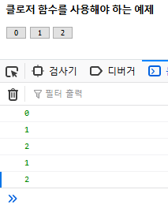

## 1.  클로저를 알기 전에

### 1.1 일급객체 OR 일급 함수

> 프로그래밍 언어를 디자인 할때 주어진 프로그래밍언어에서 일급 시민(또는 일급 타입, 일급 객체, 일급 엔티티, 일급 값)은 다른 엔티티들이 일반적으로 이용 가능한 모든 연산을 지원하는 엔티티를 뜻합니다. 여기서의 연산은 전형적으로 인자로 전달되고, 함수의 반환값으로 사용되고, 수정되고, 변수에 할당하는 것을 포함합니다.

### 1.2 변수의 범위 (scope) 및 수명 

변수 범위 : **local** || **global** 


#### 1.2.1 local variable (지역변수)

- <u>다른 함수에서는 사용 불가!</u> ===> 클로저 함수를 이해하는데 중요한 포인트

```javascript
function printName() {
var name ='John'
console.log(name);
}

결과 ) John
```

#### 1.2.2 global variable(전역변수)

- 윈도우 객체에 속한다. 	
- 페이지 내 모든 스크립트에서 사용 가능

```javascript
var name = 'John'

function printName(){
console.log(name);
}

결과 )
John
```

- 특징

```javascript
var name = 'John';

function printName(){
var name ='Sam';
console.log(name);
}

printName();
console.log(name);

결과 )
Sam
John
```

==> 같은 이름의 전역변수 !=지역변수 **서로 다른 변수다**

- var 생략하고 변수를 만들면 항상 전역변수 ( 함수 안에 있어도 전역 변수)

```javascript
function printName(){
name = "홍길동";
console.log(name)
}

printName(); // 함수
console.log(name); // 전역

결과 )
홍길동
홍길동
```

#### 1.2.3 변수의 수명

- 글로벌 변수 : 애플리케이션이 살아있는동안 유효
- 지역변수 : 함수가 종료되면 삭제

### 1.3 중첩함수

- 함수 내 함수를 또 정의하는 것
- 외부 변수에 접근 가능!

```javascript
var global_name='John'

function printName(){

var outer_variable ='Sam';
	function showName(){
		var inner_variable ='Smith';
		console.log(global_name);
		console.log(outer_variable);
		console.log(inner_variable);
}
	showName()
}
printName();

결과)
John
Same
Smith
```

### 1.4 함수의 저장 및 반환

```javascript
var global_name='모모';

function makePrinter(){
	var outer_name='사나';
	function printName(){
		var inner_name='쯔위';
		console.log(global_name)
		console.log(outer_name)
		console.log(inner_name)
}
	return printName;
}
var print = makePrint();
print();

결과)
모모
사나
쯔위
```

## 2. 클로저 함수

> 자신을 포함하고 있는 외부 함수의 인자, 지역변수 등을 외부 함수가 종료된 후에도 사용할 수 있다. ====> 자유변수
>
> 자유 변수를 가지는 코드를 클로저라고 한다. 

- 외부에서 직접 접근은 불가 , 항상 클로저를 통해서만 사용 가능
  - <u>**===> private 멤버 변수와 같은 효과**</u>

> 클로저가 생성될 때 범위내의 지역변수들을 자유 변수로 만드는 것을 캡쳐(capture)라고 한다.

```javascript
function makeGreeting(name){
var greeting ='안녕!';
	return function(){
		console.log(greeting+name);
};
}

var g1=makeGreeting('모모');
var g2= makeGreeting('사나');

g1()
g2()
```

- 여러개 생성할 필요 없을 때는 단 하나만 생성 시에는 **자기 호출 함수** 사용해 클로저를 만들면 된다.
  - *자기호출함수 = 즉시호출함수*

```javascript
var print=(function(){

	var name='모모';

	return function(){
		console.log(name);
};
})();

print();

결과 )
모모
```

- 초기값 부여도 가능

```javascript
var print =(function(name) {
    var greeting= 'hello!';
    
    	return function() {
            console.log(greeting + name);
        }
})('John');

print();
```

- 예제 

```javascript
// counter 클로저 생성
var counter = (function (){
    
    //private변수 (외부 접근 불가)
    var privateCounter=0;
    
    //private함수 (외부 접근 불가)
    function changeCounter(val){
        privateCounter+=val;
    }
    
    
    //public  함수를 가지는 객체 반환
    return {
        //증가 기능을 가지는 public 함수
        inc : function (){
            changeCounter(1);
        },
        desc : function(){
            changeCounter(-1);
        },
        // 현재값 조회
        val : function(){
            return privateCounter;
        }
    }
})();


counter.inc();
console.log("after increment : " + counter.val());
counter.dec();
console.log("after decrement : " + counter.val());
  
```


```html
<!DOCTYPE html>
<html lang="en">
<head>
  <meta charset="UTF-8">

  <title>클로저 함수 예제</title>
  <script >

//기존 문제점
     window.onload = function(){
       var buttons=document.getElementsByTagName("input")
       for(var i = 0 ; i<buttons.length;i++){
    
         buttons[i].onclick=function(){
           console.log(i);
         }
       	}//for end ; i: 3  3 이출력 되므로 로컬변수를 이용하도록 함
       }

//방법 1.
    window.onload = function(){
      var buttons=document.getElementsByTagName("input") //getElements는 배열로 가져오고 태그 네임의 input은 3가지이다.  -> 배열을 for문으로 이용
      for(var i = 0 ; i<buttons.length;i++){
        let _i= i //고정 let _0
        buttons[_i].onclick=function(){ // buttons[_0].onclick= function(){ console.log(_0)}
          console.log(_i); //_0 
        }
      }//for end
    }

//방법 2. 클로저 함수 이용
    window.onload = function(){
      var buttons=document.getElementsByTagName("input")
      for(var i = 0 ; i<buttons.length;i++)(function(_i){
        buttons[_i].onclick=function(){
            
          console.log(_i);
          }
        }
      )(i); //반복문의 i
    }

  </script>
</head>
<body>
  <h3>클로저 함수를 사용해야 하는 예제</h3>
  <input type="button" value="0">
  <input type="button" value="1">
  <input type="button" value="2">
</body>
</html>

```

