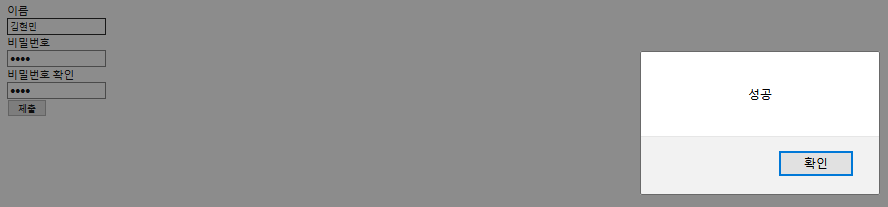

```html

<!DOCTYPE html>
<html>
<head>
<meta charset="utf-8">
<title>폼 태그</title>
<script>
 function whenSubmit(){
   var pass  = document.getElementById('pass').value 
   //input 태그가 가지고 있는 value 속성 : 값이 바뀌는 속성
   var pass_check= document.getElementById('pass_check').value
   if(pass==pass_check){
     alert('성공')
   }else{
     alert("다시")
     return false;
   }
 }
</script>
</head>
<body>
<form id="my_form" action = "data.jsp" method="" onsubmit="return whenSubmit()">
        <label for="name">이름</label><br/>
        <input type="text" name="name" id="name"/><br/>
        <label for="pass">비밀번호</label><br/>
        <input type="password" name="pass" id="pass"/><br/>
        <label for="pass_check">비밀번호 확인</label><br/>
        <input type="password" id="pass_check"/><br/>
        <input type="submit" value="제출"/>
    </form>

</body>
</html>

```



