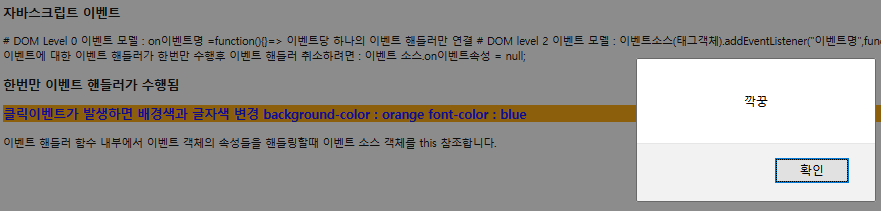

```html

<!DOCTYPE html>
<html>
<head>
<meta charset="utf-8">
<title>이벤트</title>
<script>
  /*window.onload=function(){
  alert("load event handler1")
  }
  window.onload=function(){
  alert("load event handler2")
  }
  window.onload=function(){
  alert("load event handler3")    //3만 수행
}*/

/*  addEventListener로 연속해서 창을 띄울 수 있다.(여러개의 동일 이벤트 핸들러)

window.addEventListener("load",function(){
  alert("load event handler1");
},false)
window.addEventListener("load",function(){
  alert("load event handler2");
},false)
window.addEventListener("load",function(){
  alert("load event handler3");
},false)
*/
window.addEventListener("load",function(){
  var h3= document.querySelector("#evt")
  h3.onclick=function(){
    alert("깍꿍") //계속실행됨 여기까지는
    this.onclick=null; //null로 인해서 한번만 실행됨 
    //h3.onclick=null; 이벤트 핸들러 취소하려면 : 이벤트 소스.on이벤트속성 = null;
  }
})
window.addEventListener("load",function(){
  var h3= document.querySelector("#evt2")
  h3.onclick=function(){
     this.style.color="blue"//계속실행됨 여기까지는
    this.style.background="orange" 
   //h3.onclick=null;
   // this : 이벤트 핸들러 함수 내부에서 이벤트 객체의 속성들을 핸들링할때 이벤트 소스 객체를 this 참조
   
  }
})
</script>
</head>
<body>
 <h3> 자바스크립트 이벤트 </h3>
 # DOM Level 0 이벤트 모델 :  on이벤트명 =function(){}=> 이벤트당 하나의 이벤트 핸들러만 연결
 # DOM level 2 이벤트 모델 : 이벤트소스(태그객체).addEventListener("이벤트명",function(){},이벤트캡처여부(boolean값,default는 false))
 이벤트당 하나 이상의 이벤트 핸들러만 연결
 <br>
이벤트에 대한 이벤트 핸들러가 한번만 수행후 이벤트 핸들러 취소하려면 : 이벤트 소스.on이벤트속성 = null;<br>
<h3 id ="evt">한번만 이벤트 핸들러가 수행됨</h3>
<h3 id ="evt2">클릭이벤트가 발생하면 배경색과 글자색 변경 background-color : orange  font-color : blue</h3>
이벤트 핸들러 함수 내부에서 이벤트 객체의 속성들을 핸들링할때 이벤트 소스 객체를 this 참조합니다.<br>
<style >

</style>
</body>
</html>

```



