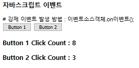
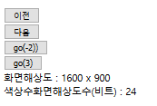

## innerHTML

```html
<!DOCTYPE html>
<html>
<head>
<meta charset="utf-8">
<title>이벤트</title>
<script>

window.addEventListener("load", function(){
 document.querySelector("#btn1").onclick =  function(){
		var span1 = document.querySelector("#count1");
		span1.innerHTML=Number(span1.innerHTML)+1;  
     //body태그 내부의 id=count1에서의 0을 가져와(inner HTML) 0+1을 해준다.
	};

document.querySelector("#btn2").onclick=function(){
  var span2=document.querySelector("#count2")
span2.innerHTML=Number(span2.innerHTML)+1;
document.querySelector("#btn1").onclick(); //위에서 이미 정의된 함수로 같이 합이 누적됨
}
},false);

</script>
</head>
<body>
 <h3> 자바스크립트 이벤트 </h3>
# 강제 이벤트 발생  방법 : 이벤트소스객체.on이벤트();<br>
<button id="btn1">Button 1</button>
<button id="btn2">Button 2</button><br>
<h3>Button 1 Click Count : <span id="count1">0</span></h3>
<h3>Button 2 Click Count : <span id="count2">0</span></h3>
</body>
</html>

```



## location 객체

```html
<!DOCTYPE html>
<html lang="en">
<head>
    <meta charset="UTF-8">
    <meta name="viewport" content="width=device-width, initial-scale=1.0">
    <meta http-equiv="X-UA-Compatible" content="ie=edge">
    <title>Document</title>

    <script>
            window.onload=function(){
                var panel1 = document.getElementById('panel1')
                var nNum = 1+Math.floor(Math.random()*100);
        
                panel1.innerHTML=nNum;
                panel1.style.fonsize=100+(Math.random()*100)+"px";
        
        
            setTimeout(function(){
                location.href=location.href;
        
            },1000);
            }
            </script>
</head>
<body>
     <!-- h3> 이 페이지는 3초후에 www.w3schools.com 으로 이동합니다.</h3 -->
  <h3> 이 페이지는 1초후에 reload 됩니다.</h3>
  <div id="panel1">
    
  </div>
    
</body>
</html>
```


## history 객체

```html
<!DOCTYPE html>
<html>
<head>
<meta charset="UTF-8">
<title>Insert title here</title>
  <script>
    window.onload = function() {
    	/*
		history.pushState(null, null, "js01.html");
		history.pushState(null, null, "js02.html");
		history.pushState(null, null, "js03.html");
		history.pushState(null, null, "js04.html");
		history.pushState(null, null, "js05.html");
		history.pushState(null, null, "js08.html");
		*/
		
		document.getElementById("back").onclick = function() {
			history.back();
		}
		
		document.getElementById("next").onclick = function() {
			history.forward();
		}
		
		document.getElementById("goBack").onclick = function() {
			history.go(-2);
		}
		
		document.getElementById("goNext").onclick = function() {
			history.go(3);
		}
    }
  </script>
</head>
<body>
  <button id="back">이전</button> <br>
  <button id="next">다음</button> <br>
  <button id ="goBack">go(-2))</button> <br>
  <button id="goNext">go(3)</button> <br>
  <script>
  	document.write("화면해상도 : " + screen.width + " x " + screen.height);
  	document.write("<br>색상수화면해상도수(비트) : " +  screen.colorDepth);
  </script>
  
</body>
</html>
```

