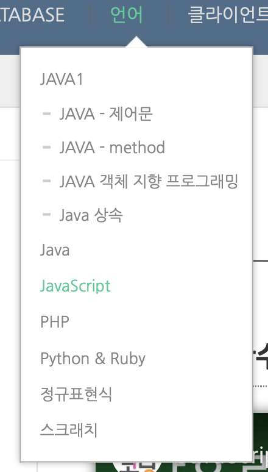

## 콘솔 출력 

1. 텍스트 편집기로 출력
2. node.js로 출력
   1. 프로젝트 폴더로 이동해 `node test.js` 실행

</br> 

## `async` , `defer`

### HTML과 JS 파싱

- 한줄한줄 파싱(해석)하면서 DOM요소로 변환한다.

- 경우 1번 ( head 태그 안에 script 선언 )

  ```html
  <!DOCTYPE html>
  <html lang="en">
  <head>
      <meta charset="UTF-8">
      <meta name="viewport" content="width=device-width, initial-scale=1.0">
      <title>Document</title>
    	<script src = "main.js"></script>
  </head>
  <body>
  </body>
  </html>
  ```

  - 이 과정에서 Script태그가 보이면 main.js를 fetching js , executing js 하고 나머지 html을 파싱한다.
    - 단점 : 중간에 js과정을 거치는 과정에서 컨텐츠가 멈출 수 있다.

</br> 

- 경우 2번 ( body 태그 맨 아래에 선언 )

  ```html
  <!DOCTYPE html>
  <html lang="en">
  <head>
      <meta charset="UTF-8">
      <meta name="viewport" content="width=device-width, initial-scale=1.0">
      <title>Document</title>
  </head>
  <body>
      <div></div>
  		<script srt = "main.js"></script>
  </body>
  </html>
  ```

  - 이 때는 컨텐츠가 전부 다운르드 된 후에 js를 불러오기 때문에 정보를 모두 볼 수 있다.
    - 단점 : js에 매우 의존적인 경우 (서버와 견결하는 경우 등 )에는  단점이 될 수 있다

</br> 

- `async` 옵션

  ```html
  <!DOCTYPE html>
  <html lang="en">
  <head>
      <meta charset="UTF-8">
      <meta name="viewport" content="width=device-width, initial-scale=1.0">
      <title>Document</title>
    		<script async srt = "main.js"></script>
       기본적으로 `true` 이기 때문에 그냥 적어주어도 된다.
  </head>
  <body>
    <div></div>
  </body>
  </html>
  ```

  

  - 장점 : 병렬적으로 js를 다운로드 해 시간을 절약할 수 있다.

  - 단점 : querySelector 등으로 DOM요소를 조작하려고 할 경우 단점이 될 수 있다.

    - 다운로드가 먼저 된 js부터 실행하기 때문에 실행 순서가 민감한 경우라면 큰 단점이 된다.

      

  </br> 

- `defer` 옵션

  ```html
  <!DOCTYPE html>
  <html lang="en">
  <head>
      <meta charset="UTF-8">
      <meta name="viewport" content="width=device-width, initial-scale=1.0">
      <title>Document</title>
    		<script defer srt = "main.js"></script>
       기본적으로 `true` 이기 때문에 그냥 적어주어도 된다.
  </head>
  <body>
    <div></div>
  </body>
  </html>
  ```

  

  - 가장 BEST한 옵션

  - 여러개의 js가 있어도 안정적

    

  

### `'use strict';`

- JS는 매우 관대한 언어이기 때문에 문법적으로 맞지 않은 것들도 오류판별이 나지 않아 매우 위험할 수 있다.
- 이것을 방지하기 위한 선언문. ECMAScript5에 추가되어 있다.

</br> 

</br> 


## Variable

### let

- `let` : 변수 선언

  ```javascript
  'use strict';
  let name = 'hyun';
  console.log(name);
  
  name = "hello";
  console.log(name);
  
  //출력
  //hyun
  //hello 
  ```

  선언하면 변수 메모리에 참조할 수 있는 포인터가 생김

</br> 

- 전역변수, 지역변수

  - 지역 scope `{ }`

  ```javascript
  'use strict';
  let globalVar = "global";
  {
  let name = 'hyun';
  console.log(name);
  
  name = "hello";
  console.log(name);
  
  // 지역안에서는 전역변수 사용 가능.
  console.log(globalVar);
  }
  
  // 출력 X (공백)
  console.log(name);
  
  ```

  </br> 

- **`var`  : 쓰지 말자!**

  1. 선언도 하기 전에 호출이 가능하기 때문,, 비정상적이다. (**`hoisting`개념**) 
  2. **블럭 scope 와 무관**하게 된다.

</br> 

### constant

- 상수

- 사용하는 이유

  1. 보안

  2. Thread safety

     : 프로그램이 실행되면 여러가지의 스레드가 실행되고 동시에 변수를 참조하는데 동시에 값을 변경할 수 있는데, 위험성이 존재함. 상수면 이런 위험을 없애준다.

  3. 실수 가능성 감소

</br> 

---

<u>*참고*</u>

- Immutable data types : primitive types, frozen objects(`object.freeze()`)

  - primitive type이 변경 불가라는게 무슨말 ?

    ```javascript
    let str ='hello';
    str = 'world';
    ```

    1. 메모리에 `hello`가 생성되고 `str`은 `hello` 의 **주소를 참조**한다.
    2. 그 후, str이 <u>**수정되는 것이 아닌**</u> 새로 생성된 world의 주소를 참조하는 것이다. 즉, 참조하는 주소만 달라지는 것 뿐.

- Mutable data types : `objects`  , *JS안의 거의 모든 object는 mutable*

---

</br> 

### 변수 타입

1. Primitive type (single item) 

   : `number`, `string`,` boolean`, `null`, `undefined`, `symbol`

   메모리에 바로 저장. (`value`로 값이 바로 저장)

2. Object 

   : single. item들을 묶어서 한 박스로 관리할 수 있게 해줌 ( box container )

   너무 커서 한번에 저장할 수 없음. `reference` 를 통해 오브젝트가 담긴 메모리를 가리키는 것.

3. function ( first - class function )

</br> 

#### 1-1. primitive type

- `number`의 경우 

  - C언어, Java의 경우 : 메모리할당을 미리 생각해 타입을 지정해 주어야 한다. (`double`, `float`, ....)

  - JavaScript : <u>number하나면 퉁칠수 있다.</u> 

    - `let a = 1.2;`
    - `let b = 1;`

    </br> 

- `string` 의 경우

  - 한글자(`c`)든 여러글자든 모두 `string` 타입

  - ` +`  연산도 가능

  - **Template literals  (backtick `)**

    - ` ${변수}` 	

    - 이용하면 일일이 `+` 연산을 붙어야하는 수고로움을 덜 수 있다.

      </br> 

- `symbol`

  - 고유의 식별자

  - 우선순위가 필요한 경우 사용됨

    ```javascript
    const symbol1 = Symbol('id');
    const symbol2 = Symbol('id');
    
    console.log(symbol1 === symbol2);
    // false
    
    // string이 똑같다면 동일한 symbol을 만들고 싶다? for이용
    const gSymbol1 = Symbol.for('id');
    const gSymbol2 = Symbol.for('id');
    console.log(symbol1 === symbol2); 
    //true
    
    console.log(`value : ${symbol1}`) ---> 오류발생
    console.log(`value : ${symbol1.description}`) -- description을 사용해야한다.
    ```

  </br> 

- Dynamic typing : dynamically typed language

  - 선언 시 어떤 타입인지 선언하지 않고 런타임중에 값이 할당된 타입에 따라 그 타입이 변경된다.
  - *C , Java는 statically typed language*
  - 개발 중간에 타입이 바뀌게 되면 런타임오류가 발생하는 일이 빈번할 수 있다. ( 나의 코드 + 여러사람의 코드가 섞이게 되는 경우를 생각해보면 )
    - 이를 보완하기 위해 만들어진 것이` typescript`

</br> 


## operator

### ==, ===

1. *예제1*

   ```javascript
   console.log(0 == false); // T
   console.log(0 === false); // F
   console.log('' == false); // T
   console.log('' === false); // F
   console.log(null == undefined); // T
   console.log(null === undefined); // F
   ```

2. *예제2*

   ```javascript
   const o1 = {name :'iron'};
   const o2 = {name : 'iron'};
   const o3 = o1;
   
   console.log(o1 == o2); // F
   console.log(o1 === o2); // F
   console.log(o1 === o3); // T
   ```

</br> 


### ||, &&

```javascript
let t = true;
let f = false;

if(t||f||check());
// t가 true이므로 뒤에 f, check()를 체크할 필요 없이 바로 true를 나타낸다.

if(t&&f&&check());
//t가 false면 뒤에 f, check()를 체크할 필요 없이 바로 false 를 출력한다.

// 이를 이용해 null체크에 활용한다.

function check(){
  for(let i = 0; i< 10; i++){
    
  }
  return true;
}
```


</br> 


## Class , Object

### class (ES6)

```javascript
class Person{
name; 프로퍼티
age;  프로퍼티 
speak(); 메서드
}
```

- 서로 연관있는 것들끼리 묶어 놓은 것. (fields 또는 methods가 묶여있다.)

- *method가 없이* fields만 들어있는 경우 **`Data Class`**라고 불린다.

- *특징*
  - template(청사진)
  - declare once
  - no data in
  
- *ES6부터 클래스 도입  전, 선언하지 않아도  object를 생성이 가능했다.*
  
  - Prototype-based 문법만 클래스가 추가된 것. (syntatical sugar라고한다)
  
- **class VS object**

  | class                                                        | object                                                       |
  | :----------------------------------------------------------- | ------------------------------------------------------------ |
  | 1. template(청사진)<br />2. declare once <br />3. no data in | 1. instance of a class <br />2. created many times <br />3. data in ( 메모리에도 올라간다는 의미 ) |

  


</br> 

---

#### 1. class 선언

```javascript
'use strict';
class Person {
    //constructor
    constructor(name, age) {
        //fields
        this.name = name;
        this.age = age;
    }

    speak() {
        console.log(`${this.name}: hello!`);
    }
}


const Sam = new Person('Smith', 22);

console.log(Sam.name);
console.log(Sam.age);
Sam.speak();
```

</br> 

#### 2.  getter setter

```javascript
class User{
    constructor(firstName,lastName, age){
        this.firstName = firstName;
        this.lastName =lastName;
        this.age = age;
    }
    get age(){
        return this.age;
    }

    set age(value){
        this.age = value;
    }
}
const user1 = new User('Steve','Jobs', -1);
console.log(user1.age);
```

1. user1이라는 객체를 생성할 때, `age` 의 값이 -1이 나오면 안되지만 그대로 출력되는데, 이를 방지하기 위해 getter, setter 메서드가 존재한다.

   </br> 

2. `set` 메서드를 쓸때, 

   ```javascript
   set age(value){
    	this.age = value;
   }
   ```

   이렇게만 주면 <u>콜 스택 초과 오류</u>가 발생하게 된다. 

   *왜?*

   - 생성자에서 `this`부터 입력된 프로퍼티들은 **메모리에 바로 올라가는 것이 아니기 때문,**

   - 이는 바로 get, set,메서드로 가고 set 메서드에서 this.age에 value를 업데이트 하는 것이 아니라 setter를 호출하게 된다. 이 작업이 계속 반복되기 때문에 오류가 발생하게 되는 것이다.
   - 이를 해결하기 위해 **변수 지정을 다르게 해준다.**

   ```javascript
   get age(){
           return this._age;
       }
   set age(value){
           this._age = _value;
       }
   ```


</br> 

### 상속 & 다형성

```javascript
Shape이라는 클래스 (공통점)
class Shape {
    constructor(width, height, color) {
        this.width = width;
        this.height = height;
        this.color = color;
    }
    draw() {
        console.log(`drawing ${this.color} color of`);
    }
    getArea() {
        return this.width * this.height;
    }
}

const test1 = new Shape(30, 20, 'blue');
test1.draw(); //drawing blue color of
console.log(test1.getArea()); //600

// extends를 이용해 상속
class Circle extends Shape{}


class Triangle extends Shape {
		// 오버라이딩
    getArea() {
        return (this.width * this.height) / 2;
    }

    draw() {
      
        // 부모의 메서드 호출
	      	// : 오버라이딩 된 메서드만 출력하는게 아쉬울 때, 부모의 메서드를 호출하는 방법
        super.draw();
        console.log('triangle!');
    }
}

const triangle = new Triangle(30, 20, 'red');
triangle.draw();
console.log(triangle.getArea());
```

</br> 

### objects

#### 1. Literals & properties

- <u>**`key`와 `value`의 집합체**</u>

- 선언 방법

  1. object literal

     `const obj1 = {};`

  2. object constructor -- `new`

     `const obj2 = new Object();`

- *사용 예*

  ```javascript
  const name = 'Sam';
  const age = 14;
  print(name, age);
  function print(name,age){
  	console.log(name);
  		console.log(age);
  }
  ```

  - 이런식으로 일일이 변수에 맞춰 설정을 해줘야 하는 불편함이 있다.

    </br>

  ```javascript
  function print(person){
      console.log(person.name);
      console.log(person.age);
  }
  const sam  ={name : 'sam', age : 13};
  print(sam);
  
  //출력
  //sam
  //13
  ```

  - js에서 클래스 없이도 객가 생성이 가능하다.
  - print() 함수 호출시 매개변수에 름만 쳐도 되어 편리하다.

</br> 

- **뒤늦게 프로퍼티를 추가 및 삭제할 수 있다.**

  - JS는 **Dynamic Type Language**로.**Runtime일때 타입이 결정**되기 때문

  ```javascript
  function print(person){
      console.log(person.name);
      console.log(person.age);
  }
  const sam  ={name : 'sam', age : 13};
  print(sam);
  
  sam.hasJob = true;
  console.log(sam.hasJob);
  
  delete sam.hasJob;
  console.log(sam.hasJob); //undefined
  ```

</br> 

#### 2. Computed properties ( object.[`'key'`] )

- 프로퍼티로의 접근
  1. `console.log(sam.name);`
  2. `console.log(sam['name']);`  이때 프로퍼티의 Key는 String타입으로 해야한다. (`'name'`)


</br> 

## 이벤트 처리기 등록하기와 타이머

- [이벤트 처리기](#이벤트-처리기)
- [타이머](#타이머)


### 이벤트 처리기

#### 함수를 이벤트 처리기로 등록하는 방법

1. [HTML요소의 속성으로 등록하는 방법](#HTML요소의-속성에-이벤트-처리기-등록하기)
2. [DOM요소의 프로퍼티로 등록하는 방법](#DOM요소의-프로퍼티로-등록하는-방법)
3. `addEventListener` 메서드를 사용하느 방법


</br>


1. ##### HTML요소의 속성에 이벤트 처리기 등록하기

   </br>

   ```html
   <!DOCTYPE html>
   <html lang="en">
   
   <head>
       <meta charset="UTF-8">
       <meta name="viewport" content="width=device-width, initial-scale=1.0">
       <title>Document</title>
       <script>
           function displayTime() {
               var d = new Date();
               console.log("현재 시각은 " + d + " 입니다.");
           }
   
       </script>
   </head>
   
   <body>
       <input type="button" value="click" , onmousemove="displayTime()">
   </body>
   
   </html> 
   ```

   - **`onmousemove` 부분 : 이벤트 처리기 이름**
   - HTML코드와 JS코드가 뒤섞이는 단점이 발생
     - *DOM or `addEventListener` 메서드를 사용하면 보완할 수 있다.*

</br>


2. ##### DOM요소의 프로퍼티로 등록하는 방법

   - **DOM의 주요 객체**

     - **`window`** : Window객체, 웹 브라우저 윈도우 하나 또는 탭
     - **`document`** : Document객체, HTML문서 전체를 가리킴, HTML문서에서 HTML 요소 객체를 가져오거나 하는 기능을 제공
     - **요소 객체**  : HTML문서 요소를 가리키는 객체

     </br>

     ```html
     <!DOCTYPE html>
     <html lang="en">
     
     <head>
         <meta charset="UTF-8">
         <meta name="viewport" content="width=device-width, initial-scale=1.0">
         <title>Document</title>
     
     
         <script>
             function displayTime() {
                 var d = new Date();
     
                 console.log("현재 시각은 ? " + d.toLocaleString() + " 입니다.");
     
             }
             window.onload = function () {
                 var button = document.getElementById("button");
                 button.onclick = displayTime;
             };
     
         </script>
     </head>
     
     <body>
         <input type="button" value="click" id="button">
     </body>
     
     </html>
     ```


     </br>

   - 목적

     - HTML코드와 JS코드를 분리하기 위함.
     - 가독성, 유지 보수성이 높아짐

   </br>

   - DOM을 사용해서 `body` 요소 밖에서 `body` 요소 안에 있는 HTML요소를 조작할 수 있다.

   - 위에서부터 아래로 순차적으로 실행되고 `script` 요소를 만나면 `script` 요소가 모두 끝날 때 까지 `body` 요소를 읽어들이지 않는다.
     - 이벤트 처리기를 등록할 수 없다ㅏ.
     - 이를 위해, `window` 객체의`onload` 프로프티에 이벤트 처리기를 등록한다.
     - `window.onload = function() {...}`
       - **웹 브라우저가 문서를 모두 읽은 후에 실행된다**

   - 이벤트가 등록된 이벤트 처리기를 제거할 때는 `null` 을 입력한다.

     </br>
     
     </br>

### 타이머

1. `setTimeout`
2. `setInterval`

</br>

#### `setTimeout` 

: 시간이 흐른 후 함수 실행 (한번만)

```javascript
setTimeout(function(){
    console.log(new Date());
},2000);
```

`clearTimeout()`  : 함수 실행 취소

</br>

#### `setInterval`

: 일정시간 간격으로 반복해서 실행

```javascript
setInterval(function(){
    console.log(new Date());
},2000);
```

- `setInterval("console.log(new Date())", 1000);` 
  - `eval()` 로 평가되어 실행된다.


</br>

</br>


## HTML 요소를 동적으로 읽고 쓰기

1. [`innerHTML `](#html요소의-innerhtml-프로퍼티로-읽고-쓰기)
2. [`value()`](#폼-컨트롤의-입력-값-얻기-value)
3. [`document.write()`](#documentwrite)

</br>

### HTML요소의 `innerHTML` 프로퍼티로 읽고 쓰기

`innerHTML` 프로퍼티는 그 HTML요소의 내용을 기리킴 --> 해당 요소의 내용을 읽거나 쓸수 있다.

- 타이머 예제

  ```javascript
  <!DOCTYPE html>
  <html lang="en">
  
  <head>
      <meta charset="UTF-8">
      <meta name="viewport" content="width=device-width, initial-scale=1.0">
      <title>Document</title>
      <script>
          window.onload = function () {
              var startButton = document.getElementById("start");
              var endButton = document.getElementById("end");
              var display = document.getElementById("display");
              var startTime, timer;
  
              startButton.onclick = start;
  
              function start() {
                  startButton.onclick = null;
                  endButton.onclick = stop;
                  startTime = new Date();
                  timer = setInterval(function () {
                      var now = new Date();
                      display.innerHTML = ((now - startTime) / 1000).toFixed(2);
                  }, 10);
              }
              
              function stop() {
                  clearInterval(timer);
                  startButton.onclick = start;
              }
          };
      </script>
  </head>
  
  <body>
      <p id="display">0.00</p>
      <input type="button" id="start" value="start">
      <input type="button" id="end" value="end">
  </body>
  
  </html>
  ```

  </br>


### 폼 컨트롤의 입력 값 얻기 `value()`

- `value()` 를 이용해서 해당되는 `id` 의 값을 가져올 수 있다.

```html
<!DOCTYPE html>
<html lang="en">

<head>
    <meta charset="UTF-8">
    <meta name="viewport" content="width=device-width, initial-scale=1.0">
    <title>Document</title>
    <script>
        window.onload = function () {
            document.getElementById("button").onclick = function () {
              	// h 변수에 id가 height에 해당하는 값을 가져와 대입
                var h = parseFloat(document.getElementById("height").value)
                var w = parseFloat(document.getElementById("weight").value)
                
                // 아이디가 bmi에 해당하는 곳에 갱신하기 위해 innerHTML 프로퍼티 입력
                var bmi = document.getElementById("bmi");
                bmi.innerHTML = (w / h / h).toFixed(1);

            };
        };

    </script>
</head>

<body>
    <p>키 : <input type="number" id="height"> m</p>
    <p>몸무게 : <input type="number" id="weight"> kg</p>
    <p>당신의 체질량 지수는 <output id="bmi">?</output> 입니다.</p>
    <input type="button" value="계산" id="button">
</body>

</html>
```


</br>

### `document.write()`

- 인수로 받은 문자열을 **HTML문서의 body요소 안에 출력**한다.

  ```html
  <!DOCTYPE html>
  <html lang="en">
  <head>
      <meta charset="UTF-8">
      <meta name="viewport" content="width=device-width, initial-scale=1.0">
      <title>Document</title>
  </head>
  <body>
      <script>
  var now = new Date();
  var month = now.getMonth() +1;
  var day = now.getDay();
  
  document.write("<p>오늘은 " + month + "월 " + day + "일 입니다.</p>");
  
      </script>
  </body>
  </html>
  ```

- 이벤트처리기로 등록한 함수 안에서 `document.write` 를 사용하면 안된다.

  - HTML문서 전체 내용이 `document.write`로 출력한 값으로 바뀌게 된다.
  - **`document.write` 를 사용한 다음에 호출한 함수에서는 HTML문서를 동적으로 수정할 수 없다.**
    - **DOM**을 이용해야 한다.


</br>

</br>

## 함수 

- 웬만하면 **동사**로,

- *One function = one thing*

### 함수 정의하기

#### 함수 정의 방법

1. 함수 선언문

   `function square(x) { return x*x; }`

   </br>

2. 함수 리터럴

   `var square = function(x) {return x * x; };`

   </br>

3. Function 생성자로 정의

   `var square = new function("x", " return x*x" );`

   </br>

4. 화살표 함수 표현식

   - `var square = x => x*x ;`

   - `const simplePrint = () => console.log('simple');`
   
   - `const add = (a,b ) => a+b;`
   
   - ```javascript
     const simpleMultiply = (a,b) => {
     	//logic..
     	return a * b;
     }
     // 이런 경우에는 반드시 return을 써주어야 한다.
     ```
   
   </br>

- **함수 선언문**으로 정의한 함수만 **Hoisting이 가능하다**
  - 함수리터럴, Function 생성자, 화살표 함수는 불가능!

</br>

#### Parameter

##### parameters

- premitive parameters : value
- object parameters : reference

```javascript
function log(message){
  console.log(message);
}

log("hello"); //hello 출력
log(1234);	// 1234 출력 (string으로 변환되어서 출력됨)
```

- 매개변수가 타입이 **불분병**한 문제점이 있다.

- 여기서  typescript와의 차이점.. 배워야 하는 이유

  ```typescript
  // function test(message:string (input 타입)): number (output타입)
  function test(message:string): number {
    console.log(message);
    return 0;
  }
  ```

</br> 

##### Default parameters

- 기존 방법

  ```javascript
  // 기존의 방법
  function showMsg(message, from){
    if(from === undefined){
      from = 'unknown';
    }
    console.log(`${message} by ${from}`);
  }
  
  showMsg('Hi');
  ```

- ES6 추가

  ```javascript
  // 기존의 방법
  function showMsg(message, from='unknown'){
     console.log(`${message} by ${from}`);
  }
  
  showMsg('Hi');
  ```

</br> 

##### Rest parameters

- `...args` : **배열** 형태로 반환

  ```javascript
  function prntAll(...args){
    
  //  1. 첫번째 for문 방법
    for(let i = 0; i< args.length ; i++){
      console.log(args[i]);
    }
  //  2. 두번째 for문 방법 (of)
    for(const arg of args){
      console.log(arg);
    }
  //  3. 세번째 for문 방법 (forEach)
    args.forEach((arg) => console.log(arg));
  }
  prntAll('dream','comes','true');
  ```

</br> 

##### early return, early exit

```javascript
// bad  : if 안되면 else 를 쓰는 방법
function upgradeUser(user){
  if(user.point>10){
    // login....
  }
}

//good : 찾을 조건이 안되는 것들은 빨리 리턴을 하는 것.
function upgradeUser(user){
  if(user.point<=10){
    return;
  }
		//  logic...
}
```


</br> 

#### 중첩함수

```javascript
 function norm(x) {
            var sum2 = sumSquare();
            return Math.sqrt(sum2);

            function sumSquare() {
                sum = 0;
                for (var i = 0; i < x.length; i++) sum += x[i] * x[i];
                return sum;
            }
        }
var a = [2, 1, 3, 5, 7];
var n = norm(a);
console.log(n);

9.38083151964686
```

- 특징
  - 중첩함수 참조는 **외부 함수 바깥에서는 읽거나 쓸수 없다**.
  - 자신을 둘러싼 **외부함수의 인수와 지역 변수에 접근 가능하다.**
    - 외부함수 `norm(x)` 에서 변수 `x`가 중첩함수에까지 영향을 미친다.(for문에서의 `x.length` 부분)

</br>

### 함수 호출하기

1. 함수 호출 ( `( )` )

   `( )` 

   `var s = square(5);`

   </br>

2. 메서드 호출 

   *객**체의 프로퍼티에 저장된 값이 함수타입**이면 그 프로퍼티를 메서드라고 부른다.*

   `obj.m = function() {...};`

   `obj.m();`

   </br>

3. 생성자 호출( `new` )

   `var obj = new Object();`

   </br>

4. Call, apply 사용 간접호출

</br> 

### 용도로써의 함수

다양한 용도로 사용될 수 있는 형태의 데이터 : `first-class-object`  (JS의 함수도 이에 해당함)

1. 매개변수
2. 리턴값
3. 변수


</br> 

</br> 


### 클로저(closure)

내부함수가 외부함수의 맥락에 접근할 수 있는 것.

</br> 

#### 내부함수

```javascript
function outter(){
  function innner(){
    var title = "inner Function";
    alert(title); 
  }
  inner();
}
outer();

// 내부함수의 title변수를 외부함수의 인자로 꺼내보면 ?
// 내부함수는 외부함수의 지역변수에 접근할 수 있다.
function outter(){
  
  //바뀐 부분
  var title = "inner Function";
  
  function innner(){

    alert(title); 
  }
  inner();
}
outer();
```

</br>

### 클로저

```javascript
function  outter(){
  var title = "coding";
  
  return funtion(){
    alert(title);
  }
}

inner = outter();
inner();
```

1. `outter`를 호출하면 이름없는 **함수가 `inner`에 담긴다.**

2. `inner()`를 실행하면 `outter`함수는 실행이 끝났으므로 `title`변수가 없어져야 맞지만,

3. *소멸되지 않았다.* 

   **<u>즉, 클로저는</u>** 

   - **내부함수가 외부함수의 지역변수에 접근 가능하고,**
   - 외부함수는 외부함수의 지역변수를 사용하는 **내부함수가 소멸될 때까지 소멸되지 않는 특성**을 가진다.

</br> 

#### private variable

```javascript
function factory_movie(title){
  return 
// ---- 객체 ----
  {
    //메서드
    get_title : function(){
      return title;
    },
    //메서드 
    set_title : function(_title){
      title = _title;
    }
  }
// --------------
}

ghost = factory_movie('Ghost in the shell');
matrix = factory_movie('Matrix');
```

- **객체 안의 메서드부분에 해당하는 함수도 내부함수이다.**
- `get_title` 메서드에서 `title`을 리턴해 주는데 이때 `title`은 `fattory_movie`의 매개변수다.
  - **매개변수는 지역변수로 사용**되기 때문에 참조가 가능하다.

</br> 

```javascript
<!DOCTYPE html>
<html lang="en">

<head>
    <meta charset="UTF-8">
    <meta name="viewport" content="width=device-width, initial-scale=1.0">
    <title>Document</title>


    <script>
        function factory_movie(title) {
            return {
                get_title: function () {
                    return title;
                },
                set_title: function (_title) {
                    return title = _title;
                }
            }
        }

        ghost = factory_movie('ghost in the shell');
        matrix = factory_movie('Matrix');

        alert(ghost.get_title());

        ghost.set_title('공각기동대');

        alert(ghost.get_title());

    </script>
</head>

<body>

</body>

</html>
```

- **의미 : 왜 private인가 ?**
  - 외부에서 접근할 수 없게 된다.
  - `Factory_movie()` 외부함수의 인자 `title` 은 수명을 다해서 **내부함수에서만 접근 가능해지기 때문이다.**
  - `get_title` 또는 `set_title()` 로만 매개변수 `title` 을 참조할 수 있기 때문에 보다 안전하다.

</br> 

#### 클로저함수 응용

```javascript
var arr = [] 

        for(var i = 0 ; i< 5 ; i++){

            arr[i] = function(){
               
                return i;
            }
        }

        for(var index in arr){
            console.log(arr[index]());
        }

// 이때 값은 5 5 5 5 5 ( 5가 다섯번 ) 출력된다.
```

</br> 

- *의도한 대로 0 1 2 3 4 를 출력하기 위해서는 ?*

  ```javascript
  	for (var i = 0; i < 5; i++) {
          arr[i] = function (id) {
              return function () {
                  return id;
              }
          }(i);
      }
  ```
  - 첫번째 코드에서는 반복문에서 정의한 `i` 가 함수의 **외부변수의 값이 아니기 때문**에 5가 반복 출력된다.
  - 이를 위해, **클로저함수**를 이용해 **외부함수의 매개변수**로 **내부함수가 참조할 수 있는 지역변수를 설정**해 그 그 값을 리턴한다.

</br> 

### arguments

- 기본 사용

```javascript
function sum(){
  var _sum = 0;
  
  for( var i. = 0 ; i < arguments.length ; i++){
    _sum += arguments[i];
    
  }
  return _sum;
}

documents.write('result : '+ sum(1,2,3,4));
```

- 위의 `sum()` 함수에서 매개변수 공간이 *비어있다.*
  - 그런데 `arguments` 는 알 수 있다. **사용자가 전달한 인자에 접근하는 기능**

</br> 

- 응용되는 경우

```javascript
function one(arg){
  console.log(
  'one.length', one.length, ====> 1을 출력 (arg) 한개
  'arguments', arguments.length ====> 2를 출력  (var1, var2)
  );
}

one('var1', 'val2');
```

- 위 두개의 값을 비교해서 **매개변수의 갯수와 인자의 갯수가 다를 경우 경고**를 보내는 것처럼 사용할 수 있다.

</br> 

</br> 

### 콜백

```javascript
var numbers = [20,10,9,8,7,6,5,4,3,2,1];

console.log(numbers.sort());
// 결과
// 1, 10, 2, 20, 3, 4, 5, 6, 7, 8, 9
```

- 함수 앞에 `.`이 있으면 그 앞의 변수 (`numbers`) 는 **객체다**

- `sort()`는 **(내장)객체**에 속해있기 때문에 **메서드**라고 부른다.

  </br> 

================ >>>>> *제대로 정렬하려면 ?*

```javascript
 var sortFunc = function(a,b){
   
            // 빙법 1
            // if(a>b){
            //     return 1;
            // }else if(a<b){
            //     return -1;
            // }else{
            //     return 0;
            // }
   
            // 더 간단한 2번째 방법
            // return a-b;
   
            // 역으로는
            // return b-a;
        }
console.log(numbers.sort(sortFunc));
```

1. 배열에서의 `array`객체의 `sort`메서드

   `array.sort(함수) `

    : <u>정렬 기준</u>을 정하는 함수

</br> 

2. `numbers.sort(sortFunc)`
   - 여기서 `sortFunc` 부분이 **콜백함수**로, **인자로 전달된 함수에 따라 동작방법이 완전히 바뀌게 된다.**
   - **JS의 함수가 값으로써 처리**되기 때문에 가능한 것.

</br> 

#### 비동기처리

- 동기적 VS 비동기적 차이 ?

  - 동기

    : 글 작성 -> 발송 예약 -> 작성완료 (순차적, 3시간이 걸린다고 가정)

  - 비동기

    : 위의 과정과는 별개로 백그라운드에서 작업이 이루어짐 

- 일반적으로,

  - 클릭 -> 웹페이지 다운로드 -> 화면 표시 

  - 

  - 이러한 내용들은 웹페이지에 없던 내용이다.

  - 표시를 하기 위해서 서버에서 데이터를 가져와야 하는데 만약에라도 서버가 느리다면 완료될 때까지 웹페이지는 <u>Freezing될 위험</u>이 발생한다. 이를 방지하기 위해 Ajax가 유용하게 사용된다.

    

    </br> 

- 사용 예제

  - `Ajax_test.html`

    ```html
    <!DOCTYPE html>
    <html lang="en">
    <head>
        <meta charset="UTF-8">
        <meta name="viewport" content="width=device-width, initial-scale=1.0">
        <title>Document</title>
    </head><script src="//code.jquery.com/jquery-1.11.0.min.js"></script>
    <body>
        <script type = "text/javascript">
            $.get('http://127.0.0.1:5500/data.json.js',function(result){
                console.log(result);
            },'json');
        </script>
    </body>
    </html>
    ```

    </br> 

    `data.json.js`

    ```json
    {"author":"kim", "title" : "javascript"}
    ```

    ----- *결과* ------

    

    

    

    </br> 

    - 위의 `$.get`은 Ajax통신에 필요한 함수 (`jQuery` 에서 제공)
    - get함수는 누구나 공통적으로 사용되는 함수이고 **그 안의 인자로 함수가 사용되었다.(콜백)**
      - 즉, *인자로 들어간 함수는 사용자의 용도에 따라 바뀔 수 있다.* 

</br> </br> 

## 객체

### prototype

- 생성자

  : 기본적으로 **함수**다.

- 함수를 호출할 때, **`new`** 를 붙여주면 단순한 함수가 아닌 **생성자**가 되는것. 

- 새로운 객체를 만들어 변수에 저장하는 것.

- 왜 만드냐 ? 객체가 가지고 있어야 하는 **프로퍼티 값**을 가지고 주어지기를 바라며 객체를 생성하는 것.

- 이 때, 그 객체의 원형은 **`prototype`**이라는 프로퍼티에 저장되어 있다.

  - 예제

    ```javascript
    function Ultra(){}
    Ultra.prototype.ultraprop = true;
    
    function Super(){}
    Super.prototype = new Ultra();
    
    function Sub(){}
    Sub.prototype = new Super();
    
    var o = new Sub();
    console.log(o.ultraprop);
    
    // 결과는 true
    ```

  - *변수 `o` 에는 ultraprop이라는 프로퍼티가 없는데 어떻게 가능한가?*

    - 함수 원형에 포함되어 있는 특수한 프로퍼티인 `prototype` 이 있기 때문.
    - `new`로  만든  `Super()` 라는 생성자를 `Sub.prototype` 에 넣으면  `Super()` 함수를 찾는다
    - 똑같이 `Super()` 라는 함수는 `Ultra()` 라는 생성자를 프로토타입에 대입한다 (상속받는다)
    - `Ultra()` 함수를 찾고 난 후, 그 안에 `ultrapop` 이라는 프로퍼가 존재하므로 true라는 값을 출력함.

  - 이와같이 연결, 연결 되어있는 것을 **`prototype chain`** 이라고 부른다.

  </br> 

  - 예제2

    ```javascript
    function Ultra(){}
    Ultra.prototype.ultraprop = true;
    
    function Super(){}
    Super.prototype = new Ultra();
    
    function Sub(){}
    Sub.prototype = new Super();
    
    var o = new Sub();
    o.ultrapop = 1;
    console.log(o.ultraprop);
    
    // 이때는 출력결과가 1이다.
    ```

    ```javascript
    function Ultra(){}
    Ultra.prototype.ultraprop = true;
    
    function Super(){}
    Super.prototype = new Ultra();
    
    function Sub(){}
    Sub.prototype = new Super();
    Sub.prototype.ultrapop = 2;
    
    var o = new Sub();
    console.log(o.ultraprop);
    
    // 이때는 출력결과가 2이다.
    ```

    - 이처럼 객체가 호출이 되면 객체로 정의되어 있는값을 우선 확인하고,
    - 없으면, 생성자를 찾고 그안에 `prototype`을 찾는다
    - `prototype`의 프로퍼티가 존재하면 출력, 없으면 다시 `생성자`를 찾고,` prototype`을 찾는다

    </br> 

    </br> 

### 표준 내장 객체의 확장

- Array를 예로 들면,

  ```javascript
  var arr = new Array('seoul','new york','ladarkh','pusan', 'Tsukuba');
  	function getRandom(city){
      var index = Math.floor(city.length * Math.randon());
      return city[index];
    }
  
  console.log(getRandom(arr));
  ```

  </br> 

  *이 코드를 `prototype`을 적용해보면 ?*

  ```javascript
   // var arr = new Array('seoul', 'new york', 'ladarkh', 'pusan', 'Tsukuba');
          // function getRandom(city) {
          //     var index = Math.floor(city.length * Math.random());
          //     return city[index];
          // }
  
          // console.log(getRandom(arr));
  
  
          Array.prototype.rand = function(){
              var index = Math.floor(this.length * Math.random());
              return this[index];
          }
          var arr = new Array('seoul', 'new york', 'ladarkh', 'pusan', 'Tsukuba');
  
          console.log(arr.rand());
  ```

  - 이렇게 하면 Array객체의 프로토타입에 접근해 **마치 원래 Array 객체가 가지고 있는 메서드처럼 활용할 수 있게 된**다.