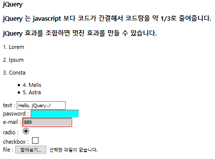

```html
<!DOCTYPE html>
<html lang="en">
<head>
  <meta charset="UTF-8">
  <!--https://developers.google.com/speed/libraries/#jquery-->
  <title>jQuery 기본</title>
</head>
<body>
<script src="https://ajax.googleapis.com/ajax/libs/jquery/3.4.1/jquery.min.js"></script>
<script>
  /*
  jQuery(document).ready(function (){alert("ready event handler1");})
  $(document).ready(function (){alert("ready event handler2");})
  $(function(){alert("즉시 실행될 함수");})
  */
  $(document).ready(function(){
    //$("h3").css("color","orange").css("backgroundColor","lightblue")
    //$("*").css("color","white").css("backgroundColor","lightblue")
    //$("p,h3").css("color","white").css("backgroundColor","lightblue")
    //$("#simple").css("color","white").css("backgroundColor","lightblue")
    //$(".todo").css("color","white").css("backgroundColor","lightblue")
    $("body>p").css("color","white").css("backgroundColor","lightblue")
    $("input[type='text']").val ("hello,jQuery")
    $("input:password").css("backgroundColor","lightblue")
    $("input:focus").css("backgroundColor","Blue")
  }
  )
</script>
<body>
<h3>JQuery</h3>
<h3 id="simple">JQuery는 javascript보다 코드 간결하다 1/3 정도 줄여 준다.</h3>
<h3>JQuery효과 조합으로 멋진 효과를 만들 수 있다.</h3>
<div class= " todo"> <p>1. 쉬기</p></div>
<p>2. 먹기</p>
<article class="todo">3. 많이 공부하기</article>
<ul><li>4. 사회관계망 튼튼하게 하기</li>
<li>5. 마인드 컨트롤</li></ul>
text : <input type="text"><br>
password : <input type="password"><br>
email : <input type="email"><br>
search : <input type="search" autofocus><br>
tel : <input type="tel"><br>
url : <input type="url"><br>

</body>
</html>

```

