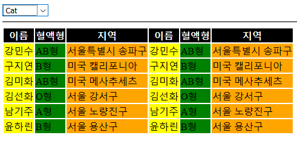

## eq(), nth-child()

```html
<!DOCTYPE html>
<html lang="en">
<head>
    <meta charset="UTF-8">
    <meta name="viewport" content="width=device-width, initial-scale=1.0">
    <meta http-equiv="X-UA-Compatible" content="ie=edge">
    <title>Document</title>
    <script src="https://ajax.googleapis.com/ajax/libs/jquery/3.4.1/jquery.min.js"></script>
    <script>
    $(document).ready(function(){
        $('tr:eq(0)').css('background','black').css('color','white');
        $('td:nth-child(3n+1)').css('background','yellow');
        $('td:nth-child(3n+2)').css('background','green');
        $('td:nth-child(3n)').css('background','orange');


    })
    
    
    </script>
</head>
<body>

  <select>
    <option>Apple</option>
    <option>Bag</option>
    <option>Cat</option>
    <option>Dog</option>
    <option>Elephant</option>
  </select>
  
  <hr>
  
  <table>
        <tr><th>이름</th><th>혈액형</th><th>지역</th><th>이름</th><th>혈액형</th><th>지역</th></tr>
        <tr><td>강민수</td><td>AB형</td><td>서울특별시 송파구</td><td>강민수</td><td>AB형</td><td>서울특별시 송파구</td></tr>
        <tr><td>구지연</td><td>B형</td><td>미국 캘리포니아</td>
		<td>구지연</td><td>B형</td><td>미국 캘리포니아</td></tr>
        <tr><td>김미화</td><td>AB형</td><td>미국 메사추세츠</td>
		<td>김미화</td><td>AB형</td><td>미국 메사추세츠</td></tr>
        <tr><td>김선화</td><td>O형</td><td>서울 강서구</td>
		<td>김선화</td><td>O형</td><td>서울 강서구</td></tr>
        <tr><td>남기주</td><td>A형</td><td>서울 노량진구</td><td>남기주</td><td>A형</td><td>서울 노량진구</td></tr>
        <tr><td>윤하린</td><td>B형</td><td>서울 용산구</td>
		<td>윤하린</td><td>B형</td><td>서울 용산구</td></tr>
    </table>
  
  
</body>
</html>
```

