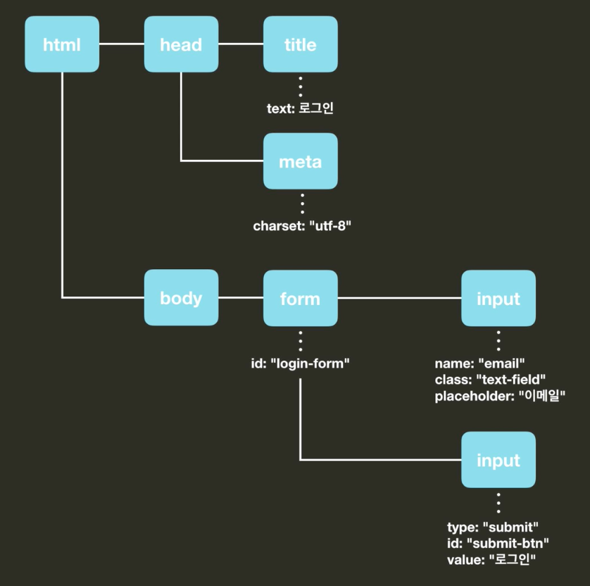
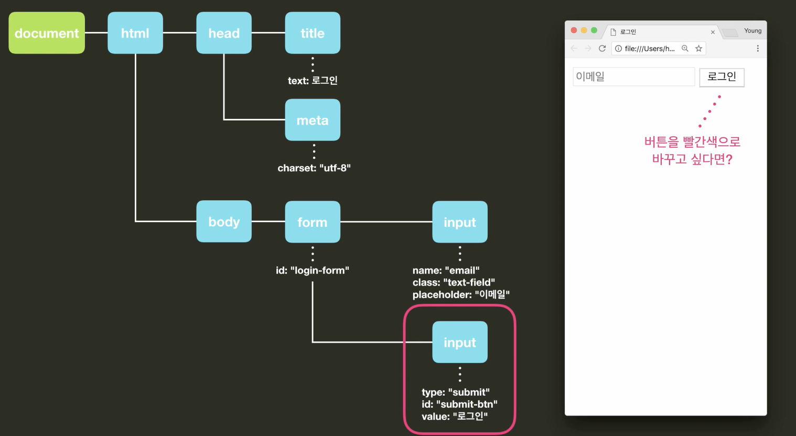
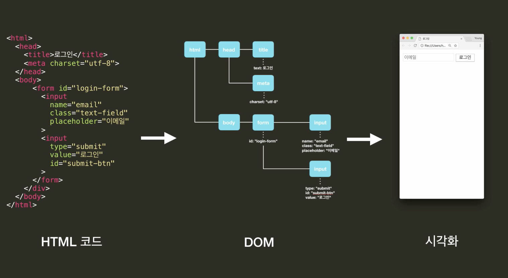

## 문서객체모델(DOM)

- 트리구조

- DOM의 객체들을 시각화해 브라우저에 나타냄.




- 최상위 객체인 **document객체**가 다른 객체의 접근을 도와준다.






### jQuery를 이용해 DOM트리 다루기

- 다양한 방식으로 DOM 객체 선택하기
- DOM트리에 요소 추가 및 빼기
- DOM트리의 요소 변형시키기

#### jQuery = 선택 + 동작


##### 		선택(요소 받아오기)

- `$('#아이디')` : 아이디

- `$('li')` : 태그

- `$('.클래스')` : 클래스

- `$('ul li:last-child')` :li태그 중 마지막 자식

  

  ##### 동작

- 클래스 관련

  ```javascript
  // item에 header이라는 클래스 추가
  $('#item').addClass('header');
  
  // item에 header이라는 클래스 제거
  $('#item').removeClass('header');
  
  // item에 header이라는 클래스가 없으면 추가, 있으면 제거
  $('#item').toggleClass('header');
  
  // item에 header라는 클래스가 있으면 true, 없으면 false 리턴
  $("#item").hasClass('header');
  ```

- 속성 관련

  ```javascript
  // 이미지 태그의 src 속성 받아오기
  $('img').attr('src');
  
  // 이미지 태그의 src 속성 지정하기
  $('img').attr('src', 'images/logo.png');
  
  // h1 태그의 텍스트 받아오기
  $('h1').text();
  
  // h1 태그에 텍스트 지정하기
  $('h1').text('Hello World!');
  
  // h1 태그에 HTML 텍스트 지정하기
  $('h1').html('<b>Hello World!</b>');
  ```

- 스타일 관련

  ```javascript
  // item의 font-weight를 bold로 지정하기
  $("#item").css('font-weight','bold');
  
  // item의 background-color 가져오기
  $("#item").css('background-color');
  ```

  


#### jQuery는 단순 JS의 라이브러리


### HTML 요소 추가

- after

  `$('li').after('<li class='item"> 새로운 아이템</li>')`

  각각의 태그 뒤에 다 생겨버림

  

  `$('#todo-list li:last-child').after('<li class='item"> 새로운 아이템</li>')`

  마지막 태그 뒤에만 생긴다.

- before

  ----> **형제 관계**가 된다.

---

​		-----> **자식관계 **는 ?

- append 

  `$('ul').append('<li class='item"> 새로운 아이템</li>')`

  마지막 자식으로 들어감

  

- prepend

  `$('ul').prepend('<li class='item"> 새로운 아이템</li>')`

  첫번째 자식으로 들어감

