# JSP 시작하기

## 중요 배경지식


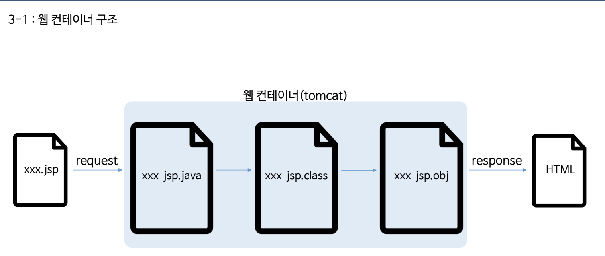

- jsp파일은 반드시 WebContent아래에 있어야 한다.

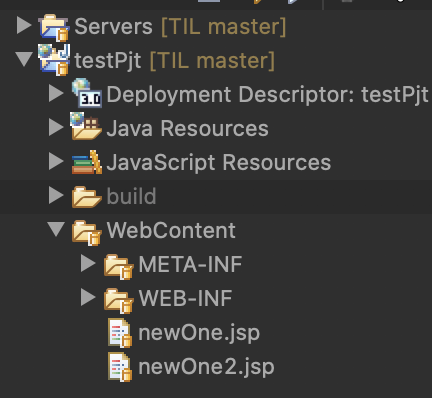


# Servlet 시작하기

- jsp는 안에 html코드를 넣는거고 servlet은 순수 java파일을 이용하는 것.
  - **jsp**는 <u>뷰</u> 부분
  - **servlet** <u>controller, model</u> 서블렛을 이용

## Servlet Mapping

- 
- servlet이 많아지면 구분이 필요하다 (중복불가)
- full path를 보완한 mapping path


## mapping을 어떻게 할까?

- 방법1. web.xml을 이용하는 방법

  ```xml
    <servlet>
    	<servlet-name>testServlet</servlet-name>
    	<servlet-class>com.testPjt.testServlet</servlet-class>
    </servlet>
  
  	<servlet-mapping>
  		<servlet-name>testServlet</servlet-name>
  		<url-pattern>/test</url-pattern>
  	</servlet-mapping>
  ```

  - `servlet-name`은 위아래가 반드시 같아야한다.
  - `servlet-class`는 패키지명.class이름까지 적어줘야 한다.

- 방법2. annotation활용

  `@WebServlet("/ts")`

  - test로도 매핑이 되고, ts로도 매핑이 되서 각각 모두 출력이 된다.

## Response, Request

### httpServlet, httpServletRequest, httpServletResponse

> 추상클래스
>
> httpServlet만 상속받아서 사용하게 되면 아래에 많은 표준화된 기능들을 사용할 수 있게 편의기능을 이용 가능하다.

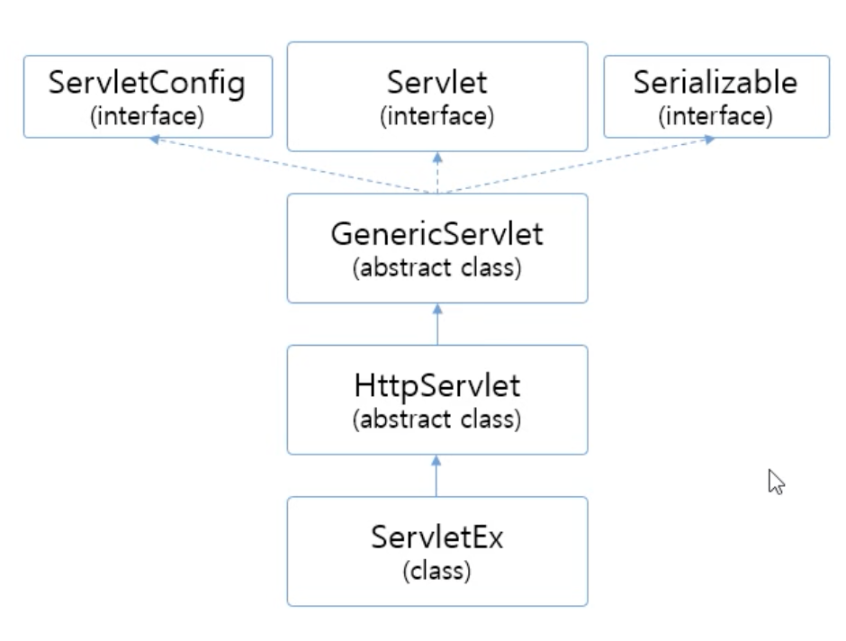

- servlet을 만들면 자동적으로 httpServlet을 상속받음

## Servlet Life-Cycle

- 콜백 메서드
- **WebContainer**가 호출해준다.

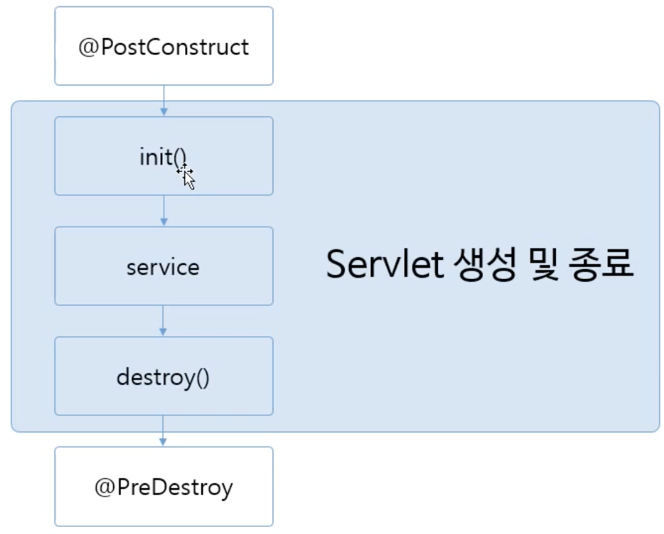

`@PostConstructor` : init()하기 위해 준비, 로그인 아이디 및 패스워드를 변수에 담는다는 등 공통적인 업무를 주로 사용
`@PreDestroy` : 정리, 데이터베이스 사용 후 반납 시 사용

## Form 데이터 처리

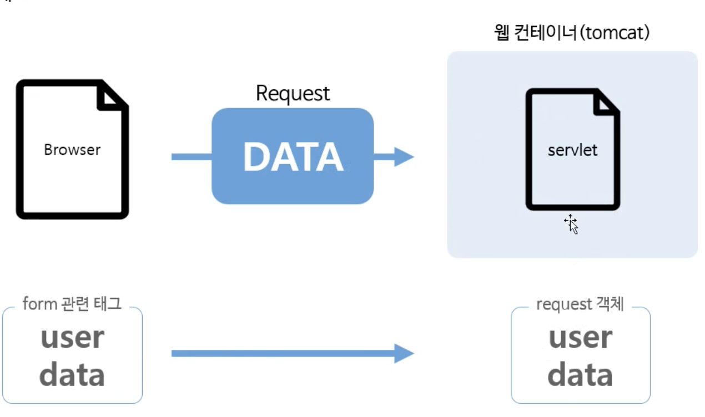

<br><br><br>


### doGet

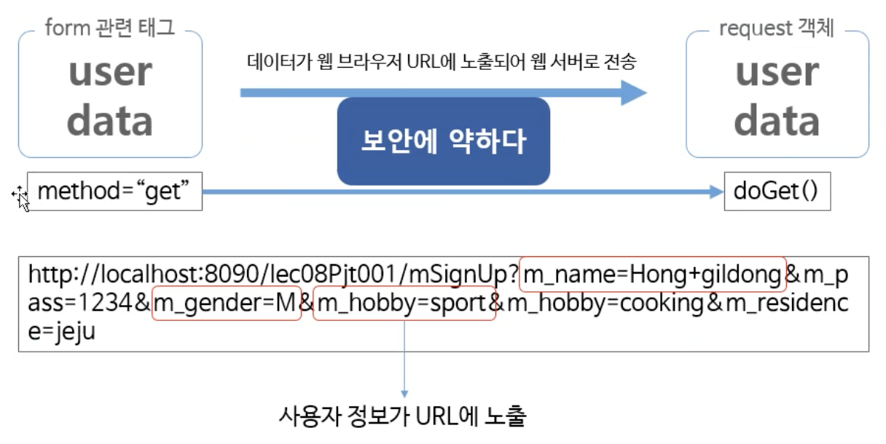

<br><br><br><br>


### doPost

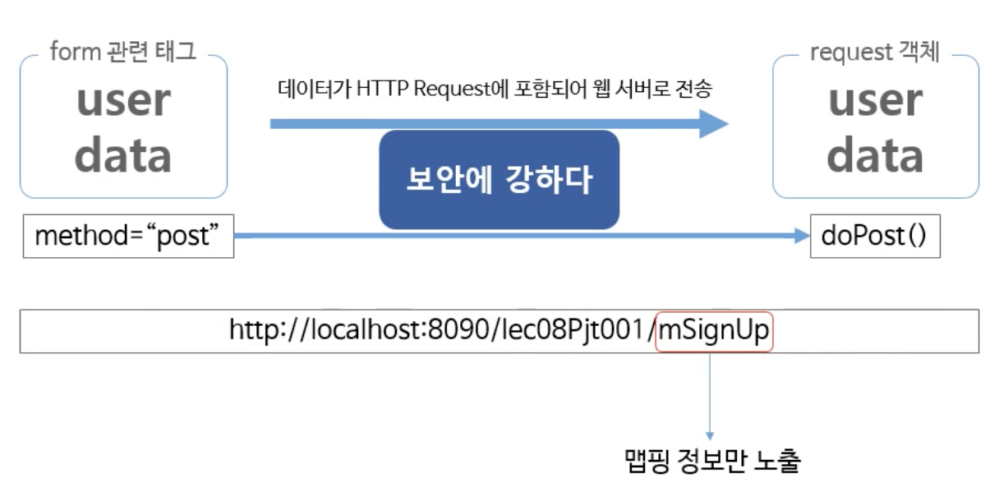

- 맵핑정보만 나올 뿐만 아니라 <u>헤더파일에 암호화되어 전송</u>되어 보안에 강하다.

</br>

</br>

</br>

## JSP 스크립트

- Servlet / JSP 차이점


</br>
</br>
</br>
</br>

### JSP 주요 스크립트

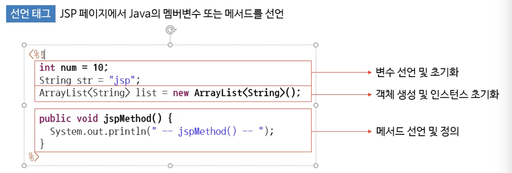
</br>
- 선언 : `<%!   ~~ 자바 언어 ~~  %>`
</br>
</br>
</br>
</br>


#### 스크립트릿 태그


- *java와 html코드가 뒤섞이게 되어 뷰페이지만을 만드는데 쓰일 수 밖에 없다.*

</br>
</br>
</br>
</br>


#### 지시어


<br><br><br><br><br>


## JSP request, response

- *서블릿의 request,response객체와 동일*


#### Request


1. `form action = "page1.jsp"` 로 `POST` 방식으로 요청

2. `Request.getParamter("m_name");` 으로 `m_name`변수에 저장
3. JSP스크립트 언어를 통해 화면에 보여줌.


#### Response


1. firstPage.jsp를 불러오면
2. `Response.sendRedirect("secondPage.jsp")` 때문에 secondPage.jsp가 불러와진다.
3. secondPage문구 출력


## JSP내장 객체

### confing객체

##### 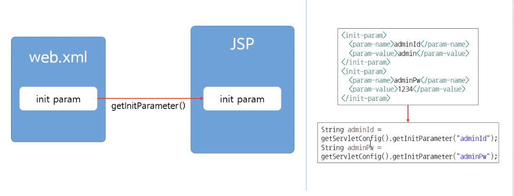

- `getInitParameter("xml에서 정의한 파라미터 이름")`
- 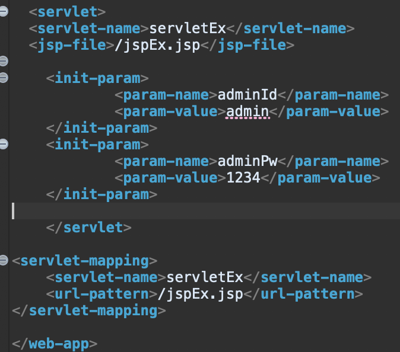

- 지정해준 서블릿 안에서만 사용 가능하다.
  - 하나의 서블릿이 아닌 모든 서블릿에서 접근 가능하려면 ? **application 객체 활용**

### application 객체

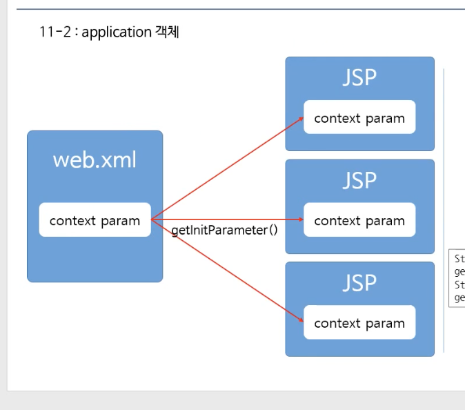

- application에서 공통적으로 사용하는 정보를 다룰 때 사용한다.
- `application.getInitParameter("param-name이름")`

- `setAttribute() / getAttribute()`
  - `getAttribute()` : <u>String형변환</u>을 잊지 말 것.

### out객체

-  `out.print("html코드")`


### exception객체

- 에러 발생시 사용

- `<%@ page errorPage="errorPage.jsp" %>`

  - `<%@ page IserrorPage = true"%>` : 에러페이지 (errorPage.jsp) 에서도 설정해주어야 한다

  