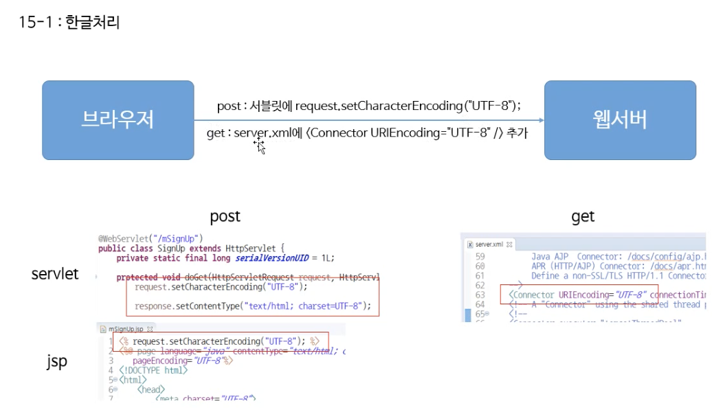
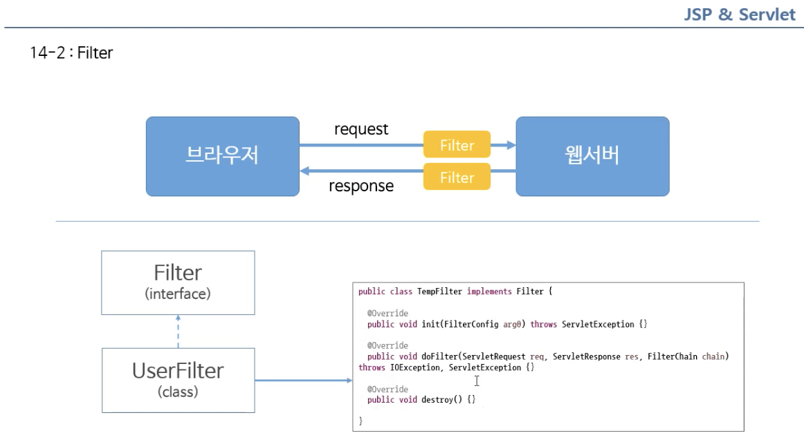
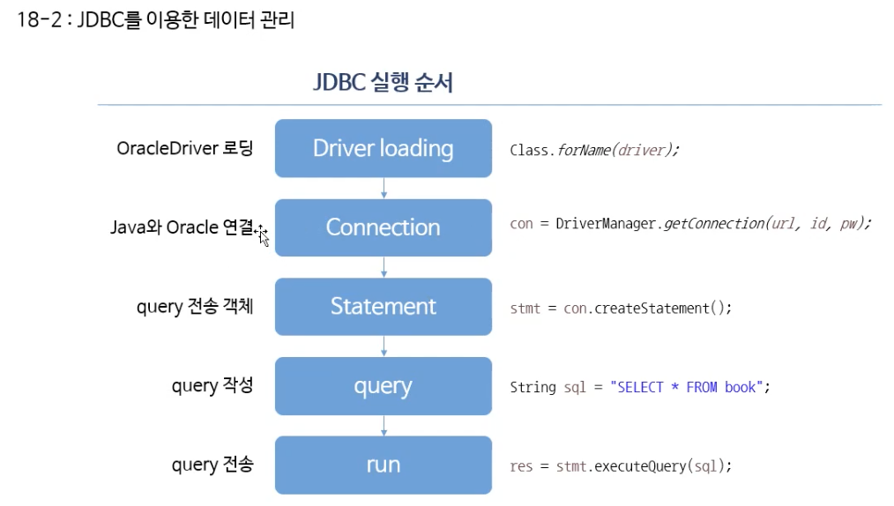
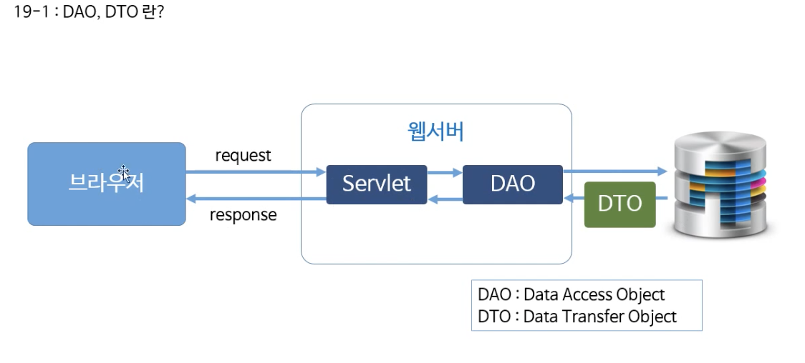

# JSP 시작하기

## 중요 배경지식


- jsp파일은 반드시 WebContent아래에 있어야 한다.


# Servlet 시작하기

- jsp는 안에 html코드를 넣는거고 servlet은 순수 java파일을 이용하는 것.
  - **jsp**는 <u>뷰</u> 부분
  - **servlet** <u>controller, model</u> 서블렛을 이용

## Servlet Mapping

- 
- servlet이 많아지면 구분이 필요하다 (중복불가)
- full path를 보완한 mapping path


## mapping을 어떻게 할까?

- 방법1. web.xml을 이용하는 방법

  ```xml
    <servlet>
    	<servlet-name>testServlet</servlet-name>
    	<servlet-class>com.testPjt.testServlet</servlet-class>
    </servlet>
  
  	<servlet-mapping>
  		<servlet-name>testServlet</servlet-name>
  		<url-pattern>/test</url-pattern>
  	</servlet-mapping>
  ```

  - `servlet-name`은 위아래가 반드시 같아야한다.
  - `servlet-class`는 패키지명.class이름까지 적어줘야 한다.

- 방법2. annotation활용

  `@WebServlet("/ts")`

  - test로도 매핑이 되고, ts로도 매핑이 되서 각각 모두 출력이 된다.

## Response, Request

### httpServlet, httpServletRequest, httpServletResponse

> 추상클래스
>
> httpServlet만 상속받아서 사용하게 되면 아래에 많은 표준화된 기능들을 사용할 수 있게 편의기능을 이용 가능하다.


- servlet을 만들면 자동적으로 httpServlet을 상속받음

## Servlet Life-Cycle

- 콜백 메서드
- **WebContainer**가 호출해준다.


`@PostConstructor` : init()하기 위해 준비, 로그인 아이디 및 패스워드를 변수에 담는다는 등 공통적인 업무를 주로 사용
`@PreDestroy` : 정리, 데이터베이스 사용 후 반납 시 사용

## Form 데이터 처리


<br><br><br>


### doGet


<br><br><br><br>


### doPost


- 맵핑정보만 나올 뿐만 아니라 <u>헤더파일에 암호화되어 전송</u>되어 보안에 강하다.

</br>

</br>

</br>

## JSP 스크립트

- Servlet / JSP 차이점


</br>
</br>
</br>
</br>

### JSP 주요 스크립트


</br>
- 선언 : `<%!   ~~ 자바 언어 ~~  %>`
</br>
</br>
</br>
</br>


#### 스크립트릿 태그


- *java와 html코드가 뒤섞이게 되어 뷰페이지만을 만드는데 쓰일 수 밖에 없다.*

</br>
</br>
</br>
</br>


#### 지시어


<br><br><br><br><br>


## JSP request, response

- *서블릿의 request,response객체와 동일*


#### Request


1. `form action = "page1.jsp"` 로 `POST` 방식으로 요청

2. `Request.getParamter("m_name");` 으로 `m_name`변수에 저장
3. JSP스크립트 언어를 통해 화면에 보여줌.


#### Response


1. firstPage.jsp를 불러오면
2. `Response.sendRedirect("secondPage.jsp")` 때문에 secondPage.jsp가 불러와진다.
3. secondPage문구 출력


## JSP내장 객체

### confing객체

##### 

- `getInitParameter("xml에서 정의한 파라미터 이름")`
- 

- 지정해준 서블릿 안에서만 사용 가능하다.
  - 하나의 서블릿이 아닌 모든 서블릿에서 접근 가능하려면 ? **application 객체 활용**

### application 객체


- application에서 공통적으로 사용하는 정보를 다룰 때 사용한다.
- `application.getInitParameter("param-name이름")`

- `setAttribute() / getAttribute()`
  - `getAttribute()` : <u>String형변환</u>을 잊지 말 것.

### out객체

-  `out.print("html코드")`


### exception객체

- 에러 발생시 사용

- `<%@ page errorPage="errorPage.jsp" %>`

  - `<%@ page IserrorPage = true"%>` : 에러페이지 (errorPage.jsp) 에서도 설정해주어야 한다

  


## Cookie

- 보안에 취약할 수 있으므로 간단한 정보면 다루도록 한다.
- 서버에 수많은 클라이언트가 접속하기 때문에 배열로 다룬다.
- 클라이언트와 서버간 연결을 유지시켜주는 역할
- 로컬PC에 정보가 저장됨

1. loginJSP.jsp

```java
<%@ page language="java" contentType="text/html; charset=UTF-8"
    pageEncoding="UTF-8"%>
<!DOCTYPE html>
<html>
<head>
<meta charset="UTF-8">
<title>Insert title here</title>
</head>
<body>

  
// =========================================================================================    
// 쿠키 정보가 이미 있는 상황에서,  로그인 페이지 다시 불러오기를 방지하는 부분
// =========================================================================================
<%
 Cookie[] cookies = request.getCookies();
System.out.println("cookies : " + cookies );
if(cookies != null){
	for(Cookie C : cookies){
		if(C.getName().equals("memberId")){
			response.sendRedirect("loginOK.jsp");
		}
	}
}

%>
  
// =========================================================================================    
// 폼 프레임 만들기
// =========================================================================================
	<form action= "loginCon" method = "post">
		ID : <input type="text" name="mID"></br>
		PW : <input type="password" name="mPW"></br>
		
		<input type="submit" value="login">

	</form>
</body>
</html>
```


2. loginConfirm 서블릿

```java
package com.servlet;

import java.io.IOException;
import java.io.PrintWriter;

import javax.servlet.ServletException;
import javax.servlet.annotation.WebServlet;
import javax.servlet.http.Cookie;
import javax.servlet.http.HttpServlet;
import javax.servlet.http.HttpServletRequest;
import javax.servlet.http.HttpServletResponse;

/**
 * Servlet implementation class loginCon
 */
@WebServlet("/loginCon")
public class loginCon extends HttpServlet {
	
   
	protected void doGet(HttpServletRequest request, HttpServletResponse response) throws ServletException, IOException {

// ==========================================================================================    
// 폼 정보 출력
// ==========================================================================================
    PrintWriter out = response.getWriter();
		
		String mid = request.getParameter("mID");
		String mpw = request.getParameter("mPW");
				
		out.print("<p> id = " + mid + "</p>");
		out.print("<p> pw = " + mpw + "</p>");

    
// ==========================================================================================
// 쿠키 정보 만들기
// ==========================================================================================
		
		Cookie[] cookies=request.getCookies(); //사용자의 request에서 쿠키가 발생하므로 request
		Cookie cookie = null;
		for(Cookie C : cookies) {
			System.out.println("C.getName = " + C.getName() +"C.getValue = "+ C.getValue());
			
			if(C.getName().equals("memberId")) {
				cookie=C;
			}
		}
		
		if(cookie==null) {
			System.out.println("cookie is null");
			cookie= new Cookie("memberId",mid);	//쿠키 정보 객체 생성
		}
		
		response.addCookie(cookie);
		cookie.setMaxAge(60 * 60);; //유효 쿠키 1시간 
		
		response.sendRedirect("loginJsp.jsp");
		
	}

	
	protected void doPost(HttpServletRequest request, HttpServletResponse response) throws ServletException, IOException {
		// TODO Auto-generated method stub
		doGet(request, response);
	}

}

```


3. loginOK.jsp

```java
<%@ page language="java" contentType="text/html; charset=UTF-8"
    pageEncoding="UTF-8"%>
<!DOCTYPE html>
<html>
<head>
<meta charset="UTF-8">
<title>Insert title here</title>
</head>
<body>
	
<%
Cookie[] cookies = request.getCookies();
for(Cookie C : cookies){
	out.print("name = " + C.getName() +"</br>");
	out.print("value = " + C.getValue() +"</br>");
}
%>
</body>
</html>
```


## Session

- 서버에서 (Web Container)에서 생성과 저장이 된다는 것이 쿠키와의 차이점
- <u>request, response를 하고 나면 연결이 해제</u> 된다*(http 프로토콜의 특징)*는 것은 공통점

1. loginJSP.jsp : 로그인 폼 페이지

```java
<%@ page language="java" contentType="text/html; charset=UTF-8"
	pageEncoding="UTF-8"%>
<!DOCTYPE html>
<html>
<head>
<meta charset="UTF-8">
<title>Insert title here</title>
</head>
<body>

	<%
		//	기존의 session의 유무를 판단하기 위함
		if (session.getAttribute("memberId") != null) {
			response.sendRedirect("loginOK.jsp");

		}
	%>


	<form action="loginCon" method="post">

		ID : <input type="text" name="mId"></br> PW : <input
			type="password" name="mPw"></br> <input type="submit"
			value="login"></input>

	</form>

</body>
</html>
```

2. loginCon 서블릿 생성

```java

package com.sessionPj;

import java.io.IOException;
import java.io.PrintWriter;

import javax.servlet.ServletException;
import javax.servlet.annotation.WebServlet;
import javax.servlet.http.HttpServlet;
import javax.servlet.http.HttpServletRequest;
import javax.servlet.http.HttpServletResponse;
import javax.servlet.http.HttpSession;

@WebServlet("/loginCon")
public class loginCon extends HttpServlet {

	protected void doGet(HttpServletRequest request, HttpServletResponse response)
			throws ServletException, IOException {
    
		PrintWriter out = response.getWriter();

		String mId = request.getParameter("mId");
		String mPw = request.getParameter("mPw");

		out.print("mid : " + mId);
		out.print("mPw : " + mPw);
    
 // ==========================================================================================
 // 세선 부분
 // ==========================================================================================

		HttpSession Session = request.getSession(); // 해당 인터페이스에 담는다

		Session.setAttribute("memberId", mId);
 // ==========================================================================================

		response.sendRedirect("loginOK.jsp");
	}

	protected void doPost(HttpServletRequest request, HttpServletResponse response)
			throws ServletException, IOException {
		doGet(request, response);
	}
}
```


3. loginOK.jsp

```java
<%@ page language="java" contentType="text/html; charset=UTF-8"
	pageEncoding="UTF-8"%>
<!DOCTYPE html>
<html>
<head>
<meta charset="UTF-8">
<title>Insert title here</title>
</head>
<body>


	<%
		session = request.getSession();
		out.print("memberId : " + session.getAttribute("memberId") + "</br>");
	%>


	<form action="logoutCon" method="post">
		<input type="submit" value="logout"> //로그아웃 버튼
	</form>
</body>
</html>
```


4. logoutCon 서블릿

```java
package com.sessionPj;

import java.io.IOException;
import javax.servlet.ServletException;
import javax.servlet.annotation.WebServlet;
import javax.servlet.http.HttpServlet;
import javax.servlet.http.HttpServletRequest;
import javax.servlet.http.HttpServletResponse;
import javax.servlet.http.HttpSession;

@WebServlet("/logoutCon")
public class logoutCon extends HttpServlet {

	protected void doGet(HttpServletRequest request, HttpServletResponse response)
			throws ServletException, IOException {
    
		HttpSession session = request.getSession();
    
		session.invalidate(); // 해당 세션 삭제하는 메서드

		response.sendRedirect("loginJSP.jsp");

	}

	protected void doPost(HttpServletRequest request, HttpServletResponse response)
			throws ServletException, IOException {

		doGet(request, response);
	}

}

```


## 한글 처리



방법1. 

- Post 와 Get방식 각각 다른 방식으로 처리

빙법2. 

- Filter 사용하여 처리


1-1. POST 방식 (jsp 에서 servlet으로 전달할 경우)

- registForm.jsp

```java
<%@ page language="java" contentType="text/html; charset=UTF-8"
    pageEncoding="UTF-8"%>
<!DOCTYPE html>
<html>
<head>
<meta charset="UTF-8">
<title>Insert title here</title>
</head>
<body>

<form action="registForm" method="post">

	이름 : <input type="text" name="name">
	별명 : <input type="text" name="nickName">
	
	<input type="submit" value="가입">
</form>

</body>
</html>
```

- registForm 서블릿

```java
package com.encodingPj;

import java.io.IOException;
import java.io.PrintWriter;

import javax.servlet.ServletException;
import javax.servlet.annotation.WebServlet;
import javax.servlet.http.HttpServlet;
import javax.servlet.http.HttpServletRequest;
import javax.servlet.http.HttpServletResponse;

@WebServlet("/registForm")
public class registForm extends HttpServlet {

	protected void doGet(HttpServletRequest request, HttpServletResponse response) throws ServletException, IOException {

// =========================================================================================
// 엔코딩 부분
// =========================================================================================
    
		request.setCharacterEncoding("UTF-8");
		response.setContentType("text/html; charset=UTF-8");
		
// =========================================================================================
    
    
    
		PrintWriter out = response.getWriter();
		String name = request.getParameter("name");
		String nickName = request.getParameter("nickName");
		
		out.print("name : " + name + "</br>");
		out.print("nickName : " + nickName);
		
		
		
	}
	protected void doPost(HttpServletRequest request, HttpServletResponse response) throws ServletException, IOException {
		// TODO Auto-generated method stub
		doGet(request, response);
	}

}

```


- jsp--> jsp페이지 이동에서의 인코딩

  - signUp.jsp

  ```java
  // =========================================================================================
  // 엔코딩 부분
  
  <%
  	request.setCharacterEncoding("UTF-8");
  %>
    
  // =========================================================================================
    
  <%@ page language="java" contentType="text/html; charset=UTF-8"
  	pageEncoding="UTF-8"%>
  <!DOCTYPE html>
  <html>
  <head>
  <meta charset="UTF-8">
  <title>Insert title here</title>
  </head>
  <body>
  	<%!String mName;
  	String mNickName;%>
  
  
  	<%
  		mName = request.getParameter("name");
  		mNickName = request.getParameter("nickName");
  	%>
  
  	이름 :
  	<%=mName%></br> 별명 :
  	<%=mNickName%>
  </body>
  </html>
  ```


​	1-2. GET 방식일 경우 사용하는 서버에 server.xml에 입력하면 끝

```xml
<Connector  URIEncoding="UTF-8" connectionTimeout="20000" port="8080" protocol="HTTP/1.1" redirectPort="8443"/>
```


2. Filter



- <u>인터페이스</u>이므로 구현해야 한다.
- Init, doFilter, destroy
- 클래스에서 작성한 후, `web.xml`에 등록을 해 주어야 한다.
- name과 value가 같이 묶여 돌아가는 체인 기법.


## JDBC



Select 일때만 executeQuery,

반환형이 int가 아님 (updateQuery만 int)


### preparedStatement 

> 쿼리문을 좀 더 보기 좋게 하기 위함.

쿼리문 작성 후 preparedStatement호출


적용할 값을 ? 로 표현, 순서대로 적용


## DAO, DTO



DAO 부분만 객체로 따로 떼어내어 모듈화 시킨 것.

java, sql언어 호환이 안되기 때문에 java 형태로 가공을 해야한다. 중간 매개체 역할이 DTO (VO)


## 커넥션 풀

*웹서버와 데이터베이스 사이에 연결할 때마다 연결하고 끊는 반복적인 작업의 과부화가 생길 수 있다.*

이를 방지하기 위해 미리 만드는 개념으로 **Connection Pool**을 활용. 가져다 빌려다 쓰고 반환

좀더 안정적이고 효율적인 퍼포먼스가 가능하게 된다.


tomcat에 커넥션 풀 설정

`context.xml` 파일에 지정 

```xml
<Resource 
	  auth = "Container"
	  driverClassName="oracle.jdbc.driver.OracleDriver"
	  url="jdbc:oracle:thin:@localhost:1521:xe"
	  username = "scott"
	  password ="tiger"
	  name="jdbc/Oracle11g"
	  type="javax.sql.DataSource"
	  maxActive="4"
	  maxWait="10000"/>
```

