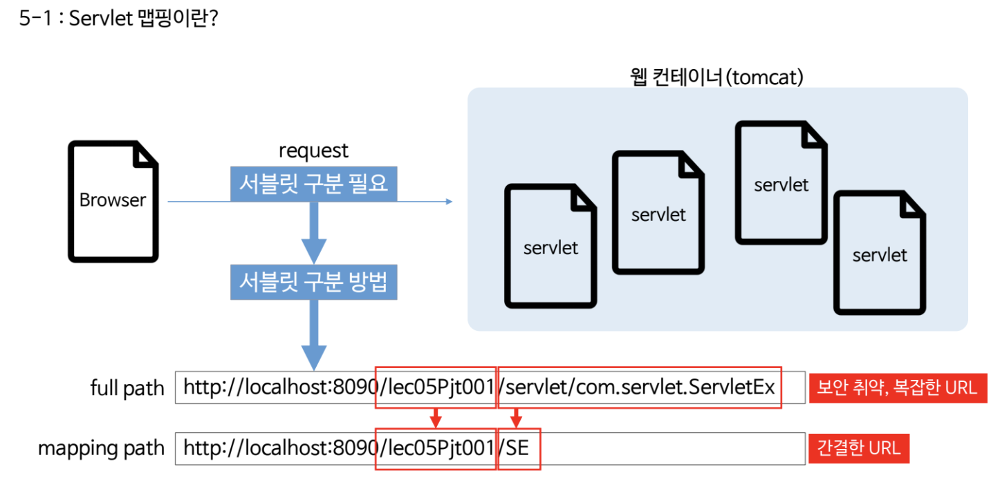

# JSP 시작하기

## 중요 배경지식


- jsp파일은 반드시 WebContent아래에 있어야 한다.


# Servlet 시작하기

- jsp는 안에 html코드를 넣는거고 servlet은 순수 java파일을 이용하는 것.
  - **jsp**는 <u>뷰</u> 부분
  - **servlet** <u>controller, model</u> 서블렛을 이용

## Servlet Mapping

- 
- servlet이 많아지면 구분이 필요하다 (중복불가)
- full path를 보완한 mapping path


### mapping을 어떻게 할까?

- 방법1. web.xml을 이용하는 방법

  ```xml
    <servlet>
    	<servlet-name>testServlet</servlet-name>
    	<servlet-class>com.testPjt.testServlet</servlet-class>
    </servlet>
  
  	<servlet-mapping>
  		<servlet-name>testServlet</servlet-name>
  		<url-pattern>/test</url-pattern>
  	</servlet-mapping>
  ```

  - `servlet-name`은 위아래가 반드시 같아야한다.
  - `servlet-class`는 패키지명.class이름까지 적어줘야 한다.

- 방법2. annotation활용

  `@WebServlet("/ts")`

  

  - test로도 매핑이 되고, ts로도 매핑이 되서 각각 모두 출력이 된다.