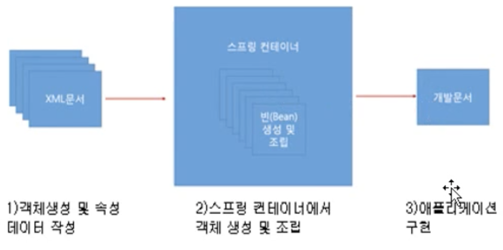
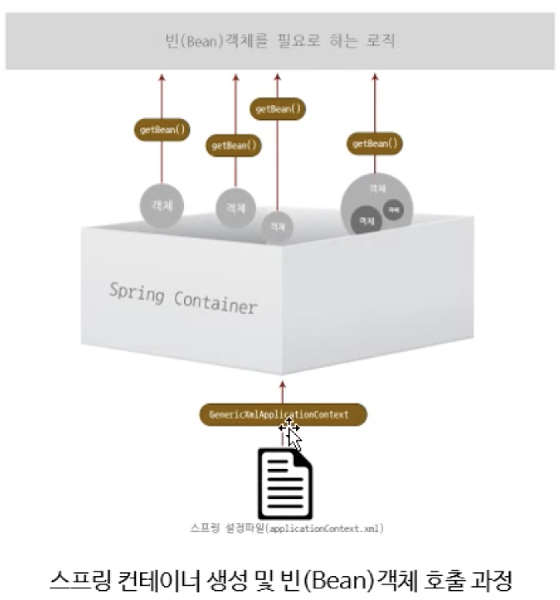

## Spring

> 웹 어플리케이션 개발에 많이 이용된다.
>
> > JSP를 많이 다루게 된다. ( JSP - MVC, JDBC )


### 스프링 프레임워크 주요 기능

> DI, AOP, MVC, JDBC


- DI 

> ​	주입


- AOP 

> ​	관점 지향 프로그래밍 , 공통 부분을 뽑아내 주요 부분만 작업


### 스프링 프레임워크에서 제공하고 있는 모듈

사용하려면 ? <u>xml파일</u>등을 이용

과거에는 모듈을 개별적으로 다운받았지만 <u>xml을 이용하면 자동으로 다운로드</u> 받게 된다.

- **spring-core** : DI, IoC제공

- **spring-aop** : AOP구현

- **spring-jdbc**

- **spring-tx** : 트랜잭션 관련 기능 제공

- **spring-webmvc** : MVC구현 기능 제공

  

---





### 스프링 컨테이너

> 객체를 생성하고 조립하는 컨테이너,

- xml을 이용해 만들어진 객체들을 담고 있는 큰 객체

### 빈(Bean)

> 컨테이너를 통해 생선된 객체


---

### Maven 

스프링에서 사용하는 빌드 툴


### 구조 :star: * 99 

프로젝트 폴더 - src - main - **java(기능 구현) , resources(보조 파일)**


모듈..  `applicationContext.xml`이용해 빈 생성하기

```java
<?xml version="1.0" encoding="UTF-8"?>

<beans xmlns="http://www.springframework.org/schema/beans"
    xmlns:xsi="http://www.w3.org/2001/XMLSchema-instance"
    xsi:schemaLocation="
        http://www.springframework.org/schema/beans http://www.springframework.org/schema/beans/spring-beans.xsd">

<bean id="twalk" class="testPjt.moveWalk"/>


</beans>
```


---

### DI (Dependency Injection)



*객체 안에 객체가 있다.  = 의존성이 형성되어 있다.*


