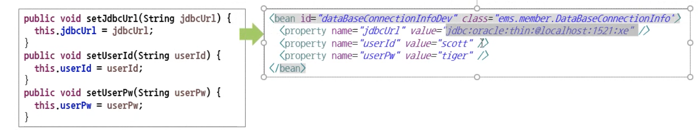
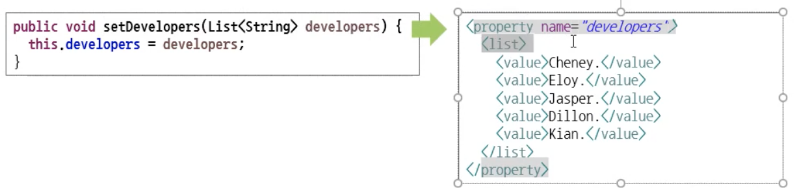
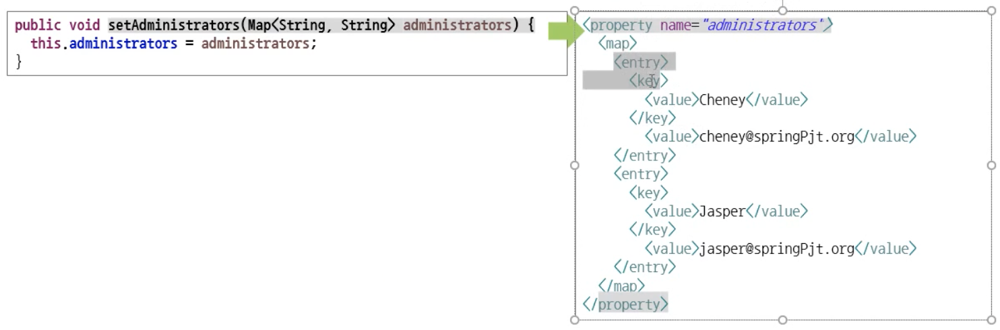
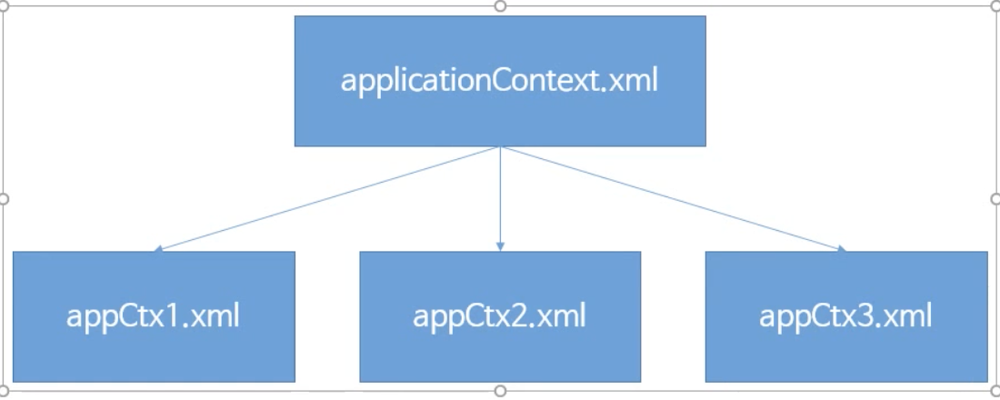
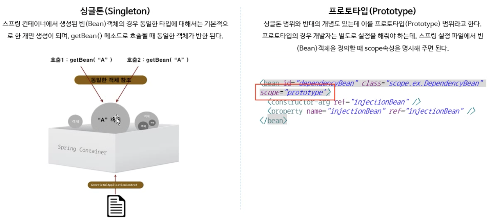

## Spring

> 웹 어플리케이션 개발에 많이 이용된다.
>
> > JSP를 많이 다루게 된다. ( JSP - MVC, JDBC )


### 스프링 프레임워크 주요 기능

> DI, AOP, MVC, JDBC


- DI 

> ​	주입


- AOP 

> ​	관점 지향 프로그래밍 , 공통 부분을 뽑아내 주요 부분만 작업


### 스프링 프레임워크에서 제공하고 있는 모듈

사용하려면 ? <u>xml파일</u>등을 이용

과거에는 모듈을 개별적으로 다운받았지만 <u>xml을 이용하면 자동으로 다운로드</u> 받게 된다.

- **spring-core** : DI, IoC제공

- **spring-aop** : AOP구현

- **spring-jdbc**

- **spring-tx** : 트랜잭션 관련 기능 제공

- **spring-webmvc** : MVC구현 기능 제공

  

---


### 스프링 컨테이너

> 객체를 생성하고 조립하는 컨테이너,

- xml을 이용해 만들어진 객체들을 담고 있는 큰 객체

### 빈(Bean)

> 컨테이너를 통해 생선된 객체


---

### Maven 

스프링에서 사용하는 빌드 툴


### 구조 :star: * 99 

프로젝트 폴더 - src - main - **java(기능 구현) , resources(보조 파일)**


모듈..  `applicationContext.xml`이용해 빈 생성하기

```java
<?xml version="1.0" encoding="UTF-8"?>

<beans xmlns="http://www.springframework.org/schema/beans"
    xmlns:xsi="http://www.w3.org/2001/XMLSchema-instance"
    xsi:schemaLocation="
        http://www.springframework.org/schema/beans http://www.springframework.org/schema/beans/spring-beans.xsd">

<bean id="twalk" class="testPjt.moveWalk"/>


</beans>
```


---

### DI (Dependency Injection)


*객체 안에 객체가 있다.  = 의존성이 형성되어 있다.*


---

### 다양한 의존객체 주입

1. #### 생성자를 이용

   `<constructor-arg>` 키워드를 사용

   ```xml
   <bean id="studentDao" class="ems.member.dao.StudentDao"></bean>  //Bean객체 생성
   
   <bean id =" registerService" class="ems.member.service.StudentRegisterService">
   	<constructor-arg ref="studentDao"></constructor-arg>
   </bean>
   ```

   

2. #### setter

   ```xml
   <bean id= " dataBaseConnectionInfoDev" class="ems.member.dao.StudentDao">
   	<property name="jdbcUrl" value = "jdbc:oracle:thin:@localhost:1521:xe"> </property>
   	<property name="userId" value = "scott"> </property>
   	<property name="userPw" value = "tiger"> </property>
    </bean>
   ```

   

   

3. #### list타입 (여러개의 value를 입력해야할 때)

   ```xml
   <property name="developers">
   	<list>
     	<value> John</value>
     	<value> Zaniac</value>
     </list>
   </property>
   ```

   

4. #### map타입 (key, value로 이루어져 있다.)

   ```xml
   <property name="adminstartors">
   <map>
     <entry>
     	<key>
       	<value>Cheney</value>
       </key>
       <value>Cheney@springPjt.org</value>
     </entry>
     <entry>
     	<key>
       	<value>Jasper</value>
       </key>
       	<value>Jasper@springPjt.org</value>
     </entry>
     </map>
   </property>
   ```

   

   


---

### 스프링 설정 파일 분리



1. 방법1

- 하나의 xml내용이 너무 길어지면 관리효율 및 가독성이 떨어진다.

- 일반적인 분리 방법은 <u>기능별로</u>

- 분리된 파일들은 **배열형식**으로 모아져 컨테이너가 만들어진다.

  ```java
  String[] appCtxs = {"classpath:appCtx1.xml", "classpath:appCtx2.xml", "classpath:appCtx3.xml"};
  
  GenericXmlApplicationContext ctx = new GenericXmlApplicationContext(appCtxs);
  
  EMSInformation informationService = appctx.getBean("InformationService",EMSInformationService.class);
  
  InformationService.outputEMSInformation();
  ```

  

2. 방법2. *import*하는 방법.

appCtx1에 studentDao내용이 있다고 가정하면 `<import resource="classpath:appCtx2.xml"/>`, `<import resource="classpath:appCtx3.xml"/>` 하면 하나의 파일만 사용하면 된다.


### 빈 (Bean)의 범위




---

### 의존객체 자동 주입

#### @Autowired

> 주입하려고 하는 **객체의 타입**이 일치하는 객체를 자동으로 주입한다.

- 생성자 외에 **프로퍼티, 메서드**에도 적용 가능
  - 단, 이럴 경우 **디폴트 생성자**를 만들어주어야 한다.

#### @Resource

> autowired는 객체 타입
>
> Resource는 **객체의 이름**을 본다

- 리소스는 생성자에는 사용이 불가!


