# node.js || express ?

js를 항상 브라우저에서만 사용하게됨

node가 나오면서 서버사이드에서도 사용가능하게 됨

## express ?

node가 엔진이라고 한다면

**express** : 엔진 + 바퀴, 브레이크시스템 등등 으로 자동차를 만드는 것 

nodejs를 쉽게 이용할수 있도록 하는 프레임워크


# express 라이브러리 설치하기

1. npm init : package.json을 설정해줌

npm : 라이브러리 설치를 도와주는 도구

어떤 라이브러리를 설치했는지 기록하면 좋음. --> package.json에 기록함 


2. npm intall express

   node_modules가 생성된다. 그 안에 express폴더도 같이 생성됨


# 모델

스키마를 감싸는 것

스키마 ?

하나하나 정보틀을 지정한 것


# GET요청을 처리해보자

### 1. 서버 만들기

서버를 띄우기 위한 기본 셋팅 (express 라이브러리)

```javascript
const express = require("express")

const app = express()

app.listen(8080, function () {
  console.log("listening on 8080")
})

app.get("/pet", function (request, response) {
  response.send("hello PET acc shop")
})

app.get("/beauty", function (request, response) {
  response.send("hello Beauty acc shop")
})


위의 GET 요청을 하면 hello~ 글들이 나타난다.
```


### 1-1. Nodemon 라이브러리

변경사항이 있을 때마다 서버를 껐다가 다시 켜야 하는 불편함을 보완해주는 라이브러리

`npm install -g nodemon`

Permission 오류가 나면 ?

`sudo chown -R $USER (오류난 경로)/usr/local/lib/node_modules` 


### 2. 실행

`nodemon server.js`


### 3. 서버에서 html 전송

response.sendFile()

`__dirname` : 현재경로

sendFile() : 파일을 보낼 수 있다.

```javascript

app.get("/", function (request, response) {
  //   response.send("무야호~")
  response.sendFile(__dirname + "/index.html")
  server.js랑 같은 경로에 있는 /index.html이라는 파일을 보내줌
})

```


## form에서 정보 입력하기

1. write.html

   ```html
   <!DOCTYPE html>
   <html lang="en">
     <head>
       <meta charset="UTF-8" />
       <meta name="viewport" content="width=device-width, initial-scale=1.0" />
       <title>Document</title>
       <link
         href="https://cdn.jsdelivr.net/npm/bootstrap@5.0.0-beta3/dist/css/bootstrap.min.css"
         rel="stylesheet"
         integrity="sha384-eOJMYsd53ii+scO/bJGFsiCZc+5NDVN2yr8+0RDqr0Ql0h+rP48ckxlpbzKgwra6"
         crossorigin="anonymous"
       />
     </head>
     <body>
       <div class="container m-5">
         <form action="/add" method="POST">
           <div class="form-group mb-3">
             <label for="exampleInputEmail1">Todo</label>
             <input type="text" class="form-control" name="title" />
           </div>
           <div class="form-group mb-3">
             <label for="exampleInputPassword1">Due Date</label>
             <input type="date" class="form-control" name="date" />
           </div>
   
           <button type="submit" class="btn btn-primary">Submit</button>
         </form>
       </div>
       <script
         src="https://cdn.jsdelivr.net/npm/bootstrap@5.0.0-beta3/dist/js/bootstrap.bundle.min.js"
         integrity="sha384-JEW9xMcG8R+pH31jmWH6WWP0WintQrMb4s7ZOdauHnUtxwoG2vI5DkLtS3qm9Ekf"
         crossorigin="anonymous"
       ></script>
     </body>
   </html>
   ```

   중요한 것 !

   1. form 태그 안에서 **action , method**
   2. input 태그 안에서 **name**

   

2. 전송버튼을 누르면 js에서 해야 할 일

   ```javascript
   // 어떤 사람이 /add 경로로 post요청을 하면
   // ~~~를 해주세요
   app.post("/add", function (req, res) {
     res.send("전송완료")
     console.log(req.body.date)
   })
   
   
   요청된 정보들은 req에 저장되어 있다.
   콘솔에 출력해보면 req.body 오브젝트 형태로 나옴
   ```

   

이제 영구적으로 저장 (DB에 저장)할 단계가 남음


그전에 

# REST API ?

- API ?
  
- 어떤식으로 통신할 것인지에 대한 규약
  
- 웹개발 환경에서의 API ?

  - 서버와 고객간의 요청 방식  (소통방법)
  - 어떻게 해야 서버랑 통신할 수 있을까

  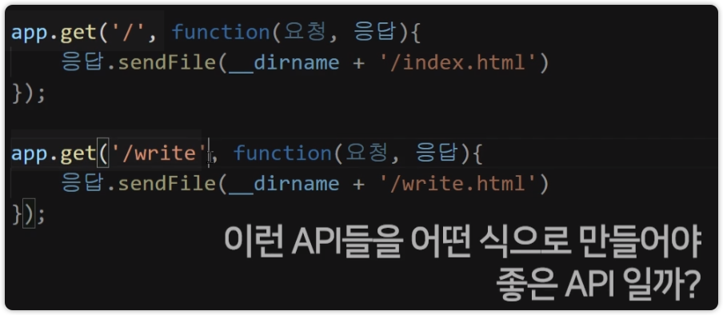


인터넷이 발달하던 시절 일관성도 없고 막 만들었기 때문에 어려움

REST 원칙에 의해서 쓰면 아름답다

**원칙 6개**

1. **uniform interface**

   하나의 자료는 하나의 URL로

   URL은 예측 가능해야함

2. Client-Server 역할 구분

   브라우저는 요청만 할 뿐, 서버는 응답만 할 뿐

3. Stateless

   고객들이 요청 시 각각의 요청들은 독립적인 존재로 다루어야 함. 

   요청 1과 요청 2는 의존성이 없어야함

4. Cachable

   크롬이 알아서 잘 해줌

5. Layered System

6. Code on Demand


**이름짓기 원칙**

1. 명사로 작성 추천
2. 하위문서를 나타낼 땐 /
3. 파일확잣자(.html) 쓰지 말기
4. 띄어쓰기는 ( - ) 사용
5. 자료 하나당 하나의 URL


웹사이트 기능만들기 기본

1. 서버로 데이터 전송할 UI만들고
2. 서버에서 원하는대로 정보를 처리해주면 됨


DB종류

1. 관계형
   1. 엑셀처럼 행과 열이 나누어져 있는 데이터베이스
   2. 3차원의 데이터들은 다루지 못한다.
   3. 그래서 다른 테이블들을 만들어 join등을 하며 해결한다.
   4. SQL이라는 언어를 사용해야 한다.
2. NoSQL
   1. Object 자료형으로 입출력 가능
   2. 대표적으로 **MongoDB**
   3. 무료로 호스팅을 받아 사용 가능
   4. MongoDB atlas


# EJS

 /list로 GET요청으로 접속하면

// 실제 DB에 저장된 데이터들로 꾸며진 HTML을 보여줌


html

EJS

서버데이터를 집어넣을 수 있다.

대체품 : vue, react, angular


ejs파일들은 항상 views폴더에 있어야 한다.

 


# 게시물들 번호 매기기

```javascript
app.post("/add", function (req, res) {
  db.collection("post").insertOne(
    { _id: 총게시물갯수+1, 제목: req.body.title, 날짜: req.body.date },
    function (에러, 결과) {
      console.log("저장완료")
    }
  )
  res.send("전송완료")
  console.log(req.body.date)
})

```

다른 DB들은 auto increament가 있는데 몽고는 없다

총 게시물 갯수를 어떻게 구하냐 ?

count함수로 총 갯수를 구하는 방법 ? 비추

저장되는 시점에 따라 혼선유발 가능

글마다의 고유의 번호를 부여하자


1. .Counter라는 컬렉션을 만든다
2. 0을 부여하고
3. findOne(하나만 찾기 때문에) 을 사용해서 결과 값을 불러온다.
4. 불러온 결과값을 `총게시물갯수`  변수에 할당한다.
5. 글이 새로 생기면 counter라는 콜렉션에 있는 totalPost라는 항목도 1 증가시켜야 한다.


Update함수

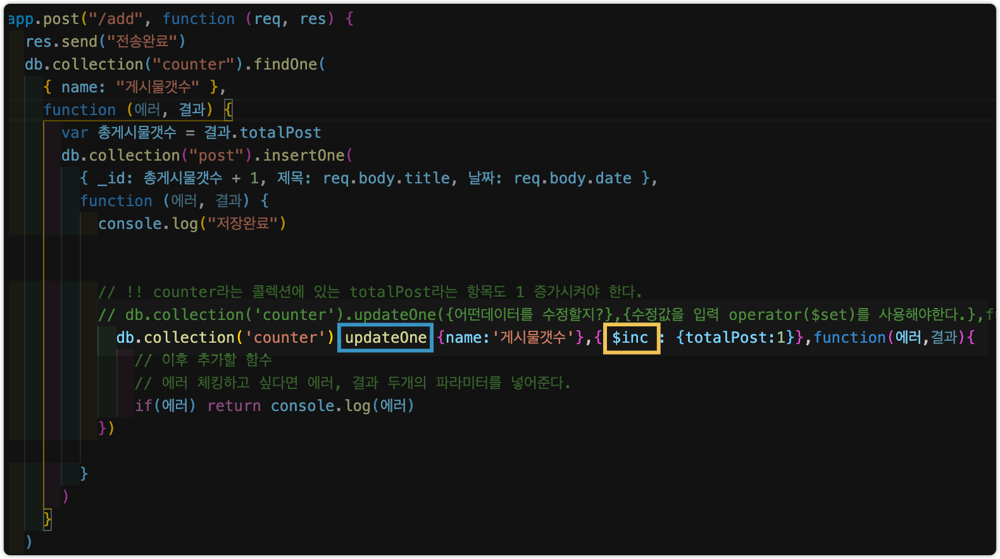


### operator

$set(변경)

$inc(증가)

$min(기존값보다 적을 때만 변경

$rename(key값 이름 변경)


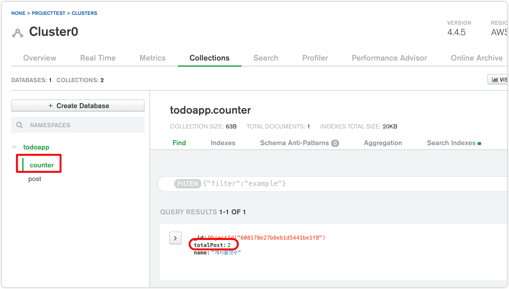

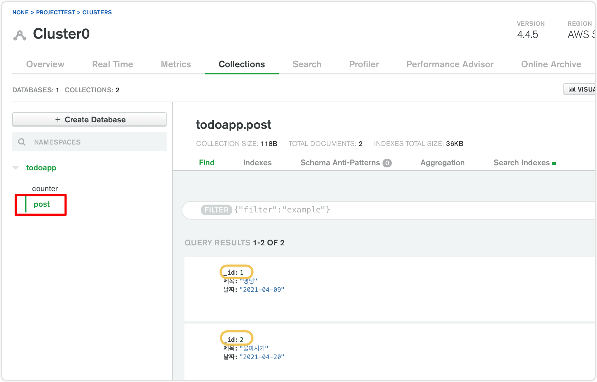


# 글 삭제

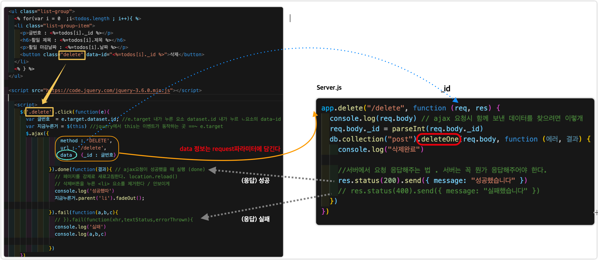

DELETE요청

html에서 바로 delete, put를 요청할 수는 없음 (post, get은 되지만..)

1. 라이브러리 

   1.  **method-override** 라이브러리 : form에서 delete요청이 가능하게 된다.

2. Ajax요청을 한다.

   


# Detail페이지

상세페이지를 만들어보자 (URL parameter)

/detil로 접속하면 detail.ejs 보여줌

1번 누르면 1번 상세페이지,

2번글 누르면 2번 상세페이지로...


/detil1로 접속하면 detail1.ejs 보여줌

/detil2로 접속하면 detail2.ejs 보여줌

/detil3로 접속하면 detail3.ejs 보여줌

...


detail 페이지를 여러개 ?

url을 다르게 설정하면 된다.


```javascript
app.get('/detail/:id', function(res,req){
  res.render('detail.ejs', {이런이름으로 : 이런데이터를});
})

: :url parameter
적엇을때 render해주세요

```


findOne이라는 함수를 사용해 _id값을 찾는다.

req.params.id에 정보가 담겨있음!

```javascript
app.get("/detail/:id", function (req, res) {
  req.params.id = parseInt(req.params.id)
  db.collection("post").findOne({ _id: req.params.id }, function (에러, 결과) {
    console.log(결과)
    
    res.render("detail.ejs", { data: 결과 }) // 정보들을 보냄
  })
})
```


# Detail페이지 디자인하기

```html
<div class="container mt-4">
```

container 속성을 주면 정렬된다


css파일 적용시키기

보통 관습적으로 public/main.css 이렇게 파일을 넣어줌

css파일들은 static파일이라고  함


조립식

ejs파일들이 매우 많을때,

nav태그 요소를 고치려고 할때 여러개의 ejs파일들을 일일이 고쳐야 하는 경우가 발생

이럴때는 공통된 요소를 따로 빼 필요한 부분에 `<%- include('nav.html') %>`  를 해준다.


# Update(글 수정) 페이지


HTML에서 PUT, DELETE요청을 직접하는 것은 불가능하다

이러한 기능을 가능하도록 해주는 것이 **`method-override`**

`npm install method-override`


**server.js**

```javascript
//method-override 설정 부분
const methodOverride = require("method-override")

app.use(methodOverride("_method"))


// 폼에 담긴 제목데이터, 날짜 데이터를 db.collection에 업데이트한다.
app.put("/edit", (req, res) => {
  db.collection("post").updateOne(
    { _id: parseInt(req.body.id) },
    { $set: { 제목: req.body.title, 날짜: req.body.date } },
    (err, result) => {
      console.log(result)
      res.redirect("/list")
    }
  )
})

```


**Edit.ejs**


# 세션, JWT, OAuth 등 회원인증 방법론

회원 인증 방법

1. cookie based

   브라우저에 저장할 수 있는 긴 문자열

   Session id 가 적힌 쿠키

   서버메모리에 이 정보를 저장하고 저장이 되면 쿠키로 만들어 브라우저에 보낸다

   브라우저는 이 쿠키를 저장한다.

   마이페이지 접속 시 이 쿠키데이터를 서버에게 자동으로 전송한다.

   이 쿠키에는 session id가 저장되어 있으므로 서버((session store)에서 찾는다 

   있으면 마이페이지에 보내준다.

   이러한 과정들은 라이브러리들이 알아서 해주기 때문에 흐름만 기억하도록 한다.


2. Token-based (JWT)

   로그인 성공시

   서버에서는 JSON Web Token (암호화된 그냥 긴 문자열)을 브라우저에게 전송함

   이러한 문자열을 local storage등에 저장한다.

   마이페이지 요청시 서버에게 웹 토큰을 Header에 함께 전송한다.

   서버는 토큰이 있으면 유효한 토큰인지 검사한다. (유통기한이 있는 방식)

   유저들 로그인 상태를 저장할 필요가 없음 (보다 Restful한 방식)

   

3. Open Authentication (OAuth)

   Google, 의 프로필 정보를 가져옴 소셜 로그인 방식

   pw가 필요없음

   사이트가 없어지면 사용이 불가능


# CORS 이슈 Proxy 설정

# concurrently

`npm install concurrently`

​	

회원가입 & 로그인

회원가입

node.js


1. 기본 구성 exprees & mongoose

   mongoose : mongoDB ODM 중 가장 유명한 라이브러리

   ODM : Object Document Mapping MongoDB의 데이터를 NodeJS에서 JS객체로 사용할 수 있도록 해준다.

   데이터베이스 연결 , 스키마 정의, 스키마에서 모델로 변환, 모델을 이용해 데이터를 다룸

   프로미스 & 콜백 사용 가능

2. mongoose 사용

   `nom instal mongoose`

   1. 환경변수 설정

      ```javascript
      mongoose
        .connect(config.mongoURI, {
          useNewUrlParser: true,
          useUnifiedTopology: true,
          useCreateIndex: true,
          useFindAndModify: false,
        })
        .then(() => console.log("MongoDB Connected..."))
        .catch((err) => console.log(err))
      ```

   2. 연결시키기
   
   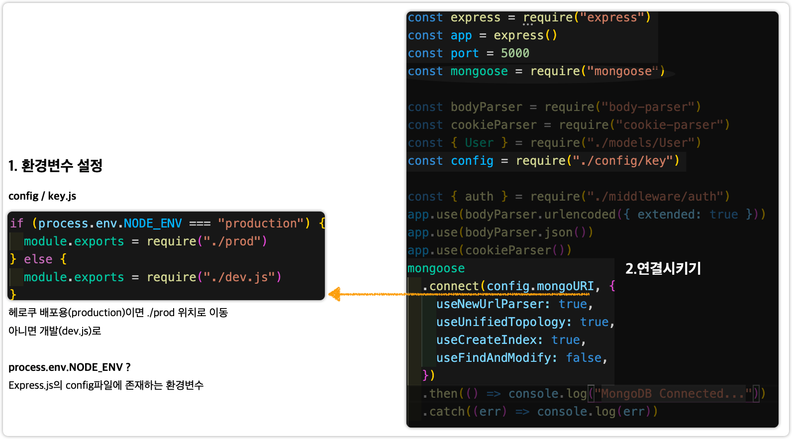


3. 모델 스키마 작성

   

4. MongoDB Altas에서 Collection을 확인해보면 생성된것을 확인할 수 있다.

   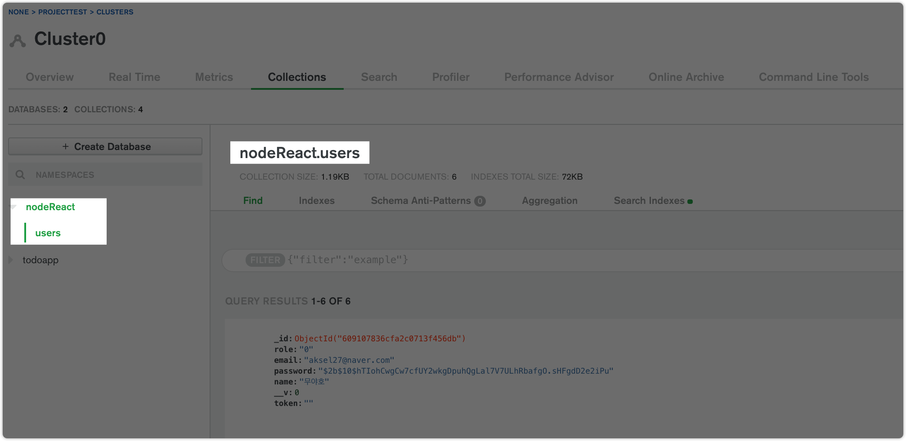


회원가입하기

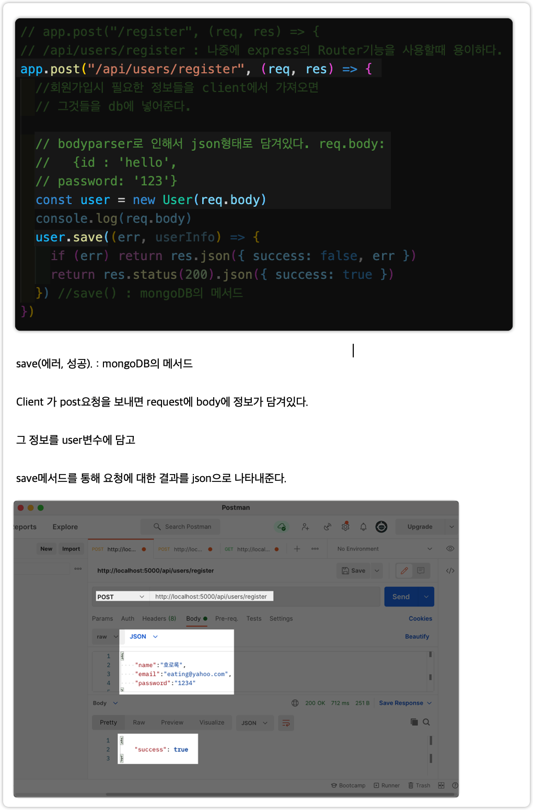


하지만 저장된 db를 보면 입력했던 비밀번호 (1234) 가 그대로 저장되어 있다. 보안문제가 생길 수 있음 !

이럴때를 대비해서 암호화하는 bcrypt라이브러리를 사용한다

`npm install bcrypt`


로그인

1. mongoDB에서 findOne메서드를 이용해 찾는다.
2. 비교를 위해 comparePassword 생성

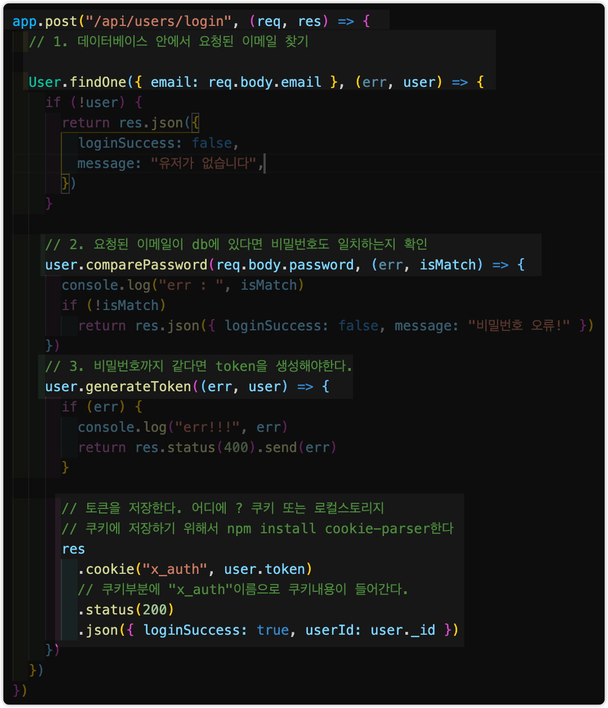

3. comparePassword 메서드

   

4. 토큰생성

   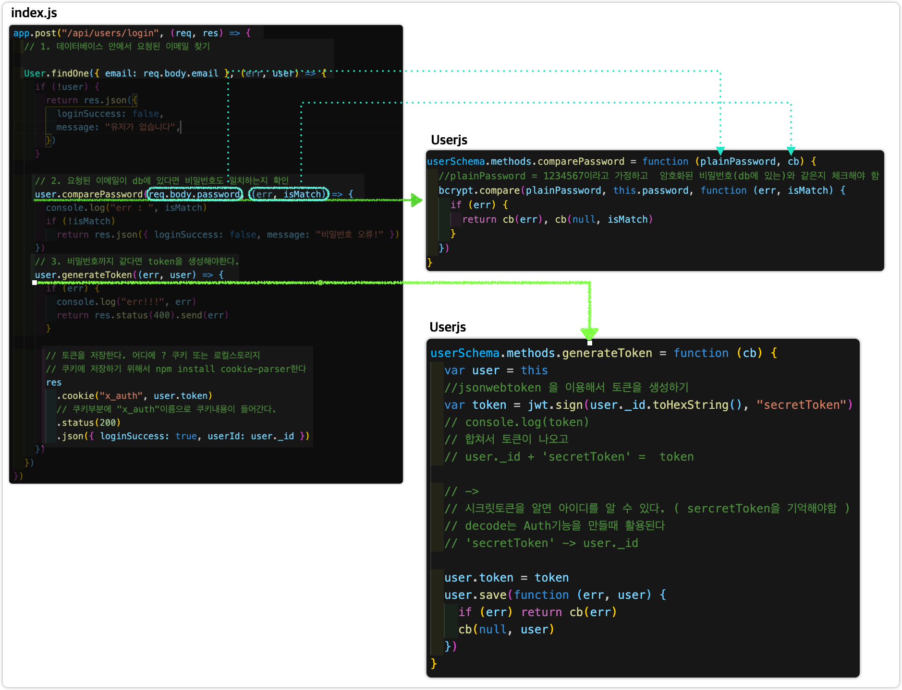

   생성된 결과

   

   


Auth기능 만들기

미들웨어 auth

index.js

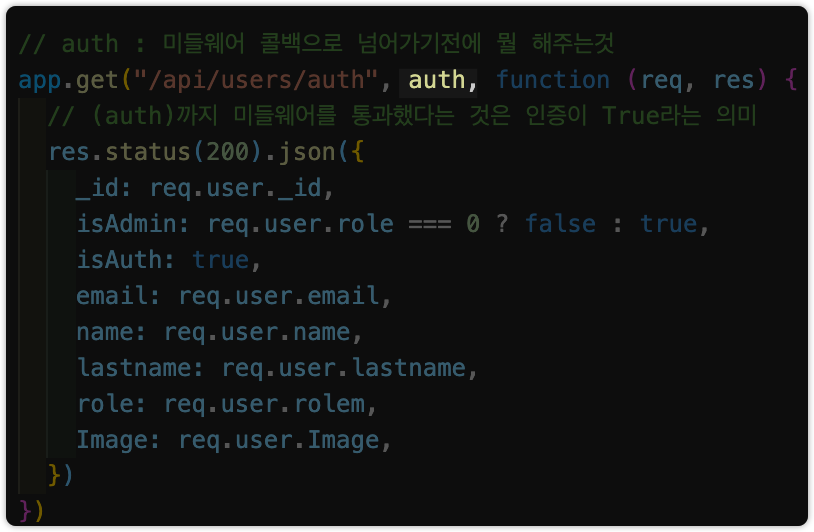


middleware /auth.js


User.js

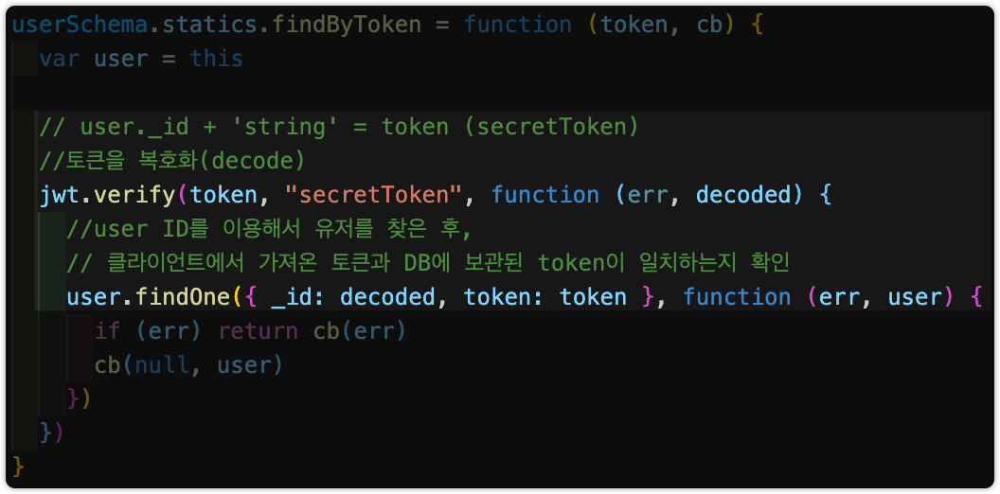


# Logout

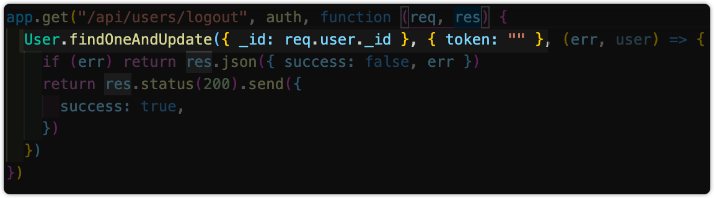

`_id` 가 존재하면 `token`을 없애준다.


FE

Create-react-app

HOC

Proxy

Axios CORS


# Redux

수많은 컴포넌트 사이에 state공유 및 상태관릴를 편리하게 하기 위해서 사용하는 Javascript 라이브러리

1. 파일구조

   1. action폴더

      애플리케이션에서 사용하는 명령어 (action type), API통신과 같은 작업을 하는 액션 메서드를 모아둔 폴더

   2. reducer폴더

      리듀서로 구서된 폴더.

      리듀서 : 액션메서드에서 변경한 상태를 받아 기존의 상태를 새로운 상태로 변경하는 일을 한다.

      

      `index.js`  에서는 분리한 리듀서를 합친다.

      파일갯수가 많아진다면 **ducks기법**을 고려해볼 수도 있다.

   3. component폴더 (도메인별로 구분)

      1. 컨테이너 컴포넌트 

         여러개의 프레젠테이션 컴포넌트로 구성. 데이터나 공통으로 관리해야 하는 객체, 컴포넌트간의 인터랙션등을 관리하는 컴포넌트

      2. 프레젠테이션 컴포넌트

         일반적인 UI컴포넌트 

      일반적으로 프레젠테이션 컴포넌트에는 비즈니스 로직이 없다. 비즈니스 로직은 컨테이너 컴포넌트에서 개발해야 재활용성이 높아진다.

   4. store폴더

      `index.js` 폴더 하나만 있다. 주로 **미들웨어**를 설정하는 일을 한다. 

      비통기 통신 -> redux-thunk 라이브러리,

      State 변경 내역 관리 ->react- router-redux 라이브러리

      디버깅 -> react-devtool 설정


## Middleware


실제 프로젝트에서는 미들웨어를 직접 만들어서 사용하는 경우는 많지않다.


### redux-promise

### redux-thunk

비동기작업 처리할 때 사용하는 미들웨어

객체 대신 함수를 생성하는 액션 생성함수를 작성할수 있게 해준다.


두가지가 필요한 이유 ?

redux 를 잘 사용할 수 있도록

어떻게 ?

redux 는 redux store가 존재하고, 모든 state를 관리한다.

store안의 state를 변경하려면 dispatch를 이용해서 action으로 변경할 수 있다.

store에서는 언제나 객체형식으로 된 action을 받는것이 아닌, Promise형식 또는 function형태로 받을 수도 있다.

Promise형식 또는 function형태로 오면 redux store가 받지를 못한다.

redux - thunk는 dispatch에게 function을 받는 방법을 알려주고,

redux-promise는 promise를 어떻게 대처하는지 알려준다.


#### Async await

Promise then.... promise then... promise then... 반복 --> 난잡한 코드가 될 수 있다

깔끔하게 promise를 사용하기 위해 Async await이 도움이 될 수 있다. **`syntatic sugar `** 


