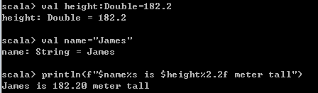

## Learning Git

### Git

> (분산) 버전관리 시스템 (DVCS)
>
> 소스코드의 이력을 관리한다

코드의 history를 관리하는 도구
	: 개발된 과정의 역사를 볼 수 있고, 특정 시점으로 복구가 가능

- 참고
  - [Git scm](https://git-scm.com/book/ko/v2)
  - [Git 입문](https://backlog.com/git-tutorial/kr/)

### 1. git 설정

git 커밋을 위해서 초기 작성자 author 설정을 반드시 해야함

```
$ git confing -- global user.name
$ git config --glober user.email
```

현재 글로벌로 설정된 환경설정 확인

```bash
 $ git config --global --list
user.email = 내 이메일
user.name = 아이디
```

### 2.git 활용 기초

1. 로컬 git 저장소 설정

   ```bash
   $ git init
   Reinitialized existing Git repository in C:/Users/student/.git/
   (master) $
   ```

   - 해당 디렉토리에 .git/ 폴더가 생성됨

   - 항상 git init하기 전에는 해당 폴더가 이미 로컬 저장소인지 (master 여부) 확인해야 한다.

     

2.  add

   ```bash
   $ git add .
   $ git add README.md a.txt
   $ git add folder/
   ```

   - add명령어를 통해 Working directory에서 `INDEX(staging area)`로 특정 파일을 이동시킨다.
   - 커밋을 할 목록에 쌓는 것이다.

3. commit

   ```bash
   $git commit -m '커밋메세지'
   $git commit 
   [master a1a04a7] README 제목 작성
   1 file changed, 1insertion (+)
   $git log
   ```

4. 커밋 히스토리 확인하기 (`log`)

   ```bash
   $git log
   $git log -2
   $git log --oneline
   ```

5. 현재 git 상태 알아보기 (`status`) **중요 ! 자주 입력해 확인하자**

   ```bash
   $git status
   ```

### 3. 원격저장소(remote) 활용하기

#### 	1. 기초

1. remote 저장소 등록

   ```bash
   $git remote add origin {github URL}
   ```

   - 원격 저장소를 `origin` 이라는 이름으로 URL 등록

2.  remote 저장소 확인

   ```bash
   $git remote -v
   ```

3. remote 저장소 삭제

   ```bash
   $git remote rm {저장소 이름}
   ```

#### 2. Push - Pull

1.  원격 저장소로 `push`

   ```bash
   $ git push orgin master
   ```

2. 원격 저장소로부터 가져오기 (`pull`)

   ```bash
   $git pull origin master
   ```

   

### 3. push - pull 시나리오

Local A, Local B, gitHub으로 활용을 하는 경우 원격저장소 이력과 달라져서 충돌이 발생할 수 있다. 따라서, 항상 작업을 시작하기 전에 pull을 받고 작업을 완료한 이후에 push를 진행하면 충돌 사항이 발생하지 않는다

1. auto-merge

   동일한 파일을 수정하지 않은 경우 자동으로 merge commit이 발생한다

   ```bash
   1. LOcal A에서 작업 후 push
   2. Local B에서 작업 시 pull을 받지 않음
   3. Loval B에서 다른 파일 작업 후 commit -> push
   4. 오류 발생 (~~ git pull ~~)
   5. Local B에서 git pull
   6. 자동으로 vim commit 할 수 있도록 뜸
   7. 저장하면, merge commit 발생
   8. Local B에서 git push
   ```

2. merge Conflict

   다른 이력(커밋)으로 동일한 파일이 수정되는 경우 merge conflict 발생
   직접 충돌 파일을 해결해야 한다.

   ```bash
   1. Local A에서 작업 후 Push
   2. Local B에서 작업 시 pull을 받지 않음.
   3. Local B에서 동일 파일 작업 후 commit -> push
   4. 오류 발생(~~git pull~~)
   5. Local B에서 git pull
   6. 충돌 발생(merge conflict)
   7. 직접 오류 수정 및 add, commit
   8. Local B에서 git push
   ```

   - git status 명령어를 통해 어느 파일에서 충돌이 발생하였는지 확인 가능!
   - 실제 파일 예시

   ``` bash
   <<<<<< HEAD
   Local B 작업
   ===========
   원격 저장소에 기록된 작업
   >>>>>> (hash 주소)
   ```

### 4.되돌리기

1. `staging area`에서 Unstage

   ```bash
   $ git status 
   
   $ git reset HEAD b.txt
   ```

2. commit 메시지 수정하기

   ```bash
   $ git commit --amend
   ```

   - 커밋 메세지를 수정하게 되면 해시값이 변경되어 이력이 바뀌게 된다

   - 따라서 원격 저장소에 push된 이력이라면 절대 변경하면 안된다

   - 커밋하는 과정에서 파일을 빠뜨렸다면, 위의 명령어를 통해 수정할 수 도있다

     ```bash
     $git add omit_file.txt
     $ git commit --amend
     ```

3. working directory 변경사항 버리기

   ```bash
   $git checkout --파일명
   ```

   - 변경사항이 모두 삭제되고, 해당 파일의 이전 커밋 상태로 변화된다.


1.기술스택

- R
- springMVC

2.데이터베이스 모델링

3.시연화면


## git ignore

1. http://gitignore.io/ 어떤 것을 ignore할지 모를 때

2. git 이름 짓기에 대한 사전  git commit 메시지를 위한 영어 사전
3. 


git config --glober user.name


git config --global user.name 'aksel26'
git config --global user.email 'aksel26'

git log 확인


git remote add origin 
git remote -v


git remote add algo https://github.com/~~~
git remote -v


삭제

git remote rm algo


git log --oneline

HEAD ?
	: 작업환경의 commit 위치

origin/master
	:원격 저장소의 지금 상태 - master


git add .

git commit -m 'readme 제목 작성'

git log --oneline

충돌 시 merge commit

