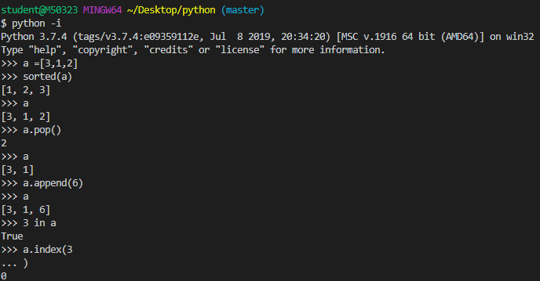
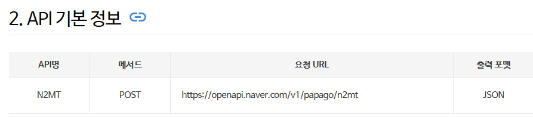
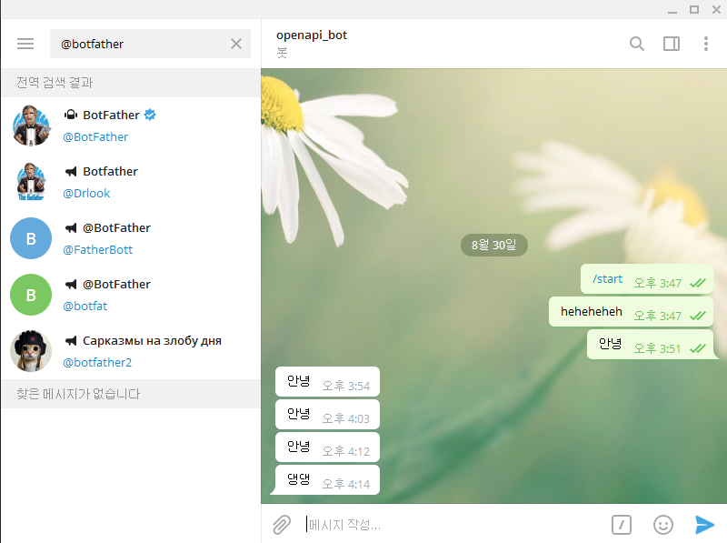
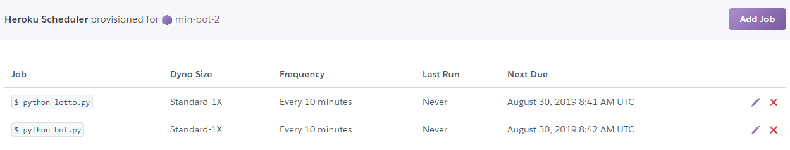

# Python


```python

# ctrl + n
# ctrl  + hello.pyprint('happy hacking')

# 변수 선언할 때 타입 신경쓰지 않아도 된다.
name = 'bear'
print(name )
name =123
print(name)
name =True
print(name)

# 리스트(배열)
my_list = ['bear', 123,True,'hippo']
type(my_list)   
print(my_list[1])

# 딕셔너리 (해시)
my_dict = {'bear' : 20, 'hippo' :50}
print(my_dict['bear'])
```




student@M50323 MINGW64 ~/Desktop/python (master)
$ python -i
Python 3.7.4 (tags/v3.7.4:e09359112e, Jul  8 2019, 20:34:20) [MSC v.1916 64 bit (AMD64)] on win32
Type "help", "copyright", "credits" or "license" for more information.

>>> a =[3,1,2] 
>>> sorted(a)   # 자동정렬
>>> [1, 2, 3]
>>> a
>>> [3, 1, 2]
>>> a.pop() #pop 
>>> 2
>>> a
>>> [3, 1]
>>> a.append(6) #push
>>> a
>>> [3, 1, 6]
>>> 3 in a #변수 a에 3이 있는지 확인
>>> True
>>> a.index(3 #3의 위치
>>> ... )
>>> 0

----


## API 

### 겟썸API 활용

-  API : 프로그래밍으로 접근해 사용하는 인터페이스

1. pip install requests 라이브러리 설치

2. import requests  라이브러리 임포트 

   import requests

3. url 요청 보내서 

   url = 'https://api.bithumb.com/public/ticker/btc'

4. 값을 받아온다
   
   1. response = requests.get(url)

```
student@M50323 MINGW64 ~/Desktop/python (master)$ C:/Users/student/AppData/Local/Programs/Python/Python37/python.exe c:/Users/student/Desktop/python/api.py
<Response [200]>
```

   	2. response = requests.get(url).json()

5. 출력
   print(response)

```python
student@M50323 MINGW64 ~/Desktop/python (master)$ C:/Users/student/AppData/Local/Programs/Python/Python37/python.exe c:/Users/student/Desktop/python/api.py
{'status': '0000', 'data': {'opening_price': '11426000', 'closing_price': '11553000', 'min_price': '11397000', 'max_price': '11618000', 'units_traded': '5860.71', 'acc_trade_value': '67600376437.43', 'prev_closing_price': '11427000', 'units_traded_24H':
'10848.87', 'acc_trade_value_24H': '124846681923.7', 'fluctate_24H': '-102,000', 'fluctate_rate_24H': '-0.88', 'date': '1567142693441'}}
```


​		cf )

```json
// 20190830143446
// https://api.bithumb.com/public/ticker/btc

{
  "status": "0000",
  "data": {
    "opening_price": "11426000",
    "closing_price": "11541000",
    "min_price": "11397000",
    "max_price": "11618000",
    "units_traded": "6307.19",
    "acc_trade_value": "72751110067.72",
    "prev_closing_price": "11427000",
    "units_traded_24H": "11256.99",
    "acc_trade_value_24H": "129551023672.42",
    "fluctate_24H": "-89,000",
    "fluctate_rate_24H": "-0.77",
    "date": "1567143209965"
  }
}
```


+7. max_price 출력

`print(response['data']['max_price'])`


### Naver API (papago)


*참고 )* api 키 값들은 따로 gitignore에서 관리해야함

안그러면 유료라면 과금됨

보안위험


- .gitignore 파일 ( *gitignore.io* 사이트에서 추가해도됨)

  ```bash
  .env
  ```

- .env

  ```bash
  NAVER_CLIENT_ID="J0E1oonIS48lGKPV3Fza"
  NAVER_CLIENT_SECRET="3BsB782XbO" 
  ```

- papago.py

  

  ```python
  import requests
  from decouple import config
  
  # 1. 환경변수 설정
  naver_client_id = config('NAVER_CLIENT_ID')
  naver_client_secret = config('NAVER_CLIENT_SECRET')
  print(naver_client_id)
  
  # 2. URL 설정
  
  url = 'https://openapi.naver.com/v1/papago/n2mt'
  
  # 3. 딕셔너리에 헤더 설정 및 data 설정
  headers = {
      'X-Naver-Client-Id' : naver_client_id,
      'X-Naver-Client-Secret' : naver_client_secret
  }
  # UpperCamelCase
  # lowerCamelCase
  
  data = {
      'source' : 'ko',
      'target' : 'en',
      'text' : '댕댕이'
  }
  
  # 4. 요청
  # url에 헤더와 데이터를 포함해서 POST 요청을 보내고
  # 그 결과(json) 파싱
  response=requests.post(url, headers=headers, data=data).json()
  print(response)
  #pprint.pprint(response)
  #print(response)
  ```

- output

  ```bash
  student@M50323 MINGW64 ~/Desktop/chatbot (master)
  $ C:/Users/student/AppData/Local/Programs/Python/Python37/python.exe c:/Users/student/Desktop/chatbot/papago.py
  J0E1oonIS48lGKPV3Fza
  {'message': {'@type': 'response', '@service': 'naverservice.nmt.proxy', '@version': '1.0.0', 'result': {'srcLangType': 'ko', 'tarLangType': 'en', 'translatedText': 'cIog'}}}
  ```

  

## Chatbot

### URL을 통해서 메세지 수신

1. 검색 - @botfather 
2. /start
3. /newbot
4. openapiBB_bot 이름으로 생성
   1. https://core.telegram.org/bots/api 이동
      	 Making requests 에서 `https://api.telegram.org/bot `+ botfather로부터 받은 토큰 값


5. 채팅창에 아무말 하고 나면 /getupdates에 출력 내용을 확인
   `https://api.telegram.org/bot851541472:AAFs8py0ejLoI2yf1rBUd4o1TLB5bQbDcGE/getUpdates`

```
// 20190830155950
// https://api.telegram.org/bot851541472:AAFs8py0ejLoI2yf1rBUd4o1TLB5bQbDcGE/getUpdates

{
  "ok": true,
  "result": [
    {
      "update_id": 200680561,
      "message": {
        "message_id": 1,
        "from": {
          "id": 945069316,
          "is_bot": false,
          "first_name": "현민",
          "last_name": "김"
        },
        "chat": {
          "id": 945069316,
          "first_name": "현민",
          "last_name": "김",
          "type": "private"
        },
        "date": 1567147597,
        "text": "/start",
        "entities": [
          {
            "offset": 0,
            "length": 6,
            "type": "bot_command"
          }
        ]
      }
    }
```


6. ID 값`from ~ id ~: 94069316` 으로 `sendMessage?chat_id=945069316&text=안녕` 쓰면
   	`(https://api.telegram.org/bot851541472:AAFs8py0ejLoI2yf1rBUd4o1TLB5bQbDcGE/sendMessage?chat_id=945069316&text=안녕)`

7. 챗봇 메세지가 온다

   

### 코드를 통해 메세지 수신

- 메세지를 보내는 봇을 만드는 코드

```python
import requests
from decouple import config

# 1. 토큰 값 설정

token = config("TELEGRAM_TOKEN")

# 2. URL 설정
# baseURL에 chat_Id, text를 반드시 요청변수로 설정 

# string interpolation(문자열 보간법 : 문자열 내에 변수 값 삽입(f-string))
base_url = f'https://api.telegram.org/bot{token}'

print(base_url)
-------1--------


chat_Id =945069316
text ='안녕'
url = f'{base_url}/sendMEssage?chat_id={chat_Id}&text={text}'


# 3. 메시지 보내기
requests.get(url)

-------2 -------
```

-----1------까지의 결과

```bash
student@M50323 MINGW64 ~/Desktop/chatbot (master)
$ python bot.py
https://api.telegram.org/bot851541472:AAFs8py0ejLoI2yf1rBUd4o1TLB5bQbDcGE
```

-----2-----까지의 결과

텔레그램으로부터 메세지 온다 (알람창)




서버로 보내오는 webhook ==> 파이썬 서버를 통해 구성해 요청을 받음
webhook 설정은 나중에


### 매주 로또 번호를 알려주는 챗봇 만들기

```python
import random
import requests
from decouple import config

#반복문을 5번 돌리겠다 for ~ range
#for i in range(5):
#   print('hi')
#numbers =[1,2,3,4,5,6,7]

numbers = range(1,46)
print(list(numbers))
lotto = random.sample(numbers,1)
print(lotto)
text = sorted(random.sample(numbers,6))

# 1. 토큰 값 설정

token = config("TELEGRAM_TOKEN")

# 2. URL 설정
# baseURL에 chat_Id, text를 반드시 요청변수로 설정 

# string interpolation(문자열 보간법 : 문자열 내에 변수 값 삽입(f-string))
base_url = f'https://api.telegram.org/bot{token}'

print(base_url)

chat_Id =945069316
url = f'{base_url}/sendMEssage?chat_id={chat_Id}&text={text}'

# 3. 메시지 보내기
requests.get(url)
```


### Heroku  배포

1. runtime.txt

```
python-3.7.2
```

2. Procfile

```
student@M50323 MINGW64 ~/Desktop/chatbot (master)
$ pip freeze -> requirements.txt
```

​		== >requirements.txt.가 생긴다 (내용)

```txt
astroid==2.2.5
certifi==2019.6.16
chardet==3.0.4
colorama==0.4.1
idna==2.8
isort==4.3.21
lazy-object-proxy==1.4.2
mccabe==0.6.1
pylint==2.3.1
python-decouple==3.1
requests==2.22.0
six==1.12.0
typed-ast==1.4.0
urllib3==1.25.3
wrapt==1.11.2
```


*참고*

```
pipe install -r  requirements.txt
```

=>입력하면 설치됨

3. commit 

```bash
student@M50323 MINGW64 ~/Desktop/chatbot (master)
$ git add .

student@M50323 MINGW64 ~/Desktop/chatbot (master)
$ git commit -m 'heroku setting'
[master f93be54] heroku setting
 3 files changed, 16 insertions(+)
 create mode 100644 Procfile
 create mode 100644 requirements.txt
 create mode 100644 runtime.txt
```


4. chatbot 폴더에서 gitbash 실행

```bash
$ heroku heroku login

student@M50323 MINGW64 ~/Desktop/chatbot (master)
$ heroku create min-bot-2
Creating min-bot-2... done
https://min-bot-2.herokuapp.com/ | https://git.heroku.com/min-bot-2.git

student@M50323 MINGW64 ~/Desktop/chatbot (master)
$ git push heroku master
~~~설치 완료

cron job
```


5. Heroku 홈페이지

   personal - settings - config Vars 에 Token 입력

   Resources - Add-ons - heroku scheduler - addJob



---

---------결과 ----------

