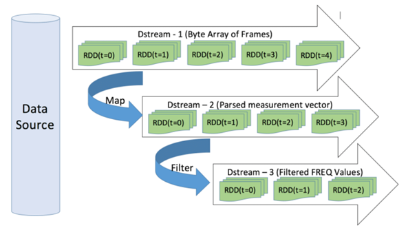
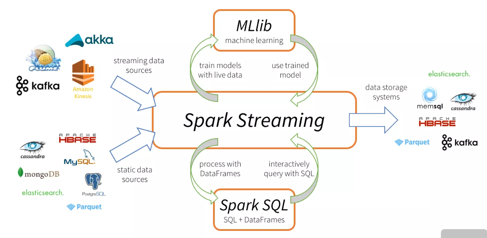
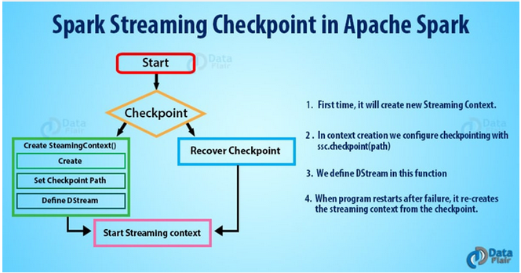
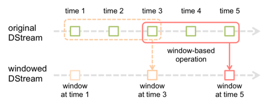

### 세이프 모드

- 출력 장소에 지정한 데이터셋이 이미 존재할 경우 어떻게 처리할지 결정

| 세이프 모드          | 효과                                                         |
| -------------------- | ------------------------------------------------------------ |
| SaveMode.ErrorExists | 예외를 발생시킨다(디폴트)                                    |
| SaveMode.Append      | 기존 데이터셋에 덧붙인다                                     |
| SaveMode.Overwrite   | 기존 데이터셋을 덮어쓴다.                                    |
| SaveMode.Ignore      | 기존 데이터셋을 변경하지 않는다.(=create tabe if not exists) |

- 세이프 모드 하려면 **org.apache.spark.sql.SaveMode**임포트 해야한다.

```cmd
hadoop fs -mkdir /output/dessert_json
```

```scala
dessertDF.write.save("/output/dessert_json") //예외 AnalysisException 발생 (이미 존재함)

```

```scala
import org.apache.spark.sql.SaveMode
dessertDF.write.format("json").mode(SaveMode.Overwrite).save("output/dessert_json") //예외발생 안한다!

val dessertDF2=dfReader.format("json").load("/output/dessert_json")
dessertDF2.orderBy($"kcal").show(4)
+------+---------------+-----+----+
|menuId|           name|price|kcal|
+------+---------------+-----+----+
|  D-15|  커스터드 푸딩| 2000| 120|
|   D-8|  바닐라 젤라또| 3600| 131|
|  D-17|    치즈 수플레| 2200| 160|
|  D-14|바나나 크레이프| 3300| 220|
+------+---------------+-----+----+
only showing top 4 rows

```


#### 명시적으로 스키마 정보 부여하기

- 데이터에 대한 스키마 정보를 나타내는 API, StuctType은 데이터프레임의 레코드에 대한 구조 정보를 나타내며, 내부에 여러 개의 StructField를 갖는 형태로 정의

```scala
import java.math.BigDecimal
case class DecimalTypeContainer(data: BigDecimal)
val bdContainerDF=sc.parallelize(
List(new BigDecimal("123456.6789999999999"))).map(data=>DecimalTypeContainer(data)).toDF
bdContainerDF.printSchema

bdContainerDF.show(false)//data문자열의 길이가 20을 넘을 경우에도 생략하지 않고 표시하려는 것
+--------------------+
|data                |
+--------------------+
|123456.6789999999999|
+--------------------+

bdContainerDF.write.format("orc").save("/output/bdContainerORC")
val bdContainerORCDF=spark.sqlContext.read.format("orc").load("/output/bdContainerORC")
bdContainerORCDF.printSchema
bdContainerORCDF.show(false)
+-------------------------+
|data                     |
+-------------------------+
|123456.678999999999900000|
+-------------------------+

bdContainerDF.write.format("json").save("/output/bdContainerJSON")
val bdContainerJSONDF= spark.sqlContext.read.format("json").load("/output/bdContainerJSON")
bdContainerJSONDF.printSchema

bdContainerJSONDF.show(false)
+----------+
|data      |
+----------+
|123456.679|
+----------+

import org.apache.spark.sql.types.DataTypes._
val schema=createStructType(Array(createStructField("data",createDecimalType(38,18),true)))

val bdContainerJSONDF=spark.sqlContext.read.schema(schema).format("json").load("/output/bdContainerJSON")
bdContainerJSONDF.printSchema

bdContainerJSONDF.show(false)
+-------------------------+
|data                     |
+-------------------------+
|123456.678999999999900000|
+-------------------------+
//이처럼 스키마를 명시적으로 설정함으로 형변환에 따른 오차 없이 파일 내용을 정확히 DataFrame으로 변환 가능
```

### 파티셔닝

- where절이나 where 메서드의 필터링 조건식에 파티션을 지정하여 해당 파티션 이외의 데이터를 읽지 않게 함

```scala
import org.apache.spark.sql.types.DataTypes._
val priceRangeDessertDF=dessertDF.select(((($"price"/1000)cast IntegerType)*1000)as "price_range",dessertDF("*"))


//priceRangeDessertDF를 파티셔닝하지 않고 출력
priceRangeDessertDF.write.format("parquet").save("/output/price_range_dessert_parquet_non_partitioned")

val nonPartitionedDessertDF=spark.sqlContext.read.format("parquet").load("/output/price_range_dessert_parquet_non_partitioned")
nonPartitionedDessertDF.where($"price_range">=5000).explain
== Physical Plan ==
*(1) Project [price_range#243, menuId#244, name#245, price#246, kcal#247]
+- *(1) Filter (isnotnull(price_range#243) && (price_range#243 >= 5000))
   +- *(1) FileScan parquet [price_range#243,menuId#244,name#245,price#246,kcal#247] Batched: true, Format: Parquet, Location: InMemoryFileIndex[hdfs://master:9000/output/price_range_dessert_parquet_non_partitioned], PartitionFilters: [], PushedFilters: [IsNotNull(price_range), GreaterThanOrEqual(price_range,5000)], ReadSchema: struct<price_range:int,menuId:string,name:string,price:int,kcal:int>

```

```scala
//priceRangeDessertDF를 파티셔닝하고 출력
priceRangeDessertDF.write.format("parquet").partitionBy("price_range").save("/outputprice_range_dessert_parquet_partitioned")
val partitionedDessertDF=spark.sqlContext.read.format("parquet").load("/outputprice_range_dessert_parquet_partitioned")
partitionedDessertDF.where($"price_range">=5000).explain
                                                                                                     == Physical Plan ==
*(1) FileScan parquet [menuId#259,name#260,price#261,kcal#262,price_range#263] Batched: true, Format: Parquet, Location: InMemoryFileIndex[hdfs://master:9000/outputprice_range_dessert_parquet_partitioned], PartitionCount: 2, PartitionFilters: [isnotnull(price_range#263), (price_range#263 >= 5000)], PushedFilters: [], ReadSchema: struct<menuId:string,name:string,price:int,kcal:int>

```

### 구조화된 데이터셋을 테이블로 다루기

`create table 테이블명 using <해당 포맷의 프로바이더명>options(옵션,옵션....)

- using절에는 다루고자 하는 포맷에 대응하는 프로바이더의 이름 지정 . 아래를 참고

| 파일 포맷 | 대응 프로바이더명             |
| --------- | ----------------------------- |
| Parquet   | org.apache.spark.sql.parquet  |
| ORC       | org.apache.spark.sql.hive.orc |
| JSON      | org.apache.spark.sql.json     |

```cmd
[hadoop@master ~]$ spark-sql
#하면 들어가진다 spark-sql
```

```scala
create table dessert_tbl_json USING org.apache.spark.sql.json OPTIONS(path 'output/dessert_json');

SELECT name, price FROM dessert_tbl_json LIMIT 3;
초콜릿 파르페   4900
푸딩 파르페     5300
딸기 파르페     5200

```

### 테이블 캐시

- DataFrame이나 테이블을 이그제큐터에 캐시 가능. 

```scala
df.cache()// DataFrame을 캐시에 저장, df는 DataFrame을 나타낸다.
spark.sqlContext.cacheTable("tbl")//테이블을 캐시에 저장, sqlContext는 SQLContext의 인스턴스를 tbl은 테이블명을 나타낸다.

df.unpersist// DataFrame 캐시에서 삭제
spark.sqlContext.uncacheTable("tbl")//테이블을 캐시에서 삭제

```

---

## 스파크 Streaming

### 스트림처리

- 7장에서는 스트림처리를 구현하기 위해 스트리밍 라이브러리가 있다.

- 짧은 시간 발생한 데이터를 반복적으로 처리하는 것 

- 예를 들어 혈액냉장고의 온도 센서 확인 등

- 갑작스러운 변화의 경향 파악이 쉽다.

  

### 스트림 데이터 란?

- 스토리지에 저장된 하나의 큰 데이터가 아닌 '반영구적으로 계속 생성되는 데이터'
- 짧은 시간 간격으로 생성되는 것이 특정
- 단순히 주어진 데이터를 읽고 처리하는 것뿐만 아니라 시간의 흐름에 따라 꾸준히 변화하는 데이터를 다루기 위한 것
  - 예) 온라인 쇼핑몰이나 웹사이트에 대한 악의적인 접근 시도를 판단하기 위한 데이터라든가 시민들에게 환경 오염이나 교통 흐름 정보를 알려주기 위한 목적으로 취합한 데이터는 시간이 지난 후에 처리하면 그 가치가 크게 떨어지므로 최대한 빠른 시간 안에 데이터를 분석하고 그 결과를 산출할 수 있어야 합니다
- 실시간으로 변화하는 데이터를 (배치 처리보다) 짧은 주기에 맞춰 빠르고 안정적으로 처리하는 데 필요한 기능을 제공하는 스파크 모듈
  - 예) 시시각각으로 변하는 날씨 데이터라든가 웹 서버의 접속 로그와 같은 것들이 스트리밍 데이터로 취급될 수 있습니다.
- 짧은 주기의 배치 처리를 통해 이전 배치와 다름 배치 사이의 데이터 크기를 최소화하는 방법으로 스트리밍 데이터를 다루며, 각각의 배치 작업 사이에 새로 생성된 데이터가 하나의 RDD로 취급되어 처리됩니다.
- 스파크 스트리밍은 일정한 주기마다 새로운 RDD를 읽어와서 그 이전에 생성했던 RDD 처리 결과와 혼합해서 필요한 처리를 수행하는 행위를 애플리케이션이 종료될 때까지 무한히 반복하는 형태로 동작한다.

### 스파크 스트리밍

- RDD변환처리로 데이터처리 구현
- 조각을 나누어 입력 데이터를 구성, 반복 처리한다는 것이 특징

#### DStream (Discretized Stream) 변환

- 고정되지 않고 끊임없이 생성되는 연속된 데이터를 나타내기 위한 추상 모델
- 데이터스트림을 처리해서 일정 시간마다 데이터를 모아서 RDD를 만드는데 이러한 RDD로 구성된 시퀀스
- 마지막 데이터를 읽어들인 시점으로부터 배치 간격에 해당 하는 시간 동안 새로 생성된 데이터를 읽어들여 새로운 RDD를 생성 

1. map
   - 원래의 DStream을 변환하여 새로운 DStream 생성하는 API다.
2. flatMap
   - DStream의 각 요소에 대해서 함수를 적용하고, 다차원 컬렉션을 한 차원 풀어 내린 요소들로 이루어진 DStream생성. 인수로는 변환처리가 정의된 함수를 건네준다.
3. filter
   - 원래의 DStream에서 조건을 만족하는 요소만을 남긴 DStream을 생성. 인수로는 조건을 확인하기 위한 함수를 건네준다.



#### 기본 데이터 소스

- 외부 라이브러리의 도움 없이 스파크 단독으로 지원 가능
- 소켓, 파일, RDD 큐

#### 어드밴스드 데이터 소스

- 카프카(Kafka), 플럼(Flume), 키니시스(Kinesis), 트위터(Twitter)
- 스파크가 제공하는 Receiver 추상 클래스를 상속받아 사용자 정의 데이터 소스를 사용할 수 있습니다.



#### 데이터 읽기

- TCP 소켓을 이용해 데이터를 수신하는 경우 서버의 IP와 포트 번호를 지정해 스파크 스트리밍의 데이터 소스로 사용할 수 있습니다.

  - socketTextStream() – 소켓을 통해 문자열 데이터를 수신

  - socketStream() – 소켓을 통해 문자열이 아닌 데이터를 수신  

  - ```scala
    import org.apache.spark.SparkConf
    import org.apache.spark.streaming.{Seconds, StreamingContext}
    
    object SocketSample {
      def main(args: Array[String]): Unit = {
    
        val conf = new SparkConf().
          setMaster("local[3]")
          .setAppName("SocketSample")
        val ssc = new StreamingContext(conf, Seconds(3))
        val ds = ssc.socketTextStream("localhost", 9000)
        ds.print
        ssc.start()
        ssc.awaitTermination()
      }
    }
    ```

- 데이터 소스로 파일을 사용할 경우 fileStream()를 사용합니다.

- 모든 파일시스템 유형을 지원

- textFileStream() – 데이터 형식이 문자열일 경우 사용

- 파일의 변경 내용을 추적하는 것은 아니며 동일한 디렉토리에 있는 파일은 모두 같은 형식을 가져야 합니다.

- 스트리밍 컨텍스트가 생성 중이거나 이동 중인 파일에 접근하면 안 됩니다. 파일은 항상 atomic 방식(이미 생성된 파일에만 ) 으로 생성되고 이동해야 합니다.

- 한번 생성된 파일은 변경돼서는 안됩니다.

- RDD로 구성된 Queue를 이용해 Dstream을 만들 수 있습니다.

- 테스트 케이스를 작성하거나 Dstream이 제공하는 다양한 연산을 테스트하고 학습하는 용도로 많이 사용하는 방법

- 테스트에 사용할 데이터로 RDD를 만들고 이 RDD들로 구성된 scala.collection.mutable.Queue를 스트트리밍 컨텍스트의 queueStream() 의 매개변수로 지정해 Dstream을 생성합니다.

  - ```scala
    import scala.collection.mutable
    val rdd1 = ssc.sparkContext.parallelize(List("a", "b", "c")) //RDD생성
    val rdd2 = ssc.sparkContext.parallelize(List("c", "d", "e"))
    val queue = mutable.Queue(rdd1, rdd2) //Queuing
    val ds = sc.queueStream(queue) 
    ```

- **Kafka**

  - 카프카(Kafka)는 높은 성능과 안정성을 보장하는 분산 메시징 시스템입니다

  - 카프카 시스템은 데이터를 제공하는 <u>프로듀서(Producer)</u>와 데이터를 사용하는 <u>컨슈머(Consumer)</u>, 데이터 저장과 관리를 담당하는 <u>브로커(Broker)</u>로 구성

  - 카프카 서버에 데이터를 저아하는 클라이언트(Producer)와 읽기 연산을 수행하는 클라이언트(consumer)로 구성

  - 브로커(Broker) 서버는 <u>토픽이라는 개념</u>을 이용해 토픽 단위로 데이터를 분류해서 저장하며 컨슈머 역시 동일한 토픽 단위로 데이터를 읽어갈 수 있습니다.
    브로커(Broker) 서버가 데이터를 저장할 때는 토픽 단위로 분리한 데이터를 다시 <u>여러 개의 파티션으로 분리해서 저장</u>하는데 카프카의 브로커 서버가 서버의 대수와 무관하게 무조건 클러스터를 구성하도록 돼 있기 때문에 <u>각 파티션은 클러스터에 분산되어 저장</u>됩니다.

  - 각 파티션은 클러스터를 구성하고 있는 <u>여러 브로커 서버에 나누어 저장</u>되고 복제 정책에 따라 하나의 파티션이 다수의 서버에 복제됩니다.

  - 클러스터 간 데이터를 복제하기 위해 주키퍼 서버를 사용하므로 카프카를 사용할 때 <u>반드시 주키퍼 서버</u>도 함께 구성해야 합니다.

  - 스파크 스트리밍에서는 카프카와 연동할 수 있는 두가지 API를 제공

    - 데이터를 수신을 위한 리시버를 사용하는 방법 – KafkaUtils.createStream() 사용
    - 카프카에 특화된 API – 카프카로부터 수신하는 데이터는 <u>애플리케이션 장애</u>가 발생하더라도 <u>정확히 한번 처리되는 것을 보장</u> , KafkaUtils.createDirectStream() 사용

  - ```scala
    import kafka.serializer.StringDecoder
    import org.apache.spark.streaming.{Seconds, StreamingContext}
    import org.apache.spark.{SparkConf, SparkContext}
    object KafkaSample {
      def main(args: Array[String]) {    
        import org.apache.spark.streaming.kafka._
        val conf = new SparkConf()
          .setMaster("local[*]")
          .setAppName("KafkaSample")
        val sc = new SparkContext(conf)
        val ssc = new StreamingContext(sc, Seconds(3))
        val zkQuorum = "localhost:2181"
        val groupId = "test-consumer-group1"
        val topics = Map("test" -> 3)    
        val ds1 = KafkaUtils.createStream(ssc, zkQuorum, groupId, topics)
        val ds2 = KafkaUtils.createDirectStream[String, String, StringDecoder, StringDecoder](ssc, 
            Map("metadata.broker.list" -> "localhost:9092"), 
            Set("test"))
        ds1.print
        ds2.print
        ssc.start
        ssc.awaitTermination()
      }
    }
    ```

#### 데이터 기본 연산

- print() 
  : DStream에 포함된 RDD의 내용을 콘솔에 출력
- map(func)
  : DStream에 포함된 RDD의 각 원소에 <u>func 함수</u>(주로 람다식)를 적용한 결과값으로 구성된 <u>새로운 DStream</u>을 반환
- flatMap(func) 
  : DStream에 포함된 RDD의 각 원소에 func 함수를 적용한 결과값으로 구성된 새로운 DStream을 반환, 하나의 입력이 <u>0~N개의 출력</u>으로 변환 (입력은하나인데 출력은 0개~N개)
- count(), countByValue() 
  : DStream에 포함된 요소의 개수를 DStream 으로 반환
- reduce(func), reduceByKey(func) 
  : DStream에 포함된 RDD 값을 <u>집계</u>해서 최종적으로 하나의 값으로 DStream 으로 반환
- Filter(func) 
  : DStream에 포함된 요소에 func 함수를 적용한 결과가 true인 요소만 포함한 새로운 DStream 으로 반환
- union()  
  : 두개의 DStream의 요소를 모두 포함한 새로운 DStream  생성
- join() 
  : 키와 값 쌍으로 구성된 두 개의 DStream을 키를 이용해 조인, leftOuterJoin(), rightOuterJoin(), fullOuterJoin()

#### 데이터 고급 연산

- transform(func) – DStream에 내부의 RDD에 func 함수를 적용하고 그 결과로 새로운 DStream을 반환

- updateStateByKey() – 배치가 실행될 때마다 새로 생성된 데이터와 이전 배치의 최종 상태값을 함께 전달해주기 때문에 각 키별 최신 값, 즉 상태(state)를 유지하고 갱싱할 수 있습니다.

- ckeckpoint() – 현재의 작업 상태를 HDFS와 같은 영속성을 가진 저장소에 저장

  

- ```scala
  val ssc = new StreamingContext(conf, Seconds(3))
  val t1 = ssc.sparkContext.parallelize(List("a", "b", "c"))
  val t2 = ssc.sparkContext.parallelize(List("b", "c"))
  val t3 = ssc.sparkContext.parallelize(List("a", "a", "a"))
  val q6 = mutable.Queue(t1, t2, t3)
  val ds6 - ssc.queueStream(q6, true)
  ssc.checkpoint(".") //현재 디렉토리
  val updateFunc = (newValues: Seq[Long], currentValue: Option[Long]) => Option(currentValue, getOrElse(0L) + newValues.sum)
  ds6.map((_, 1)).updateStateByKey(updateFunc).print
  ```

#### 윈도우연산

- StreamingContext는 정해진 주기마다 새로 생성된 데이터를 읽어서 RDD를 생성하며, 생성된 RDD는 DStream이 제공하는 API를 이용해 처리할 수 있습니다.

- 스트리밍 데이터의 가장 마지막에 수행된 <u>배치의 결과(updatestateByKey)</u> 뿐 아니라 이전에 수행된 배치의 결과까지 함께 사용해야 하는 경우, 윈도우 연산을 활용할 수 있습니다. (마지막 뿐만 아니라 이전에 배치까지)

- 윈도우 연산은 마지막 배치가 수행됐을 때 읽어온 데이터뿐 아니라 그 이전에 수행된 배치의 입력 데이터까지 한꺼번에 처리할 수 있도록 지원하는 연산입니다.

- 윈도우 연산은 수행하기 위해서는 <u>얼마만큼의 간격</u>으로 윈도우 연산을 수행할 것인지와 한번 수행할 때 <u>얼마만큼의 과거 배치 수행 결과를 가져올 것인지</u>에 대한 정보를 지정해야 합니다.

- spark의 window 연산은 여러 배치 들의 결과를 합쳐서 StreamingContext의 배치 간격보다 훨씬 긴 시간 간격에 대한 결과를 계산한다

- 

- window(windowLength, slideInterval) 
  : slideInterval에 지정한 시간마다 windowLength에 지정한 크기만큼의 시간 동안 발생된 데이터를 포함한 DStream을 생성합니다.

- countByWindow(windowLength, slideInterval) 
  : 윈도우에 포함된 요소의 개수를 포함한 DStream을 생성합니다.   

- reduceByWindow(func, windowLength, slideInterval) 
  : 윈도우에 포함된 요소에 reduce() 함수를 적용한 결과로 구성된 DStream을 생성합니다.

  - ```scala
    //var conf = new SparkConf().setMaster("local[*]").setAppName("WindowSample")
    //val sc = new SparkContext(conf)
    val ssc = new StreamingContext(sc, Seconds(1))
    ssc.checkpoint(".")
    val input = for (i <- mutable.Queue(1 to 100: _*)) yield sc.parallelize(i :: Nil)
    val ds = ssc.queueStream(input)
    ds.window(Seconds(3), Seconds(2)).print  //stream batch 간격 1초인데 3초로
    ssc.start
    ssc.awaitTermination()
    
    
    //ds.countByWindow(Second(3), Second(2)).print
    
    //ds.reduceByWindow( (a, b) => Math.max(a, b), Seconds(3), Second(2)).print
    
    ```

    === 결과 ===

    ```
    scala> ssc.awaitTermination()19/09/04 04:11:14 WARN dstream.QueueInputDStream: queueStream doesn't support checkpointing
    19/09/04 04:11:15 WARN dstream.QueueInputDStream: queueStream doesn't support checkpointing
    -------------------------------------------                                     
    Time: 1567584674000 ms
    -------------------------------------------
    1
    2
    
    19/09/04 04:11:15 WARN dstream.QueueInputDStream: queueStream doesn't support checkpointing
    19/09/04 04:11:16 WARN dstream.QueueInputDStream: queueStream doesn't support checkpointing
    -------------------------------------------
    Time: 1567584676000 ms
    -------------------------------------------
    2
    3
    4
    
    19/09/04 04:11:16 WARN dstream.QueueInputDStream: queueStream doesn't support checkpointing
    19/09/04 04:11:17 WARN dstream.QueueInputDStream: queueStream doesn't support checkpointing
    19/09/04 04:11:18 WARN dstream.QueueInputDStream: queueStream doesn't support checkpointing
    -------------------------------------------
    Time: 1567584678000 ms
    -------------------------------------------
    4
    5
    6
    <연속..>
    ```

    

- •window(windowLength, slideInterval) 
  : slideInterval에 지정한 시간마다 windowLength에 지정한 크기만큼의 시간 동안 발생된 데이터를 포함한 DStream을 생성합니다.

- countByWindow(windowLength, slideInterval) 
  : 윈도우에 포함된 요소의 개수를 포함한 DStream을 생성합니다.   

- reduceByWindow(func, windowLength, slideInterval) 
  : 윈도우에 포함된 요소에 reduce() 함수를 적용한 결과로 구성된 DStream을 생성합니다.

  - ```scala
    ds.map( v => (v%2, 1)).reduceByKeyAndWindow(a: Int, b: Int) => a+b, Seconds(4), Seconds(2)).print
    
    ds.countByValueAndWindow(Seconds(3), Seconds(2)).print
    ```

  - 


- ```bash
  import org.apache.spark.SparkConf
  import org.apache.spark.streaming.{Seconds, StreamingContext}
  
  object SocketSample {
    def main(args: Array[String]): Unit = {
  
      val conf = new SparkConf().
        setMaster("local[3]")
        .setAppName("SocketSample")
      val ssc = new StreamingContext(conf, Seconds(3))
      val ds = ssc.socketTextStream("localhost", 9000)
      ds.print
      ssc.start()
      ssc.awaitTermination()
    }
  }
  ```

  

### 넷캣(Netcat)

1. TCP나 UDP프로토콜을 사용하는 네트워크 연결에서 데이터를 읽고 쓰는 간단한 유틸리티 프로그램

   nc는 network connection에 읽거나 쓴다.

   Network connection에서 raw-data read,write를 할 수 있는 유틸리티프로그램으로 원하는 포트로 원하는 데이터를 주고받을 수 있는 특징으로  해킹에도 사용되며 컴퓨터 포렌식에 있어서 라이브시스템의 데이터를 손쉽게 가져오기 위해 사용
   
   ```bash
   (nc server) 192.168.50.133
   [TERM1] # nc -l 9999
    
   
   (nc client) 192.168.50.134
   [TERM2] # nc 192.168.50.133 9999 (# telnet 192.168.50.133 9999)
   
   hi
   hello netcat!!!!
   
   <CTRL + D>
   ```
   
   -  -> 클라이언트에서 입력한 모든 문자가 서버에 출력된다.
     -> 간단한 채팅 서버를 만든 셈이다.
     -> 클라이언트에서 <CTRL + D> 통해 끊을 때  종료 된다.
   
     -> connection 이 이루어 졌을 때 파일을 실행시킨다. -l 과 같이 사용되면 한 instance만을 사용하
     는 inetd와 비슷하다.

```cmd
#마스터에서
[hadoop@master ~]$ nc -l 9999
#슬레이브에서
[hadoop@slave ~]$ nc 마스터ipaddress(000.000.000.000) 9999
#하면 둘이 연결이 된다! 아무거나 작성해 보자

#마스터에서 (파일은 만들어 놓아야 한다.)
nc -l 9999 > ./listen.txt
#슬레이브에서
nc 192.168.255.130 9999 < ./input.txt


```

- 마스터에서 ` nc -lk 9999' 상태에서(slave연결 끊고)
- /usr/local/hadoop2.7.7/ 에서 spark-shell (--master local[*])실행 후

```scala
import org.apache.spark.{SparkContext,SparkConf}
import org.apache.spark.streaming.{Seconds,StreamingContext}
import org.apache.spark.storage.StorageLevel
import org.apache.log4j.{Level,Logger}

Logger.getRootLogger.setLevel(Level.WARN)

val ssc=new StreamingContext(sc,Seconds(10))
val lines=ssc.socketTextStream("localhost",9999,StorageLevel.MEMORY_AND_DISK_SER)
val words=lines.flatMap(_.split(" "))
val wordCounts=words.map((_, 1)).reduceByKey(_ + _)
wordCounts.print()
ssc.start()
ssc.awaitTermination()


```

2. 클러스터 환경에 애플리케이션 배포

```scala
//hadoop fs -mkdir /data/sample_dir
import org.apache.spark.{SparkContext,SparkConf}
import org.apache.spark.streaming.{Seconds,StreamingContext}
import org.apache.spark.storage.StorageLevel
import org.apache.log4j.{Level,Logger}

Logger.getRootLogger.setLevel(Level.WARN)

val ssc=new StreamingContext(sc,Seconds(10))
val lines=ssc.textFileStream("/data/sample_dir/")
val words=lines.flatMap(_.split(" "))
val wordCounts=words.map((_, 1)).reduceByKey(_ + _)
wordCounts.print()
ssc.start()
ssc.awaitTermination()

//hadoop fs -put /usr/local/spark/README.md /data/sample_dir
//대상 파일을 읽어서 wordCount처리 하는 중! 파일이 업로드 되면 바로 읽는다.
```

#### 평균데이터 계산

- 스파크 스트리밍을 이용해 샘플 데이터로 
- [데이터](http://archive.ics.uci.edu/ml/index.php) 에서 human activity ~를 data folder로 zip으로 받자

```cmd
[hadoop@master Downloads]$ unzip UCI\ HAR\ Dataset.zip
#파일이 이름에 공백이 있으므로 unzip으로 풀어주자.
[hadoop@master Downloads]$ mv UCI\ HAR\ Dataset UCI_HAR_Dataset
#공백이 있어 불편함으로 이름을 바꿔주자 UCI_HAR_Dataset으로 이름이 바뀐것을 확인한다.
```
