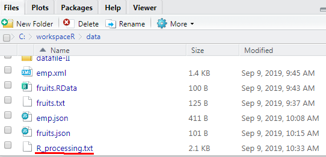

헤더를 제외한 레코드 2개 skip(제외)하고, 2개의 record만 읽어옴

fruits  <- read.table("./data/fruits.txt", header=T, skip=2, nrows=2)
print(fruits )
str(fruits)
class(fruits)

#R객체를 바이너리 파일로 저장 save(), load()
str(fruits)
save(fruits, file="./output/fruits.RData")
rm(list=ls())


### XML 구조의 파일을 Read/Write

1. 원본xml

```xml
<RECORDS>
   <EMPLOYEE>
      <ID>1</ID>
      <NAME>Rick</NAME>
      <SALARY>623.3</SALARY>
      <STARTDATE>1/1/2012</STARTDATE>
      <DEPT>IT</DEPT>
   </EMPLOYEE>
	
   <EMPLOYEE>
      <ID>2</ID>
      <NAME>Dan</NAME>
      <SALARY>515.2</SALARY>
      <STARTDATE>9/23/2013</STARTDATE>
      <DEPT>Operations</DEPT>
   </EMPLOYEE>

   <EMPLOYEE>
      <ID>3</ID>
      <NAME>Michelle</NAME>
      <SALARY>611</SALARY>
      <STARTDATE>11/15/2014</STARTDATE>
      <DEPT>IT</DEPT>
   </EMPLOYEE>

   <EMPLOYEE>
      <ID>4</ID>
      <NAME>Ryan</NAME>
      <SALARY>729</SALARY>
      <STARTDATE>5/11/2014</STARTDATE>
      <DEPT>HR</DEPT>
   </EMPLOYEE>

   <EMPLOYEE>
      <ID>5</ID>
      <NAME>Gary</NAME>
      <SALARY>843.25</SALARY>
      <STARTDATE>3/27/2015</STARTDATE>
      <DEPT>Finance</DEPT>
   </EMPLOYEE>

   <EMPLOYEE>
      <ID>6</ID>
      <NAME>Nina</NAME>
      <SALARY>578</SALARY>
      <STARTDATE>5/21/2013</STARTDATE>
      <DEPT>IT</DEPT>
   </EMPLOYEE>

   <EMPLOYEE>
      <ID>7</ID>
      <NAME>Simon</NAME>
      <SALARY>632.8</SALARY>
      <STARTDATE>7/30/2013</STARTDATE>
      <DEPT>Operations</DEPT>
   </EMPLOYEE>

   <EMPLOYEE>
      <ID>8</ID>
      <NAME>Guru</NAME>
      <SALARY>722.5</SALARY>
      <STARTDATE>6/17/2014</STARTDATE>
      <DEPT>Finance</DEPT>
   </EMPLOYEE>
	
</RECORDS>
```

2. XML 또는 HTML 문서를 가져오기 위해서 httr과 XML 패키지를 설치합니다.

```r
install.packages("XML")
library(XML)
data2 <- xmlParse(file="./data/emp.xml")
print(data2)

> str(data2)
	Classes 'XMLInternalDocument', 'XMLAbstractDocument' <externalptr> 
```

```R
> #Root Node만 추출
> rootnode <- xmlRoot(data2)
> print(rootnode)
<RECORDS>
  <EMPLOYEE>
    <ID>1</ID>
    <NAME>Rick</NAME>
    <SALARY>623.3</SALARY>
    <STARTDATE>1/1/2012</STARTDATE>
    <DEPT>IT</DEPT>
  </EMPLOYEE>
  <EMPLOYEE>
    <ID>2</ID>
    <NAME>Dan</NAME>
    <SALARY>515.2</SALARY>
    <STARTDATE>9/23/2013</STARTDATE>
    <DEPT>Operations</DEPT>
  </EMPLOYEE>
  <EMPLOYEE>
    <ID>3</ID>
    <NAME>Michelle</NAME>
    <SALARY>611</SALARY>
    <STARTDATE>11/15/2014</STARTDATE>
    <DEPT>IT</DEPT>
  </EMPLOYEE>
  <EMPLOYEE>
    <ID>4</ID>
    <NAME>Ryan</NAME>
    <SALARY>729</SALARY>
    <STARTDATE>5/11/2014</STARTDATE>
    <DEPT>HR</DEPT>
  </EMPLOYEE>
  <EMPLOYEE>
    <ID>5</ID>
    <NAME>Gary</NAME>
    <SALARY>843.25</SALARY>
    <STARTDATE>3/27/2015</STARTDATE>
    <DEPT>Finance</DEPT>
  </EMPLOYEE>
  <EMPLOYEE>
    <ID>6</ID>
    <NAME>Nina</NAME>
    <SALARY>578</SALARY>
    <STARTDATE>5/21/2013</STARTDATE>
    <DEPT>IT</DEPT>
  </EMPLOYEE>
  <EMPLOYEE>
    <ID>7</ID>
    <NAME>Simon</NAME>
    <SALARY>632.8</SALARY>
    <STARTDATE>7/30/2013</STARTDATE>
    <DEPT>Operations</DEPT>
  </EMPLOYEE>
  <EMPLOYEE>
    <ID>8</ID>
    <NAME>Guru</NAME>
    <SALARY>722.5</SALARY>
    <STARTDATE>6/17/2014</STARTDATE>
    <DEPT>Finance</DEPT>
  </EMPLOYEE>
</RECORDS> 

> class(rootnode)
[1] "XMLInternalElementNode" "XMLInternalNode"       
[3] "XMLAbstractNode"       

> str(rootnode)
Classes 'XMLInternalElementNode', 'XMLInternalNode', 'XMLAbstractNode' <externalptr> 

> #rootnode의 자식 노드 개수
> rootsize <- xmlSize(rootnode)
> print(rootsize)
[1] 8

> #rootnode의 첫번째 자식 노드 출력
> print(rootnode[1])
$EMPLOYEE
<EMPLOYEE>
  <ID>1</ID>
  <NAME>Rick</NAME>
  <SALARY>623.3</SALARY>
  <STARTDATE>1/1/2012</STARTDATE>
  <DEPT>IT</DEPT>
</EMPLOYEE> 

attr(,"class")
[1] "XMLInternalNodeList" "XMLNodeList"        

> #rootnode의 첫번재 자식 노드의 이름과 부서와 급여 출력
> print(rootnode[[1]][[2]]);
<NAME>Rick</NAME> 

> print(rootnode[[1]][[3]]);
<SALARY>623.3</SALARY> 

> print(rootnode[[1]][[5]]);
<DEPT>IT</DEPT> 

> #XML을 R의 지원형식인 data.frame으로 로딩
> xmldataframe <- xmlToDataFrame("./data/emp.xml")
> print(xmldataframe)
  ID     NAME SALARY  STARTDATE       DEPT
1  1     Rick  623.3   1/1/2012         IT
2  2      Dan  515.2  9/23/2013 Operations
3  3 Michelle    611 11/15/2014         IT
4  4     Ryan    729  5/11/2014         HR
5  5     Gary 843.25  3/27/2015    Finance
6  6     Nina    578  5/21/2013         IT
7  7    Simon  632.8  7/30/2013 Operations
8  8     Guru  722.5  6/17/2014    Finance

> str(xmldataframe)
'data.frame':	8 obs. of  5 variables:
 $ ID       : Factor w/ 8 levels "1","2","3","4",..: 1 2 3 4 5 6 7 8
 $ NAME     : Factor w/ 8 levels "Dan","Gary","Guru",..: 6 1 4 7 2 5 8 3
 $ SALARY   : Factor w/ 8 levels "515.2","578",..: 4 1 3 7 8 2 5 6
 $ STARTDATE: Factor w/ 8 levels "1/1/2012","11/15/2014",..: 1 8 2 4 3 5 7 6
 $ DEPT     : Factor w/ 4 levels "Finance","HR",..: 3 4 3 2 1 3 4 1
```


### JSON 데이터 Read/Write

```json
{ 
   "ID": ["1","2","3","4","5","6","7","8" ],
   "Name":["Rick","Dan","Michelle","Ryan","Gary","Nina","Simon","Guru" ],
   "Salary":["623.3","515.2","611","729","843.25","578","632.8","722.5" ],
   
   "StartDate":[ "1/1/2012","9/23/2013","11/15/2014","5/11/2014","3/27/2015","5/21/2013",
      "7/30/2013","6/17/2014"],
   "Dept":[ "IT","Operations","IT","HR","Finance","IT","Operations","Finance"]
}
```

```R
> library(rjson)
> rm(list=ls())
> data1<- fromJSON(file="./data/emp.json")
> print(data1)
$ID
[1] "1" "2" "3" "4" "5" "6" "7" "8"

$Name
[1] "Rick"     "Dan"      "Michelle" "Ryan"    
[5] "Gary"     "Nina"     "Simon"    "Guru"    

$Salary
[1] "623.3"  "515.2"  "611"    "729"    "843.25"
[6] "578"    "632.8"  "722.5" 

$StartDate
[1] "1/1/2012"   "9/23/2013"  "11/15/2014" "5/11/2014" 
[5] "3/27/2015"  "5/21/2013"  "7/30/2013"  "6/17/2014" 

$Dept
[1] "IT"         "Operations" "IT"         "HR"        
[5] "Finance"    "IT"         "Operations" "Finance"   

> str(data1)
List of 5
 $ ID       : chr [1:8] "1" "2" "3" "4" ...
 $ Name     : chr [1:8] "Rick" "Dan" "Michelle" "Ryan" ...
 $ Salary   : chr [1:8] "623.3" "515.2" "611" "729" ...
 $ StartDate: chr [1:8] "1/1/2012" "9/23/2013" "11/15/2014" "5/11/2014" ...
 $ Dept     : chr [1:8] "IT" "Operations" "IT" "HR" ...

> emp.dataframe <-as.data.frame(data1)
> print(emp.dataframe)
  ID     Name Salary  StartDate       Dept
1  1     Rick  623.3   1/1/2012         IT
2  2      Dan  515.2  9/23/2013 Operations
3  3 Michelle    611 11/15/2014         IT
4  4     Ryan    729  5/11/2014         HR
5  5     Gary 843.25  3/27/2015    Finance
6  6     Nina    578  5/21/2013         IT
7  7    Simon  632.8  7/30/2013 Operations
8  8     Guru  722.5  6/17/2014    Finance

> str(emp.dataframe)
'data.frame':	8 obs. of  5 variables:
 $ ID       : Factor w/ 8 levels "1","2","3","4",..: 1 2 3 4 5 6 7 8
 $ Name     : Factor w/ 8 levels "Dan","Gary","Guru",..: 6 1 4 7 2 5 8 3
 $ Salary   : Factor w/ 8 levels "515.2","578",..: 4 1 3 7 8 2 5 6
 $ StartDate: Factor w/ 8 levels "1/1/2012","11/15/2014",..: 1 8 2 4 3 5 7 6
 $ Dept     : Factor w/ 4 levels "Finance","HR",..: 3 4 3 2 1 3 4 1

> fruits1 <- read.table("./data/fruits.txt", header=T, stringsAsFactors = 2)
> print(fruits1)
  no   name price qty
1  1  apple   500   5
2  2 banana   200   2
3  3  peach   200   7
4  4  berry    50   9
> str(fruits1)
'data.frame':	4 obs. of  4 variables:
 $ no   : int  1 2 3 4
 $ name : Factor w/ 4 levels "apple","banana",..: 1 2 4 3
 $ price: int  500 200 200 50
 $ qty  : int  5 2 7 9
> class(fruits1)
[1] "data.frame"

> result<- toJSON(fruits1)
> print(result)
[1] "{\"no\":[1,2,3,4],\"name\":[\"apple\",\"banana\",\"peach\",\"berry\"],\"price\":[500,200,200,50],\"qty\":[5,2,7,9]}"
> str(result)
 chr "{\"no\":[1,2,3,4],\"name\":[\"apple\",\"banana\",\"peach\",\"berry\"],\"price\":[500,200,200,50],\"qty\":[5,2,7,9]}"

> write(result,"./data/fruits.json")

> list.files("./data/")
[1] "datafile-I"   "datafile-II"  "emp.json"    
[4] "emp.xml"      "fruits.json"  "fruits.RData"
[7] "fruits.txt"  
```


### HTML

- httr 패키지는 지정한 url의 HTML소스를 가져오는 GET() 함수를 제공하고 

  `<table>` 태그의 내용을 읽어올 수 있는 readHTMLTable()함수를 제공합니다.

- readHTMLTable()에 사용되는 속성 
  - get_url$content  : GET(url)함수에 의해서 가져온 HTML소스의 내용
  - rawToChar() : 바이너리(binary) 소스를 HTML 태그로 변환
  - stringsAsFactors = F : 문자열을 요인으로 처리하지 않고 순수한 문자열로 가져오기


```R
> library(httr)
> url<-"https://ssti.org/blog/useful-stats-capita-personal-income-state-2010-2015"
> get_url <- GET(url)
> html_cont <- readHTMLTable(rawToChar(get_url$content),stringAsFactor=F)

> str(html_cont)
List of 1
 $ NULL:'data.frame':	52 obs. of  7 variables:
  ..$ State: Factor w/ 52 levels "Alabama","Alaska",..: 45 1 2 3 4 5 6 7 8 9 ...
  ..$ 2010 : Factor w/ 52 levels "$30,783","$31,991",..: 32 9 46 10 2 38 35 51 34 52 ...
  ..$ 2011 : Factor w/ 52 levels "$31,976","$33,544",..: 29 9 46 10 3 40 38 51 32 52 ...
  ..$ 2012 : Factor w/ 52 levels "$33,127","$34,846",..: 29 8 45 10 9 41 38 51 32 52 ...
  ..$ 2013 : Factor w/ 52 levels "$33,629","$35,163",..: 30 7 44 10 8 41 38 51 32 52 ...
  ..$ 2014 : Factor w/ 52 levels "$34,431","$36,132",..: 31 7 44 10 9 41 38 51 32 52 ...
  ..$ 2015 : Factor w/ 52 levels "$35,444","$37,047",..: 31 6 46 9 10 42 38 51 30 52 ...

> class(html_cont)
[1] "list"

> html_cont<-as.data.frame(html_cont)

> head(html_cont)
     NULL.State NULL.2010 NULL.2011 NULL.2012
1 United States   $40,277   $42,453   $44,266
2       Alabama   $34,073   $35,202   $36,036
3        Alaska   $47,773   $50,552   $52,269
4       Arizona   $34,185   $35,675   $36,788
5      Arkansas   $31,991   $33,961   $36,291
6    California   $42,411   $44,852   $47,614
  NULL.2013 NULL.2014 NULL.2015
1   $44,438   $46,049   $47,669
2   $36,176   $37,512   $38,965
3   $51,259   $54,012   $55,940
4   $36,723   $37,895   $39,060
5   $36,529   $37,782   $39,107
6   $48,125   $49,985   $52,651

> str(html_cont)
'data.frame':	52 obs. of  7 variables:
 $ NULL.State: Factor w/ 52 levels "Alabama","Alaska",..: 45 1 2 3 4 5 6 7 8 9 ...
 $ NULL.2010 : Factor w/ 52 levels "$30,783","$31,991",..: 32 9 46 10 2 38 35 51 34 52 ...
 $ NULL.2011 : Factor w/ 52 levels "$31,976","$33,544",..: 29 9 46 10 3 40 38 51 32 52 ...
 $ NULL.2012 : Factor w/ 52 levels "$33,127","$34,846",..: 29 8 45 10 9 41 38 51 32 52 ...
 $ NULL.2013 : Factor w/ 52 levels "$33,629","$35,163",..: 30 7 44 10 8 41 38 51 32 52 ...
 $ NULL.2014 : Factor w/ 52 levels "$34,431","$36,132",..: 31 7 44 10 9 41 38 51 32 52 ...
 $ NULL.2015 : Factor w/ 52 levels "$35,444","$37,047",..: 31 6 46 9 10 42 38 51 30 52 ...

> class(html_cont)
[1] "data.frame"

> names(html_cont) <- c("State","y2010","y2011","y2012","y2013","y2014","y2015")

> tail(html_cont)
           State   y2010   y2011   y2012   y2013
47       Vermont $40,066 $42,735 $44,287 $44,839
48      Virginia $45,412 $47,689 $49,320 $48,956
49    Washington $42,821 $44,800 $47,344 $47,468
50 West Virginia $32,104 $34,211 $35,374 $35,163
51     Wisconsin $38,815 $40,837 $42,463 $42,737
52       Wyoming $44,846 $49,140 $52,154 $51,791
     y2014   y2015
47 $46,428 $47,864
48 $50,345 $52,136
49 $49,610 $51,146
50 $36,132 $37,047
51 $44,186 $45,617
52 $54,584 $55,303
```


### sink()

- 작업한 모든 내용을 파일에 저장

```R
> sink("./data/R_processing.txt")

위 HTML 가져오기 내용과 동일
> url <-"https://ssti.org/blog/useful-stats-capita-personal-income-state-2010-2015"
> get_url <- GET(url)
> html_cont <- readHTMLTable(rawToChar(get_url$content), stringsAsFactors = F)
> str(html_cont)
> class(html_cont)
> html_cont <- as.data.frame(html_cont)
> head(html_cont)
> str(html_cont)
> class(html_cont)
> names(html_cont) <- c("State", "y2010", "y2011","y2012", "y2013", "y2014", "y2015")
> tail(html_cont)

> sink() 파일이 생성됨
```




```R
> library(xlsx)
> studentx <-read.xlsx(file.choose(),sheetIndex = 1,encoding="UTF-8")
> print(studentx)
  NA. 학번   이름 성적 평가
1   1  101 홍길동   80    B
2   2  102 이순신   95   A+
3   3  103 강감찬   78   C+
4   4  104 유관순   85   B+
5   5  105 김유신   65   D+


> str(studentx)
'data.frame':	5 obs. of  5 variables:
 $ NA. : Factor w/ 5 levels "1","2","3","4",..: 1 2 3 4 5
 $ 학번: num  101 102 103 104 105
 $ 이름: Factor w/ 5 levels "강감찬","김유신",..: 5 4 1 3 2
 $ 성적: num  80 95 78 85 65
 $ 평가: Factor w/ 5 levels "A+","B","B+",..: 2 1 4 3 5
> class(studentx)
[1] "data.frame"

> write.table(studentx,"./data/std.txt")
"NA." "학번" "이름" "성적" "평가"
"1" "1" 101 "홍길동" 80 "B"
"2" "2" 102 "이순신" 95 "A+"
"3" "3" 103 "강감찬" 78 "C+"
"4" "4" 104 "유관순" 85 "B+"
"5" "5" 105 "김유신" 65 "D+"

> write.table(studentx,"./data/std2.txt",row.names=FALSE, quote=FALSE)
NA. 학번 이름 성적 평가
1 101 홍길동 80 B
2 102 이순신 95 A+
3 103 강감찬 78 C+
4 104 유관순 85 B+
5 105 김유신 65 D+

```

### 연산자

- 산술 연산자 : +, _, *, /, %%, ^, **
- 관계 연산자 : ==, !=, >, >=, <, <=
- 논리 연산자  : &, |, !, xor()

### 조건문

- 조건문 : if(조건식) {참인 경우 처리문 } else { 거짓인 경우 처리문}

  ```R
  > score <-scan()
  1: 90
  2: 
  Read 1 item
  > #점수입력
  > #엔터
  > if(score>=90){
  +   result ="A학점"
  + }else if (score>=80){
  +   result ="B학점"
  + }else if (score >=70){
  +   result ="C학점"
  + }else if (score>=60){
  +   
  + }else {
  +   result ="F학점"
  + }
  > cat ("점수 ",score,"의 학점은",result)
  점수  90 의 학점은 A학점
  ```

  

- ifelse(조건식, 참인 경우 처리문, 거짓인 경우 처리문)

  ```R
  > num <-scan()
  1: 54
  2: 
  Read 1 item
  
  > ifelse(num%%2==0,"짝수","홀수")
  [1] "짝수"
  ```

  

- switch (비교문, 실행문1, 실행문2, 실행문3) : 비교 문장의 내용에 따라서 여러 개의 실행 문장 중 하나를 선택

  - 비교문의 변수의 값이 실행문에 있는 변수와 일치할때 , 해당 변수에 할당된 값이 출력됩니다.

    `switch("name", id="hong", pwd="1234", age=25, name="홍길동")`

    ```R
    > ename <- scan(what ="")
    1: 댕댕이
    2: 
    Read 1 item
    
    > print(ename)
    [1] "댕댕이"
    
    > switch(ename, "댕댕이"=250, lee=300, park=350, kim =200)
    [1] 250
    ```

  

- which(조건)  : 벡터 객체를 대상으로 특정 데이터를 검색하는데 사용되는 함수

  - which() 함수의 인수로 사용되는 조건식에 만족하는 경우 벡터 원소의 위치(인덱스)가 출력되며, 조건식이 거짓이면 0이 출력된다.

    ```R
    > names<- c("kim","댕댕이","choi","park")
    > which(names=="댕댕이")
    [1] 2
    ```

- 예제 

  - which 함수를 사용해 유관순의 학번,이름,성적 출력

  ```R
  > no <- c(1:5)
  > name <- c("홍길동","이순신","강감찬","유관순","정약용")
  > score <- c(54,65,89,53,59)
  > exam <- data.frame(학번=no, 이름=name, 성적=score)
  
  > print(exam[which(exam$이름=="유관순"),])
    학번   이름 성적
  4    4 유관순   53
  ```

  

- for(변수 in 자료구조변수) {실행문} : 지정한 횟수만큼 실행문을 반복 수행

  - ```R
    > #짝수만 출력 방법1
    > i <- c(1:10)
    > for (n in i){
    +   if (n%%2 == 1){
    +     next
    +   }else{
    +     print(n)
    +   }
    + }
    ```

    ```R
    #짝수만 출력 방법2
    i <- c(1:10)
    for (n in i)
      if(n%%2==0) print(n)
        
    [1] 2
    [1] 4
    [1] 6
    [1] 8
    [1] 10
    ```

    

  - 데이터 프레임에서 컬럼명 추출, 출력

    ```R
    > name <- c (names(exam))
    > for (n in name)
    +   print(n)
    [1] "학번"
    [1] "이름"
    [1] "성적"
    
    ```

  

- while문으로 짝수 출력

  - ```R
    i <-0
    while(i<10) {
      i<- i+1
      if(n%%2==0) print(n)
    }
    ```

    

### 함수 

- 코드의 집합

- 함수명 <- function(매개변수) { 실행문 }

- 매개변수가 없는 함수

  ```R
  > f1 <- function() {
  +   cat("매개변수 없는 함수 ")
  + }
  > f1() # 함수호출
  매개변수 없는 함수
  ```

  - ```R
    
    > f2 <- function (x) {
    +   cat (x%%2 == 0) print(n)
    Error: unexpected symbol in:
    "f2 <- function (x) {
      cat (x%%2 == 0) print"
    > }
    Error: unexpected '}' in "}"
    > f2 <- function (x) {
    +   if(x%%2 == 0) print(n)
    + }
    > f2()
    Error in f2() : argument "x" is missing, with no default
    > f2(x)
    > f2(12)
    [1] "성적"
    > f2(14)
    [1] "성적"
    > f2(15)
    > f2(11)
    > #결과 반환 함수
    > f3<- function (a,b){
    +   add <- a+b
    +   return( a+b)
    + }
    > result <- f3(11,5)
    > print(result)
    [1] 16
    > 
    ```

  - 


- while(조건) { 실행문 }  : while블럭안에 증감식 포함

  - ```R
    i <-0
    while(i<10) {
      i<- i+1
      if(n%%2==0) print(n)
    }
    ```

    

- repeat 함수

  - repeat  {반복 수행 문장 ; 반복문을 빠져나올 조건; 증감식}

  - ```R
    > i <-0
    > repeat{
    +   i <- i+1
    +        if(i>10) break;
    +        if(i%%2==0) print(i)
    + }
    [1] 2
    [1] 4
    [1] 6
    [1] 8
    [1] 10
    ```

- 예제1) #함수 정의 하시오 (매개변수 정수1개)

  - ```R
    > f4<- function(n) {
    +   ifelse(n==0,0,n*2)
    + }
    
    > print(f4(0))
    [1] 0
    
    > print(f4(3))
    [1] 6
    
    > print(f4(-3))
    [1] -6
    ```

- 예제2 ) 첫번째 매개변수는 벡터객체,두번째매개변수는 함수타입
  -mean, sum, median을 문자열로 입력받아 mean인 경우 벡터의 평균을 반환, sum은 벡터 요소의 합계 반환
  median은 벡터 요소의 중앙값 반환

  - ```r
    > f5 <-function(v, type){
    +   switch(type, mean=mean(v), sum=sum(v), median=median(v))
    + }
    
    > print(f5(nums,"mean"))
    [1] 10.5
    
    > print(f5(nums,"sum"))
    [1] 210
    
    > print(f5(nums,"median"))
    [1] 10.5
    ```

### 내부 함수

```R
> outer <- function(x,y) {
+   print(x)
+   inner <- function(y) {
+     print(y*2)
+   }
+   inner(y) #내부함수 호출
+ }

> print(inner(7))
[1] 14
[1] 14

> print(outer(3,7))
[1] 3
[1] 14
[1] 14

>str(outer)
function (x, y)  
 - attr(*, "srcref")= 'srcref' int [1:8] 1 10 7 1 10 1 1 7
  ..- attr(*, "srcfile")=Classes 'srcfilecopy', 'srcfile' <environment: 0x0000000035c5da30> 
```

### 매개변수로서의 함수

- #함수의 매개변수로 함수 전달 가능

```R
>       callee <- function(x){
+         print(x*2)
+       }

>       caller <- function(v, call){
+         for (i in v){
+           call(i)
+         }
+       }

> print(caller(1:5, callee))      #함수의 매개변수로 함수 전달 가능
[1] 2
[1] 4
[1] 6
[1] 8
[1] 10
NULL
```


### 전역변수 & 지역변수

```R
> g <- "global" #전역변수

> f6 <- function(){ 
+   local <- "local" #로컬변수
+   print(local)
+   print(g)
+ }

> f6()
[1] "local"
[1] "global"

> print(g)
[1] "global"

> print(local) # 로컬변수는 정의된 함수 스코프 외부에서 참조 불가
function (expr, envir = new.env()) 
eval.parent(substitute(eval(quote(expr), envir)))
<bytecode: 0x0000000001596360>
<environment: namespace:base>
```


