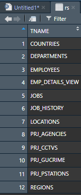
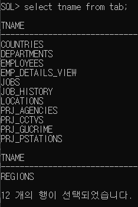
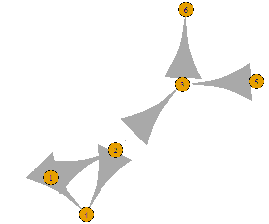
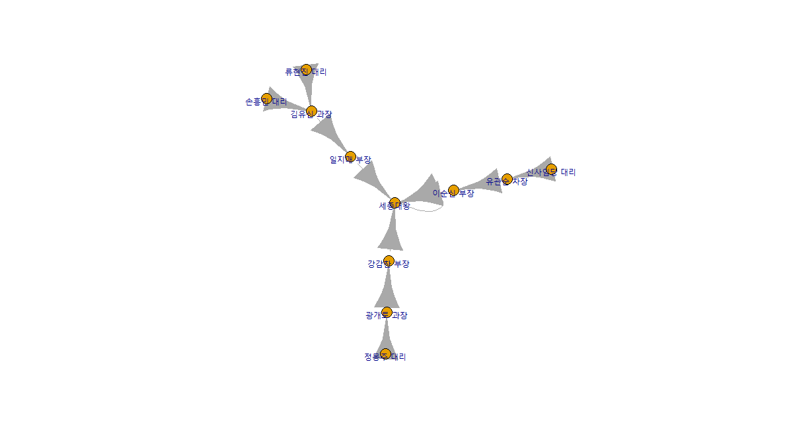

### 산점도( scatter plot ) 

> 두개 이상의 변수들 사이의 분포를 점으로 표시, 두 변수의 관계를 시각적으로 분석할 때 유용

```R
> price <- runif(10,min=1,max=100) #난수 10개 발생

> print(price)
 [1] 95.726501 45.880081 68.079493
 [4] 57.690707 11.189544 90.082672
 [7] 25.362686  5.163894 33.464151
[10] 95.495861

> plot(price,col="red")

> par(new=T) #차트 추가

> line_chart=1:100

> #x축은 생성된 난수의 순서
> plot(line_chart,type="l",col="red",axes = F,ann = F)
```


#### 좌표평면상의 점 등을 선으로 연결

```R
par(mfrow=c(2,2))
plot(price,type="l")
plot(price,type="o")
plot(price,type="b")
plot(price,type="s")
```


#### 중복된 데이터의 수만큼 plot점 크기 확대

```R
> x <-c(1,2,3,4,2,4)
> y <- rep(2,6)
> table(x,y) #table() : 빈도수
   y
x   2
  1 1
  2 2
  3 1
  4 2
```


=======> <u>*dataframe*</u>으로 만들고 *cex (0.5) 에 Freq객체 곱해주기*

```R
> xy.df<-as.data.frame(table(x,y))
> xy.df
  x y Freq
1 1 2    1
2 2 2    2
3 3 2    1
4 4 2    2

> plot(x,y,pch='@',col='blue',cex=0.5 * xy.df$Freq,xlab="x벡터 원소",ylab="y벡터 원소")
```


```R
> library(psych)
> data(galton)
> str(galton)
'data.frame':	928 obs. of  2 variables:
 $ parent: num  70.5 68.5 65.5 64.5 64 67.5 67.5 67.5 66.5 66.5 ...
 $ child : num  61.7 61.7 61.7 61.7 61.7 62.2 62.2 62.2 62.2 62.2 ...

#child컬럼, parent 컬럼을 대상으로 교차테이블 생성 결과를 데이터 프레임으로
galtondf <- as.data.frame(table(galton$child,galton$parent))
> head(galtondf)
#var1 : child, var2 : parent
Var1 Var2 Freq
1 61.7   64    1
2 62.2   64    0
3 63.2   64    2
4 64.2   64    4
5 65.2   64    1
6 66.2   64    2


> str(galtondf)
'data.frame':	154 obs. of  3 variables:
 $ Var1: Factor w/ 14 levels "61.7","62.2",..: 1 2 3 4 5 6 7 8 9 10 ...
 $ Var2: Factor w/ 11 levels "64","64.5","65.5",..: 1 1 1 1 1 1 1 1 1 1 ...
 $ Freq: int  1 0 2 4 1 2 2 1 1 0 ...

names(galtondf) <- c("child","parent","freq")
head(galtondf) #freq이 factor로되있음
parent <- as.numeric(galtondf$parent)
child <- as.numeric(galtondf$child)
plot(parent, child, pch=21, col="blue", bg="green", 
     cex=0.2*galtondf$freq, xlab="parent", ylab="child")
```


### pairs()

> 변수간의 관계를 차트로 그릴 수 있다.
>
> graphics 패키지에서 제공하는 pairs()는 matrix 또는 data.frame의 numeric 컬럼을 대상으로 변수들 사이의 비교 결과를 행렬구조의 분산된 그래프로 제공합니다.

```R
> attributes(iris)
$names
[1] "Sepal.Length" "Sepal.Width" 
[3] "Petal.Length" "Petal.Width" 
[5] "Species"     

$class
[1] "data.frame"

$row.names
  [1]   1   2   3   4   5   6   7   8   9
 [10]  10  11  12  13  14  15  16  17  18
 [19]  19  20  21  22  23  24  25  26  27
 [28]  28  29  30  31  32  33  34  35  36
 [37]  37  38  39  40  41  42  43  44  45
 [46]  46  47  48  49  50  51  52  53  54
 [55]  55  56  57  58  59  60  61  62  63
 [64]  64  65  66  67  68  69  70  71  72
 [73]  73  74  75  76  77  78  79  80  81
 [82]  82  83  84  85  86  87  88  89  90
 [91]  91  92  93  94  95  96  97  98  99
[100] 100 101 102 103 104 105 106 107 108
[109] 109 110 111 112 113 114 115 116 117
[118] 118 119 120 121 122 123 124 125 126
[127] 127 128 129 130 131 132 133 134 135
[136] 136 137 138 139 140 141 142 143 144
[145] 145 146 147 148 149 150

> pairs(iris[, 1:4])
```


`> pairs(iris[iris$Species=="setosa", 1:4])`


	### 3차원 산점도

```R
> library(scatterplot3d)
> levels(iris$Species)
[1] "setosa"     "versicolor" "virginica" 

> iris_setosa=iris[iris$Species=='setosa',]
> iris_setosa=iris[iris$Species=='versicolor',]
> iris_setosa=iris[iris$Species=='virginica',]

> d3 <- scatterplot3d(iris$Petal.Length,iris$Sepal.Length,iris$Sepal.Width,type='n') #type='n' 은 기본 산점도를 표시

> d3$points3d(iris_setosa$Petal.Length,iris_setosa$Sepal.Length, iris_setosa$Sepal.Width, bg="orange",pch=21)

> d3$points3d(iris_versicolor$Petal.Length,iris_versicolor$Sepal.Length, iris_setosa$Sepal.Width, bg="blue",pch=23)

> d3$points3d(iris_virginica$Petal.Length,iris_virginica$Sepal.Length, iris_setosa$Sepal.Width, bg="green",pch=25) 
```


---

## 데이터 전처리

데이터 분석 프로젝트에서는 70%이상의 시간을 데이터변환과 조작, 필터링 등 전처리 작업에 소요된다
데이터 전처리에 사용되는 유용한 패키지 :

`plyr`, `dplyr`,  `reshape`, `reshape2`


### plyr

>  데이터프레임 대상으로 key값을 이용해 merge, 함수적용 , 요약, 집계등으 기능 제공

#### Join()

```R
> x <- data.frame(id=c(1,2,3,4,5), height =c(150,170,144,195,124))
> y <- data.frame(id=c(5,1,3,2,4), weight =c(60,70,44,95,72))

> #join() : 두 데이터 프레임을 merge

> xyjoin <- join(x,y,by="id")

> xyjoin
  id height weight
1  1    150     70
2  2    170     95
3  3    144     44
4  4    195     72
5  5    124     60
```

#### leftjoin()

```R
> leftjoin<- join(x,y,  by="id")
> leftjoin #키에 join할 데이터가 없으면 NA로 출력
  id height weight
1  1    150     70
2  2    170     95
3  3    144     44
4  4    195     72
5  6    124     NA
```

#### innerjoin()

```R
> innerjoin <- join(x,y,by="id",type="inner")

> innerjoin			 #innerjoin은 두 데이터프레임에서 키값이 있는 경우에만 조인
  id height weight
1  1    150     70
2  2    170     95
3  3    144     44
4  4    195     72
```

#### fulljoin()

```R
> fulljoin <- join(x,y, by="id",type="full")
> fulljoin #키 값이 존재하는 전체 관측치를 대상으로 조인 수행,
  id height weight
1  1    150     70
2  2    170     95
3  3    144     44
4  4    195     72
5  6    124     NA
6  5     NA     60
```

```R
> x <- data.frame(key1=c(1,1,2,2,3), key2=c('a','b','c','d','e'), val1=c(10,20,30,40,50))
> y <- data.frame(key1=c(3,2,1,1,2), key2=c('e','d','c','b','a'), val1=c(500,300,400,100,200))
> xyjoin <- join(x,y,by=c('key1','key2'))
> xyjoin
  key1 key2 val1 val1
1    1    a   10   NA
2    1    b   20  100
3    2    c   30   NA
4    2    d   40  300
5    3    e   50  500
```


### dplyr

> 데이터 전처리( 조건 필터, 그룹핑,  함수적용, 변환, 집계연산, 정렬,.....)

- ddply 데이터 셋에 집단 변수(이산형 범주)를 대상으로 그룹별 함수를 여러개  적용할 수 있습니다.

- ddply(데이터 셋, 집단변수, 요약집계, 컬럼명=함수(변수)) - 결과를 data.frame타입으로 반환

- ```R
  filter() 조건에 맞는 데이터셋 추출, 행추출
  filter(dataframe, 조건1, 조건2)
  
  select() 데이터 셋을 대상으로 컬럼을 선택하는 기능
  select(dataframe, 컬럼1, 컬럼2,...)
  
  mutate() 데이터 넷의 새로운 컬럼을 추가하는 기능
  
  arrange() 데이터 셋의 특정 컬럼으로 정렬하는 기능
  arrange(dataframe,컬럼, desc(컬럼), ...)
  
  summarise() 데이터 셋의 특정 컬럼으로 요약집계 기능
  
  tbl_df() 데이터셋에서 콘솔 창의 크기만큼 데이터 셋 추출 기능
  ```

- **Iris**

  ```R
  > avg_df <- ddply(iris, .(Species), summarise, avg=mean(Sepal.Length))
  
  > avg_df
       Species   avg
  1     setosa 5.006
  2 versicolor 5.936
  3  virginica 6.588
  
  > str(avg_df)
  'data.frame':	3 obs. of  2 variables:
   $ Species: Factor w/ 3 levels "setosa","versicolor",..: 1 2 3
   $ avg    : num  5.01 5.94 6.59
  ```

  

#### apply(vec, func) 
​	-결과는 벡터, 배열, 리스트

#### lapply(vec|list, func) 

​	-결과는  리스트

#### sapply(vec , func) 

​	- 결과는 벡터, 배열, 행렬 반환

#### tapply(dataset,집단변수, 함수) 

- 데이터 셋에 집단 변수(이산형 범주)를 대상으로 그룹별 함수 적용

- tapply(

```R
> names(iris)
[1] "Sepal.Length" "Sepal.Width"  "Petal.Length" "Petal.Width"  "Species"     

> unique(iris$Species)
[1] setosa     versicolor virginica 
Levels: setosa versicolor virginica

> tapply(iris$Sepal.Length,iris$Species,mean) #평균값
    setosa versicolor  virginica 
     5.006      5.936      6.588 

> tapply(iris$Sepal.Width,iris$Species,sd) # 표준편차
    setosa versicolor  virginica 
 0.3790644  0.3137983  0.3224966 

> tapply(iris$Petal.Length,iris$Species,max) # 최댓값
    setosa versicolor  virginica 
       1.9        5.1        6.9 
```

#### ddply (vec, 집단변수, 함수)

- ddply(데이터 셋, 집단변수, 요약집계,컬럼명=함수(변수))
- 데이터 셋에 집단 변수(이산형 번수)를 대상으로 그룹별 함수

```R
> library(plyr)
> avg_df<-ddply(iris,.(Species),summarise,avg=mean(Sepal.Length))
> avg_df
     Species   avg
1     setosa 5.006
2 versicolor 5.936
3  virginica 6.588

> str(avg_df)
'data.frame':	3 obs. of  2 variables:
 $ Species: Factor w/ 3 levels "setosa","versicolor",..: 1 2 3
 $ avg    : num  5.01 5.94 6.59

#여러가지 그룹도 가능!
> result<-ddply(iris,.(Species),summarise,avg=mean(Sepal.Length)
+                                ,std=sd(Sepal.Length),max=max(Sepal.Length),
+                                min=min(Sepal.Length))

> result
     Species   avg       std max min
1     setosa 5.006 0.3524897 5.8 4.3
2 versicolor 5.936 0.5161711 7.0 4.9
3  virginica 6.588 0.6358796 7.9 4.9
```


#### filter() 

> 조건에 맞는 데이터셋 추출, 행추출

```R
#클래스가 1인 record(행) 추출
>  class1<-exam %>% filter(class==1)
>  print(class1)
  癤퓁d class math english science
1     1     1   50      98      50
2     2     1   60      97      60
3     3     1   45      86      78
4     4     1   30      98      58

#클래스가 1인 record(행) 추출
> other_class<-exam %>% filter(class!=1)
> print(other_class)
   癤퓁d class math english science
1      5     2   25      80      65
2      6     2   50      89      98
3      7     2   80      90      45
4      8     2   90      78      25
5      9     3   20      98      15
6     10     3   50      98      45
7     11     3   65      65      65
8     12     3   45      85      32
9     13     4   46      98      65
10    14     4   48      87      12
11    15     4   75      56      78
12    16     4   58      98      65
13    17     5   65      68      98
14    18     5   80      78      90
15    19     5   89      68      87
16    20     5   78      83      58

#class가 1이면서 수학점수는 50이상인 행을 추출
> class1_math50<-exam %>% filter(class==1 & math>50)
> print(class1_math50)
  癤퓁d class math english science
1     2     1   60      97      60

#class가 1,3,5 인 행만 추출
 class1_3_5<-exam %>% filter(class== 1 | class==3 | class==5)
#혹은 exam %>% filter(class %in% c(1,3,5))
> print(class1_3_5)
   id class math english science
1   1     1   50      98      50
2   2     1   60      97      60
3   3     1   45      86      78
4   4     1   30      98      58
5   9     3   20      98      15
6  10     3   50      98      45
7  11     3   65      65      65
8  12     3   45      85      32
9  17     5   65      68      98
10 18     5   80      78      90
11 19     5   89      68      87
12 20     5   78      83      58
```


#### select() 

> 데이터 셋을 대상으로 컬럼을 선택하는 기능

```R
#영어 점수 컬럼값만 추출
> e_jumsu<-exam %>% select(english)
> print(e_jumsu)

  english
1       98
2       97
3       86
4       98
5       80
6       89
7       90
8       78
9       98
10      98
11      65
12      85
13      98
14      87
15      56
16      98
17      68
18      78
19      68
20      83

#수학점수 제외하고 모든 컬럼 추출
>  allcolumn <- exam %>% select(-math)
>   print(allcolumn)
   癤퓁d class english science
1      1     1      98      50
2      2     1      97      60
3      3     1      86      78
4      4     1      98      58
5      5     2      80      65
6      6     2      89      98
7      7     2      90      45
8      8     2      78      25
9      9     3      98      15
10    10     3      98      45
11    11     3      65      65
12    12     3      85      32
13    13     4      98      65
14    14     4      87      12
15    15     4      56      78
16    16     4      98      65
17    17     5      68      98
18    18     5      78      90
19    19     5      68      87
20    20     5      83      58


#class 가 1이면서 영어점수 컬럼값만 1행에서 ~3행까지 출력
> exam %>% filter(class==1) %>% select(english) %>% head(3)
  english
1      98
2      97
3      86


#pass 이름의 컬럼을 추가(평균이 60점 이상이면 "pass", 아니면 " false)
> new_pass <- new_avg %>% mutate(pass=(ifelse(avg>=60,"pass","fail")))
> print(new_pass)               
   癤퓁d class math english science      avg pass
1      1     1   50      98      50 66.00000 pass
2      2     1   60      97      60 72.33333 pass
3      3     1   45      86      78 69.66667 pass
4      4     1   30      98      58 62.00000 pass
5      5     2   25      80      65 56.66667 fail
6      6     2   50      89      98 79.00000 pass
7      7     2   80      90      45 71.66667 pass
8      8     2   90      78      25 64.33333 pass
9      9     3   20      98      15 44.33333 fail
10    10     3   50      98      45 64.33333 pass
11    11     3   65      65      65 65.00000 pass
12    12     3   45      85      32 54.00000 fail
13    13     4   46      98      65 69.66667 pass
14    14     4   48      87      12 49.00000 fail
15    15     4   75      56      78 69.66667 pass
16    16     4   58      98      65 73.66667 pass
17    17     5   65      68      98 77.00000 pass
18    18     5   80      78      90 82.66667 pass
19    19     5   89      68      87 81.33333 pass
20    20     5   78      83      58 73.00000 pass


```

#### arrange() 

>  데이터 셋의 특정 컬럼으로 정렬하는 기능

~~~R
>   asc_math<-exam %>% arrange(math)
>   print(asc_math)   
   癤퓁d class math english science
1      9     3   20      98      15
2      5     2   25      80      65
3      4     1   30      98      58
4      3     1   45      86      78
5     12     3   45      85      32
6     13     4   46      98      65
7     14     4   48      87      12
8      1     1   50      98      50
9      6     2   50      89      98
10    10     3   50      98      45
11    16     4   58      98      65
12     2     1   60      97      60
13    11     3   65      65      65
14    17     5   65      68      98
15    15     4   75      56      78
16    20     5   78      83      58
17     7     2   80      90      45
18    18     5   80      78      90
19    19     5   89      68      87
20     8     2   90      78      25


#수학점수를 기준으로 내림차순 정렬된 결과를 변수에 저장하고 출력
desc_math<-exam %>% arrange(desc(math))
print(desc_math)
   癤퓁d class math english science
1      8     2   90      78      25
2     19     5   89      68      87
3      7     2   80      90      45
4     18     5   80      78      90
5     20     5   78      83      58
6     15     4   75      56      78
7     11     3   65      65      65
8     17     5   65      68      98
9      2     1   60      97      60
10    16     4   58      98      65
11     1     1   50      98      50
12     6     2   50      89      98
13    10     3   50      98      45
14    14     4   48      87      12
15    13     4   46      98      65
16     3     1   45      86      78
17    12     3   45      85      32
18     4     1   30      98      58
19     5     2   25      80      65
20     9     3   20      98      15

# 1차 정렬은 class의 오름차순, 2차정렬은 math의 내림차순
>order_math<- exam%>% arrange(class,desc(math))
>print(order_math)  
      癤퓁d class math english science
1      2     1   60      97      60
2      1     1   50      98      50
3      3     1   45      86      78
4      4     1   30      98      58
5      8     2   90      78      25
6      7     2   80      90      45
7      6     2   50      89      98
8      5     2   25      80      65
9     11     3   65      65      65
10    10     3   50      98      45
11    12     3   45      85      32
12     9     3   20      98      15
13    15     4   75      56      78
14    16     4   58      98      65
15    14     4   48      87      12
16    13     4   46      98      65
17    19     5   89      68      87
18    18     5   80      78      90
19    20     5   78      83      58
20    17     5   65      68      98
  
# 추가된 평균칼럼으로 내림차순 정렬
> new_desc <- new_pass %>% arrange(desc(avg))
> print(new_desc)
   癤퓁d class math english science      avg pass
1     18     5   80      78      90 82.66667 pass
2     19     5   89      68      87 81.33333 pass
3      6     2   50      89      98 79.00000 pass
4     17     5   65      68      98 77.00000 pass
5     16     4   58      98      65 73.66667 pass
6     20     5   78      83      58 73.00000 pass
7      2     1   60      97      60 72.33333 pass
8      7     2   80      90      45 71.66667 pass
9      3     1   45      86      78 69.66667 pass
10    13     4   46      98      65 69.66667 pass
11    15     4   75      56      78 69.66667 pass
12     1     1   50      98      50 66.00000 pass
13    11     3   65      65      65 65.00000 pass
14     8     2   90      78      25 64.33333 pass
15    10     3   50      98      45 64.33333 pass
16     4     1   30      98      58 62.00000 pass
17     5     2   25      80      65 56.66667 fail
18    12     3   45      85      32 54.00000 fail
19    14     4   48      87      12 49.00000 fail
20     9     3   20      98      15 44.33333 fail
~~~

#### summarise

> 데이터 셋의 특정 컬럼으로 요약집계 기능 (아래 hflights 패키지 이용)

```R
> summary_exam <- exam %>% summarise( mean_math=mean(math),
+                                     sum_math=sum(math),
+                                     median_math=median(math),
+                                     sd_math=sd(math),
+                                     min_math=min(math),
+                                     max_math=max(math),
+                                     n=n()
+                                     )

> print(summary_exam)
  mean_math sum_math median_math  sd_math min_math max_math  n
1     57.45     1149          54 20.29901       20       90 20
```

#### tbl_df()

> 콘솔창의 크기만큼만 출력

#### group_by( dataframe, 집단변수 )

```R
> group_summary  <- exam %>% group_by(class) %>% summarise(mean_math=mean(math), 
+                                                          sum_math=sum(math),
+                                                          median_math =median(math),
+                                                          sd_math=sd(math),
+                                                          min_math=min(math),
+                                                          max_math=max(math),
+                                                          n=n())

> print(group_summary)                                                       
# A tibble: 5 x 8
  class mean_math sum_math median_math sd_math min_math max_math
  <int>     <dbl>    <int>       <dbl>   <dbl>    <int>    <int>
1     1      46.2      185        47.5   12.5        30       60
2     2      61.2      245        65     29.5        25       90
3     3      45        180        47.5   18.7        20       65
4     4      56.8      227        53     13.3        46       75
5     5      78        312        79      9.90       65       89
# ... with 1 more variable: n <int>
```

### hflight 패키지 활용

#### tbl_df()

```R
> library(hflights)

> hflights <- tbl_df(hflights)  

> print(hflights)
# A tibble: 227,496 x 21
    Year Month DayofMonth DayOfWeek DepTime ArrTime UniqueCarrier
   <int> <int>      <int>     <int>   <int>   <int> <chr>        
 1  2011     1          1         6    1400    1500 AA           
 2  2011     1          2         7    1401    1501 AA           
 3  2011     1          3         1    1352    1502 AA           
 4  2011     1          4         2    1403    1513 AA           
 5  2011     1          5         3    1405    1507 AA           
 6  2011     1          6         4    1359    1503 AA           
 7  2011     1          7         5    1359    1509 AA           
 8  2011     1          8         6    1355    1454 AA           
 9  2011     1          9         7    1443    1554 AA           
10  2011     1         10         1    1443    1553 AA           
# ... with 227,486 more rows, and 14 more variables:
#   FlightNum <int>, TailNum <chr>, ActualElapsedTime <int>,
#   AirTime <int>, ArrDelay <int>, DepDelay <int>, Origin <chr>,
#   Dest <chr>, Distance <int>, TaxiIn <int>, TaxiOut <int>,
#   Cancelled <int>, CancellationCode <chr>, Diverted <int>
```


#### 1. 1월의 2일 모든 비행기의 이착률 정보 추출

```R
> hflights12 <-hflights %>% filter(Month %in% c(1,2))

> print(hflights12)
# A tibble: 36,038 x 21
    Year Month DayofMonth DayOfWeek DepTime ArrTime UniqueCarrier
   <int> <int>      <int>     <int>   <int>   <int> <chr>        
 1  2011     1          1         6    1400    1500 AA           
 2  2011     1          2         7    1401    1501 AA           
 3  2011     1          3         1    1352    1502 AA           
 4  2011     1          4         2    1403    1513 AA           
 5  2011     1          5         3    1405    1507 AA           
 6  2011     1          6         4    1359    1503 AA           
 7  2011     1          7         5    1359    1509 AA           
 8  2011     1          8         6    1355    1454 AA           
 9  2011     1          9         7    1443    1554 AA           
10  2011     1         10         1    1443    1553 AA           
# ... with 36,028 more rows, and 14 more variables: FlightNum <int>,
#   TailNum <chr>, ActualElapsedTime <int>, AirTime <int>,
#   ArrDelay <int>, DepDelay <int>, Origin <chr>, Dest <chr>,
#   Distance <int>, TaxiIn <int>, TaxiOut <int>, Cancelled <int>,
#   CancellationCode <chr>, Diverted <int>
```


#### 2. 년, 월, 출발시간, 도착시간순으로 오름차순 정렬

```R
> arrange(hflights, Year,Month, DepTime,ArrTime)
# A tibble: 227,496 x 21
    Year Month DayofMonth DayOfWeek DepTime ArrTime UniqueCarrier
   <int> <int>      <int>     <int>   <int>   <int> <chr>        
 1  2011     1          1         6       1     621 CO           
 2  2011     1         21         5       4      46 XE           
 3  2011     1          4         2       5      59 OO           
 4  2011     1         27         4      11     216 CO           
 5  2011     1         27         4      17     240 XE           
 6  2011     1          9         7      22     117 WN           
 7  2011     1         28         5     226     310 XE           
 8  2011     1         18         2     537     829 DL           
 9  2011     1         25         2     538     824 DL           
10  2011     1          7         5     538     832 DL           
# ... with 227,486 more rows, and 14 more variables:
#   FlightNum <int>, TailNum <chr>, ActualElapsedTime <int>,
#   AirTime <int>, ArrDelay <int>, DepDelay <int>, Origin <chr>,
#   Dest <chr>, Distance <int>, TaxiIn <int>, TaxiOut <int>,
#   Cancelled <int>, CancellationCode <chr>, Diverted <int>
```


#### 3. hflights데이터셋을 년(오름차순), 월(오름차순), 출발시간(내림차순), 도착시간(오름차순) 정렬

```R
> arrange(hflights,Year,Month,desc(DepTime),ArrTime)
# A tibble: 227,496 x 21
    Year Month DayofMonth DayOfWeek DepTime ArrTime UniqueCarrier
   <int> <int>      <int>     <int>   <int>   <int> <chr>        
 1  2011     1          2         7    2335      32 WN           
 2  2011     1          2         7    2334     121 CO           
 3  2011     1         27         4    2329      14 WN           
 4  2011     1          6         4    2325      10 XE           
 5  2011     1         20         4    2325      17 XE           
 6  2011     1          3         1    2321     110 CO           
 7  2011     1         17         1    2315       8 XE           
 8  2011     1         14         5    2315      20 XE           
 9  2011     1         27         4    2315    2355 XE           
10  2011     1         27         4    2313       3 XE           
# ... with 227,486 more rows, and 14 more variables:
#   FlightNum <int>, TailNum <chr>, ActualElapsedTime <int>,
#   AirTime <int>, ArrDelay <int>, DepDelay <int>, Origin <chr>,
#   Dest <chr>, Distance <int>, TaxiIn <int>, TaxiOut <int>,
#   Cancelled <int>, CancellationCode <chr>, Diverted <int>
```


#### 4. hflights데이터셋으로부터 년, 월, 출발시간, 도착시간 컬럼만 검색

```r
> select(hflights, Year,Month,DepTime,ArrTime)
# A tibble: 227,496 x 4
    Year Month DepTime ArrTime
   <int> <int>   <int>   <int>
 1  2011     1    1400    1500
 2  2011     1    1401    1501
 3  2011     1    1352    1502
 4  2011     1    1403    1513
 5  2011     1    1405    1507
 6  2011     1    1359    1503
 7  2011     1    1359    1509
 8  2011     1    1355    1454
 9  2011     1    1443    1554
10  2011     1    1443    1553
# ... with 227,486 more rows
```


#### 5. hflights데이터셋으로부터 출발지연시간과 도착지연시간과의 차리를 계산한 컬럼 추가

```R
f_def<-flights_df %>% mutate(def=(ArrDelay-DepDelay))
> f_def1<-f_def %>% select(Year,Month,def)
> print(f_def1)
# A tibble: 227,496 x 3
    Year Month   def
   <int> <int> <int>
 1  2011     1   -10
 2  2011     1   -10
 3  2011     1     0
 4  2011     1     0
 5  2011     1    -8
 6  2011     1    -6
 7  2011     1     0
 8  2011     1   -11
 9  2011     1     1
10  2011     1     0
# ... with 227,486 more rows
```


#### 6. hflights데이터셋으로부터 도착 시간에 대한 평균, 표준편차 계산

```R
> summarise(hflights, cnt=n(), delay=mean(AirTime, na.rm=T))

     cnt    delay
1 227496 108.1423

> summarise(hflights, arrTimeSd = sd(AirTime, na.rm=T),
+           arrTimeVar = var(AirTime, na.rm=T))

  arrTimeSd arrTimeVar
1  56.55523   3198.494
```

## ggplot2

```R
install.packages("ggplot2")
library(ggplot2)
mpg <- as.data.frame(ggplot2::mpg)
mpg1<-tbl_df(mpg)
> print(mpg1)
# A tibble: 234 x 11
   manufacturer model displ  year   cyl trans drv     cty   hwy fl   
   <chr>        <chr> <dbl> <int> <int> <chr> <chr> <int> <int> <chr>
 1 audi         a4      1.8  1999     4 auto~ f        18    29 p    
 2 audi         a4      1.8  1999     4 manu~ f        21    29 p    
 3 audi         a4      2    2008     4 manu~ f        20    31 p    
 4 audi         a4      2    2008     4 auto~ f        21    30 p    
 5 audi         a4      2.8  1999     6 auto~ f        16    26 p    
 6 audi         a4      2.8  1999     6 manu~ f        18    26 p    
 7 audi         a4      3.1  2008     6 auto~ f        18    27 p    
 8 audi         a4 q~   1.8  1999     4 manu~ 4        18    26 p    
 9 audi         a4 q~   1.8  1999     4 auto~ 4        16    25 p    
10 audi         a4 q~   2    2008     4 manu~ 4        20    28 p    
# ... with 224 more rows, and 1 more variable: class <chr>
> str(mpg1)
Classes ‘tbl_df’, ‘tbl’ and 'data.frame':	234 obs. of  11 variables:
 $ manufacturer: chr  "audi" "audi" "audi" "audi" ...
 $ model       : chr  "a4" "a4" "a4" "a4" ...
 $ displ       : num  1.8 1.8 2 2 2.8 2.8 3.1 1.8 1.8 2 ...
 $ year        : int  1999 1999 2008 2008 1999 1999 2008 1999 1999 2008 ...
 $ cyl         : int  4 4 4 4 6 6 6 4 4 4 ...
 $ trans       : chr  "auto(l5)" "manual(m5)" "manual(m6)" "auto(av)" ...
 $ drv         : chr  "f" "f" "f" "f" ...
 $ cty         : int  18 21 20 21 16 18 18 18 16 20 ...
 $ hwy         : int  29 29 31 30 26 26 27 26 25 28 ...
 $ fl          : chr  "p" "p" "p" "p" ...
 $ class       : chr  "compact" "compact" "compact" "compact" ...
```

### 연습

#### Quiz 1. 

회사별로 분리, suv 추출, 통합 연비(도시연비+고속도로 연비) 변수 생성, 통합 연비 평균 산출, 내림차순 정렬, 1~5위까지 출력

```R
> mpg %>% group_by(manufacturer)  %>% filter(class=="suv") %>% mutate(tot=(cty+hwy)/2)  %>% summarise(mean_tot=mean(tot)) %>% arrange(desc(mean_tot))%>% head(5)

# A tibble: 5 x 2
  manufacturer mean_tot
  <chr>           <dbl>
1 subaru           21.9
2 toyota           16.3
3 nissan           15.9
4 mercury          15.6
5 jeep             15.6
```

#### Quiz 2.

어떤 회사에서 "compact"(경차) 차종을 가장 많이 생산하는지 알아보려고 합니다. 
각 회사별로 "compact" 차종을 내림차순으로 정렬해 출력하세요

```R
> result <- mpg %>% filter(class=="compact") %>% group_by(manufacturer)%>% summarise(count=n())  
> result %>% arrange(desc(count))

# A tibble: 5 x 2
  manufacturer count
  <chr>        <int>
1 audi            15
2 volkswagen      14
3 toyota          12
4 subaru           4
5 nissan           2
```


## Oracle DB로부터 R실행환경 (메모리) 가져오기

- RJDBC::JDBC("driver이름","driver가 존재하는 클래스경로","DB에서 문")
- dbConnect(Driver객체, DB_Url,user,password)
- dbGetQuery(connection 객체, select sql문장)

```R
>  drv<-JDBC("oracle.jdbc.OracleDriver",
   classPath = "C:/app/HK/product/11.2.0/dbhome_1/jdbc/lib/ojdbc6.jar",
   identifier.quote="`")

# 우리집은 localhost:1524
> con<-dbConnect(drv,"jdbc:oracle:thin:@localhost:1524:orcl","hr","oracle") 

> rs<-dbGetQuery(con,"select tname from tab") 
> print(rs)
              TNAME
1         COUNTRIES
2       DEPARTMENTS
3         EMPLOYEES
4  EMP_DETAILS_VIEW
5              JOBS
6       JOB_HISTORY
7         LOCATIONS
8      PRJ_AGENCIES
9         PRJ_CCTVS
10      PRJ_GUCRIME
11    PRJ_PSTATIONS
12          REGIONS
> View(rs)
# cmd 창에서 sqlplus hr/oracle로 접속해 
# select tname from tab; 결과와 동일
```



## 관계도 igraph()

### 예제 1.

```R
> install.packages("igraph")
> g1<-graph(c(1,2,2,3,2,4,1,4,5,3,3,6))
> print(g1)
IGRAPH c386fe0 D--- 6 6 -- 
+ edges from c386fe0:
[1] 1->2 2->3 2->4 1->4 5->3 3->6
```



### 예제 2.

```R
> name<-c("세종대왕", "일지매 부장", "김유신 과장", "손흥민 대리", "류현진 대리",
+                    "이순신 부장", "유관순 차장", "신사임당 대리", "강감찬 부장"
+                    , "광개토 과장", "정몽주 대리")
> pemp <- c("세종대왕", "세종대왕", "일지매 부장" , "김유신 과장", "김유신 과장"
+                        ,"세종대왕",  "이순신 부장", "유관순 차장",  "세종대왕" , "강감찬 부장"
+                      , "광개토 과장")
> emp<-data.frame(이름=name,상사이름=pemp)    
> print(emp)   
            이름    상사이름
1       세종대왕    세종대왕
2    일지매 부장    세종대왕
3    김유신 과장 일지매 부장
4    손흥민 대리 김유신 과장
5    류현진 대리 김유신 과장
6    이순신 부장    세종대왕
7    유관순 차장 이순신 부장
8  신사임당 대리 유관순 차장
9    강감찬 부장    세종대왕
10   광개토 과장 강감찬 부장
11   정몽주 대리 광개토 과장

> g <- graph.data.frame(emp, direct=T) 
> plot(g, layout=layout.fruchterman.reingold, vertex.size=8, edge.arrow.size=0.5)
> plot(g, layout=layout.fruchterman.reingold, vertex.size=8, edge.arrow.size=0.5)
```



## reshape 패키지

> 데이터 셋의 구성이 구분변수(identifier variable)에 의해서 특정 변수가 분류된 경우 데이터 셋의 모양을 변경하는 패키지

> 구분변수(identifier variable) : 데이터 셋에 1개 이상으로 분류되는 집단변수
>
>  측정변수(measured variable): 구분변수에 의해서 구분되는 변수

### rename()

> 데이터 파일을 가져오는 경우 컬럼명이 없으면 <u>기본적으로 V1, V2, V3... 형식</u>으로 기본 컬럼명이 적용되므로 
>
> 데이터 셋의 컬럼명을 변경하려면 rename() 함수를 사용

```R
> result<-read.csv("./reshape.csv",header=FALSE)
> head(result)
   V1  V2  V3  V4
1 5.1 1.4 0.2 3.5
2 4.9 1.4 0.2 3.0
3 4.7 1.3 0.2 3.2
4 4.6 1.5 0.2 3.1
5 5.0 1.4 0.2 3.6
6 5.4 1.7 0.4 3.9
> result<-rename(result,c(v1='total',v2="num1",v3="num2",v4="num3"))
```


### Indometh  (항염증제에 대한 약물동태학 데이터 셋)

- 기준변수 : timevar="time", idvar="Subject"
- 관측변수 : v.names="conc"
- 실험대상1을 기준으로 약물투여시간 0.25에서 8까지의 ...농도를

```R
> data('Indometh')
> str(Indometh)   #생체내에서 약물의 흡수, 분포, 비축, 대사, 배설의 과정을 연구
 				#Subject(실험대상), time(약물 투여시간:hr), conc(농도:ml/mcg)
Classes ‘nfnGroupedData’, ‘nfGroupedData’, ‘groupedData’ and 'data.frame':	66 obs. of  3 variables:
 $ Subject: Ord.factor w/ 6 levels "1"<"4"<"2"<"5"<..: 1 1 1 1 1 1 1 1 1 1 ...
 $ time   : num  0.25 0.5 0.75 1 1.25 2 3 4 5 6 ...
 $ conc   : num  1.5 0.94 0.78 0.48 0.37 0.19 0.12 0.11 0.08 0.07 ...
 - attr(*, "formula")=Class 'formula'  language conc ~ time | Subject
  .. ..- attr(*, ".Environment")=<environment: R_EmptyEnv> 
 - attr(*, "labels")=List of 2
  ..$ x: chr "Time since drug administration"
  ..$ y: chr "Indomethacin concentration"
 - attr(*, "units")=List of 2
  ..$ x: chr "(hr)"
  ..$ y: chr "(mcg/ml)"
```

#### 1. reshape(), melt()

> 구분변수를 기분으로 측정변수를 분류하여 새로운 컬럼을 생성

#### 2. wide

> 기준변수와 관측변수가 1:n 의 관계로 관측치가 구성된다.
>
> Indometh 는 long형식으로 이를 wide로 바꿔 보았다

```R
> wide <- reshape(Indometh, v.names="conc", timevar="time", idvar="Subject", direction="wide")
> wide
   Subject conc.0.25 conc.0.5 conc.0.75 conc.1 conc.1.25 conc.2
1        1      1.50     0.94      0.78   0.48      0.37   0.19
12       2      2.03     1.63      0.71   0.70      0.64   0.36
23       3      2.72     1.49      1.16   0.80      0.80   0.39
34       4      1.85     1.39      1.02   0.89      0.59   0.40
45       5      2.05     1.04      0.81   0.39      0.30   0.23
56       6      2.31     1.44      1.03   0.84      0.64   0.42
   conc.3 conc.4 conc.5 conc.6 conc.8
1    0.12   0.11   0.08   0.07   0.05
12   0.32   0.20   0.25   0.12   0.08
23   0.22   0.12   0.11   0.08   0.08
34   0.16   0.11   0.10   0.07   0.07
45   0.13   0.11   0.08   0.10   0.06
56   0.24   0.17   0.13   0.10   0.09
```

#### 3. long

> 기준변수와 관측변수가 1:1관계로 관측치가 구성

```R
> reshape(wide,direction="long")
       Subject time conc
1.0.25       1 0.25 1.50
2.0.25       2 0.25 2.03
3.0.25       3 0.25 2.72
4.0.25       4 0.25 1.85
5.0.25       5 0.25 2.05
6.0.25       6 0.25 2.31
1.0.5        1 0.50 0.94
2.0.5        2 0.50 1.63
3.0.5        3 0.50 1.49
4.0.5        4 0.50 1.39
5.0.5        5 0.50 1.04
6.0.5        6 0.50 1.44
1.0.75       1 0.75 0.78
2.0.75       2 0.75 0.71
3.0.75       3 0.75 1.16
4.0.75       4 0.75 1.02
5.0.75       5 0.75 0.81
6.0.75       6 0.75 1.03
# ...생략
```

### varying : 반복되는 색인

```R
## varying=2:12
> long <- reshape(wide, idvar ="Subject", varying=2:12,  
+                                  v.names="conc",  direction="long" )

> str(long)
Classes ‘nfnGroupedData’, ‘nfGroupedData’, ‘groupedData’ and 'data.frame':	66 obs. of  3 variables:
 $ Subject: Ord.factor w/ 6 levels "1"<"4"<"2"<"5"<..: 1 3 6 2 4 5 1 3 6 2 ...
 $ time   : int  1 1 1 1 1 1 2 2 2 2 ...
 $ conc   : num  1.5 2.03 2.72 1.85 2.05 2.31 0.94 1.63 1.49 1.39 ...
 - attr(*, "reshapeLong")=List of 4
  ..$ varying:List of 1
  .. ..$ conc: chr  "conc.0.25" "conc.0.5" "conc.0.75" "conc.1" ...
  .. ..- attr(*, "v.names")= chr "conc"
  .. ..- attr(*, "times")= int  1 2 3 4 5 6 7 8 9 10 ...
  ..$ v.names: chr "conc"
  ..$ idvar  : chr "Subject"
  ..$ timevar: chr "time"
```


