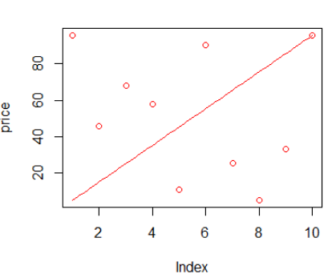
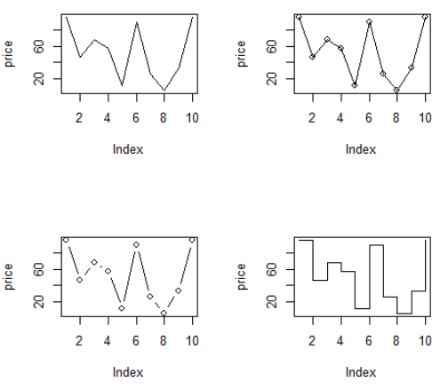
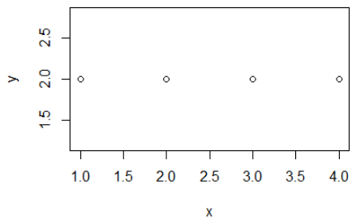
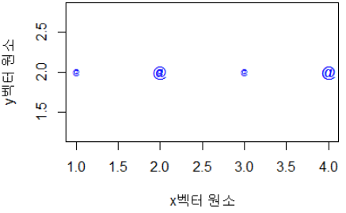
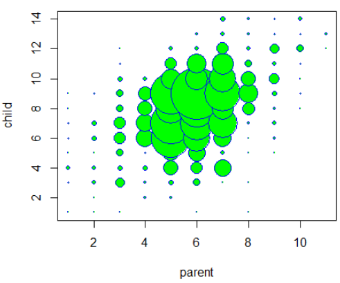
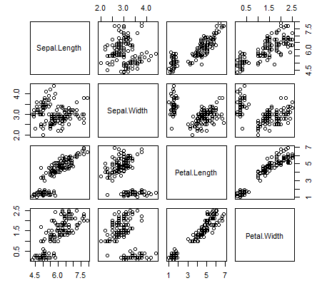
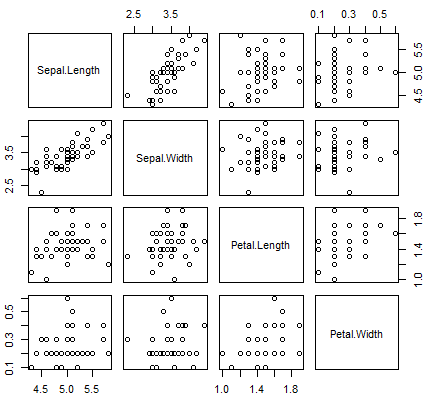
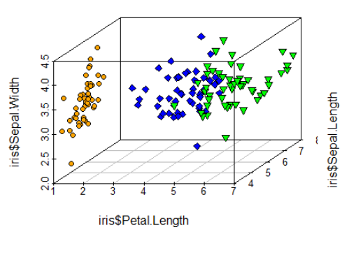

### 산점도( scatter plot ) 

> 두개 이상의 변수들 사이의 분포를 점으로 표시, 두 변수의 관계를 시각적으로 분석할 때 유용

```R
> price <- runif(10,min=1,max=100) #난수 10개 발생

> print(price)
 [1] 95.726501 45.880081 68.079493
 [4] 57.690707 11.189544 90.082672
 [7] 25.362686  5.163894 33.464151
[10] 95.495861

> plot(price,col="red")

> par(new=T) #차트 추가

> line_chart=1:100

> #x축은 생성된 난수의 순서
> plot(line_chart,type="l",col="red",axes = F,ann = F)
```



#### 좌표평면상의 점 등을 선으로 연결

```R
par(mfrow=c(2,2))
plot(price,type="l")
plot(price,type="o")
plot(price,type="b")
plot(price,type="s")
```



#### 중복된 데이터의 수만큼 plot점 크기 확대

```R
> x <-c(1,2,3,4,2,4)
> y <- rep(2,6)
> table(x,y) #table() : 빈도수
   y
x   2
  1 1
  2 2
  3 1
  4 2
```



=======> <u>*dataframe*</u>으로 만들고 *cex (0.5) 에 Freq객체 곱해주기*

```R
> xy.df<-as.data.frame(table(x,y))
> xy.df
  x y Freq
1 1 2    1
2 2 2    2
3 3 2    1
4 4 2    2

> plot(x,y,pch='@',col='blue',cex=0.5 * xy.df$Freq,xlab="x벡터 원소",ylab="y벡터 원소")
```



```R
> library(psych)
> data(galton)
> str(galton)
'data.frame':	928 obs. of  2 variables:
 $ parent: num  70.5 68.5 65.5 64.5 64 67.5 67.5 67.5 66.5 66.5 ...
 $ child : num  61.7 61.7 61.7 61.7 61.7 62.2 62.2 62.2 62.2 62.2 ...

#child컬럼, parent 컬럼을 대상으로 교차테이블 생성 결과를 데이터 프레임으로
galtondf <- as.data.frame(table(galton$child,galton$parent))
> head(galtondf)
#var1 : child, var2 : parent
Var1 Var2 Freq
1 61.7   64    1
2 62.2   64    0
3 63.2   64    2
4 64.2   64    4
5 65.2   64    1
6 66.2   64    2


> str(galtondf)
'data.frame':	154 obs. of  3 variables:
 $ Var1: Factor w/ 14 levels "61.7","62.2",..: 1 2 3 4 5 6 7 8 9 10 ...
 $ Var2: Factor w/ 11 levels "64","64.5","65.5",..: 1 1 1 1 1 1 1 1 1 1 ...
 $ Freq: int  1 0 2 4 1 2 2 1 1 0 ...

names(galtondf) <- c("child","parent","freq")
head(galtondf) #freq이 factor로되있음
parent <- as.numeric(galtondf$parent)
child <- as.numeric(galtondf$child)
plot(parent, child, pch=21, col="blue", bg="green", 
     cex=0.2*galtondf$freq, xlab="parent", ylab="child")
```




### pairs()

> 변수간의 관계를 차트로 그릴 수 있다.
>
> graphics 패키지에서 제공하는 pairs()는 matrix 또는 data.frame의 numeric 컬럼을 대상으로 변수들 사이의 비교 결과를 행렬구조의 분산된 그래프로 제공합니다.

```R
> attributes(iris)
$names
[1] "Sepal.Length" "Sepal.Width" 
[3] "Petal.Length" "Petal.Width" 
[5] "Species"     

$class
[1] "data.frame"

$row.names
  [1]   1   2   3   4   5   6   7   8   9
 [10]  10  11  12  13  14  15  16  17  18
 [19]  19  20  21  22  23  24  25  26  27
 [28]  28  29  30  31  32  33  34  35  36
 [37]  37  38  39  40  41  42  43  44  45
 [46]  46  47  48  49  50  51  52  53  54
 [55]  55  56  57  58  59  60  61  62  63
 [64]  64  65  66  67  68  69  70  71  72
 [73]  73  74  75  76  77  78  79  80  81
 [82]  82  83  84  85  86  87  88  89  90
 [91]  91  92  93  94  95  96  97  98  99
[100] 100 101 102 103 104 105 106 107 108
[109] 109 110 111 112 113 114 115 116 117
[118] 118 119 120 121 122 123 124 125 126
[127] 127 128 129 130 131 132 133 134 135
[136] 136 137 138 139 140 141 142 143 144
[145] 145 146 147 148 149 150

> pairs(iris[, 1:4])
```



`> pairs(iris[iris$Species=="setosa", 1:4])`



	### 3차원 산점도

```R
> library(scatterplot3d)
> levels(iris$Species)
[1] "setosa"     "versicolor" "virginica" 

> iris_setosa=iris[iris$Species=='setosa',]
> iris_setosa=iris[iris$Species=='versicolor',]
> iris_setosa=iris[iris$Species=='virginica',]

> d3 <- scatterplot3d(iris$Petal.Length,iris$Sepal.Length,iris$Sepal.Width,type='n') #type='n' 은 기본 산점도를 표시

> d3$points3d(iris_setosa$Petal.Length,iris_setosa$Sepal.Length, iris_setosa$Sepal.Width, bg="orange",pch=21)

> d3$points3d(iris_versicolor$Petal.Length,iris_versicolor$Sepal.Length, iris_setosa$Sepal.Width, bg="blue",pch=23)

> d3$points3d(iris_virginica$Petal.Length,iris_virginica$Sepal.Length, iris_setosa$Sepal.Width, bg="green",pch=25) 
```



---

## 데이터 전처리

데이터 분석 프로젝트에서는 70%이상의 시간을 데이터변환과 조작, 필터링 등 전처리 작업에 소요된다
데이터 전처리에 사용되는 유용한 패키지 :

`plyr`, `dplyr`,  `reshape`, `reshape2`


### plyr

>  데이터프레임 대상으로 key값을 이용해 merge, 함수적용 , 요약, 집계등으 기능 제공

#### Join()

```R
> x <- data.frame(id=c(1,2,3,4,5), height =c(150,170,144,195,124))
> y <- data.frame(id=c(5,1,3,2,4), weight =c(60,70,44,95,72))

> #join() : 두 데이터 프레임을 merge

> xyjoin <- join(x,y,by="id")

> xyjoin
  id height weight
1  1    150     70
2  2    170     95
3  3    144     44
4  4    195     72
5  5    124     60
```

#### leftjoin()

```R
> leftjoin<- join(x,y,  by="id")
> leftjoin #키에 join할 데이터가 없으면 NA로 출력
  id height weight
1  1    150     70
2  2    170     95
3  3    144     44
4  4    195     72
5  6    124     NA
```

#### innerjoin()

```R
> innerjoin <- join(x,y,by="id",type="inner")

> innerjoin			 #innerjoin은 두 데이터프레임에서 키값이 있는 경우에만 조인
  id height weight
1  1    150     70
2  2    170     95
3  3    144     44
4  4    195     72
```

#### fulljoin()

```R
> fulljoin <- join(x,y, by="id",type="full")
> fulljoin #키 값이 존재하는 전체 관측치를 대상으로 조인 수행,
  id height weight
1  1    150     70
2  2    170     95
3  3    144     44
4  4    195     72
5  6    124     NA
6  5     NA     60
```

```R
> x <- data.frame(key1=c(1,1,2,2,3), key2=c('a','b','c','d','e'), val1=c(10,20,30,40,50))
> y <- data.frame(key1=c(3,2,1,1,2), key2=c('e','d','c','b','a'), val1=c(500,300,400,100,200))
> xyjoin <- join(x,y,by=c('key1','key2'))
> xyjoin
  key1 key2 val1 val1
1    1    a   10   NA
2    1    b   20  100
3    2    c   30   NA
4    2    d   40  300
5    3    e   50  500
```


### dplyr

> 데이터 전처리( 조건 필터, 그룹핑,  함수적용, 변환, 집계연산, 정렬,.....)

- ddply 데이터 셋에 집단 변수(이산형 범주)를 대상으로 그룹별 함수를 여러개  적용할 수 있습니다.

- ddply(데이터 셋, 집단변수, 요약집계, 컬럼명=함수(변수)) - 결과를 data.frame타입으로 반환

- ```R
  filter() 조건에 맞는 데이터셋 추출, 행추출
  filter(dataframe, 조건1, 조건2)
  
  select() 데이터 셋을 대상으로 컬럼을 선택하는 기능
  select(dataframe, 컬럼1, 컬럼2,...)
  
  mutate() 데이터 넷의 새로운 컬럼을 추가하는 기능
  
  arrange() 데이터 셋의 특정 컬럼으로 정렬하는 기능
  arrange(dataframe,컬럼, desc(컬럼), ...)
  
  summarise() 데이터 셋의 특정 컬럼으로 요약집계 기능
  
  tbl_df() 데이터셋에서 콘솔 창의 크기만큼 데이터 셋 추출 기능
  ```

- **Iris**

  ```R
  > avg_df <- ddply(iris, .(Species), summarise, avg=mean(Sepal.Length))
  
  > avg_df
       Species   avg
  1     setosa 5.006
  2 versicolor 5.936
  3  virginica 6.588
  
  > str(avg_df)
  'data.frame':	3 obs. of  2 variables:
   $ Species: Factor w/ 3 levels "setosa","versicolor",..: 1 2 3
   $ avg    : num  5.01 5.94 6.59
  ```

  

#### apply(vec, func) 
​	-결과는 벡터, 배열, 리스트

#### lapply(vec|list, func) 

​	-결과는  리스트

#### sapply(vec , func) 

​	- 결과는 벡터, 배열, 행렬 반환

#### tapply(dataset,집단변수, 함수) 

- 데이터 셋에 집단 변수(이산형 범주)를 대상으로 그룹별 함수 적용

- tapply(

```R
> names(iris)
[1] "Sepal.Length" "Sepal.Width"  "Petal.Length" "Petal.Width"  "Species"     

> unique(iris$Species)
[1] setosa     versicolor virginica 
Levels: setosa versicolor virginica

> tapply(iris$Sepal.Length,iris$Species,mean) #평균값
    setosa versicolor  virginica 
     5.006      5.936      6.588 

> tapply(iris$Sepal.Width,iris$Species,sd) # 표준편차
    setosa versicolor  virginica 
 0.3790644  0.3137983  0.3224966 

> tapply(iris$Petal.Length,iris$Species,max) # 최댓값
    setosa versicolor  virginica 
       1.9        5.1        6.9 
```

#### ddply (vec, 집단변수, 함수)

- ddply(데이터 셋, 집단변수, 요약집계,컬럼명=함수(변수))
- 데이터 셋에 집단 변수(이산형 번수)를 대상으로 그룹별 함수

```R
> library(plyr)
> avg_df<-ddply(iris,.(Species),summarise,avg=mean(Sepal.Length))
> avg_df
     Species   avg
1     setosa 5.006
2 versicolor 5.936
3  virginica 6.588

> str(avg_df)
'data.frame':	3 obs. of  2 variables:
 $ Species: Factor w/ 3 levels "setosa","versicolor",..: 1 2 3
 $ avg    : num  5.01 5.94 6.59

#여러가지 그룹도 가능!
> result<-ddply(iris,.(Species),summarise,avg=mean(Sepal.Length)
+                                ,std=sd(Sepal.Length),max=max(Sepal.Length),
+                                min=min(Sepal.Length))

> result
     Species   avg       std max min
1     setosa 5.006 0.3524897 5.8 4.3
2 versicolor 5.936 0.5161711 7.0 4.9
3  virginica 6.588 0.6358796 7.9 4.9
```


