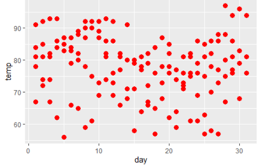

p166.melt


melt()

>  가로로 긴 데이터 셋을 세로로 전환
>
> melt(데이터셋, id.var="기준 열",measure.var = "변환열")

```R
> head(airquality)
  Ozone Solar.R Wind Temp Month Day
1    41     190  7.4   67     5   1
2    36     118  8.0   72     5   2
3    12     149 12.6   74     5   3
4    18     313 11.5   62     5   4
5    NA      NA 14.3   56     5   5
6    28      NA 14.9   66     5   6

> names(airquality) <- tolower(names(airquality))

> head(airquality)
  ozone solar.r wind temp month day
1    41     190  7.4   67     5   1
2    36     118  8.0   72     5   2
3    12     149 12.6   74     5   3
4    18     313 11.5   62     5   4
5    NA      NA 14.3   56     5   5
6    28      NA 14.9   66     5   6


> install.packages("reshape2")
> library(reshape2)

> head(melt_test)
  variable value
1    ozone    41
2    ozone    36
3    ozone    12
4    ozone    18
5    ozone    NA
6    ozone    28
> tail(melt_test)
    variable value
913      day    25
914      day    26
915      day    27
916      day    28
917      day    29
918      day    30

> melt_test2 <- melt(airquality,id.vars = c("month","wind"),measure.vars = "ozone")

> head(melt_test2)
  month wind variable value
1     5  7.4    ozone    41
2     5  8.0    ozone    36
3     5 12.6    ozone    12
4     5 11.5    ozone    18
5     5 14.3    ozone    NA
6     5 14.9    ozone    28
```


cast()

acast() : 벡터, 행렬, 배열 형태를 변환
dcast() : 데이터프레임 형태를 변환
	: dcast(데이터셋, 기준열 ~ 반환열)


## KoNLP패키지

1. KoNLP 사전준비

```R
> library(KoNLP)
> useSystemDic()
> useSejongDic()
> useNIADic()

> word_data <- readLines("애국가(가사).txt")

> word_data
 [1] "(1절)"                                                       
 [2] "동해물과 백두산이 마르고 닳도록"                             
 [3] "하느님이 보우하사 우리나라만세"                              
 [4] "(후렴)무궁화 삼천리 화려강산 대한사람 대한으로 길이 보전하세"
 [5] ""                                                            
 [6] "(2절)"                                                       
 [7] "남산위에 저 소나무 철갑을 두른듯"                            
 [8] "바람서리 불변함은 우리기상 일세"                             
 [9] "(후렴)무궁화 삼천리 화려강산 대한사람 대한으로 길이보전하세" 
[10] ""                                                            
[11] "(3절)"                                                       
[12] "가을하늘 공활한데 높고 구름없이 "                            
[13] "밝은달은 우리가슴 일편단심일세"                              
[14] "(후렴)무궁화 삼천리 화려강산 대한사람 대한으로 길이보전하세" 
[15] ""                                                            
[16] "(4절)"                                                       
[17] "이 기상과 이 맘으로 충성을 다하여"                           
[18] "괴로우나 즐거우나 나라사랑하세"                              
[19] "(후렴)무궁화 삼천리 화려강산 대한사람 대한으로 길이보전하세" 
[20] ""                                                            
```

2. 명사 추출 ---sapply 모든 행에 함수를 적용하는 함수
   `sapply(데이터,적용할 함수)`

   ```R
   > word_data2<-sapply(word_data,extractNoun,USE.NAMES = T)
   > word_data2
   $`(1절)`
   [1] "1"  "절"
   
   $`동해물과 백두산이 마르고 닳도록`
   [1] "동해"   "물"     "백두산" "닳도"  
   [5] "록"    
   
   $`하느님이 보우하사 우리나라만세`
   [1] "하느님"   "보우"     "하사"    
   [4] "우리나라" "세"      
   
   $`(후렴)무궁화 삼천리 화려강산 대한사람 대한으로 길이 보전하세`
    [1] "후"     "무궁화" "삼"     "천"    
    [5] "리"     "화려"   "강산"   "대한"  
    [9] "사람"   "대한"   "길"     "보전"  
   [13] "하"     "세"    
   
   [[5]]
   [1] ""
   ```

   

3. 세종 사전에 등록되어 있지 않은 단어 별도로 추가하기 

   ```R
   > add_words <- c("백두산","남산","철갑","가을","하늘","달")
   > buildDictionary(user_dic=data.frame(add_words,rep("ncn",length(add_words))),replace_usr_dic = T)
   629903 words dictionary was built.
   ```

   1. 다시 적용

      ```R
      > word_data2<-sapply(word_data,extractNoun,USE.NAMES = T)
      > word_data2
      $`(1절)`
      [1] "1"  "절"
      
      $`동해물과 백두산이 마르고 닳도록`
      [1] "동해"   "물"     "백두산" "닳도"  
      [5] "록"    
      
      $`하느님이 보우하사 우리나라만세`
      [1] "하느님이" "보우"     "하사"    
      [4] "우리나라" "세"      
      
      $`(후렴)무궁화 삼천리 화려강산 대한사람 대한으로 길이 보전하세`
       [1] "후"     "무궁화" "삼"     "천"    
       [5] "리"     "화려"   "강산"   "대한"  
       [9] "사람"   "대한"   "길"     "보전"  
      [13] "하"     "세"    
      
      [[5]]
      ```

4. 행렬을 벡터로 변환 **unlist()**
   ( 단어 뭉치 형태로 )

```R
> undata<-unlist(word_data2)
> undata
                                                        (1절)1 
                                                           "1" 
                                                        (1절)2 
                                                          "절" 
                              동해물과 백두산이 마르고 닳도록1 
                                                        "동해" 
                              동해물과 백두산이 마르고 닳도록2 
                                                          "물" 
                              동해물과 백두산이 마르고 닳도록3 
                                                      "백두산" 
                              동해물과 백두산이 마르고 닳도록4 
                                                        "닳도" 
                              동해물과 백두산이 마르고 닳도록5 
                                                          "록" 
                               하느님이 보우하사 우리나라만세1 
                                                    "하느님이" 
                               하느님이 보우하사 우리나라만세2 
                                                        "보우" 
                               하느님이 보우하사 우리나라만세3 
                                                        "하사" 
                               하느님이 보우하사 우리나라만세4 
                                                    "우리나라" 
                               하느님이 보우하사 우리나라만세5 
                                                          "세" 
 (후렴)무궁화 삼천리 화려강산 대한사람 대한으로 길이 보전하세1 
                                                          "후" 
 (후렴)무궁화 삼천리 화려강산 대한사람 대한으로 길이 보전하세2 
                                                      "무궁화" 
 (후렴)무궁화 삼천리 화려강산 대한사람 대한으로 길이 보전하세3 
                                                          "삼" 
 (후렴)무궁화 삼천리 화려강산 대한사람 대한으로 길이 보전하세4 
                                                          "천" 
 (후렴)무궁화 삼천리 화려강산 대한사람 대한으로 길이 보전하세5 
                                                          "리" 
 (후렴)무궁화 삼천리 화려강산 대한사람 대한으로 길이 보전하세6 
                                                        "화려" 
 (후렴)무궁화 삼천리 화려강산 대한사람 대한으로 길이 보전하세7 
                                                        "강산" 
 (후렴)무궁화 삼천리 화려강산 대한사람 대한으로 길이 보전하세8 
                                                        "대한" 
 (후렴)무궁화 삼천리 화려강산 대한사람 대한으로 길이 보전하세9 
                                                        "사람" 
(후렴)무궁화 삼천리 화려강산 대한사람 대한으로 길이 보전하세10 
                                                        "대한" 
(후렴)무궁화 삼천리 화려강산 대한사람 대한으로 길이 보전하세11 
                                                          "길" 
(후렴)무궁화 삼천리 화려강산 대한사람 대한으로 길이 보전하세12 
                                                        "보전" 
(후렴)무궁화 삼천리 화려강산 대한사람 대한으로 길이 보전하세13 
                                                          "하" 
(후렴)무궁화 삼천리 화려강산 대한사람 대한으로 길이 보전하세14 
                                                          "세" 
```

5. 사용빈도확인 - **table()**

   ```R
   > word_table <- table(undata)
   > word_table
   undata
                   1        2        3 
          4        1        1        1 
          4     가슴     가을     강산 
          1        1        1        4 
   공활한데   구름없     기상       길 
          1        1        1        1 
       길이     나라     남산     닳도 
          3        1        1        1 
       대한     동해       듯       록 
          8        1        1        1 
         리   무궁화       물 바람서리 
          4        4        1        1 
   밝은달은   백두산     보우     보전 
          1        1        1        4 
       불변     사람     사랑       삼 
          1        4        1        4 
         상       세   소나무       여 
          1        8        1        1 
       우리   우리기 우리나라       위 
          1        1        1        1 
         일 일편단심       저       절 
          1        1        1        4 
         천     철갑     충성       하 
          4        1        1        5 
   하느님이     하늘     하사       함 
          1        1        1        1 
       화려       후 
          4        4  
   ```

6. 필터링하기- **Filter()**

   ```R
   > undata2<-Filter(function(x){nchar(x)>=2},undata)
   > word_table2 <-table(undata2)
   > word_table2
   undata2
       가슴     가을     강산 공활한데 
          1        1        4        1 
     구름없     기상     길이     나라 
          1        1        3        1 
       남산     닳도     대한     동해 
          1        1        8        1 
     무궁화 바람서리 밝은달은   백두산 
          4        1        1        1 
       보우     보전     불변     사람 
          1        4        1        4 
       사랑   소나무     우리   우리기 
          1        1        1        1 
   우리나라 일편단심     철갑     충성 
          1        1        1        1 
   하느님이     하늘     하사     화려 
          1        1        1        4 
   ```

7. 데이터 정렬 - **sort()**

   ```R
   > sort(word_table2,decreasing = T)
   undata2
       대한     강산   무궁화     보전 
          8        4        4        4 
       사람     화려     길이     가슴 
          4        4        3        1 
       가을 공활한데   구름없     기상 
          1        1        1        1 
       나라     남산     닳도     동해 
          1        1        1        1 
   바람서리 밝은달은   백두산     보우 
          1        1        1        1 
       불변     사랑   소나무     우리 
          1        1        1        1 
     우리기 우리나라 일편단심     철갑 
          1        1        1        1 
       충성 하느님이     하늘     하사 
          1        1        1        1
   ```

   

## wordcloud

> 특정 주제와 관련된 키워드의 색상과 크기, 글자모음 형태를 활용해 주제를 쉽고 빠르게 인식할 수 있는 시각화 기법

`install.packages("wordcloud2")`

`library(wordcloud2)`

`wordcloud2(word_table2)` word_table2의 워드클라우드 생성


배경, 글씨 색상 변경

`wordcloud2(word_table2,color="random-light",backgroundColor = "black")`


모양 변경

`wordcloud2(word_table2,fontFamily = "궁서체",size=1.2,color="random-light",
           backgroundColor="black",shape="star")`


참고 ) demoFreq 데이터 셋 활용


### 네이버 API 활용

http://developers.naver.com/main 접속 Open API 신청
[Products]-[서비스 API]-[검색]
오픈 API 이용 신청
로그인
애플리케이션 이름 설정, WEB 설정 , 임의의 URL 입력 , 애플리케이션 등록 하기
Client ID (L9ejoeDdkvkfHXhyKaAe) 와 Client Secret( 6kK1vBv2hV ) 발급

네이버 Open API의 WEB 방식 호출은 API URL 뒤에 요청변수들을 "&" 기호로 연결해 전송하는 GET방식을 사용
[블러그 검색을 위한 API URL과  요청 변수]
https://openapi.naver.com/v1/search/blog.xml
요청변수query는 string타입으로 필수이며 검색을 원하는 문자열(UTF-8로 인코딩)
요청변수display는 integer타입으로 기본값 10, 최대값 100으로  검색 결과 출력 건수
요청변수 start는 integer타입으로 기본값 1, 최대값 1000으로 검색 시작 위치
요청변수 sort는 string타입으로 기본값 sim, date로 정렬 옵션:sim(유사도순), date는 날짜순


예) "RStudio"로 검색된 블로그 100개에 대해 첫 페이지부터 유사도순으로 정렬해 정보를 받기
https://openapi.naver.com/v1/search/blog.xml?query=Rstudio&display=100&start=1&sort=sim
		--> 결과값은 블로그 제목과 요약 내용, 작성자 이름 등 다양한 정보들이 XML 형식으로 제공

```R
> #기본 URL
> urlStr <- "https://openapi.naver.com/v1/search/blog.xml?"

> #검색어 설정 및 UTF-8 URL 인코딩
> searchString <- "query=코타키나발루"

> #UTF-8 인코딩
> searchString <- iconv(searchString, to="UTF-8")

> #URL 인코딩
> searchString <- URLencode(searchString )
> searchString
[1] "query=%EC%BD%94%ED%83%80%ED%82%A4%EB%82%98%EB%B0%9C%EB%A3%A8"
 
> #나머지 요청 변수 : 조회 개수 100개, 시작페이지 1, 유사도순 정렬
> etcString <- "&display=100&start=1&sort=sim"
 
> #URL조합
> reqUrl <- paste(urlStr, searchString, etcString, sep="")
> reqUrl
[1] "https://openapi.naver.com/v1/search/blog.xml?query=%EC%BD%94%ED%83%80%ED%82%A4%EB%82%98%EB%B0%9C%EB%A3%A8&display=100&start=1&sort=sim"
  
> #get방식으로 URL을 호출하기 위해 httr패키지의 GET함수 활용
> library(httr)
> clientID <- 'L9ejoeDdkvkfHXhyKaAe'
> clientSecret <- '6kK1vBv2hV'
 
> #인증정보는 add_headers에 담아 함께 전송
> apiResult <- GET(reqUrl, add_headers("X-Naver-Client-Id"=clientID
+                                      , "X-Naver-Client-Secret"=clientSecret))

> apiResult    #응답코드 status가 200이면 정상
Response [https://openapi.naver.com/v1/search/blog.xml?query=%EC%BD%94%ED%83%80%ED%82%A4%EB%82%98%EB%B0%9C%EB%A3%A8&display=100&start=1&sort=sim]
  Date: 2019-09-11 02:50
  Status: 200
  Content-Type: application/xml; charset=UTF-8
  Size: 68.6 kB
<BINARY BODY>
 
> #openAPI의 결과 구조 확인 (UTF-8로 인코딩된XML형식)
> str(apiResult)  #XML응답값은 "content"에 담겨있음
List of 10
 $ url        : chr "https://openapi.naver.com/v1/search/blog.xml?query=%EC%BD%94%ED%83%80%ED%82%A4%EB%82%98%EB%B0%9C%EB%A3%A8&displ"| __truncated__
 $ status_code: int 200
 $ headers    :List of 12
  ..$ server                : chr "nginx"
  ..$ date                  : chr "Wed, 11 Sep 2019 02:50:20 GMT"
 	...생략

> apiResult$content
   [1] 3c 3f 78 6d 6c 20 76 65 72 73 69 6f 6e 3d 22 31
  [17] 2e 30 22 20 65 6e 63 6f 64 69 6e 67 3d 22 55 54
  [33] 46 2d 38 22 3f 3e 3c 72 73 73 20 76 65 72 73 69
  [49] 6f 6e 3d 22 32 2e 30 22 3e 3c 63 68 61 6e 6e 65
  [65] 6c 3e 3c 74 69 74 6c 65 3e 4e 61 76 65 72 20 4f
  [81] 70 65 6e 20 41 50 49 20 2d 20 62 6c 6f 67 20 3a
  [97] 3a 27 ec bd 94 ed 83 80 ed 82 a4 eb 82 98 eb b0
 
..생략

 [ reached getOption("max.print") -- omitted 67627 entries ]

> str(apiResult$content)
 raw [1:68627] 3c 3f 78 6d ...

> #raw형식이므로 rawToChar()를 활용해 문자로 변환
> result <- rawToChar(apiResult$content)
> result
[1] "<?xml version=\"1.0\" encoding=\"UTF-8\"?><rss version=\"2.0\"><channel><title>Naver Open API - blog ::'肄뷀<83>\u0080<ed>궎<eb>굹諛쒕（'</title><link>https://search.naver.com</link><description>Naver Search Result</description><lastBuildDate>Wed, 11 Sep 2019 11:50:20 +0900</lastBuildDate><total>208322</total><start>1</start><display>100</display><item><title>&lt;b&gt;肄뷀<83>\u0080<ed>궎<eb>굹諛쒕（&lt;/b&gt;留쏆쭛 由ъ븰 <ed>뙩 <ec>뵪<ed>뫖<eb>뱶 Liang Fan Seafood</title><link>https://blog.nave
..생략

```

#### 1. gsub()

##### 	1-1. 개념 

>워드 클라우드에 표현할 단어를 추출하기 전에 문자열을 치환하는 gsub 함수를 활용해 
>불필요한 XML관련 태그(tag)와 특수문자 제거

```R
gsub(pattern, replacement, x, ignore.case)
```

- 변환 전 문자열(정규표현식 가능), 변환 후 문자열, 변환할 문자열 벡터, 대소문자 무시 여부

  ```R
  > gsub("ABC", "***", "ABCabcABC")  #ABC를 **로 변환
  [1] "***abc***"
  
  > gsub("ABC", "***", "ABCabcABC", ignore.case=T)
  [1] "*********"
  
  > x<-c("ABCabcABC", "abcABCabc")
  > gsub("ABC", "***", x) 
  [1] "***abc***" "abc***abc"
  ```

- gsub()는 고정된 문자열뿐 아니라 정규표현식을 통해 특정 패턴의 문자열들도 치환할 수 있습니다.

- 패턴문자  \\w 는 '_'를 포함한 문자와 숫자_

- 패턴문자  \\W 는  \\w 의 반대의미 '_'와 문자와 숫자를 제외한 기호

- 패턴문자  \\d 는  숫자

- 패턴문자  \\D 는  숫자를 제외한 기호와 문자

- 패턴문자 []는 대괄호 안의 문자 중 한 개를 의미

- 패턴문자 [^]는 대괄호 안의 문자가 없는 패턴을 의미

  ```R
  > gsub("b.n", "***", "i love banana")  
  [1] "i love ***ana"
  
  > gsub("b.*n", "***", "i love banana") 
  [1] "i love ***a"
  
  > gsub("[bn]a", "***", "i love banana") 
  [1] "i love *********"
  
  > gsub("010-[0-9]{4}-[0-9]{4}", "010-****-****", "내 폰번호는 010-1234-6789") 
  [1] "내 폰번호는 010-****-****"
  
  > gsub("010-\\d{4}-\\d{4}", "010-****-****", "내 폰번호는 010-1234-6789") 
  [1] "내 폰번호는 010-****-****"
  ```

##### 1-2. result에 반영해보기

```R
refinedStr <- result

> #XML 태그를 공란으로 치환
> refinedStr <- gsub("<\\/?)(\\w+)*([^<>]*)>", " ", refinedStr)

> #단락을 표현하는 불필요한 문자를 공란으로 치환
> refinedStr <- gsub("[[:punct:]]", " ", refinedStr)

> #영어 소문자를 공란으로 치환
> refinedStr <- gsub("[a-z]", " ", refinedStr)

> #숫자를 공란으로 치환
> refinedStr <- gsub("[0-9]", " ", refinedStr)

> #여러 공란은 한 개의 공란으로 변경
> refinedStr <- gsub(" +", " ", refinedStr)
> refinedStr 
```

#### 2. KoNLP (한글 자연어 분석 패키지) 활용

>  extractNoun()는 입력받은 문장에서 단어를 추출해 벡터로 반환

​		예 ) `extractNoun( "안녕하세요 오늘은 기분 좋은 하루 입니다.")`

```R
library(KoNLP)
library(rJava)

nouns<- extractNoun( refinedStr )
str(nouns)
nouns[1:40]

#길이가 1인 문자를 제외
nouns <-nouns[nchar(nouns) > 1]

#제외할 특정 단어를 정의
excluNouns <- c("코타키나발루", "얼마" , "오늘", "으로", "해서", "API", "저희", "정도")

nouns  <- nouns [!nouns  %in% excluNouns ]
nouns [1:40]

#빈도수 기준으로 상위 50개 단어 추출
wordT <- sort(table(nouns), decreasing=T)[1:50]
wordT

#wordcloud2 패키지 
# wordcloud2 (data, size, shape) 
단어와 빈도수 정보가 포함된 데이터프레임 또는 테이블, 글자 크기, 워드 클라우드의 전체 모양(circle:기본값, cardioid, diamond, triangle, star등)

install.packages("wordcloud2")
library(wordcloud2)
wordcloud2(wordT, size=3, shape="diamond")
```

#### 3. 결과


### 영문서 형태소 분석 및 워드클라우드

```R
#install
install.packages("tm")  # 텍스트 마이닝을 위한 패키지
install.packages("SnowballC") # 어간추출을 위한 패키지
install.packages("wordcloud") # word-cloud generator 
install.packages("RColorBrewer") # color palettes

#load
library("tm")
library("SnowballC")
library("wordcloud")
library("RColorBrewer")

> filePath <- "http://www.sthda.com/sthda/RDoc/example-files/martin-luther-king-i-have-a-dream-speech.txt"
> text <- readLines(filePath)
> str(text)
	chr [1:46] "" ...

#VectorSource() : 문자형 벡터모음을 만든다
> docs <- Corpus(VectorSource(text))
> head(docs)

#텍스트의 특수문자 등을 대체하기 위해 tm_map()함수 사용해 변환수행
#"/","@" 및 "|" 을 공백으로 바꾼다.
> toSpace <- content_transformer(function (x , pattern ) gsub(pattern, " ", x))
> docs <- tm_map(docs, toSpace, "/")
> docs <- tm_map(docs, toSpace, "@")
> docs <- tm_map(docs, toSpace, "\\|")
> head(docs)
<<SimpleCorpus>>
Metadata:  corpus specific: 1, document level (indexed): 0
Content:  documents: 6

#소문자로 변환
> docs <- tm_map(docs, content_transformer(tolower))

#수치데이터 제거
> docs <- tm_map(docs,removeNumbers)

# 영어 불용어 제거
> docs <- tm_map(docs, removeWords, stopwords("english"))

# 벡터 구조로 사용자가 직접 불용어  설정 , 제거
> docs <- tm_map(docs, removeWords, c("blabla1", "blabla2")) 

# 문장 부호 punctuations
> docs <- tm_map(docs, removePunctuation)

# 공백 제거
> docs <- tm_map(docs, stripWhitespace)

# 텍스트 형태소 분석
> docs <- tm_map(docs, stemDocument)
 
# 문서 매트릭스는 단어의 빈도를 포함하는 테이블입니다. 
# 열 이름은 단어이고 행 이름은 문서입니다. 
# text mining 패키지에서 문서 매트릭스를 생성하는 함수 사용
> dtm <- TermDocumentMatrix(docs)
> m <- as.matrix(dtm)
> v <- sort(rowSums(m),decreasing=TRUE)
> d <- data.frame(word = names(v),freq=v)
> head(d, 10)
                               
           word freq
the         the   31
and         and   26
will       will   17
freedom freedom   13
from       from   12
let         let   11
that       that   10
this       this   10
with       with   10
dream     dream    9

> set.seed(1234)
> wordcloud(words = d$word, freq = d$freq, min.freq = 1,
          max.words=200, random.order=FALSE, rot.per=0.35, 
          colors=brewer.pal(8, "Dark2"))
```


## ggplot2

> 함수를 이용해 틀을 만들고, 그안에 다양한 이미지 객체 레이어를 포개는 방식으로 표현
>
> `ggplot(데이터셋, aes(데이터속성))`
>
> 데이터는 data.frame 타입으로 변환 후 입력

```R
# 1단계 : 배경 설정(축) 
> str(airquality)


# 2단계 : 그래프 추가(점, 막대, 선)
#geom_boxplot, geom_histogram, geom_col, geom_bar,  geom_line, geom_point

> ggplot(airquality,aes(x=day,y=temp)) +geom_point()

# 3단계 : 설정 추가(축 범위, 색, 표식)
#xlim(), ylim(), labs(), theme()....
> ggplot(airquality,aes(x=day,y=temp)) +geom_point(size=3,color="red")
```



## 크롤링

- read_html() : url에서 html 파일을 읽어오고 저장한다.
- html_table() :  테이블추출
- html_node()는 매칭되는 한 요소만 반환하고, 
- html_nodes()는 모든 요소를 반환한다.
  - id를 찾을 경우에는 html_node()를 사용하면 되고, tag, class로 같은 요소를 모두 추출하고자 할 경우에는 html_nodes()를 사용하면 된다
- html_names()는 attribute의 이름을 가져온다.    
  ` ex) `
- html_chidren() 해당 요소의 하위 요소를 읽어온다.
- html_tag() tag이름 추출한다.
- html_attrs() attribute을 추출한다.


- 사전작업

  ```R
  > install.packages('rvest')
  
  > library(rvest)
  
  #스크래핑할 웹 사이트 URL을 변수에 저장
  > url <- 'http://www.imdb.com/search/title?count=100&release_date=2016,2016&title_type=feature'
  
  #웹 사이트로부터  HTML code 읽기
  > webpage <- read_html(url)   
  
  > webpage
  {html_document}
  <html xmlns:og="http://ogp.me/ns#" xmlns:fb="http://www.facebook.com/2008/fbml">
  [1] <head>\n<meta http-equiv="Content-Type" con ...
  [2] <body id="styleguide-v2" class="fixed">\n   ...
  
  #스크래핑할 데이터 - rank, title, description, runtime, genre, ratio ,,,
  ```

- 랭킹

  ```R
  #랭킹이 포함된 CSS selector를 찾아서 R코드로 가져오기
  > rank_data_html <- html_nodes(webpage,'.text-primary')
  
  #랭킹 데이터를 텍스트로 가져오기
  > rank_data <- html_text(rank_data_html)
  > head(rank_data)
  [1] "1." "2." "3." "4." "5." "6."
  
  #랭킹 데이터를 수치형 데이터로 변환
  > rank_data <- as.numeric(rank_data)
  > head(rank_data)
  [1] 1 2 3 4 5 6
  
  > length(rank_data)
  [1] 100
  
  > str(rank_data)
   num [1:100] 1 2 3 4 5 6 7 8 9 10 ...
  ```

- 제목

  ```R
  #제목 영역의 CSS Selector 스크래핑
  > rank_data_html <- html_nodes(webpage,'.lister-item-header a')
  
  #제목 데이터 텍스트로 가져오기
  > title_data <-html_text(title_data_html)
  
  > head(title_data_html)
  {xml_nodeset (6)}
  [1] <a href="/title/tt1386697/?ref_=adv_li_tt"> ...
  [2] <a href="/title/tt3300542/?ref_=adv_li_tt"> ...
  [3] <a href="/title/tt3385516/?ref_=adv_li_tt"> ...
  [4] <a href="/title/tt1431045/?ref_=adv_li_tt"> ...
  [5] <a href="/title/tt4972582/?ref_=adv_li_tt"> ...
  [6] <a href="/title/tt3748528/?ref_=adv_li_tt"> ...
  
  > head(title_data)
  [1] "Suicide Squad"     "London Has Fallen"
  [3] "X-Men: Apocalypse" "Deadpool"         
  [5] "Split"             "Rogue One"        
  ```

- description

  ```R
  > #description 스크래핑
  > description_data_html <- html_nodes(webpage,'.ratings-bar+ .text-muted')
  > head(description_data_html)
  {xml_nodeset (6)}
  [1] <p class="text-muted">\n    A secret government ...
  [2] <p class="text-muted">\n    In London for the P ...
  [3] <p class="text-muted">\n    In the 1980s the X- ...
  [4] <p class="text-muted">\n    A wisecracking merc ...
  [5] <p class="text-muted">\n    Three girls are kid ...
  [6] <p class="text-muted">\n    The daughter of an  ...
  > #description 텍스트로 가져오기
  > description_data <-html_text(description_data_html)
  > head(description_data)
  [1] "\n    A secret government agency recruits some of the most dangerous incarcerated super-villains to form a defensive task force. Their first mission: save the world from the apocalypse."
  [2] "\n    In London for the Prime Minister's funeral, Mike Banning is caught up in a plot to assassinate all the attending world leaders."                                                    
  [3] "\n    In the 1980s the X-Men must defeat an ancient all-powerful mutant, En Sabah Nur, who intends to thrive through bringing destruction to the world."                                  
  [4] "\n    A wisecracking mercenary gets experimented on and becomes immortal but ugly, and sets out to track down the man who ruined his looks."                                              
  [5] "\n    Three girls are kidnapped by a man with a diagnosed 23 distinct personalities. They must try to escape before the apparent emergence of a frightful new 24th."                      
  [6] "\n    The daughter of an Imperial scientist joins the Rebel Alliance in a risky move to steal the Death Star plans."                                                                      
  
  > #'\n' 제거 데이터 처리
  > description_data<-gsub("\n","",description_data)
  > head(description_data)
  [1] "    A secret government agency recruits some of the most dangerous incarcerated super-villains to form a defensive task force. Their first mission: save the world from the apocalypse."
  [2] "    In London for the Prime Minister's funeral, Mike Banning is caught up in a plot to assassinate all the attending world leaders."                                                    
  [3] "    In the 1980s the X-Men must defeat an ancient all-powerful mutant, En Sabah Nur, who intends to thrive through bringing destruction to the world."                                  
  [4] "    A wisecracking mercenary gets experimented on and becomes immortal but ugly, and sets out to track down the man who ruined his looks."                                              
  [5] "    Three girls are kidnapped by a man with a diagnosed 23 distinct personalities. They must try to escape before the apparent emergence of a frightful new 24th."                      
  [6] "    The daughter of an Imperial scientist joins the Rebel Alliance in a risky move to steal the Death Star plans."                                                                      
  
  > library(stringr)
  > description_data<-str_trim(description_data)
  > head(description_data)
  [1] "A secret government agency recruits some of the most dangerous incarcerated super-villains to form a defensive task force. Their first mission: save the world from the apocalypse."
  [2] "In London for the Prime Minister's funeral, Mike Banning is caught up in a plot to assassinate all the attending world leaders."                                                    
  [3] "In the 1980s the X-Men must defeat an ancient all-powerful mutant, En Sabah Nur, who intends to thrive through bringing destruction to the world."                                  
  [4] "A wisecracking mercenary gets experimented on and becomes immortal but ugly, and sets out to track down the man who ruined his looks."                                              
  [5] "Three girls are kidnapped by a man with a diagnosed 23 distinct personalities. They must try to escape before the apparent emergence of a frightful new 24th."                      
  [6] "The daughter of an Imperial scientist joins the Rebel Alliance in a risky move to steal the Death Star plans."      
  ```

- runtime

  ```R
  #영화 상영시간 CSS Selector 스크래핑
  runtime_data_html <- html_nodes(webpage,'.lister-item-content > .text-muted > .runtime')
  head(runtime_data_html)
  
  
  #영화 사영시간 데이터 텍스트로 가졍괴
  runtime_data <-html_text(runtime_data_html)
  head(runtime_data)
  
  #mins(분) 문자열 제거 후 수치 데이터로 변환 데이터 처리
  runtime_data <-gsub(" min","",runtime_data)
  runtime_data<-as.numeric(runtime_data)
  head(runtime_data)
  ```

- genre

  ```R
  > genre_data_html <- html_nodes(webpage,'.lister-item-content > .text-muted > .genre')
  
  > head(genre_data_html)
  {xml_nodeset (6)}
  [1] <span class="genre">\nAction, Adventure, Fantas ...
  [2] <span class="genre">\nAction, Thriller          ...
  [3] <span class="genre">\nAction, Adventure, Sci-Fi ...
  [4] <span class="genre">\nAction, Adventure, Comedy ...
  [5] <span class="genre">\nHorror, Thriller          ...
  [6] <span class="genre">\nAction, Adventure, Sci-Fi ...
  
  > #장르 텍스트로 가져오기
  > genre_data <-html_text(genre_data_html)
  > head(genre_data)
  [1] "\nAction, Adventure, Fantasy            "
  [2] "\nAction, Thriller            "          
  [3] "\nAction, Adventure, Sci-Fi            " 
  [4] "\nAction, Adventure, Comedy            " 
  [5] "\nHorror, Thriller            "          
  [6] "\nAction, Adventure, Sci-Fi            " 
  
  > #\n 제거 
  > genre_data<-gsub("\n","",genre_data)
  > head(genre_data)
  [1] "Action, Adventure, Fantasy            "
  [2] "Action, Thriller            "          
  [3] "Action, Adventure, Sci-Fi            " 
  [4] "Action, Adventure, Comedy            " 
  [5] "Horror, Thriller            "          
  [6] "Action, Adventure, Sci-Fi            " 
  
  > #1개 이상의 공백을 제거하는 데이터 처리
  > genre_data<-str_trim(genre_data)
  > head(genre_data)
  [1] "Action, Adventure, Fantasy"
  [2] "Action, Thriller"          
  [3] "Action, Adventure, Sci-Fi" 
  [4] "Action, Adventure, Comedy" 
  [5] "Horror, Thriller"          
  [6] "Action, Adventure, Sci-Fi" 
  
  > #1개 이상의 공백을 제거하는 데이터 처리
  > genre_data<-gsub(" ","",genre_data)
  > head(genre_data)
  [1] "Action,Adventure,Fantasy"
  [2] "Action,Thriller"         
  [3] "Action,Adventure,Sci-Fi" 
  [4] "Action,Adventure,Comedy" 
  [5] "Horror,Thriller"         
  [6] "Action,Adventure,Sci-Fi" 
  
  > #, . * 특수문자 제거 데이터 처리
  > genre_data<-gsub(",.*","",genre_data)
  
  
  > #문자열 데이터를 범주형 데이터로 변환 처리
  > genre_data<-as.factor(genre_data)
  > head(genre_data)
  [1] Action Action Action Action Horror Action
  8 Levels: Action Adventure Animation ... Horror
  ```

- votes

  ```R
   #votes 영역의 CSS selectors를 이용한 스크래핑 
  > votes_data_html <- html_nodes(webpage,'.sort-num_votes-visible span:nth-child(2)')
  > head(votes_data_html)
  {xml_nodeset (6)}
  [1] <span name="nv" data-value="544063">544,063</span>
  [2] <span name="nv" data-value="128895">128,895</span>
  [3] <span name="nv" data-value="365202">365,202</span>
  [4] <span name="nv" data-value="836193">836,193</span>
  [5] <span name="nv" data-value="371465">371,465</span>
  [6] <span name="nv" data-value="487689">487,689</span>
  
  #votes 데이터 text로 가져오기
  > votes_data <- html_text(votes_data_html)
  > head(votes_data)
  [1] "544,063" "128,895" "365,202" "836,193" "371,465"
  [6] "487,689"
  
  #콤마(,) 제거 데이터 처리
  > votes_data<-gsub(",","",votes_data)
  > head(votes_data)
  [1] "544063" "128895" "365202" "836193" "371465"
  [6] "487689"
  
  #votes 데이터를 numerical으로 변환 데이터 처리
  > votes_data<-as.numeric(votes_data)
  > str(votes_data)
   num [1:100] 544063 128895 365202 836193 371465 ...
  ```

  


