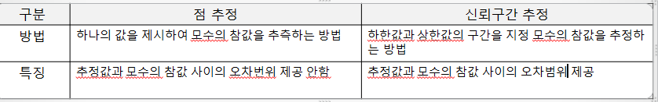
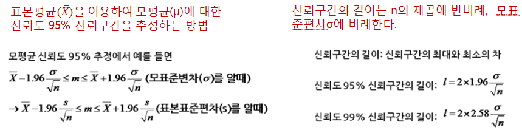
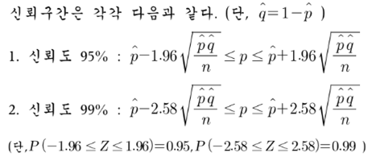
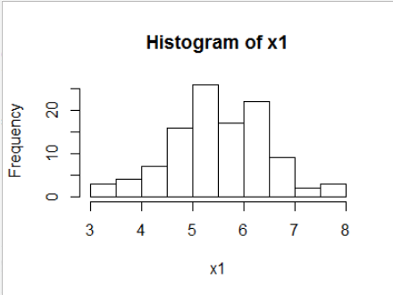
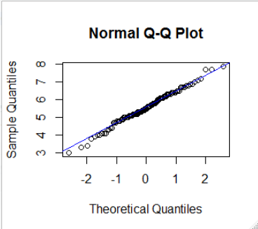
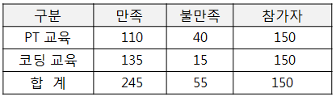
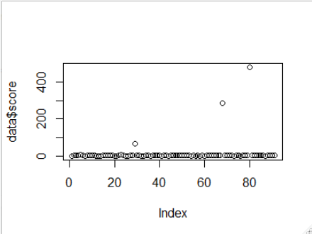
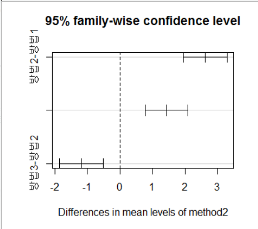

## 추론과 검정

### 추론 통계 분석

>  모집단으로부터 추출된 표본으로부터 모수와 관련된 통계량(statistics)들의 값을 계산하고, 이것을 이용하여 모집단의 특성(모수)을 알아내는 과정

- 모집단으로부터 추출한 표본으로부터 얻은 정보를 이용하여 모집단의 특성을 나타내는 값을 확률적으로 추측하는 추정(estimation)
- 유의수준과 표본의 검정 통계량을 비교하여 통계적 가설의 진위를 입증하는 <u>가설 검정(hypotheses testing)</u>


- 점추정   

> 하나의 값을 제시하여 모두의 참값을 추측

- 구간추정   

>  하한값과 상한값의 신뢰구간을 지정하여 모수의 참값을 추정하는 방식

 

- 점 추정은 하나의 값과 표본에 의한 검정 통계량을 직접 비교하여 일치하면 귀무가설이 기각되지만, 일치하지 않으면 귀무가설이 채택된다.  - 점 추정 방식에 의한 가설 검정은 귀무가설의 기각률이 낮다고 볼 수 있다 또한 검정 통계량과 모수의 참값 사이의 오차범위를 확인 할 수 없다

- 구간 추정 방식으로 가설을 검정할 경우 오차범위에 의해서 결정된 하한값과 상한값의 신뢰구간과 검정 통계량을 비교하여 가설을 검정 – 추론 통계 분석에서는 구간 추정 방식을 더 많이 이용, 오차범위는 모표준편차가 알려지지 않은 경우 표본의 표준편차(S)를 이용하여 추정한다


#### 표본의 통계량으로 모집단의 평균구간추정

>  모집단으로부터 추출된 표본으로부터 모수와 관련된 통계량(statistics)들의 값을 계산하고, 이것을 이용하여 모집단의 특성(모수)을 알아내는 과정


- 우리나라 전체 중학교 2학년 남학생의 평균 키를 알아보기 위해서 중학교 2학년 남학생 10,000명 대상으로 키를 조사한 결과  표본평균 (X ̅)은 165.1cm이고 표본 표준편차(S)는 2cm 였다.

  - 전체표본크기 (N) : 10,000명
  -  표본평균 (X ̅) : 165.1cm
  -  표본 표준편차(S) : 2cm

  
  - 모표준편차 σ의 값이 알려지지 않았을 때는 표본의 크기인 n이 충분히 클때 (n ≥ 30)에는 표존 표준편차 S을 사용한다.

  ```R
  > N<-10000
  > x<-165.1
  > S<-2
  
  > low <- x-1.96 * S/sqrt(N) #신뢰구간의 하한값값
  > high <- x+1.96 * S/sqrt(N) #신뢰구간의 상한값
  
  > low;high
  [1] 165.0608
  [1] 165.1392
  ```

  - <u>신뢰구간 165.0608 ~ 165.1392에 평균 165.1이 포함되어 있다.</u>

    

  - 신뢰구간으로 표본 오차 구하기

    - 하한값 - 평균신장, 상한값 - 평균신장 값을 백분율로 적용

    - low - X high -X *100

      ```R
      > (low-x)*100; (high-x)*100
      [1] -3.92
      [1] 3.92
      ```

    

  - **해석 :** 우리나라 중학교 2학년 남학생의 평균 신장이 95 % 신뢰수준에서 표본오차는 +- 3.92 범위에서 평균 165.1cm로 조사되었다면 실제 평균 키는 165.0608 ~ 165.1392 사이에 있다.


### 비율 구간 추정

- 모 비율의 구간 추정  
  - 모비율(p) : 모집단에서 어떤 사건에 대한 비율  
    - 예) 제품의 불량율, 대선 후보 지지율 
  - 모비율 추정 : 모집단으로부터 임의추출한 표본에서 어떤 사건에 대한 비율인 표본비율(p ̂)을 이용하여 모비율을 추정
- 
- A반도체 회사의 사원을 대상으로 임의 추출한 150명을 조사한 결과 90명이 여자 사원이다

```R
##########표본의 비율로부터 모집단의 비율 구간 추정   ###################

> #표본 크기(n) : 150 
> n <- 150

> # 표본비율(????)  : 90/150 = 0.6
> p <- 90/150

> # 전체 여자 사원 비율 (모비율) 
> p-1.96 * sqrt(p*(1-p)/n)
[1] 0.5216
> p+1.96 * sqrt(p*(1-p)/n)
[1] 0.6784

> #모집단의 비율 구간은 다음과 같습니다.  
> 0.596864 ≤ 모비율(P) ≤ 0.603136
```

### 단일집단 검정

> 한 개의 집단과 기존 집단과의 비율 차이 검정은 기술 통계량으로 **빈도수에 대한 비율**에 의미가 있으며, 평균 차이 검정은 **표본 평균**에 의미가 있다.

#### 단일집단비율 검정 

> 단일 집단의 비율이 어떤 특정한 값과 같은지를 검정하는 방법

- 데이터 전처리 (이상치와 결측치 제거) -> 기술통계량(빈도분석) -> **binom.test()** -> 검정통계량 분석
- <u>비율 차이 검정 통계량</u>을 바탕으로 귀무가설의 기각 여부를 결정한다

#### 단일 집단 비율 검정 실습

2016년도 114 전화번호 안내고객을 대상으로 불만을 갖는 고객은 20%였다. 이를 개선하기 위해서 2017년 CS 교육을 실시한 후  150명 고객을 대상으로 조사한 결과 14명이 불만을 가지고 있었다.  기존 20%보다 불만율이 낮아졌다고 할 수 있는가?.

```R
> ##################단일 집단 비율 검정 실습###################
> data <- read.csv("./data/one_sample.csv", header=TRUE)
> head(data)
  no gender survey time
1  1      2      1  5.1
2  2      2      0  5.2
3  3      2      1  4.7
4  4      2      1  4.8
5  5      2      1  5.0
6  6      2      1  5.4

> str(data)   
'data.frame':	150 obs. of  4 variables:
 $ no    : int  1 2 3 4 5 6 7 8 9 10 ...
 $ gender: int  2 2 2 2 2 2 2 2 2 1 ...
 $ survey: int  1 0 1 1 1 1 1 1 0 1 ...
 $ time  : num  5.1 5.2 4.7 4.8 5 5.4 NA 5 4.4 4.9 ...

> #변수 : 번호, 성별, 만족도(명목척도), 시간
> x<-data$survey

> summary(x) 
   Min. 1st Qu.  Median    Mean 3rd Qu.    Max. 
 0.0000  1.0000  1.0000  0.9067  1.0000  1.0000 

> length(x)   #결측치 확인
[1] 150

> table(x)   #0:불만족, 1:만족
x
  0   1 
 14 136 

> library(prettyR)

> freq(x)   #결측치 확인

Frequencies for x 
        1    0   NA
      136   14    0
%    90.7  9.3    0 
%!NA 90.7  9.3 

> #만족도(명목척도)의 비율을 바탕으로 binom.test() 이항분포 양측검정 수행 -> 검정 통계량 -> 가설 검정
> binom.test(c(136, 14), p=0.8)

	Exact binomial test

data:  c(136, 14)
number of successes = 136, number of trials =
150, p-value = 0.0006735
alternative hypothesis: true probability of success is not equal to 0.8
95 percent confidence interval:
 0.8483615 0.9480298
sample estimates:
probability of success 
             0.9066667 

> binom.test(c(136, 14), p=0.8,  alternative="two.sided", conf.level=0.95)

	Exact binomial test

data:  c(136, 14)
number of successes = 136, number of trials =
150, p-value = 0.0006735
alternative hypothesis: true probability of success is not equal to 0.8
95 percent confidence interval:
 0.8483615 0.9480298
sample estimates:
probability of success 
             0.9066667 

> #방향성을 갖는 단측 검정 수행 (더 큰 비율인가? 검정)
> binom.test(c(136, 14), p=0.8,  alternative="greater", conf.level=0.95)

	Exact binomial test

data:  c(136, 14)
number of successes = 136, number of trials =
150, p-value = 0.0003179
alternative hypothesis: true probability of success is greater than 0.8
95 percent confidence interval:
 0.8579426 1.0000000
sample estimates:
probability of success 
             0.9066667 
```

**해석 : p-value 유의확률 0.0003179로 유의수준 0.05보다 작기 때문에 기존 만족률 80%  이상의 효과를 얻을 수 있다. CS 교육후에 고객의 불만율은 낮아졌다고 할 수 있습니다. 귀무가설은 기각이고 연구가설이 채택되므로 CS교육에 효과가 있다.**


```R
> #불만율 기준 비율 검정
> binom.test(c(14, 136), p=0.2)

	Exact binomial test

data:  c(14, 136)
number of successes = 14, number of trials =
150, p-value = 0.0006735
alternative hypothesis: true probability of success is not equal to 0.2
95 percent confidence interval:
 0.05197017 0.15163853
sample estimates:
probability of success 
            0.09333333 

> binom.test(c(14, 136), p=0.2,  alternative="two.sided", conf.level=0.95)

	Exact binomial test

data:  c(14, 136)
number of successes = 14, number of trials = 150, p-value = 0.0006735
alternative hypothesis: true probability of success is not equal to 0.2
95 percent confidence interval:
 0.05197017 0.15163853
sample estimates:
probability of success 
            0.09333333 
```

**해석 : p-value 유의확률 0.0006735로 유의수준 0.05보다 작기 때문에 기존 불만족률(20%)과 차이가 있다**


```R
> binom.test(c(14, 136), p=0.2,  alternative="less", conf.level=0.95)

	Exact binomial test

data:  c(14, 136)
number of successes = 14, number of trials = 150, p-value = 0.0003179
alternative hypothesis: true probability of success is less than 0.2
95 percent confidence interval:
 0.0000000 0.1420574
sample estimates:
probability of success 
            0.09333333 
```

**해석 : p-value 유의확률 0.0003179로 유의수준 0.05보다 작기 때문에 기존 불만족률 20% 보다 낮다**  

#### 단일집단평균 검정

>  단일집단의 평균이 어떤 특정한 집단의 평균과 차이가 있는지를 검정하는 방법

- 데이터 전처리 (이상치와 결측치 제거) -> 기술통계량(평균) -> 정규분포( **shapiro.test()** ) -> **t.test()** 또는 **wilcox.test()**  -> 검정통계량 분석
- 모수 검정인 경우 **T검정**을 수행
- 비모수 검정인 경우 **Wilcox** 검정을 수행


#### 단일집단평균 검정 실습

국내에서 생산된 노트북 평균 사용시간이 5.2시간으로 파악된 상황에서 A회사에서 생산된 노트북 평균 사용시간과 차이가 있는지를 검정하기 위해서 A 회사 노트북 150대를 랜덤으로 선정하여 검정을 실시한다. 
국내에서 생산된 노트북 평균 사용시간이 5.2시간으로 파악된 상황에서 A회사에서 생산된 노트북 평균 사용시간과 차이가 있는지를 검정하기 위해서 A회사 노트북 150대를 랜덤으로 선정하여 검정을 실시한다

```R
> data <- read.csv("./data/one_sample.csv", header=TRUE)
> head(data)
  no gender survey time
1  1      2      1  5.1
2  2      2      0  5.2
3  3      2      1  4.7
4  4      2      1  4.8
5  5      2      1  5.0
6  6      2      1  5.4
> str(data) 
'data.frame':	150 obs. of  4 variables:
 $ no    : int  1 2 3 4 5 6 7 8 9 10 ...
 $ gender: int  2 2 2 2 2 2 2 2 2 1 ...
 $ survey: int  1 0 1 1 1 1 1 1 0 1 ...
 $ time  : num  5.1 5.2 4.7 4.8 5 5.4 NA 5 4.4 4.9 ...

> x<-data$time

> summary(x)  #결측치 확인
   Min. 1st Qu.  Median    Mean 3rd Qu.    Max. 
  3.000   5.000   5.500   5.557   6.200   7.900 
   NA's 
     41 

> length(x)   
[1] 150

> mean(x, na.rm=T)  #NA 제외 평균  
[1] 5.556881

> x1 <- na.omit(x)  #NA 제외 평균 

> mean(x1) 
[1] 5.556881

> #정규분포 검정
> shapiro.test(x1)  

	Shapiro-Wilk normality test

data:  x1
W = 0.99137, p-value = 0.7242
```

**해석 : 검정 통계량 p-value 값은 0.7242 로 유의수준 0.05보다 크기 때문에 x1 객체의 데이터 분포는 정규분포를 따른다고 할 수 있다**



```R
#stats패키지에서 정규성 검정 - qqnorm(), qqline()는 정규분포 시각화
> library(stats)
> qqnorm(x1)
> qqline(x1, lty=1, col='blue')
```



모수 검정 :T-검정 

```R
> # 모수 검정 :T-검정 
> t.test(x1, mu=5.2)  #x1객체와 기존 모집단의 평균 5.2시간 비교

	One Sample t-test

data:  x1
t = 3.9461, df = 108, p-value = 0.0001417
alternative hypothesis: true mean is not equal to 5.2
95 percent confidence interval:
 5.377613 5.736148
sample estimates:
mean of x 
 5.556881 

> t.test(x1, mu=5.2, alter="two.side", conf.level=0.95)

	One Sample t-test

data:  x1
t = 3.9461, df = 108, p-value = 0.0001417
alternative hypothesis: true mean is not equal to 5.2
95 percent confidence interval:
 5.377613 5.736148
sample estimates:
mean of x 
 5.556881 
```

**해석 :** 검정 통계량 p-value 값은 0.0001417 로 유의수준 0.05보다 작기 때문에 
귀무가설 : 차이가 없다  0.05보다 크면 채택, 0.05보다 작으면 기각
<u>연구가설 : 차이가 있다</u> 

**국내에서 생산된 노트북 평균 사용시간과  A회사에서 생산된 노트북의 평균 사용시간의 차이가 있다**
x1의 평균은 5.55688(점추정)는 신뢰구간에 포함되고 A회사에서 생산된 노트북의 평균 사용시간 5.2는 신뢰구간을 벗어나므로 귀무가설이 기각된다 
(신뢰구간은 귀무가설의 채택역의 의미가 있으므로)


방향성을 갖는 단측 검정

```R
> #방향성을 갖는 단측 검정
> t.test(x1, mu=5.2, alter="greater", conf.level=0.95)

	One Sample t-test

data:  x1
t = 3.9461, df = 108, p-value = 7.083e-05
alternative hypothesis: true mean is greater than 5.2
95 percent confidence interval:
 5.406833      Inf
sample estimates:
mean of x 
 5.556881 
```

연구가설 : '국내에서 생산된 노트북 평균 사용시간이  A회사에서 생산된 노트북의 평균 사용시간보다 더 길다'
**해석 : 검정 통계량 p-value 값은 7.083e-6로 유의수준 0.05보다 매우 작기 때문에** 
**귀무가설 :'A회사에서 생산된 노트북의 평균 사용시간이 국내에서 생산된 노트북 평균 사용시간보다 더 길다'고 할 수 있다.**


귀무가설 임계값 계산 qt(p-value, df)

귀무가설을 기각할 수 있는 *임계값  qt(7.083e-6, 108)* 계산 결과는 **-3.946073 (임계값은 절대값)**
<u>임계값 3.946073 이상이면 귀무가설을 기각</u>할 수 있다
**t 검정 통계량 3.9461**이므로 귀무가설을 기각할 수 있다


### 두 집단 검정

- 데이터 전처리 -> 두 집단 **subset** 생성  -> **prop.test()** -> 검정통계량 분석
- <u>단일표본</u> 이항분포 비율검정은 **binom.test()** 를 이용
- <u>독립표본</u> 이항분포 비율검정은 **prop.test()**를 이용
- 비율 차이 검정 통계량을 바탕으로 귀무가설의 기각 여부를 결정


`IT 교육센터에서 PT를 이용한 프리젠테이션 교육방법과 실시간 코딩 교육방법을 적용하여 교육을 실시하였다. 2시간 교육방법 중 더 효과적인 교육방법을 조사하기 위해서 교육생 300명을 대상으로 설문을 실시하였다. `




#### 두 집단 비율 차이 검정

- 명목 척도의 비율을 바탕으로 prop.test() 함수를 이용하여 두 집단 간 이항분포의 양측 검정을 토해서 검정 통계량을 구한 후 이를 이용하여 가설을 검정한다.
- `prop.test(x, n, p = NULL, alternative = c(“two.sided”, “less”, “greater”),conf.level=0.95, correct=TRUE)`

```R
> data <- read.csv("./data	/Part-3/two_sample.csv", header=TRUE)
> head(data)
  no gender method survey score
1  1      1      1      1   5.1
2  2      1      1      0   5.2
3  3      1      1      1   4.7
4  4      2      1      0   4.8
5  5      1      1      1   5.0
6  6      1      1      1   5.4

> str(data) #method교육방법 , 관측치
'data.frame':	300 obs. of  5 variables:
 $ no    : int  1 2 3 4 5 6 7 8 9 10 ...
 $ gender: int  1 1 1 2 1 1 2 1 1 1 ...
 $ method: int  1 1 1 1 1 1 1 1 1 1 ...
 $ survey: int  1 0 1 0 1 1 0 1 1 0 ...
 $ score : num  5.1 5.2 4.7 4.8 5 5.4 NA 5 4.4 4.9 ...

> x<- data$method
> y<- data$survey
> length(x)   # NA 없음
[1] 300
> length(y)   # NA 없음
[1] 300

> table(x)
x
  1   2 
150 150 

> table(y)
y
  0   1 
 55 245 

> #교차 분석을 위한 분할표 생성
> table(x, y, useNA="ifany")   #결측치까지 출력(useNA="ifany")
   y
x     0   1
  1  40 110
  2  15 135

> #두 집단의 만족도 차이 비율 검정
> #prop.test ('pt교육 만족도와 코딩교육 만족도', '교육방법에 대한 변량-시행횟수')
> prop.test(c(110, 135), c(150, 150))

	2-sample test for equality of proportions with
	continuity correction

data:  c(110, 135) out of c(150, 150)
X-squared = 12.824, df = 1, p-value = 0.0003422
alternative hypothesis: two.sided
95 percent confidence interval:
 -0.25884941 -0.07448392
sample estimates:
   prop 1    prop 2 
0.7333333 0.9000000 

> prop.test(c(110, 135), c(150, 150), alter="two.sided", conf.level=0.95)

	2-sample test for equality of proportions with
	continuity correction

data:  c(110, 135) out of c(150, 150)
X-squared = 12.824, df = 1, p-value = 0.0003422
alternative hypothesis: two.sided
95 percent confidence interval:
 -0.25884941 -0.07448392
sample estimates:
   prop 1    prop 2 
0.7333333 0.9000000 
```

**해석 : 검정 통계량 p-value 값은 0.0003422로 유의수준 0.05보다 작기 때문에 두 교육방법 간의 만족도에 차이가 있다 (연구가설 채택)**
**검정 통계량 X-squared로 가설 검정을 수행하면 df 1일때 기각역은 3.84이고 X-squared 12.82..가 더 크기 때문에 귀무가설을 기각할 수 있다**


#### 두 집단 평균 검정(독립표본 T검정)

> 두 집단을 대상으로 평균 차이 검정을 통해서 두 집단의 평균이 같은지 또는 다른지를 검정

- 데이터 전처리 -> 두집단 subset 작성 -> <u>기술 통계량(평균)</u>  ->  동질성분포 (**var.test()**) -> **t.test() 또는 wilcox.text()** -> 검정통계량 분석


`IT 교육센터에서 PT를 이용한 프리젠테이션 교육방법과 실시간 코딩 교육방법을 적용하여 1개월동안 교육받은 교육생 각 150명을 대상으로 실기시험을  실시하였다. 집단간 실기시험의 평균에 차이가 있는가를 검정한다.`


```R
> data <- read.csv("./data/Part-3/two_sample.csv", header=TRUE)
> head(data)
  no gender method survey score
1  1      1      1      1   5.1
2  2      1      1      0   5.2
3  3      1      1      1   4.7
4  4      2      1      0   4.8
5  5      1      1      1   5.0
6  6      1      1      1   5.4
> str(data) #method교육방법 , score(점수)
'data.frame':	300 obs. of  5 variables:
 $ no    : int  1 2 3 4 5 6 7 8 9 10 ...
 $ gender: int  1 1 1 2 1 1 2 1 1 1 ...
 $ method: int  1 1 1 1 1 1 1 1 1 1 ...
 $ survey: int  1 0 1 0 1 1 0 1 1 0 ...
 $ score : num  5.1 5.2 4.7 4.8 5 5.4 NA 5 4.4 4.9 ...
> summary(data)  #score의 NA 개수 : 73개
       no             gender         method   
 Min.   :  1.00   Min.   :1.00   Min.   :1.0  
 1st Qu.: 75.75   1st Qu.:1.00   1st Qu.:1.0  
 Median :150.50   Median :1.00   Median :1.5  
 Mean   :150.50   Mean   :1.42   Mean   :1.5  
 3rd Qu.:225.25   3rd Qu.:2.00   3rd Qu.:2.0  
 Max.   :300.00   Max.   :2.00   Max.   :2.0  
                                              
     survey           score      
 Min.   :0.0000   Min.   :3.000  
 1st Qu.:1.0000   1st Qu.:5.100  
 Median :1.0000   Median :5.600  
 Mean   :0.8167   Mean   :5.685  
 3rd Qu.:1.0000   3rd Qu.:6.300  
 Max.   :1.0000   Max.   :8.000  
                  NA's   :73     
> # 두 집단 subset 생성 
> result <- subset(data, !is.na(score), c(method, score)) #조건과 select할 변수
> result
    method score
1        1   5.1
2        1   5.2
3        1   4.7
4        1   4.8
5        1   5.0
6        1   5.4
8        1   5.0
9        1   4.4
10       1   4.9
12       1   5.2
14       1   4.3
15       1   5.8
16       1   5.7
18       1   5.1
19       1   5.3
..생략

> length(result)
[1] 2

> a <- subset(result, method==1)
> b <- subset(result, method==2)
> ascore <- a$score
> bscore <- b$score

> #기술통계량(평균)
> length(ascore)  # 109
[1] 109
> length(bscore)  # 118
[1] 118
> mean(ascore)    # 5.556881
[1] 5.556881
> mean(bscore)    # 5.80339
[1] 5.80339

> #분산의 동질성 검정 
> var.test(ascore, bscore)

	F test to compare two variances

data:  ascore and bscore
F = 1.2158, num df = 108, denom df = 117,p-value = 0.3002
alternative hypothesis: true ratio of variances is not equal to 1
95 percent confidence interval:
 0.8394729 1.7656728
sample estimates:
ratio of variances 
          1.215768 
```

**해석 : 검정 통계량 p-value 값은 0.3002 로 유의수준 0.05보다 크기 때문에 두 집단 간의 분포 형태가 동일하다고 볼 수 있다.**


두 집단 평균 차이 검정

```R
> # 두 집단 평균 차이 검정
> t.test(ascore, bscore)

	Welch Two Sample t-test

data:  ascore and bscore
t = -2.0547, df = 218.19, p-value = 0.0411
alternative hypothesis: true difference in means is not equal to 0
95 percent confidence interval:
 -0.48296687 -0.01005133
sample estimates:
mean of x mean of y 
 5.556881  5.803390 

> t.test(ascore, bscore, alter="two.sided", conf.int=TRUE, conf.level=0.95)

	Welch Two Sample t-test

data:  ascore and bscore
t = -2.0547, df = 218.19, p-value = 0.0411
alternative hypothesis: true difference in means is not equal to 0
95 percent confidence interval:
 -0.48296687 -0.01005133
sample estimates:
mean of x mean of y 
 5.556881  5.803390 

```

**해석 : 검정 통계량 p-value 값은 0.0411로 유의수준 0.05보다 작기 때문에 두 집단간의 평균에 차이가 있다**


단측 가설 검정

```R
> #단측 가설 검정 (ascore가 기준으로 비교 -> ascore보다 bscore가 더 큰지 여부)
> t.test(ascore, bscore, alter="greater", conf.int=TRUE, conf.level=0.95)

	Welch Two Sample t-test

data:  ascore and bscore
t = -2.0547, df = 218.19, p-value = 0.9794
alternative hypothesis: true difference in means is greater than 0
95 percent confidence interval:
 -0.4446915        Inf
sample estimates:
mean of x mean of y 
 5.556881  5.803390 

#해석 : 검정 통계량 p-value 값은 0.9794로 유의수준 0.05보다 크기 때문에 pt교육보다 코딩교육의 실기 점수 평균이 더 크다

> t.test(ascore, bscore, alter="less", conf.int=TRUE, conf.level=0.95)

	Welch Two Sample t-test

data:  ascore and bscore
t = -2.0547, df = 218.19, p-value = 0.02055
alternative hypothesis: true difference in means is less than 0
95 percent confidence interval:
        -Inf -0.04832672
sample estimates:
mean of x mean of y 
 5.556881  5.803390 

#해석 : 검정 통계량 p-value 값은 0.02055로 유의수준 0.05보다 작기 때문에 pt교육이 코딩교육의 실기 점수 평균이 더 낮다
```


### 동질성 검정

- 모집단에서 추출된 표본을 대사으로 분산의 동질성 검정은 stats 패키지에서 제공하는 var.test() 함수를 이용할 수 있다.

- 검정 결과가 유의수준 0.05보다 큰 경우 두 집단 간 분포의 모양이 동질하다고 할 수 있다.

- 분산의 동질성 검정은 등분산 가정과 등분산 가정되지 않음(이분산)에 따라서 결과가 달라진다.

- 등분산은 모집단에서 추출된 표본이 균등하게 추출된 경우이고, 이분산은 추출된 표본이 특정 계층으로 편중되어 추출되는 경우이다.

  ```R
  > #동질성 검정
  > var.test(x,y,paired=true)
  
  	F test to compare two variances
  
  data:  x and y
  F = 1.0718, num df = 95, denom df = 95, p-value
  = 0.7361
  alternative hypothesis: true ratio of variances is not equal to 1
  95 percent confidence interval:
   0.7151477 1.6062992
  sample estimates:
  ratio of variances 
            1.071793 
  ```

### 평균차이 검정

대응 두 집단 평균 검정(대응 표본 T검정)

- 대응 표본 평균검정(Paired Samples t-test)은 동일한 표본을 대상으로 측정된 두 변수의 평균 차이를 검정하는  분석 방법
- 일반적으로  사전검사와 사후 검사의 평균 차이를 검증할 때 많이 이용
  - 예) 교수법 프로그램을 적용하기 전 학생들의 학습력과 교수법 프로그램 적용한 후 학생들의 학습력에 차이가 있는지를 검정
- 데이터 전처리 -> 전과 후  subset 작성 -> 기술 통계량(평균)  ->  동질성분포 (var.test()) -> t.test() 또는 wilcox.text() -> 검정통계량 분석

```R
> #평균에 대한 차이 검정
> t.test(x,y,paired=TRUE,alter="two.sided",conf.int=TRUE,conf.level =0.05 )

	Paired t-test

data:  x and y
t = -13.642, df = 95, p-value < 2.2e-16
alternative hypothesis: true difference in means is not equal to 0
5 percent confidence interval:
 -1.056932 -1.047235
sample estimates:
mean of the differences 
              -1.052083 

> t.test(x,y,paired=TRUE,alter="less",conf.int=TRUE,conf.level = 0.05)

	Paired t-test

data:  x and y
t = -13.642, df = 95, p-value < 2.2e-16
alternative hypothesis: true difference in means is less than 0
5 percent confidence interval:
      -Inf -1.180182
sample estimates:
mean of the differences 
              -1.052083 
```

### 분산검정 (F 검정)

>  분산분석(ANOVA  Analysis) -  T 검정과 동일하게 평균에 의한 차이 검정 방법
>
> 두 집단 이상의 평균 차이를 검정

- 예) 의학연구 분야에서 개발된 3가지 치료제가 있다고 가정할 때, 이 3가지 치료제의 효과에 차이가 있는지를 검정
- 분산분석은 가설 검정을 위해 F 분포를 따른 F 통계량을  검정 통계량으로 사용하기 때문에 F검정이라고 한다.
- 데이터 전처리 -> 각 집단 subset 작성 -> 기술 통계량(평균)  ->  동질성분포 (barlett.test()) -> aov() 또는 **kruskal.test() -> TukeyHSD()**

- 분산분석에서 집단 간의 동질성 여부를 검정하기 위해서는 **bartlett.test()**를 이용
- 집단 간의 분포가 동질한 경우 분산분석을 수행하는  **aov()** 함수를 이용
- 비모수 검정 방법인 kruskal.test() 를 이용하여 분석을 수행하고, 마지막으로 TukeyHSD() 함수를 이용하여 사후 검정을 수행한다

```R
> ######분산분석(F검정 ) : 세 집단의 평균 차이 분석######
> data <- read.csv("./data/Part-3/three_sample.csv", header=TRUE)
> data<-subset(data,!is.na(score),c(method,score)) #결측치 제거
> length(data$score) #이상치 제거 전 데이터 개수
[1] 91

> length(data2) #이상치 제거 후  데이터 개수 
[1] 0
> mean(data$score)
[1] 14.44725

> data2<- subset(data,score<=14)
> length(data2$score) #이상치 제거 후  데이터 개수 
[1] 88

> x<-data$score
> boxplot(x)

> #교육방법에 따른 빈도수
> table(data2$method2)
< table of extent 0 >

> #교육방법에 따른 빈도수
> y<-table(data2$method2)

> #교육방법에 따른 빈도수
> mCnt<-table(data2$method2)
> mAvg<-tapply(data2$score, data2$method2, mean)

> #세 집단의 교육 방법에 따른 subset 생성
> data2$method2[data2$method==1] <- "방법1"
> data2$method2[data2$method==2] <- "방법2"
> data2$method2[data2$method==3] <- "방법3"

> #교육방법에 따른 빈도수
> mCnt<-table(data2$method2)
> mAvg<-tapply(data2$score, data2$method2, mean)

> #데이터 프레임 생성
> df<-data.frame(교수방법법=mCnt,성적=mAvg)

> #데이터 프레임 생성
> df<-data.frame(교수방법=mCnt,성적=mAvg)
> df
      교수방법.Var1 교수방법.Freq     성적
방법1         방법1            31 4.187097
방법2         방법2            27 6.800000
방법3         방법3            30 5.610000

> #세 집단의 동질성 검정
> #bartlett.test(종속변수~독립변수,data=데이터셋)
> bartlett.test(score ~ method,data=data2)

	Bartlett test of homogeneity of variances

data:  score by method
Bartlett's K-squared = 3.3157, df = 2, p-value = 0.1905
```


이상치확인

이상치확인

**해석 : 검정 통계량 p-value값은 0.1905로 유의수준 0.05보다 크기 때문에 세 집단간의 분포 형태가 동일하다.**


```R
#세 집단의 평균 차이 검정 :aov()
#aov(종속변수 ~독립변수, data=데이터 셋)
> result <- aov(score~method2,data=data2)

> names(result)
 [1] "coefficients"  "residuals"     "effects"      
 [4] "rank"          "fitted.values" "assign"       
 [7] "qr"            "df.residual"   "contrasts"    
[10] "xlevels"       "call"          "terms"        
[13] "model"        

> summary(result)
            Df Sum Sq Mean Sq F value   Pr(>F)    
method2      2  99.37   49.68   43.58 9.39e-14 ***
Residuals   85  96.90    1.14                     
---
Signif. codes:  
0 ‘***’ 0.001 ‘**’ 0.01 ‘*’ 0.05 ‘.’ 0.1 ‘ ’ 1

```

**해석 : 검정 통계량 p-value값은 9.39e-14로 유의수준 0.05보다 작아 교육방법에 따른 세 집단의 실기시험 평균의 차이가 있다.  (연구 가설 채택) F 검정 통계량 43.58은 -1.96~+1.96  범위의 귀무가설의 채택역에 해당 귀무가설을 기각 할 수 있다.(귀무가설을 기걱하고 연구가설 채택)**


TukeyHSD()

```R
> #집단간의 평균의 차에 대한 비교 => 사후검정수행
> TukeyHSD(result) #분산분석 결과로 사후 검정
  Tukey multiple comparisons of means
    95% family-wise confidence level

Fit: aov(formula = score ~ method2, data = data2)

$method2
                 diff        lwr        upr     p adj
방법2-방법1  2.612903  1.9424342  3.2833723 0.0000000
방법3-방법1  1.422903  0.7705979  2.0752085 0.0000040
방법3-방법2 -1.190000 -1.8656509 -0.5143491 0.0001911

> #diff 폭의 크기
> plot(TukeyHSD(result))
```




**결론 : 교육방법에 따른 세 집단 간의 실기시험 평균에 차이가 있으며 세 교육방법에 따른 분석 결과 방법2와 방법1의 차이가 가장 높다.**