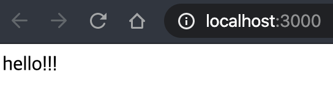
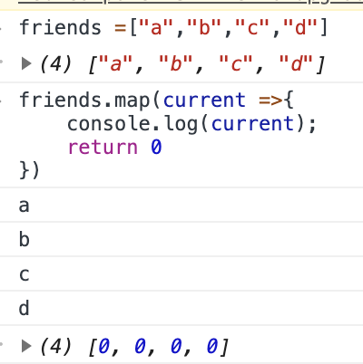
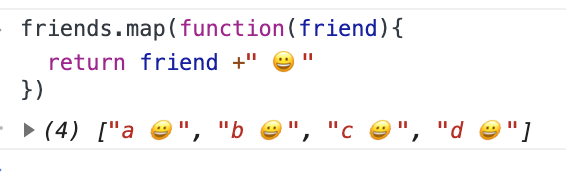
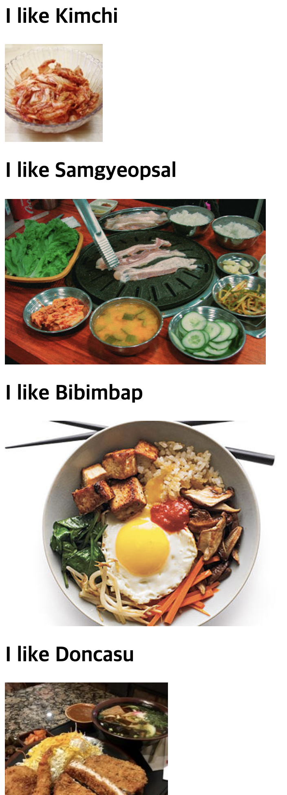

- ## React

  ### Requirements

  1. NodeJs 설치 ( + npm )
  2. NPX 설치 ( npm install npx -g )
  

  
### 프론트엔드 라이브러리 ?

  페이스북이 만든 라이브러리

  더 높은 유지보수성,

Angular 다양한 기능 내장되어 있음, 


### 시작

1. 앱 만들기
  
     ```
     npx create-react-app movie_app_2010
     ```
  
  2. 실행

   ​	`npm start`

   

   

### React가 동작하는 방식

  


- index.html에 hello!!!를 입력하지 않았는데 출력되었다.
  
  App.js에서 App에서 입력한 div를 index.js가 html사이에 넣는다 !
  
  
  
  소스코드에 html을 넣지 않고도 html을 추가하거나 제거해주니까 이로써 react가 빠르게 된다.


  - app.js
    ```react
    import React from 'react';
    ```


    function App() {
    return  <div>hello!!!</div>;
        }
    
    export default App;
     ```
  - index.html
  
    ```html
    <!DOCTYPE html>
    <html lang="en">
      <head>
        <meta charset="utf-8" />
        <link rel="icon" href="%PUBLIC_URL%/favicon.ico" />
        <meta name="viewport" content="width=device-width, initial-scale=1" />
        <meta name="theme-color" content="#000000" />
        <meta
          name="description"
          content="Web site created using create-react-app"
        />
        <link rel="apple-touch-icon" href="%PUBLIC_URL%/logo192.png" />
        <!--
          manifest.json provides metadata used when your web app is installed on a
        user's mobile device or desktop. See https://developers.google.com/web/fundamentals/web-app-manifest/
        -->
      <link rel="manifest" href="%PUBLIC_URL%/manifest.json" />
        <!--
        Notice the use of %PUBLIC_URL% in the tags above.
          It will be replaced with the URL of the `public` folder during the build.
          Only files inside the `public` folder can be referenced from the HTML.
    
          Unlike "/favicon.ico" or "favicon.ico", "%PUBLIC_URL%/favicon.ico" will
          work correctly both with client-side routing and a non-root public URL.
          Learn how to configure a non-root public URL by running `npm run build`.
        -->
        <title>React App</title>
      </head>
      <body>
        <noscript>You need to enable JavaScript to run this app.</noscript>
        <div id="root"></div>
      <!--
          This HTML file is a template.
        If you open it directly in the browser, you will see an empty page.
    
        You can add webfonts, meta tags, or analytics to this file.
          The build step will place the bundled scripts into the <body> tag.
    
          To begin the development, run `npm start` or `yarn start`.
        To create a production bundle, use `npm run build` or `yarn build`.
        -->
    </body>
    </html>
    
    ```

    

  - Index.js
  
    ```react
    import React from 'react';
    import ReactDOM from "react-dom";
    import App from "./App"
    
    
    ReactDOM.render(<App />, document.getElementById('root'));
    ```

  


#### JS - Map

-  array의 각 item에서 function을 실행하는 array를 가지는 javascript function이며 function의 result를 갖는 array를 반환



- 끝에마다 문자열 추가하기

  


- ```java
  import React from 'react';
  
  
  // props -> object -> fav
  function Food({name,image}){
    
  
    // object는 component로 전달된 모든 prop들
    return (
    
      <div> 
        <h1> I like {name}</h1>
        
      </div>
    );
  }
  
  
  const foodILike = [
    {
      name: "Kimchi",
      image:
        "http://aeriskitchen.com/wp-content/uploads/2008/09/kimchi_bokkeumbap_02-.jpg"
    },
    {
      name: "Samgyeopsal",
      image:
        "https://3.bp.blogspot.com/-hKwIBxIVcQw/WfsewX3fhJI/AAAAAAAAALk/yHxnxFXcfx4ZKSfHS_RQNKjw3bAC03AnACLcBGAs/s400/DSC07624.jpg"
    },
    {
      name: "Bibimbap",
      image:
        "http://cdn-image.myrecipes.com/sites/default/files/styles/4_3_horizontal_-_1200x900/public/image/recipes/ck/12/03/bibimbop-ck-x.jpg?itok=RoXlp6Xb"
    },
    {
      name: "Doncasu",
      image:
        "https://s3-media3.fl.yelpcdn.com/bphoto/7F9eTTQ_yxaWIRytAu5feA/ls.jpg"
    },
    {
      name: "Kimbap",
      image:
        "http://cdn2.koreanbapsang.com/wp-content/uploads/2012/05/DSC_1238r-e1454170512295.jpg"
    }
  ];
  
  // JS - Map
  // array의 각 item에서 function을 실행하는 array를 가지는 javascript function이며
  // function의 result를 갖는 array를 반환
  
  
  
  
  function App() {
    return  (
    <div>
      {/* Food Component에 kimchi라는 value로 prop name을 줌 */}
      {/* prop ; property */}
  
      {/* string, boolean, array로 정보를 보낼 수 있다. */}
      {/* dish는 object!! */}
      {foodILike.map(dish => ( 
        <Food name={dish.name} image={dish.image}/>
        ))}
    </div>
    );
   }
  
  export default App;
  
  
  // 1.  component는 HTML을 반환하는 함수
  // javascript와 HTML사이의 조합을 jsx라고 한다.
  
  
  // 2. component에 정보를 보낼 수 있다.
  //     children parent개념
  ```

  

- 적용 결과

  


- `npm i prop-types` 설치

  > 내가 전달받은 props가 내가 원하는 props인지 확인하는 도구

  

  ```java
  import React from 'react';
  import PropTypes from "prop-types"
  
  const foodILike = [
    {
      id:1,
      name: "Kimchi",
      image:
        "http://aeriskitchen.com/wp-content/uploads/2008/09/kimchi_bokkeumbap_02-.jpg",
      rating:8
      },
    {
      id:2,
      name: "Samgyeopsal",
      image:
        "https://3.bp.blogspot.com/-hKwIBxIVcQw/WfsewX3fhJI/AAAAAAAAALk/yHxnxFXcfx4ZKSfHS_RQNKjw3bAC03AnACLcBGAs/s400/DSC07624.jpg",
        rating:8.5
    },
    {
      id:3,
      name: "Bibimbap",
      image:
        "http://cdn-image.myrecipes.com/sites/default/files/styles/4_3_horizontal_-_1200x900/public/image/recipes/ck/12/03/bibimbop-ck-x.jpg?itok=RoXlp6Xb",
        rating:5.7
    },
    {
      id:4,
      name: "Doncasu",
      image:
        "https://s3-media3.fl.yelpcdn.com/bphoto/7F9eTTQ_yxaWIRytAu5feA/ls.jpg",
        rating:2.3
    },
    {
      id:5,
      name: "Kimbap",
      image:
        "http://cdn2.koreanbapsang.com/wp-content/uploads/2012/05/DSC_1238r-e1454170512295.jpg",
        rating:5.3
  
    }
  ];
  
  
  // props -> object -> fav
  function Food({name,image,rating}){
    
  
    // object는 component로 전달된 모든 prop들
    return (
    
      <div> 
        <h1> I like {name}</h1>
        <h4>{rating}/10.0</h4>
        
  
      </div>
    );
  }
  
  
  
  
  // JS - Map
  // array의 각 item에서 function을 실행하는 array를 가지는 javascript function이며
  // function의 result를 갖는 array를 반환
  
  
  Food.propTypes ={
    name : PropTypes.string.isRequired,
    image : PropTypes.string.isRequired,
    rating: PropTypes.number.isRequired
  
  
  }; 
  
  function App() {
    return  (
    <div>
      {/* Food Component에 kimchi라는 value로 prop name을 줌 */}
      {/* prop ; property */}
  
      {/* string, boolean, array로 정보를 보낼 수 있다. */}
      {/* dish는 object!! */}
      {foodILike.map(dish => ( 
        <Food 
          key={dish.id} 
          name={dish.name} 
          image={dish.image} 
          rating={dish.rating}/>
        ))}
    </div>
    );
   }
  
  export default App;
  
  
  // 1.  component는 HTML을 반환하는 함수
  // javascript와 HTML사이의 조합을 jsx라고 한다.
  
  
  // 2. component에 정보를 보낼 수 있다.
  //     children parent개념
  ```

  


### function component & class component

function component는 무언가를 return 하고
class component는 react component로부터 확장하고 스크린에 표시

자동적으로 render메서드를 실행함.

class component를 사용하는 이유는 state가 있기 때문, 
state는 객체, 변하는 데이터

```react
import React from 'react';
import PropTypes from "prop-types"


class App extends React.Component{
  state = {
    count : 0
  }


  add = () =>{
    console.log("add")
    
    //this.state.count= 1;
    //이렇게 하면 render메서드에서 반영하지 않음
    
    //this.setState.count=({count:1}) 
    //state는 object! 새로운 state를 받아야함
    //setsState를 호출하면 state를 리프레쉬하고 render function을 호출함
    
    //위의 state에 의존하지 않는 방법!
    //this.setState(current=>({count:current.count+1}));
    
  }
  minus = () =>{
    console.log("minus")
  };
  render(){
    // return <h1> im a class component</h1 >;
    return(
      <div>
        {/* render에서 count를 사용하는 방법 */}
        <h1> The number is : {this.state.count}</h1 > 
        <button onClick={this.add}>Add</button>
        <button onClick={this.minus}>Minus</button>
      </div>
    )
  }
}

export default App;


```


### React Components

- 컴포넌트들은 독립적이며 재사용 가능하다. 
  - 자바스크립트의 function과 같은 목적을 두지만, 독립적으로 실행되고 render() 기능을 통해 HTML로 리턴됨
  - 2개의 타입
    - Class components, 
    - Function components.
  
  #### Class components 생성
  
  - 첫글자는 무조건 대문자로 
  
  - `extends React.Component` 을 꼭 붙여줘야한다. 
  
  - `render()` 메서드가 필요하다. (HTML 로 리턴해주는 메서드임)
  
    ```react
  class Car extends React.component{
        render(){
          return <h2>Hi, I am a Car!</h2>
        }
  }
    ```
  
  Car 라는 component를 가졌고, render 메서드를 통해 `<h2>` 요소를 리턴했다.

  
  
  Car 클래스의 'root' 요소를 불러오는 코드
  
  ```react
  ReactDOM.render(<Car />, document.getElementId('root'));
  ```

  ==>  Hi, I am a Car!

  
  
  예제)

  MyName.js

  ```js
import React, {Component} from 'react';
  class MyName extends Component{
  static defaultProps ={ name : "iron man" }
  render(){
      return (
  
      <div>
        hi im  <b>{this.props.name}</b> ^^ 
      </div>
  
  ​    );
  
    }
  }
    export default MyName;
  ```
  
  App.js
  
  ```react
    import React, { Component } from "react";
    import MyName from "./myname.js";
    
    class App extends Component {
      render() {
      return <MyName />;
      }
  }
    
    export default App;
  ```
  
  

  %20React/assets/1570299813469.png)

  

  

  

  

  #### Function component 생성

  - function component 또한 HTML을 리턴하고 Class component와 유사하다

  - function component :  Car 생성

    ```react
    function Car(){
        return <h2> HI, Im also a Car!</h2>
    }
    ```
  
  - Car component 루트 요소 불러오기
  
    ```react
    ReactDOM.render(<Car />, document.getElementById('root'));
    ```


- 예제
  
  ```react
  import React from "react";
  
  const MyName = ({ name }) => {
    return <div> hi. i am {name} </div>;
  };
  
  MyName.defaultProps = {
    name: "ironman"
  };
  
  export default MyName;
  
  ```
  
  
  
  ### 비구조화 할당 문법
  
- 언제 쓰냐 ?
    - 초기 마운트 속도가 아주 미세하기 더 빠르고 불필요한 기능이 없기 때문에 메모리 사용이 적다.
    - 보여주기만 하는 용도일 때 유용.
    
    
  
  `const object = {a:1, b:2};`
  `const a = object.a; const b= object.b;`
  `const {a,b} =object;`
   a
  1
  b
  2
  
  
  
  `function sayHello ({name,age}) {
      console.log(name+ ' 의 나이는 ' +age);
  }`
  
  `sayHello({name : ' React', age: '121'})`
  
  VM666:2  React 의 나이는 121
  
  
  
  
  
  #### component Constructor (), state() 
  
  - 생성자가 만들어 질때 constructor function은 호출된다.
  
  - components의 properties를 실행하는데에 있다. 
  
  - component properties는  `state` 라는 객체 안에 있어야함
  
    
  
  - Car component에 생성자 함수를 만들고 color property를 추가함
  
    ```react
    class Car extends React.Component{
        constuctor(){
            super();
            this.state={color:"red"};
        }
        render(){
            return <h2>my car is red</h2>
        }   
    }
    ```
  
  - render fucntion 안에 color property 사용할 때
  
    ```react
    class Car extends React.Component{
        contructor() {
           super();
            this.state={color:"red"};
        }
        render(){
            return <h2> i am a {this.state.color} Car! </h2>
        }
    }
    ```
  
  ### Props 중요!
  
  - 부모 컴퍼넌트 --> props `<Chile value="value">`--> 자식 컴퍼넌트 
  
  - component properties를 다루는 방법 중의 하나
  
  - 함수의 아규먼트와 비슷하고 그것들을 컴포넌트의 attributes로 보낼 수 있다. 
  
    ```react
    class Car extends React.component{
        render(){
            return <h2> im a {this.props.color} Car!</h2>;
    
        }
    
    }
    
    reactDOM.render(<Car color="red"/>,document.getElementById('root'));
    
    ```
  
  ### Components in components
  
  ```react
  class Car extends React.component{
      render(){
          return <h2> im ironman</h2>;
      }
  }
  
  class Garage extends React.component{
      render(){
          retrun (
              <div>
                  <h1>who lives in my garage?</h1>
                  <Car />
              </div>
          );
      }
  }
  
  ReactDOM.render(<Garage />, document.getElementById('root'));
  ```
  
  

### Components in Files

- 분리된 파일들 안의 components에 insert 하기 쉽다.

- 먼저`.js`파일을 만든다

  ```javascript
  import React from 'react';
  import ReactDOM from 'react-dom';
  
  class Car extends React.Component{
  	render(){
  		return <h2> hi. im ironman </h2>;
  	}
  }
  
  export default Car;
  ```

- `.js`.파일 import 하기

  ```react
  import React from 'react';
  import ReactDOM from 'react-dom';
  import Car from './App.js';
  
  ReactDOM.render(<Car />, document.getElementId('root'));
  ```


### state

보통 동적 데이터를 다룰 때 만들어짐, 변하는 데이터, 존재하지 않는 데이터

1. react component의 내장 객체

2. component에 속한 property value 값들을 저장한 곳에 state객체가 있다.

3. state 객체가 바뀌면 component는 다시 rendering됨

   ```react
   class Car extends React.Component{
       constructor(props){
           super(props);
           this.state={brand:'Ford'};
       }
       render(){
           return (
               <div>
                   <h1> myCar</h1>
               </div>
           );
       }
   }
   ```

4. state 객체에 property를 넣고 싶은 만큼 넣을 수 있다.

   ```react
   class Car extends React.Component{
       constructor(props){
           super(props);
           this.state={
               model : 'CAD1292',
               color : 'red',
               year : 1994,
               brand:'Ford'};
       }
       render(){
           return (
               <div>
                   <h1> myCar</h1>
               </div>
           );
       }
   }
   ```

5. state 객체 사용하기

   ```react
   class Car extends React.Component{
       constructor(props){
           super(props);
           this.state={
               model : 'CAD1292',
               color : 'red',
               year : 19994,
               brand:'Ford'};
       }
       render(){
           return (
               <div>
                   <h1> my {this.state.brand}</h1>
                   <p>
                   It is a {this.state.color}
                   {this.state.model}
                   from {this.state.year}
   
                   </p>
               </div>
           );
       }
   }
   ```

6. state 객체 변경 --> `this.setState()` 다시 렌더링됨

   ```react
   class Car extends React.Component{
       constructor(props){
           super(props);
           this.state = {
               brand: "Ford",
               model: "Mustang",
               color: "red",
               year: 1964
             };
           }
       changeColor = ()=> {
           this.setState({color:"blue"});
       } //색 변환 함수
   
       render(){
           return(
               <div>
                   <h1>My {this.state.brand}</h1>
               <p>
                It is a {this.state.color}
                {this.state.model}
                from {this.state.year}.
               </p>
               
               <button type="button"
               onClick={this.changeColor}
               > changeColor</button>
               </div>
           );   
           }
   }
   ```

   

### React Lifecycle


- react가 component를 없애거나 만드는 방법
  - render 되기전에 호출되는 function들이 존재함.
- monitor & manipulate 할 수 있는 3 과정

- **Mounting, Updating, Unmounting**

#### Mounting 

- DOM <- elements  (DOM에 elements를 넣는 것)
- 4개의 내장 메서드 호출됨
  1. `constructor()`
  2. `getDerivedStateFromProps()`
  3. `render()` -> 항상 해줘야함
  4. `componentDidMount()`

##### constructor()

- Javascript에서 class를 만들 때 호출되는 것

- component가 initiate될 때, 초기의 `state` 설정할 때 호출됨

- `props` 와 함께 호출되는 메서드, 

  - `super(props)`로 항상 시작해야함

- contructor 메서드 호출 시, 항상 component를 만들어야함

  ```react
  class Header extends React.Component{
      constructor(props){
          super(props);
          this.state={favoriteColor:'Blue'};
      }
      render(){
          return(
              <h1> my favorite Color is {this.state.favoriteColor}</h1>
          )
      }
  }
  ReactDOM.render(<Header/>,document.getElementById('root'));
  ```

  

##### getDerivedStateFromProps()

- DOM 안에서 elements들이 rendering 되기 바로 직전에 호출됨

- 초기의 `props` 아래의`state` 객체를 설정

- `state`를 argument로 두고, 바뀐 `state` 를 반환함

  ```react
  class Header extends React.Component{
      constructor(props){
      super(props);
      this.state={favoriteColor : 'red'};
  }
  
  static getDerivedStateFromProps (props,state){
      return {favoriteColor : props.favcol};
  }
  
  render (){
      return(
          <h1> My favorite color is {this.state.favoriteColor}</h1>
      );
  }
  }
  
  ReactDOM.render(<Header favcol="yellow"/>,document.getElementById('root'));
  
  ```

  ====> My favorite color is yellow

##### render()

- 실제 DOM에서 HTML의 출력

  ```react
  class Header extends React.Component{
  render(){
  
      return(
          <h1> this is the content of the Header component</h1>
  
      );
  }
  
  }
  
  ReactDOM.render(<Header/>, document.getElementById('root'));
  ```

##### componentDidMount()

- component가 rendering 되었을 때 호출됨

  ```react
  class Header extends React.Component{
      constructor(props){
          super(props);
          this.state={favoritecolor : 'red'};
      }
  
      componentDidMount(){
          setTimeout(()=>{
              this.setState({favoritecolor:'yellow'})
          },1000)
      }
  
  
      render(){
          return (
              <h1> my favoritecolor is {this.state.favoritecolor}</h1>
          )
      }
  }
  
  ReactDOM.render(<Header/>,document.getElementById('root'));
  ```

#### Updating

- component가 업데이트 될 때의 단계
- component의 `state` 또는 `props`에 변경이 있을 때 항상 업데이트 된다
- component가 업데이트 될 때 불러지는 5가지 내장 메서드
  - `getDerivedStateFromProps()`
  - `shouldComponentUpdate()`
  - `render()`
  - `getSnapshotBeforeUpdate()`
  - `componentDidUpdate()`

##### getDerivedStateFromProps

```react
class Header extends React.Component{
    constructor(props){
        super(props);
        this.state={favoriteColor:"red"};
        }

        static getDerivedStateFromProps (props,state){
            return {favoriteColor : props.favcol};
        }

        changeColor=()=>{
            this.setState({favoriteColor :"blue"})
        }

        render(){
            return(
                <div>
<h1> my fav color is {this.state.favoriteColor}</h1>
<button type="button" onClick={this.changeColor}>changeColor</button>

                </div>
            );
        }
    }
```

##### shouldComponentUpdate

- react가 rendering을 계속 할 것이냐 말 것이냐에 대한 boolean 값을 리턴

- dafault 값은true

  

- false 값을 리턴했을 때의 예시

  ```react
  class Header extends React.Component {
      constructor(props){
          super(props);
          this.state={favoritecolor:"red"};
      }
  
      shouldComponentUpdate(){
          return false;
      }
  
      changeColor = () =>{
          this.setState({favoritecolor:"blue"});
      }
  
      render(){
          return(
              <div>
                  <h1>my favorite color is {this.state.favoritecolor}</h1>
                  <button type="button" onClick={this.state.changeColor}> Change Color</button>
              </div>
          );
      }
  }
  ReactDOM.render(<Header />, document.getElementById('root'));
  ```

  ==> my favorite color is red 에서 버튼을 눌러도 변하지 않음

##### getSnapshotBeforeUpdate()

- update 전에 `props` 와 `state`에 접근할 수 있음.

- update 후에도 가능하고 바뀌기 전 value값들을 확인할 수 있다.

- `componentDidUpdate()`메서드와 에러를 확인할 수 있다.

  ```react
  class Header extends React.Component{
      constructor(props){
          super(props);
          this.state={favoritecolor:"red"};
  
      }
      ComponentDidMount(){
          setTimeout( () =>{
              this.setState({favoritecolor:"blue"});
          },1000)
  
      }
  
      getSnapshotBeforeUpdate(prevProps,prevState){
          document.getElementById('div1').innerHTML=
          "Before the update, the favorite was" + prevProps.favoritecolor;
      }
  
      ComponentDidUpdate(){
          document.getElementById("div2").innerHTML=
          "The update favorite is " + this.state.favoritecolor;
      }
      render(){
          return(
              <div>
                  <h1>My favorite Color is {this.state.favoritecolor}</h1>
                  <div id ="div1"></div>
                  <div id ="div2"></div>
              </div>
          )
      }   
  }
  ```

  1. red로 렌더링 되었다(컴퍼넌트 마운팅하고 있을 때)
  2. 컴퍼넌트가 마운트되었을 때, timer가 state를 바꾸고, 1초 후 yellow로 바뀜
  3. 이 action은`update` 단계에서 이루어졌고, `getSnapshotBeforeUpdate()`메서드로 실행되었고, 비어있는 div1 엘레멘트에 메세지를 작성함
  4. `componentDidUpdate()`메서드는 div2에 메세지를 작성

##### componentDidUpdate

- component가 DOM에 업데이트 된 후 호출된다

  ```react
  class Header extends React.Component{
      constructor(props){
          super(props);
  
      this.state={favoritecolor:"red"}
      }
  
      componentDidMount(){
          setTimeout(()=>{
              this.setState({favoritecolor:"blue"})
          },1000)
  
      }
  
      componentDidUpdate(){
          document.getElementById("mydiv").innerHTML=
          "the update favorite is "+ this.state.favoritecolor;
      }
      render(){
          return(
              <div>
                  <h1> my favorite color is {this.state.favoritecolor}</h1>
                  <div id ="mydiv"></div>
              </div>
          )
      }
  }
  ```

  #### Unmounting

  - DOM에서component가 삭제 되었거나, unamount하였을 때
  - 단 하나의 내장 메서드 `componentWillUnmount() `

  ##### componentWillUnmount()

  ```react
  class Container extends React.Component{
      constructor(props){
          super(props);
          this.state ={show: true};
      }
      delHeader=()=>{
          this.setState({show:false})
      }
      render(){
          
              let myheader;
              if(this.state.show){
                  myheader=<Child />;
              };
              return(
                  <div>
                      {myheader}
                      <button type="button" onClick={this.delHeader}>DeleteHeader</button>
  
                  </div>
              );
          }
      }
  class Child extends React.Component {
    componentWillUnmount() {
      alert("The component named Header is about to be unmounted.");
    }
  	  render() {
  	    return (
      	  <h1>Hello World!</h1>
      );
    }
  }
  ```

  
