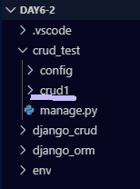

## CRUD

### 뼈대 만들기

#### 1. 가상환경 설정

1. bash 창에서 `source env/Scripts/activate` 를 입력하면 가상환경이 실행됨

2. 앱을 만들 폴더로 이동한다.

   

3. 프로젝트 만들기 

   ```bash
   HK@DESKTOP-LK161LF MINGW64 /c/day6-2/crud_test
   $ django-admin startproject config .
   (env)
   ```

4. 환경 설정 바꿔주기 config - 

   1. settings.py 언어,시간 바꿔주기

      ```
      LANGUAGE_CODE = 'ko-kr'
      
      TIME_ZONE = 'Asia/Seoul'
      ```


5. 앱 생성 (crud1) - 이후 crud1.폴더가 생성된다.

   ```bash
   HK@DESKTOP-LK161LF MINGW64 /c/day6-2/crud_test
   $ python manage.py startapp crud1
   ```
   

   1. settings.py에 추가

      ```python
      #setting.py에 앱 추가
      
      # Application definition
      
      INSTALLED_APPS = [
          'crud1',
          'django.contrib.admin',
          'django.contrib.auth',
          'django.contrib.contenttypes',
          'django.contrib.sessions',
          'django.contrib.messages',
          'django.contrib.staticfiles',
      ]
      ```

   2. urls.py

      ```python
      from django.contrib import admin
      from django.urls import path,include
      
      urlpatterns = [
          path('admin/', admin.site.urls),
          path('crud1/',include('crud1.urls'))
      ]
      ```

   

6. crud1 폴더 내에 urls.py 파일 생성하기

   ```python
   from django.urls import path
   from . import views
   
   urlpatterns = [
       path('' , views.index), #crud1/
   ]
   ```

7. view.py 파일에서 

   ```python
   from django.shortcuts import render,redirect
   from .models import Article
   
   # Create your views here.
   def index(reqests):
       return render (requests , "crud/index.html")
   ```

   

8. config 아래에 templates 폴더를 만들고 그 아래에 base.html파일을 생성한다.

   base.html

   ```html
   <!DOCTYPE html>
   <html lang="en">
   <head>
           <link rel="stylesheet" href="https://stackpath.bootstrapcdn.com/bootstrap/4.3.1/css/bootstrap.min.css" integrity="sha384-ggOyR0iXCbMQv3Xipma34MD+dH/1fQ784/j6cY/iJTQUOhcWr7x9JvoRxT2MZw1T" crossorigin="anonymous">
       <meta charset="UTF-8">
       <meta name="viewport" content="width=device-width, initial-scale=1.0">
       <meta http-equiv="X-UA-Compatible" content="ie=edge">
       <title>Document</title>
   </head>
   <body>
           
             
       <nav class="navbar navbar-light" style="background-color: #e3f2fd;">
               <a class="navbar-brand" href="#">메뉴</a>
               <button class="navbar-toggler" type="button" data-toggle="collapse" data-target="#navbarSupportedContent" aria-controls="navbarSupportedContent" aria-expanded="false" aria-label="Toggle navigation">
                   <span class="navbar-toggler-icon"></span>
               </button>
               
               <div class="collapse navbar-collapse" id="navbarSupportedContent">
                   <ul class="navbar-nav mr-auto">
                   <li class="nav-item active">
                       <a class="nav-link" href="/crud/">Home <span class="sr-only">(current)</span></a>
                   </li>
                   <li class="nav-item">
                       <a class="nav-link" href="/crud/new/">새글쓰기</a>
                   </li>
                   <li class="nav-item dropdown">
                       <a class="nav-link dropdown-toggle" href="#" id="navbarDropdown" role="button" data-toggle="dropdown" aria-haspopup="true" aria-expanded="false">
                       Dropdown
                       </a>
                       <div class="dropdown-menu" aria-labelledby="navbarDropdown">
                       <a class="dropdown-item" href="#">Action</a>
                       <a class="dropdown-item" href="#">Another action</a>
                       <div class="dropdown-divider"></div>
                       <a class="dropdown-item" href="#">Something else here</a>
                       </div>
                   </li>
                   <li class="nav-item">
                       <a class="nav-link disabled" href="#" tabindex="-1" aria-disabled="true">Disabled</a>
                   </li>
                   </ul>
                   <form class="form-inline my-2 my-lg-0">
                   <input class="form-control mr-sm-2" type="search" placeholder="Search" aria-label="Search">
                   <button class="btn btn-outline-success my-2 my-sm-0" type="submit">Search</button>
                   </form>
               </div>
       </nav>
   
       <div class="container">
           
           
       </div> 
           
   
   
       <script src="https://code.jquery.com/jquery-3.3.1.slim.min.js" integrity="sha384-q8i/X+965DzO0rT7abK41JStQIAqVgRVzpbzo5smXKp4YfRvH+8abtTE1Pi6jizo" crossorigin="anonymous"></script>
       <script src="https://cdnjs.cloudflare.com/ajax/libs/popper.js/1.14.7/umd/popper.min.js" integrity="sha384-UO2eT0CpHqdSJQ6hJty5KVphtPhzWj9WO1clHTMGa3JDZwrnQq4sF86dIHNDz0W1" crossorigin="anonymous"></script>
       <script src="https://stackpath.bootstrapcdn.com/bootstrap/4.3.1/js/bootstrap.min.js" integrity="sha384-JjSmVgyd0p3pXB1rRibZUAYoIIy6OrQ6VrjIEaFf/nJGzIxFDsf4x0xIM+B07jRM" crossorigin="anonymous"></script>    
   
   </body>
   </html>
   ```

9. templates 폴더 아래에 crud1 폴더를 생성 후 그 아래에 index.html 을 만들어 준다.

   index.html

   ```html
   <h1>
        기본페이지
   </h1>
   ```

10. templates 상속을 위해서 DIRS 요소에 내용 추가 settings.py

    ```python
    # Build paths inside the project like this: os.path.join(BASE_DIR, ...)
    BASE_DIR = os.path.dirname(os.path.dirname(os.path.abspath(__file__)))
    #현재 settings의 위치를 알려준다.
    
    TEMPLATES = [
        {
            'BACKEND': 'django.template.backends.django.DjangoTemplates',
            'DIRS': [os.path.join(BASE_DIR, 'config' , 'templates')],
            #만약 계속 폴더 만들면 계속 추가해서 이름을 넣어 주면 된다.
            
            'APP_DIRS': True,
            'OPTIONS': {
                'context_processors': [
                    'django.template.context_processors.debug',
                    'django.template.context_processors.request',
                    'django.contrib.auth.context_processors.auth',
                    'django.contrib.messages.context_processors.messages',
                ],
            },
        },
    ]
    ```

11. DB 설정 (models.py)

    ```python
    from django.db import models
    
    # Create your models here.
    class Article(models.Model):
        title = models.CharField(max_length=50)
        content = models.TextField()
        created_at = models.DateTimeField(auto_now_add=True) #추가될때 마다 현재시간으로 저장
        updated_at = models.DateTimeField(auto_now=True) #editable옵션이 False로 자동 저장된다.
    
        def __str__(self):
            return f'{self.id} {self.title}'
    ```

12. makemigrations

    ```bash
    HK@DESKTOP-LK161LF MINGW64 /c/day6-2/crud_test
    $ python manage.py makemigrations
    Migrations for 'crud1':
      crud1\migrations\0001_initial.py
        - Create model Article
    (env)
    ```

13. migrate

    ```bash
    HK@DESKTOP-LK161LF MINGW64 /c/day6-2/crud_test
    $ python manage.py migrate
    Operations to perform:
      Apply all migrations: admin, auth, contenttypes, crud1, sessions
    Running migrations:
      Applying contenttypes.0001_initial... OK
      Applying auth.0001_initial... OK
      Applying admin.0001_initial... OK
      Applying admin.0002_logentry_remove_auto_add... OK
      Applying admin.0003_logentry_add_action_flag_choices... OK
      Applying contenttypes.0002_remove_content_type_name... OK
      Applying auth.0002_alter_permission_name_max_length... OK
      Applying auth.0003_alter_user_email_max_length... OK
      Applying auth.0004_alter_user_username_opts... OK
      Applying auth.0005_alter_user_last_login_null... OK
      Applying auth.0006_require_contenttypes_0002... OK
      Applying auth.0007_alter_validators_add_error_messages... OK
      Applying auth.0008_alter_user_username_max_length... OK
      Applying auth.0009_alter_user_last_name_max_length... OK
      Applying auth.0010_alter_group_name_max_length... OK
      Applying auth.0011_update_proxy_permissions... OK
      Applying crud1.0001_initial... OK
      Applying sessions.0001_initial... OK
    (env)
    ```

14. 0001_initial.py

    ```python
    # Generated by Django 2.2.7 on 2019-11-16 14:49
    
    from django.db import migrations, models
    
    
    class Migration(migrations.Migration):
    
        initial = True
    
        dependencies = [
        ]
    
        operations = [
            migrations.CreateModel(
                name='Article',
                fields=[
                    ('id', models.AutoField(auto_created=True, primary_key=True, serialize=False, verbose_name='ID')),
                    ('title', models.CharField(max_length=50)),
                    ('content', models.TextField()),
                    ('created_at', models.DateTimeField(auto_now_add=True)),
                    ('updated_at', models.DateTimeField(auto_now=True)),
                ],
            ),
        ]
    
    ```

    

### C ( Create )

1. urls.py

   ```python
   from django.urls import path
   from . import views
   
   urlpatterns = [
       path('' , views.index), 
       path('new/', views.new),  ##### 추가 #####
       path('create/' , views.create), ##### 추가 ##### #crud/create
   ]
   ```

2. views.py

   ```python
   from django.shortcuts import render
   from .models import Article
   
   # Create your views here.
   def  index(requests) :
       return render(requests,'crud1/crud1.html')
   
   ################### 추가 ####################
   def new(requests):
       return render(requests, "crud1/new.html")    
   
   def create(request):
   
       title=request.POST.get("title")
       content = request.POST.get("content")
   
       article = Article()
   
       article.title=title
       article.content=content
       article.save()
   
       return render(request, "crud1/created.html")
   ```

   

3. new.html

   ```html
   
   
   <form action='/crud1/create/' method = 'POST'>
       
       <label for="title">기사제목</label> <!--label은 id값과 매칭이 된다.-->
       <input type="text" name="title" id="title"><br>
       <textarea name="content" cols="30" rows="5"></textarea><!--30글자의 10줄-->
       <input type= 'submit'>
   </form>
    
   ```

4. created.html

   ```html
   
   
   <h1>성공적인 입력!DB저장!</h1>
   
   ```

### R ( Read )

- index page에 제목 클릭시 해당글을 읽어 오는 실습
- index에서 모든 글 리스트를 보여주고
- 해당 글 리스트에서 제목을 클릭하면 자세한 정보를 보여줌

1. views.py

   ```python
   from django.shortcuts import render
   from .models import Article
   
   # Create your views here.
   def index(requests):
       # articles = Article.objects.all()
       #쿼리셋 형태로 전체 목록이 날아온다. 
   
       #리스트 내용을 역순으로 하는 방법 1번째 파이썬에서 정렬 하는 방법
       # articles = Article.objects.all()[::-1]
   
       #리스트 내용을 역순으로 하는 방법 2번째 , 불러올때 정렬시키는 법
       articles = Article.objects.order_by('-id')
   
       context = {
           "articles" : articles,
       }
       return render (requests , "crud1/index.html" , context)
   
   def new(requests):
       return render(requests , "crud1/new.html")
   
   #form 에서 데이터를 받아 DB에 저장하고 글작성 성공메세지 출력
   def create(request):
       title = request.POST.get("title")
       content = request.POST.get("content")
   
       #DB에 저장
       article = Article()
       
       article.title = title
       article.content = content
       article.save()
      
       return render(request, "crud/created.html")
   
   
   
   ################### 추가 ####################
   def detail(request, pk):
       article = Article.objects.get(pk=pk) #앞은 table에 저장된 pk 뒤의 pk는 입력 받은 pk
       #자동적으로 생기는 것은 id인데 왜 pk를 쓸수 있나?
       #id_exact = pk 로 등록이 되어있어 pk이용이 가능하다. 
       #만약 필터(filter)로 한다면 해당값은 쿼리셋으로 날아오기 떄문에 그 경우 for문을 사용해 주어야 한다.
   
       context = {
           "article" : article,
       }
      
       return render(request, "crud1/detail.html" , context)
   ```

   

2. index.html

   ```html
   
   
   
   <h1>Article List</h1>
   <ul>
       
       <li><a href="/crud/{{ art.pk }}/article">{{ art.title }}</li></a> <!-- 해당 pk값이 들어갈 것 이다.-->
       
   </ul>
   
   
   ```

   

### U ( Update )

- detail 페이지(내용을 볼수 있는) 에 수정하기 버튼을 만들어 수정 할 것이다.

- 특정 글만 수정하는게 목적!

- form에 해당 article의 정보를 채워둔채로 보여주기

- 수정하면 detail페이지로 돌아가 수정한 결과를 보여준다.

  

1. detail.html

   ```html
   
   
   <h1>{{ article.title}}</h1><br>
   <hr>
   {{ article.content }} <br>
   
   <a href="/crud1/{{ article.pk }}/update/">수정하기</a>
   <a href="/crud1/{{ article.pk }}/delete/">삭제하기</a>
   
   ```

   

2. urls.py

   ```python
   from django.urls import path
   from . import views
   
   urlpatterns = [
       path('' , views.index), #crud/
       path('new/', views.new),
       path('create/' , views.create), #crud/create
       path('<int:pk>/article/', views.detail), #crud/detail하게 내용 보는 페이지
       path("<int:pk>/update/", views.update), # crud/update/ 수정하는 페이지
   ]
   ```

   

3. views.py

   ```python
   from django.shortcuts import render
   from .models import Article
   
   # Create your views here.
   def  index(requests) :
       return render(requests,'crud1/crud1.html')
   
   def new(requests):
       return render(requests, "crud1/new.html")    
   
   def create(request):
   
       title=request.POST.get("title")
       content = request.POST.get("content")
   
       article = Article()
   
       article.title=title
       article.content=content
       article.save()
   
       return render(request, "crud1/created.html")
   
   def detail(request, pk):
       article = Article.objects.get(pk=pk) #앞은 table에 저장된 pk 뒤의 pk는 입력 받은 pk
       #자동적으로 생기는 것은 id인데 왜 pk를 쓸수 있나?
       #id_exact = pk 로 등록이 되어있어 pk이용이 가능하다. 
       #만약 필터(filter)로 한다면 해당값은 쿼리셋으로 날아오기 떄문에 그 경우 for문을 사용해 주어야 한다.
   
       context = {
           "article" : article,
       }
      
       return render(request, "crud1/detail.html" , context)
   
   def update(request, pk):
       article = Article.objects.get(pk=pk)
       context = {
           "article" : article,
   
       }
       return render(request , "crud1/update.html" , context)
   ```

   

4. update.html

   ```html
   
   
       <form action='/crud1/{{ article.id }}/revise/' method = 'POST'><!--기본값또한 불러와야하기 때문에 pk값을 보낼 것이다.-->
           
           <input type="text" name="title" value="{{ article.title }}" ><br>
           <textarea name="content" cols="30" rows="5">{{ article.content }}</textarea>
           <input type= 'submit'>
       </form>
   
   ```

   

5. urls.py

   ```python
   from django.urls import path
   from . import views
   
   urlpatterns = [
       path('' , views.index), #crud/
       path('new/', views.new),
       path('create/' , views.create), 
       path('<int:pk>/article/', views.detail), 
       path("<int:pk>/update/", views.update), 
       path("<int:pk>/revise/",views.revise), ####### 추가 #######
   ]
   ```

   

6. views.py

   ```python
   def revise(request, pk): #pk받아오는 방법이 url에서 id 값 받아오는 것이다~
       article = Article.objects.get(pk=pk)
   
       title = request.POST.get("title")
       content = request.POST.get("content")
   
       #새로운 내용을 본 테이블의 해당 내역에 넣어준다.
       article.title = title
       article.content = content
       article.save()
       #save되면 바뀐 값이 최종으로 된다.
   
       return redirect(f'/crud1/{article.id}/article') 
   ```

   

### D ( delete )

- 삭제해보자
- detail페이지에서 삭제하기 버튼으로 접근
- id값을 받아서 삭제 후 index페이지로 돌아간다.

1. detail.html

   ```html
   
   
   <h1>{{ article.title}}</h1><br>
   <hr>
   {{ article.content }} <br>
   
   <a href="/crud/{{ article.pk }}/update/">수정하기</a>
   <a href="/crud/{{ article.pk }}/delete/">삭제하기</a>
   
   ```

2. urls.py

   ```python
   from django.urls import path
   from . import views
   
   urlpatterns = [
       path('' , views.index), #crud/
       path('new/', views.new),
       path('create/' , views.create), #crud/create
       path('<int:pk>/article/', views.detail), #crud/detail하게 내용 보는 페이지
       path("<int:pk>/update/", views.update), # crud/update/ 수정하는 페이지
       path("<int:pk>/delete/", views.delete),
   ]
   ```

   

3. views.py

   ```python
   def delete(request, pk):
       article = Article.objects.get(pk=pk)
   
       article.delete()
   
       return redirect('/crud1') #삭제해서 뭐 받아 올 필요도 없고 하니 바로 홈으로!
   ```

   

4. 

5. 

