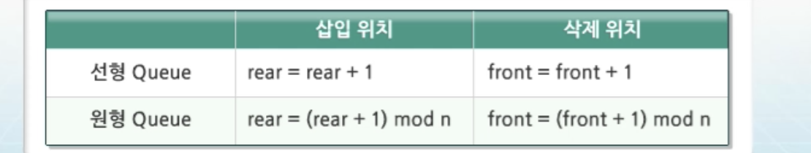
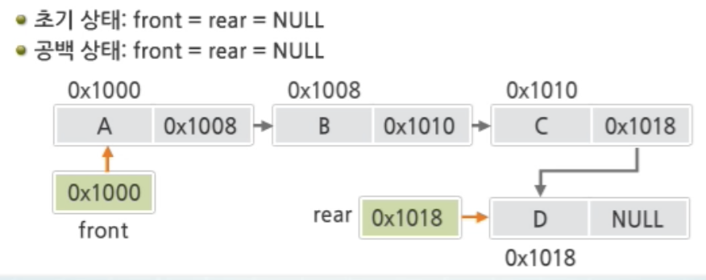
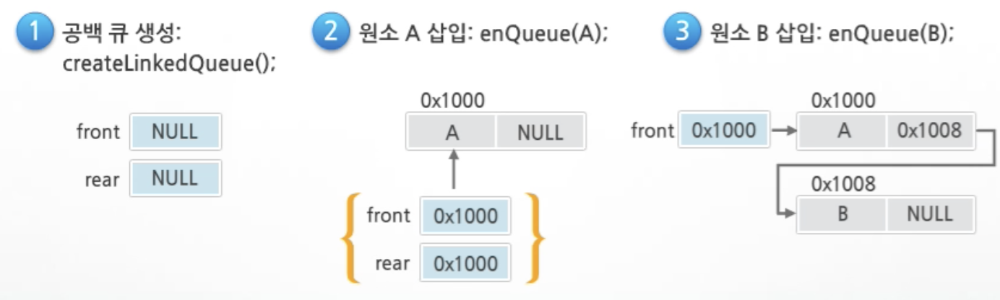
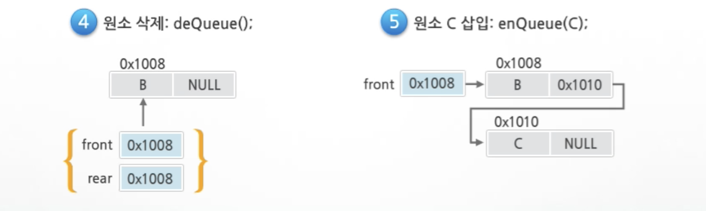
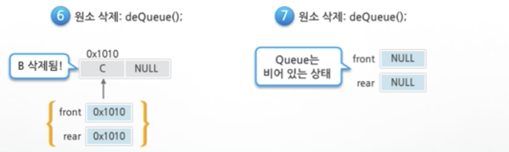
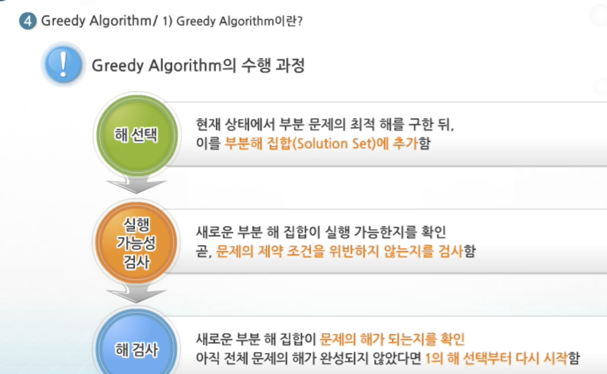
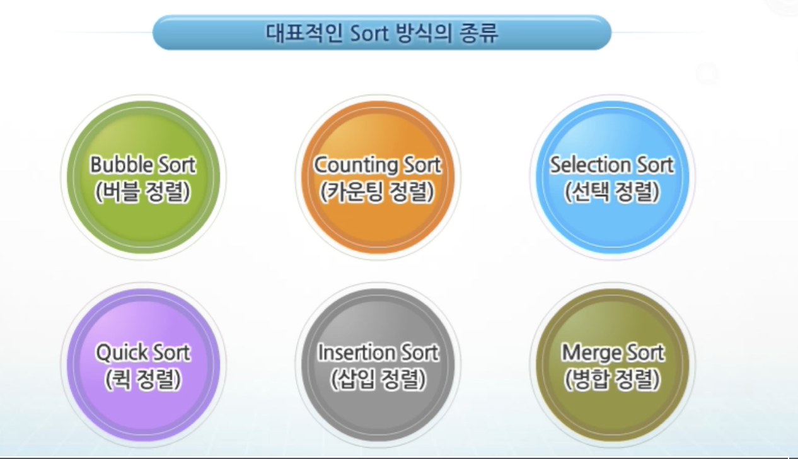
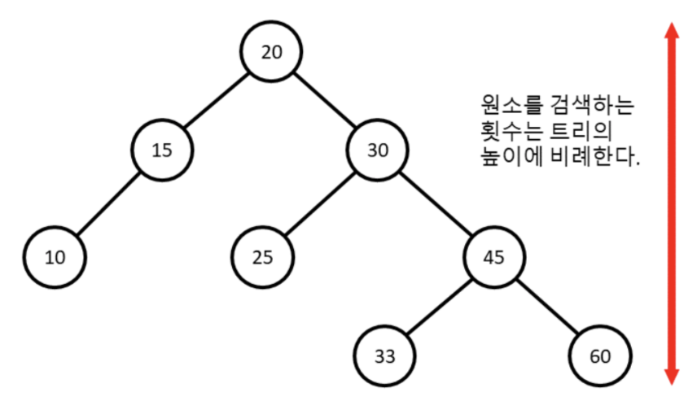

## Queue

### Queue?

- FIFO 구조
  1. 선형 큐 ( Array 이용 )
  2. 원형 큐 ( Array 이용 )
  3. 연결 큐 ( List 이용 )

### Queue의 종류

> Queue의 크기 = 배열의 크기

초기 : 저장된 원소가 없음 (front = rear = -1)

공백 :  front = rear = -1

포화 : rear = n - 1

### 선형 Queue의 구현

1. 초기 `createQueue()` 

   : front, rear = -1 로 초기화

   

2. `enQueue(item)`
   : rear값을 하나 증가시켜 새로운 원소를 삽입할 자리를 마련한다.

3. `deQueue`
   :	가장 앞에 잇는 원소를 삭제하기 위해 front값을 하나 증가시켜 남아있는 Queue의 첫째 원소로 이동함.
    	새로운 첫 원소를 리턴함으로써 삭제와 동일한 기능을 한다.

4. `isEmpty()`, `isFull()` 공백 및 포화상태 검사
   : 	공백상태 : `front = rear`
   	  포화상태 : rear = n - 1
5. `Qpeak()`
   ;	가장 앞에 있는 원소를 검색해 반환하는 연산
   	현재 front의 한자리 뒤(front + 1) 에 있는 원소를 반환 


#### 선형 Queue의 문제점

1. 삽입, 삭제를 계속하면 앞부분에 활용할 수 있는 공간이 있음에도 `rear =.n - 1` 인 상태<u>(포화상태)</u>로 인식한다.
2. 더 이상의 삽입을 수행하지 않는다.

##### 이를 방지하기 위해,

1. 매 연산시 마다 저장 원소들을 배열의 앞부분으로 모두 이동 ( 단점 : 이동 시간 소요되어 Queue의 효율성 저하 )
2. 원형 큐 사용 (배열의 처음과 끝이 연결되어 있는 구조)


### 원형 Queue

- 특징

  1. 초기 공백상태 ( `fornt = rear = 0` )

  2. Index의 순환 :  `mod사용`

  3. `front`  변수 : 공박과 포화를 구분하기 위해 `front`가 있는 자리는 사용하지 않고 항상 빈자리로 둔다.

  4. 삽입 위치 및 삭제 위치

     

#### 원형 Queue 구현

1. 초기  `createQueue()` 

   : 선형 큐오 마찬가지로 1차원 배열 생성

   ​	`front = rear = 0`

2. `isEmpty(), isFull()`

   : 공백상태 `front = rear`

   ​	포화상태 : `삽입할 rear 값의 다음 위치 = 현재 front`
   ​	`(rear + 1) mod n = front`

3. `enQueue(item)`

4. `deQueue`

   : front 값을 조정해 삭제할 자리를 준비
    새로운 `front` 원소를 리턴함으로써 삭제와 동일한 기능


### 연결 Queue

- 단순 연결 리스트(Linked List)를 이용한 Queue

  - Queue의 원소 : 단순 연결 리스트의 <u>노드</u>
  - Queue의 원소 순서 : 노드의 연결 순서, <u>링크</u>로 연결되어 있음.
  - Front : 첫번째 노드를 가리키는 링크
  - Rear  : 마지막 노드를 가리키는 링크

- 상태 표현

  - 초기상태 : `front = rear = NULL`

  - 공백상태 : `front = rear = NULL`

  - 계속해서 노드를 추가 할 수 있는 연결리스트의 특징 때문에 **포화상태가 없다.**

    


#### 연결 Queue 연산 과정

1. 공백 큐 생성 `createLinkedQueue()`

   : `front = Null, rear = Null;`

2. 원소 삽입

   

3. 원소 삭제

   

   


## Array

### Exhaustive Searh ( Brute-Force  || Generate - And - Test 기법 ) 

>  모든 경우의 수를 나열하고 확인

- 경우의 수가 상대적으로 작을 때 유리
- 수행속도 느리지만 해결 찾을 확률이 높다
- 이를 활용해 해답 도출 후, 성능 개선을 위한 다른 알고리즘을 확인하는 것이 바람직하다.


#### 순열? (nPr)

> 서로 다른 것들 중 몇 개를 뽑아 한줄로 나열하는 것

- `nPr` = `n * (n-1) *(n-2) * ... * (n-r+1)`
- `nPn` = `n!`


### Greedy Algorithm

> 최적해를 구하는 데 사용되는 근시안적인 방법

- 여러 경우중 하나를 결정해야 할 때마다 그 순간에 최적이라고 생각되는 것을 선택해 나가는 방식

- 이러한 최적값들을 계속 수집해 최종적인 해답을 만들어도 궁극적인 최적이라는 보장은 없음

- 머리속에 떠오르는 생각을 검증 없이 바로 구현하면 Greedy 접근이 됨

  


### Sort

- 종류

  

#### Bubble Sort

- 시간복잡도 : O(n^2)

#### Counting Sort

- 

</br> 

</br> 

## Tree

- **비선형** 구조, 원소들간 **1: n 의 관계**

- 원소들간에 계층관계를 가지는 계층형 자료구조

- 상위원소에서 하위원소에서 확장되는 Tree모양의 구조

- **한개 이상의 노드**로 이루어진 유한 집합

  - Root : 최상위 노드
  - Leaf  : 각각 하나의 Tree가 될 수 있다 ( 재귀적 정의 ), 루트의 **부트리(subTree)**라고함

- 구성요소

  - 노드

  - 간선

  - 차수

    : 노드에 연결된 자식 노드의 수

    - Tree의 차수

      : Tree에 있는 노드의 차수 중 가장 큰 값

    - 단말노드

      : 차수가 0인 노드, 자식노드가 없는 노드

  - 높이

    : 루트에서 노드에 이르는 간선의 수 

    - Tree의 높이

      : Tree에 있는 가장 큰 높이 값

</br> 

### Binary Tree (이진트리)

- 모든 노드들이 2개의 부트리를 갖는 형태의 Tree
- 노드가 자식 노드를 최대 2개까지만 가질 수 있는 Tree

</br> 

### Binary Search Tree (BST)

#### 특징

1. 탐색작업을 효율적으로 하기 위한 자료구조
2. 모든 원소는 서로 다른 유일한 키를 가짐
3. 왼쪽 부트리 < 루트 노드. < 오른쪽 부트리
4. 왼쪽 부트리와 오른쪽 부트리도 Binary Search Tree임 
5. 중위순회하면 오름차순으로 정렬된 결과가 나온다.

#### 탐색연산

1. 루트에서 시작

2. 탐색할 키값 x를 루트 노드의 키 값과 비교

   1. 키값 < 루트노드 

      : 왼쪽 부트리에 대해서 탐색 연산 수행

   2. 키값 > 루트노드 

      : 오른쪽 부트리에 대해서 탐색 연산 수행

3. 부트리에 대해서도 순환적으로 탐색연산 수행

</br> 

#### 삽입연산

1. 먼저 탐색 연산 수행

   같은 원소가 트리에 있으면 삽입 불가능

   탐색 실패 결정되는 위치가 삽입 위치가 된다.

2. 탐색 실패한 위치에 원소를 삽입

</br> 

#### 성능

1. 탐색, 삽입, 삭제 시간은 Tree의 높이에 좌우된다. 

   O(h), h : BST의 높이

2. 평균의 경우

   **`O(logN)`** 

3. 최악의 경우

   **`O(n)`** 

</br> 

#### 검색알고리즘 비교

1. Array에서의 순차 검색 : O(N)

2. 정렬된 Array에서의 순차 검색 : O(N)

3. 정렬된 Array에서의 이진탐색: O(logN)

   고정 Array크기와 십입, 삭제 시 추가 연산 필요

4. 이진 탐색 Tree에서의 평균 : O(logN)

5. 해쉬 검색 : O(1)

   데이터를 **저장할 추가 공간이 필요**하다.

</br> 

## Heap

Complete binary tree에 있는 노드 중에서 키 값이 **가장 큰 노드나 키 값이 가장 작은 노드를 찾기 위해서 만든 자료구조**

1. 최대힙

   키 값이 가장 큰 노드를 찾기위한 Complete Binay Tree

   부모노드의 키 값 > 자식 노드의 키 값

   루트노드 : 키 값이 가장 큰 노드

2. 최소힙

   키 값이 가장 작은 노드를 찾기위한 Complete Binay Tree

   부모노드의 키 값 < 자식 노드의 키 값

   루트노드 : 키 값이 작은 노드

</br> 

### 삭제

1. 루트노드의 원소만 삭제 가능
2. Heap의 종류에 따라 Max, Min
   + 우선순위 Queue를 구할 수 있다. 


<br/>

<br/>

## Set, Map

1. STL - map : `O(logN)`
2. STL - unordered_map : `O(1)`

3. 직접 구현 - 시험장에선 STL을 쓰자


| 시퀀스 컨테이너     | 연관 컨테이너  |
| ------------------- | -------------- |
| vector, list, deque | Key-value 구조 |

<br/>

### 0. Map VS Set

맵은 사용 메모리가 셋보다 더 크다 -> **키의 존재 유무만 궁금하다면 셋을 사용하는 것이 좋다.**

<br/>

### 1. set

1. 시퀀스 컨테이너처럼 어디에 추가할 것인지에 대한 정보는 없다.

   막 넣은것. (순서를 지키며 --> 접근부분과 연관)

2. 위치가 중요한게 아니라 **있냐 없냐에 대한 정보**가 중요하기 때문.

3. set에 접근하기 위해 **iterator 반복자**를 사용
   1. `BidirectionalIterator` : 순차적으로 접근하는 것밖에 안됨.
   2. 그렇다면 `10 30 20 50 40` 순으로 나와야 하는데 ?
   3. 이는 **<u>내부에 정렬이 된 상태로 추가</u>**되기 때문. 
   4. 내부에 **Tree 구조**로 구성이 되어있다. -> 비교적 빠르게 **O(logN)이 나올 수 있는 비결**이다.

4. 중복 원소가 없다.



```c++
#include <iostream>
#include <set>

using namespace std;
template <typename T>
void print(set<T> &s)
{
    cout << "[";

    for (typename set<T>::iterator itr = s.begin(); itr != s.end(); itr++)
    {
        cout << *itr << " ";
    }

    cout << "]" << endl;
}

int main()
{

    set<int> s;

    s.insert(10);
    s.insert(30);
    s.insert(20);
    s.insert(50);
    s.insert(40);

    cout << "순서대로 정렬되서 나온다" << endl;

    print(s);

    cout << "20이 s의 원소인가 ?";
    auto itr = s.find(20);
    if (itr != s.end())
    {
        cout << "YES" << endl;
    }
    else
    {
        cout << "NO" << endl;
    }

    return 0;
}
```

<br/> 

### 2. map

1. Set과 유사, 중복을 허락하지 않음
2. **차이점**은 ? Set의 경우 키만 보관, **map의 경우 키와 값을 보관**
3. **없는 키 값을 출력하면** default로 값이 출력되는데 이는 잘못된 정보이므로 확실하게 하려면 **`find()`함수를 활용**하자.

```c++
#include <iostream>
#include <map>
#include <string>

using namespace std;

template <typename K, typename V>
void print(map<K, V> &m)
{
    for (auto itr = m.begin(); itr != m.end(); ++itr)
    {
        cout << itr->first << " " << itr->second << endl;
    }
}

template <typename K, typename V>
void search(map<K, V> &m, K key)
{
    auto itr = m.find(key);
    if (itr != m.end())
    {
        cout << key << "-->" << itr->second << endl;
    }
    else
    {
        cout<<key << "은(는) 목록에 없다." << endl;
    }
}
int main()
{

    map<string, double> pitcher_list;

    pitcher_list.insert(pair<string, double>("박세웅", 2.23));
    pitcher_list.insert(pair<string, double>("해커", 2.93));
    pitcher_list.insert(pair<string, double>("피어밴드", 2.95));

    pitcher_list.insert(make_pair("차우찬", 3.04));
    pitcher_list.insert(make_pair("장원준", 3.05));
    pitcher_list.insert(make_pair("핵터", 3.09));

    pitcher_list["니퍼트"] = 3.56;
    pitcher_list["박종훈"] = 3.76;
    pitcher_list["켈리"] = 3.90;

    print(pitcher_list);

    cout << "박세웅의 방어율은 ? " << pitcher_list["박세웅"] << endl;

    pitcher_list["오승환"] = 3.58;

    // 없는 키를 출력하면 double의 default인 0이 출력된다. (잘못된 정보) --> find를 활용하자
        // ---> cout << "류현진의 방어율은 ?" << pitcher_list["류현진"] << endl;

    search(pitcher_list,string("오승환"));
    search(pitcher_list,string("류현진"));

    return 0;
}

니퍼트 3.56
박세웅 2.23
박종훈 3.76
장원준 3.05
차우찬 3.04
켈리 3.9
피어밴드 2.95
해커 2.93
핵터 3.09
박세웅의 방어율은 ? 2.23
오승환-->3.58
류현진은(는) 목록에 없다.
```


