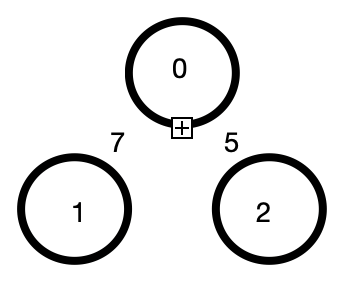

# 그래프 표현 방식

## 1.인접행렬

: 2차원 배열로 그래프의 연결관계를 표현하는 방식



|      |  0   |  1   |  2   |
| :--: | :--: | :--: | :--: |
|  0   |  0   |  7   |  5   |
|  1   |  7   |  0   | 무한 |
|  2   |  5   | 무한 |  0   |

<br/>

### 코드

```c++
#include <iostream>
#define INF 999999999 // 무한의 비용 선언
using namespace std;


// 2차원 리스트를 이용해 인접 행렬 표현
int graph[3][3] = {
    {0, 7, 5},
    {7, 0, INF},
    {5, INF, 0}
};

int main()
{

    for (int i = 0; i < 3; i++)
    {
        for (int j = 0; j < 3; j++)
        {
            cout << graph[i][j] << ' ';
        }

        cout << endl;
    }

    return 0;
}
```

<br/>

<br/>

## 2.인접리스트

: 연결된 노드에 대한 정보를 차례대로 연결하여 저장

<br/>

### 코드

```c++
#include <iostream>
#include <vector>

using namespace std;
vector<pair<int, int>> graph[3];

int main()
{

  //노드 0에 연결된 노드정보 저장 (노드, 거리)
    graph[0].push_back({1, 7});
    graph[0].push_back({2, 5});
  
  //노드 1에 연결된 노드정보 저장 (노드, 거리)
    graph[1].push_back({0, 7});
  
  //노드 2에 연결된 노드정보 저장 (노드, 거리)
    graph[2].push_back({0, 5});

    for (int i = 0; i < 3; i++)
    {
        for (int j = 0; j < graph[i].size(); j++)
        {
            cout << '(' << graph[i][j].first << ',' << graph[i][j].second << ')' << ' ';
        }
    cout << '\n';
    }

    return 0;
}
//결과
(1,7) (2,5) 
(0,7) 
(0,5) 
```


<br/>

<br/>


## 3. 인접행렬 vs 인접리스트

|        | 인접행렬방식                 | 인접리스트                                                   |
| ------ | ---------------------------- | ------------------------------------------------------------ |
| 메모리 | Bad (모든 관계를 저장하므로) | Good (연결된 정보만 저장)                                    |
| 속도   | 보다 빠름                    | 느림 ( 두 노드가 연결되어 있는지에 대한 정보를 얻는 속도가 느림, <br />연결된 데이터를 하나씩 확인해야 하기 때문) |

- 특정 노드와 연결된 **모든 인접노드를 순회해야 하는 경우** **인접리스트** 방식이 메모리 공간의 낭비가 적다.