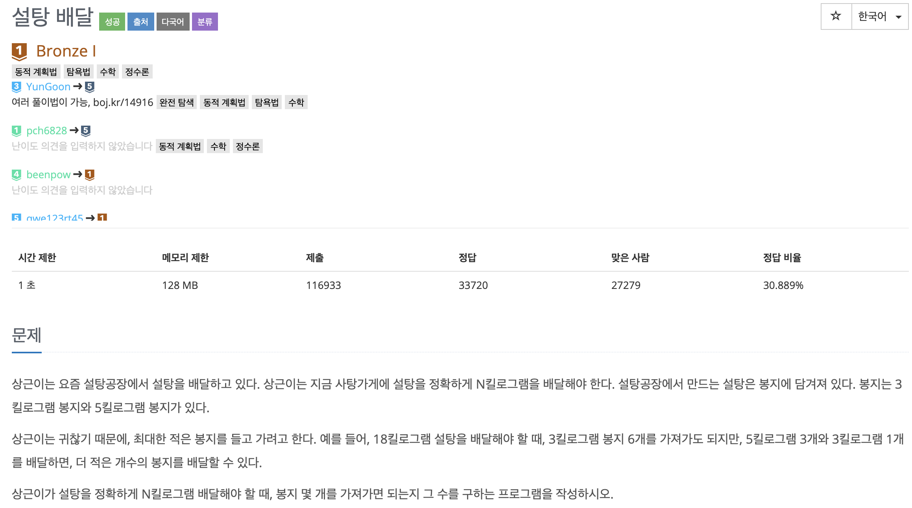

## Q2839

- 문제

  

</br>

- ### 풀이

```java
package BOJ2839;

import java.util.Arrays;
import java.util.Scanner;

public class Q2839 {

	public static void main(String[] args) {
		Scanner scn = new Scanner(System.in);

		int weight = scn.nextInt(); // 설탕 무게

		if (weight % 5 == 0) {
			System.out.println(weight / 5);
			return;

		} else {
			int quotient = weight / 5;
			for (int i = quotient; i > 0; i--) {
				int temp = weight - (i * 5);

				if (temp % 3 == 0) {
					System.out.println(i + (temp / 3));
					return;
				}
			}
		}
		if (weight % 3 == 0) {
			System.out.println(weight / 3);
		} else {
			System.out.println(-1);
		}
		return;

	}

}

```

- *접근*

  1. <u>나머지를 구하는 공식</u>

     `int temp = weight - (i * 5);`

  2. 5로 나누어 떨어지면 바로 반환

  3. 나누어 떨어지지 않는것들은 몫에서 하나씩 뺀다 `for (int i = quotient; i > 0; i--)`

  4. 3으로 나누어 떨어지는 것들은 바로 반환

  5. 이도저도 아니면 -1 반환