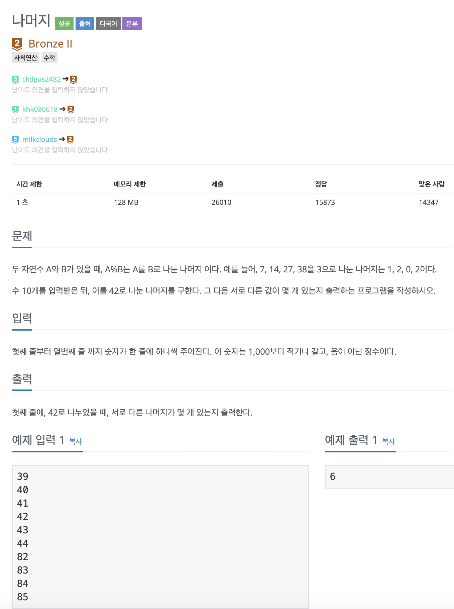

## BOJ3052

- ### 문제

  


- ### 소스

  

  ```java
  package BOJ3052;
  
  import java.io.BufferedReader;
  import java.io.IOException;
  import java.io.InputStreamReader;
  import java.util.Arrays;
  import java.util.Scanner;
  
  public class Q3052 {
  
  	public static void main(String[] args) throws IOException {
  
  		boolean[] arr = new boolean[42];
  
  		BufferedReader br = new BufferedReader(new InputStreamReader(System.in));
  
  		for (int i = 0; i < 10; i++) {
  
  			arr[Integer.parseInt(br.readLine()) % 42] = true;
  
  		}
  
  		int cnt = 0;
  		for (boolean value : arr) {
  			if (value) {
  				cnt++;
  			}
  		}
  
  		System.out.println(cnt);
  
  	}
  
  }
  
  ```


- ### *접근1. (실패)*

  주어진 숫자들을 모드 42로 나눈뒤,

  나머지들을 배열에 넣는데, 중복된 숫자는 넣지 않는다.

- ### *접근2.*

  42로 나누면 나머지는 0~42로 한정된다는 점을 이용.

  배열 크기를 42로 정하고

  중복되지 않게 True, False로 판별

  갯수를 리턴한다.