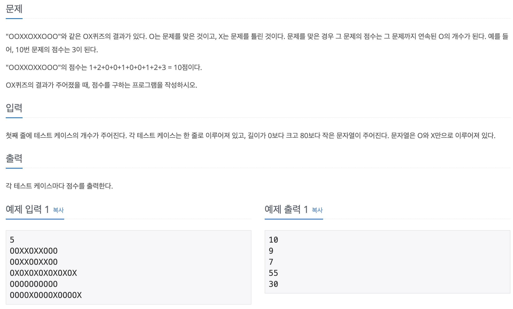

## Q8958

- 문제

  


- ### 내꺼

  ```java
  package BOJ2839;
  
  import java.util.Arrays;
  import java.util.Scanner;
  
  public class Q2839 {
  
  	public static void main(String[] args) {
  		Scanner scn = new Scanner(System.in);
  
  		// testCase
  		int tcase = scn.nextInt(); 
  		String[] cases = new String[tcase];
  		for (int i = 0; i < tcase; i++) {
  			cases[i] = scn.next();
  		}
  		scn.close();
  
  		
  		for (String OXresult : cases) {
  			int result = 0;
  			int scoreO = 0;
  
  			for (int j = 0; j < OXresult.length(); j++) {
  
  				if (OXresult.charAt(j) == 'O') {
  
  					result += ++scoreO;
  				} else {
  					scoreO = 0;
  				}
  
  			}
  			System.out.println(result);
  
  		}
  
  	}
  
  }
  
  ======================================================================
  //		3
  //		OXOXOXOXOXOXOX
  //		OOOOOOOOOO
  //		OOXXOXXOOO
  //		7
  //		55
  //		10
  ```

- *접근*

  1. OX를 각 `split("")` 으로 쪼갠다.
  2. 거기서 'O'와 같으면 점수 추가
  3. 다르면 다시 0으로 초기화