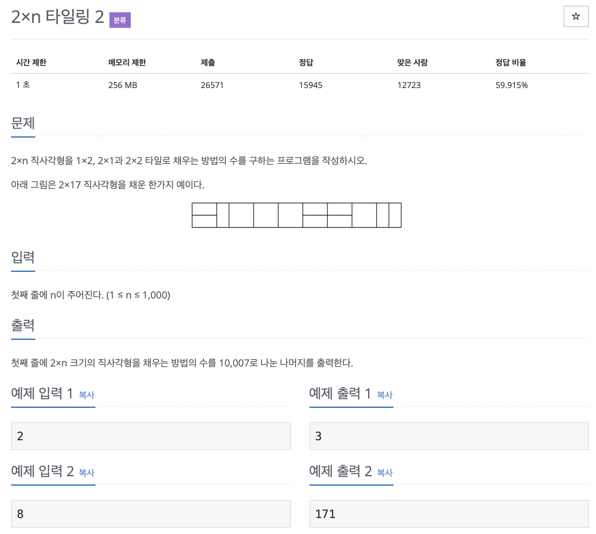
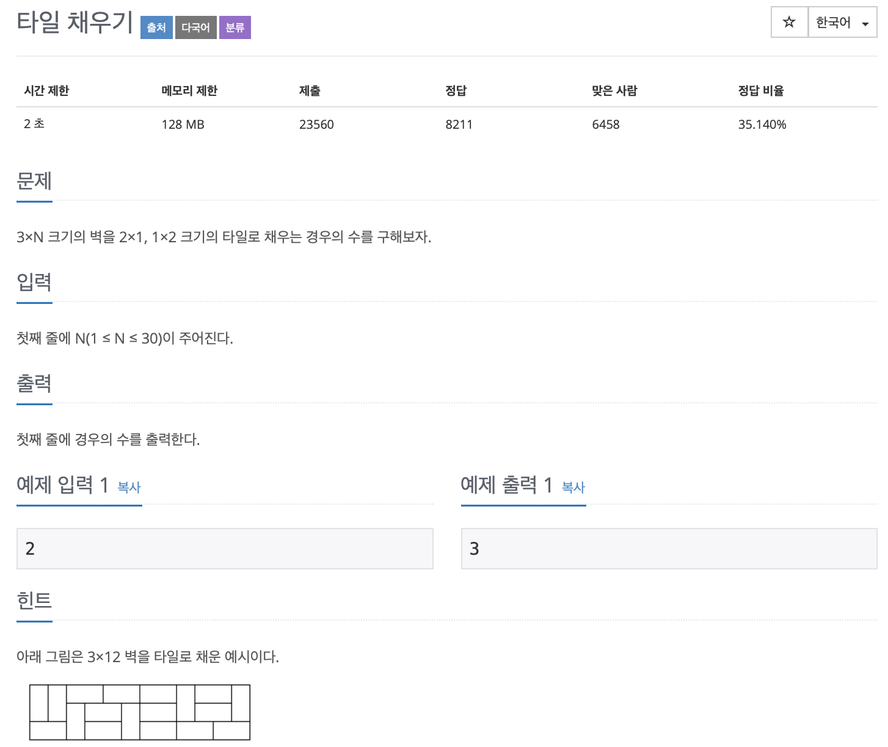

# Dynamic Programming

규칙성을 찾아서 **점화식**을 세우는 것이 중요!

---


## 1. 피보나치

피보나치 수열을 예로 들면

재귀함수로 표현했을 때,

<u>**문제점.  중복되는 연산이 너무나 많게 된다.**</u>

*2^n 의 복잡도를 가지며, 만약 n이 50번째인 피보나치 수열을 구하면, 어마어마하게 복잡도가 올라간다.*

</br> 

===> <u>이를 해결하기 위해서 **메모이제이션 기법**을 사용한다.</u>

```c++
 int dp(int x)
 {
     if (x == 1)
         return 1;
     if (x == 2)
         return 1;
     return dp(x - 1) + dp(x - 2);
 }
```


---


먼저 메모이제이션을 위한 배열을 만들어준다.

배열에 **이미 값이 있을 경우 그대로 그 값을 리턴**해줘서, 연산해야하는 수고로움을 덜어준다.

*에라토스테네스의 체랑 비슷한 개념같다..*

```c++
#include <stdio.h>

// int dp(int x)
// {
//     if (x == 1)
//         return 1;
//     if (x == 2)
//         return 1;
//     return dp(x - 1) + dp(x - 2);
// }

//메모이제이션을 위한 배열
int d[100];

int dp(int x)
{
    if (x == 1)
        return 1;
    if (x == 2)
        return 1;
  
  // 메모이제이션 
  // 이미 값이 있으면 skip한다.
    if (d[x] != 0)
        return d[x];
    return d[x] = dp(x - 1) + dp(x - 2);
}
int main()
{

    printf("%d\n", dp(50));
    //-298632863 오버플로우 발생 (정수형 표현 범위 초과)
    return 0;
}
```

</br> 


## 2. 타일링 문제2



</br> 

```c++
#include <iostream>

using namespace std;

int d[1001];

int dp(int x)
{
    if (x == 1)
        return 1;
    if (x == 2)
        return 3;
    if (d[x] != 0)
        return d[x];
    return d[x] = (dp(x - 1) + 2 * dp(x - 2)) % 10007;
    //10007은 오버플로우를 방지하기 위함.
}
int main()
{

    int x;
    cin >> x;

    cout << dp(x) << endl;

    return 0;
}
```

</br> 

## 3. 타일링문제 3



- 조심해야 할 것.
  - 짝수의 경우 2가지의 경우가 추가로 붙는다.

</br> 

```c++
#include <iostream>

using namespace std;

int d[1001];

int dp(int x)
{
    if (x == 0)
        return 1;
    if (x == 1)
        return 0;

    if (x == 2)
        return 3;

    if (d[x] != 0)
        return d[x];

    int result = 3 * dp(x - 2);
    for (int i = 3; i <= x; i++)
    {
        if (i % 2 == 0)
        {
            result += 2 * dp(x - i);
        }
    }

    return d[x] = result;
}
int main()
{

    int x;
    cin >> x;

    cout << dp(x) << endl;

    return 0;
}
```

