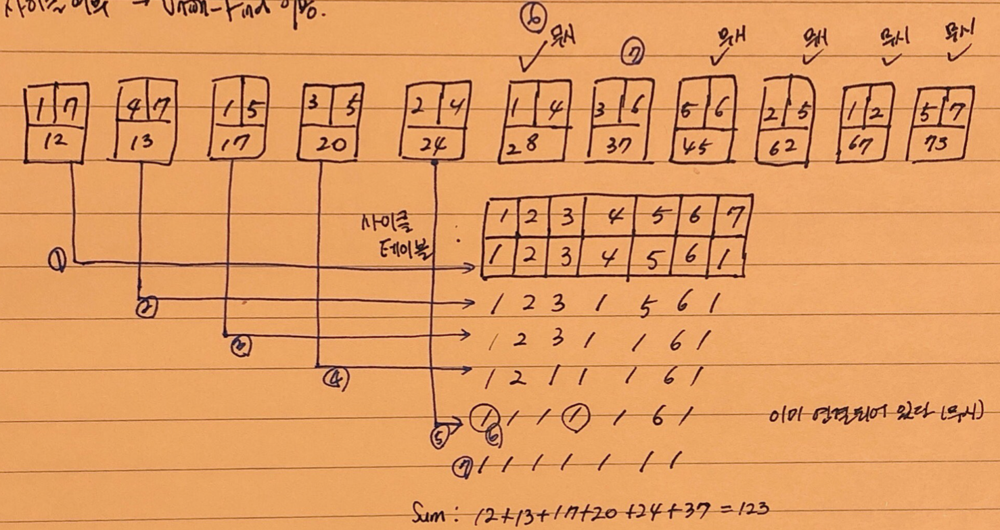

# Kruskal Algorithm

## 이론

</br> 

**<u>가장 적은 비용으로 모든 노드를 연결하기 위해 사용하는 알고리즘</u>**

최소비용 신장트리를 만들기 위한 알고리즘.

</br> 

- *예* 

  여러개의 도시가 있을 경우 각 도시를 도로로 연결할 때, 비용을 최소한으로 하고자 할 때 적용되는 알고리즘.


- 노드 = 정점 = 도시 :  동그라미

  간선 = 거리 = 비용 : 선 

- **간선 갯수 = 노드갯수 - 1**


- *간선을 거리가 짧은 순서대로 그래프에 포함시키면 어떨까 ?*

1. 오름차순으로 정렬(`sort()`). 비용이 적은 간선부터 그래프에 포함(Union) 시키면 된다. ( <u>단, 사이클이 발생하지 않도록 주의</u> )

2. 사이클 발생 여부 검사는 **(Union) Find** 로 한다.

   1. Union 조건이 되면 distance를 sum에 누적, 조건이 아니면 무시

      

</br> 

## 코드

```c++
#include <stdio.h>
#include <algorithm>
#include <iostream>
#include <vector>

using namespace std;

int getparent(int parent[], int x)
{
    // 재귀함수의 종료 부분
    if (parent[x] == x)
        return x;

    return parent[x] = getparent(parent, parent[x]);
}

int unionParent(int parent[], int a, int b)
{
    a = getparent(parent, a);
    b = getparent(parent, b);
    if (a < b)
        parent[b] = a;
    else
        parent[a] = b;
}

// 같은 부모를 가지는지 확인
int findparent(int parent[], int a, int b)
{
    a = getparent(parent, a);
    b = getparent(parent, b);
    if (a == b)
        return 1;
    return 0;
}

class Edge
{
public:
    int node[2];
    int distance;
    Edge(int a, int b, int distance)
    {
        this->node[0] = a;
        this->node[1] = b;
        this->distance = distance;
    }

    bool operator<(const Edge &edge) const
    {
        return this->distance < edge.distance;
    }
};

int main()
{
    // 정점 노드의 갯수
    int n = 7;

    //간선의 갯수
    int m = 11;

    vector<Edge> v;
    v.push_back(Edge(1, 7, 12));
    v.push_back(Edge(1, 4, 28));
    v.push_back(Edge(1, 2, 67));
    v.push_back(Edge(1, 5, 17));
    v.push_back(Edge(2, 4, 24));
    v.push_back(Edge(2, 5, 62));
    v.push_back(Edge(3, 5, 20));
    v.push_back(Edge(3, 6, 37));
    v.push_back(Edge(4, 7, 13));
    v.push_back(Edge(5, 6, 45));
    v.push_back(Edge(5, 7, 73));

    // 간선의 비용을 기준으로 오름차순 정렬
    sort(v.begin(), v.end());

    //각 정점이 포함된 그래프가 어디인지 저장
    int parent[n];

    for (int i = 0; i < n; i++)
    {
        // 정점은 자기 자신을 가리키도록
        parent[i] = i;
    }

    // 거리의 합
    int sum = 0;

    for (int i = 0; i < v.size(); i++)
    {
        //사이클이 발생하지 않는 경우 그래프에 포함
        if (!findparent(parent, v[i].node[0] - 1, v[i].node[1] - 1))
        {
            sum += v[i].distance;
            unionParent(parent, v[i].node[0] - 1, v[i].node[1] - 1);
        }
    }

    printf("%d \n", sum);
    return 0;
}
```

