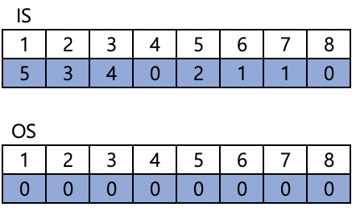
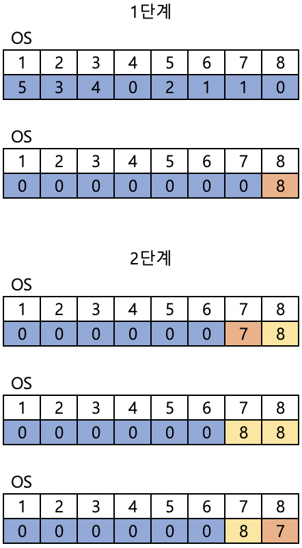
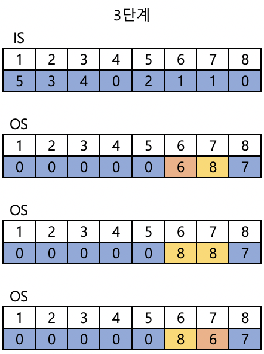
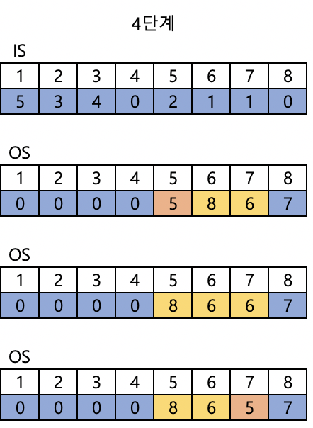
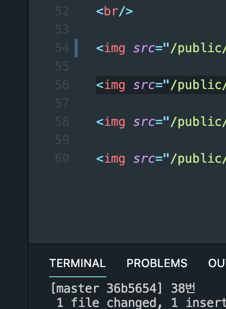

# Inversion Sequence

### 코드

```c
#include <stdio.h>
#include <vector>
using namespace std;
int main()
{
    int n, i, j, pos;
    scanf("%d", &n);
    vector<int> is(n + 1), os(n + 1);
    for (i = 1; i <= n; i++)
    {
        scanf("%d", &is[i]);
    }

    for (i = n; i >= 1; i--)
    {
        pos = i;
        for (j = 1; j <= is[i]; j++)
        {
            os[pos] = os[pos + 1];
            pos++;
        }
        os[pos] = i;
    }

    for (i = 1; i <= n; i++)
    {
        printf("%d ", os[i]);
    }

    return 0;
}
```

<br/> 

### 풀이

- **<u>1부터 N까지, N번부터 처리 (큰 수부터 처리)가 핵심</u>**
- **삽입정렬** 이용

<br/>









# Inversion Sequence

### 코드

```c
#include <stdio.h>
#include <vector>
using namespace std;
int main()
{
    int n, i, j, pos;
    scanf("%d", &n);
    vector<int> is(n + 1), os(n + 1);
    for (i = 1; i <= n; i++)
    {
        scanf("%d", &is[i]);
    }

    for (i = n; i >= 1; i--)
    {
        pos = i;
        for (j = 1; j <= is[i]; j++)
        {
            os[pos] = os[pos + 1];
            pos++;
        }
        os[pos] = i;
    }

    for (i = 1; i <= n; i++)
    {
        printf("%d ", os[i]);
    }

    return 0;
}
```

<br/> 

### 풀이

- **<u>1부터 N까지, N번부터 처리 (큰 수부터 처리)가 핵심</u>**
- **삽입정렬** 이용

<br/>


