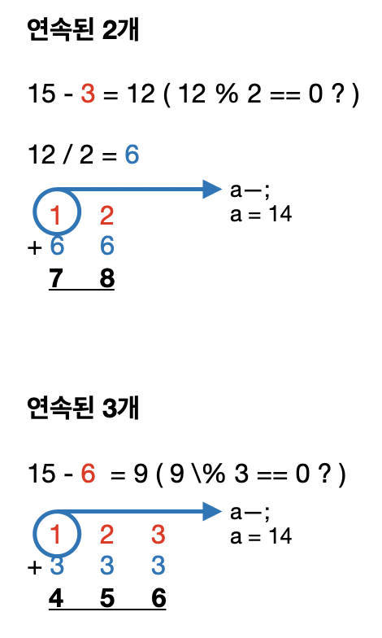

# 연속된 자연수의 합

### 코드

```c
#include <stdio.h>
#include <vector>

using namespace std;

int main()
{
    int a, b = 1, cnt = 0, tmp, i;

    scanf("%d", &a);

    // 결과값 15도 출력해야 하므로 잠시 담아둔다.
    tmp = a;

    a--;
    while (a > 0)
    {
        b++;
        a = a - b;
        if (a % b == 0)
        {
            for (i = 1; i < b; i++)
            {
                printf("%d + ", (a / b) + i);
            }

            printf("%d = %d\n", (a / b) + i, tmp);
            cnt++;
        }
    }
    printf("%d\n", cnt);

    return 0;
}
```

<br/>

###  풀이



<br/> 

**빼기 부분에서의 코드가 핵심**

```c
 a--;
    while (a > 0)
    {
        b++;
        a = a - b;
```


