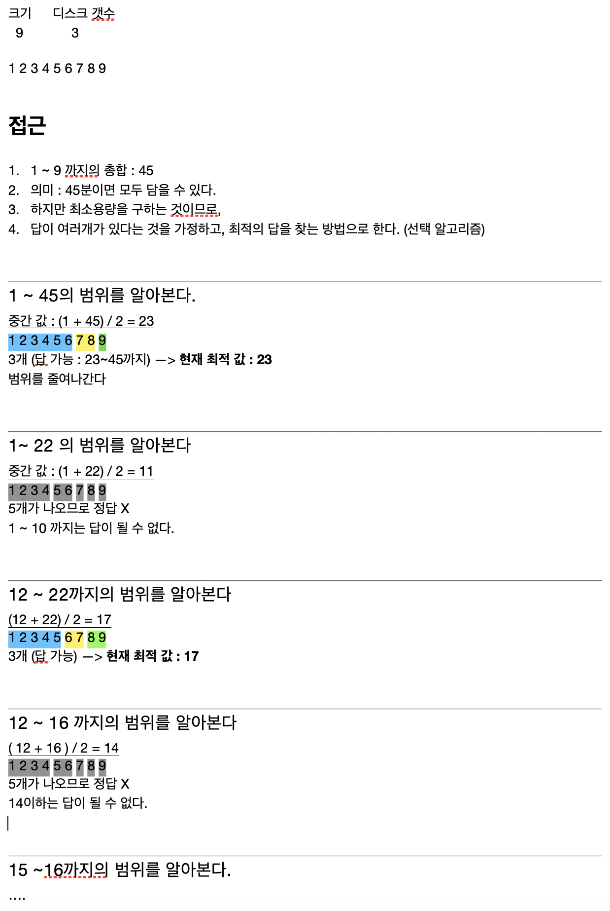

# 뮤직비디오 (이분검색 응용)

- **결정알고리즘**

  : 결정해놓고 이 값이 맞냐 아니냐로 좁혀나가는 알고리즘

<br/>

```c
#include <stdio.h>
#include <vector>

using namespace std;
int a[1001], n;

int Count(int s)
{
    int i, cnt = 1, sum = 0;
    
    for (i = 1; i <= n; i++)
    {
        if (sum + a[i] > s)
        {
            cnt++;
            sum = a[i];
        }
        else
            sum = sum + a[i];
    }
    return cnt;
}

int main()
{

    int m, i, lt = 1, rt = 0, mid, res;

    scanf("%d %d", &n, &m);

    for (i = 1; i <= n; i++)
    {
        scanf("%d", &a[i]);
        rt = rt + a[i];
    }

    while (lt <= rt)
    {
        mid = (lt + rt) / 2;

        if (Count(mid) <= m)
        {
            res = mid;
            rt = mid - 1;
        }
        else
        {
            lt = mid + 1;
        }
    }

    printf("%d\n ", res);

    return 9;
}

```

<br/> 

### 풀이



