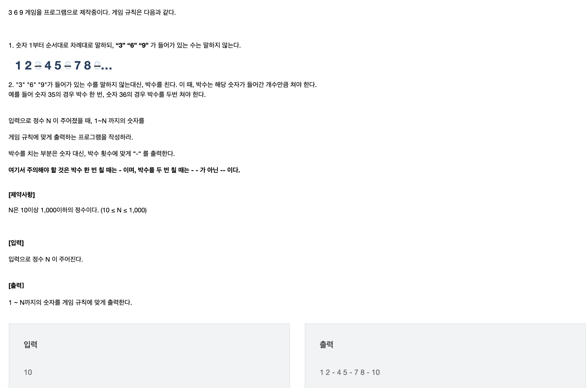

## Solution 1926

- 문제

  

- 소스

  ```java
  package test.SWEA;
  
  import java.util.Scanner;
  
  class Solution1926 {
  	public static void main(String args[]) throws Exception {
  		Scanner sc = new Scanner(System.in);
  		int N; // 숫자 받
  		N = sc.nextInt();
  
  		for (int i = 1; i <= N; i++) {
  
  			int quotient = i % 10;
  			int div = i / 10;
  
  			if (quotient == 3 || quotient == 6 || quotient == 9) {
  
  				if (div == 3 || div == 6 || div == 9) {
  					System.out.print("-- ");
  					continue;
  
  				}
  				System.out.print("- ");
  				continue;
  				
  			} else if (quotient != 3 || quotient != 6 || quotient != 9) {
  				if (div == 3 || div == 6 || div == 9) {
  					System.out.print("- ");
  					continue;
  
  				}
  			}
  
  			System.out.print(i + " ");
  		}
  
  	}
  
  }
  
  
  =============================================
  
  //	10
  //	1 2 - 4 5 - 7 8 - 10
  ```

  

- *접근*

  1. 처음: string -> charAt

     for문에서 자릿수 에러

  2. 10으로 나눈 값의 나누기가 3, 6 ,9 이면 `-`

     10으로 나눈값 중 몫도 3 , 6.  9 이면 `--` 