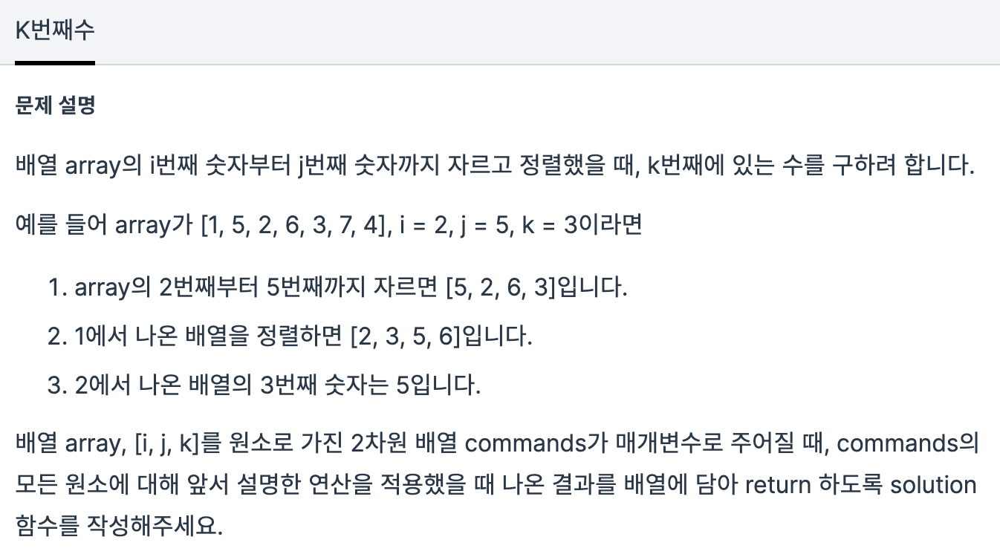

## Solution 29

- ### 문제

  

- ### 코드

  ```java
  package test.solution29;
  
  import java.util.*;
  
  class Solution29 {
  	public int[] solution(int[] array, int[][] commands) {
  
  		int[] answer = new int[commands.length];
  		String arr = "";
  
  //		자르기 위해 string으로 변환
  		for (int i = 0; i < array.length; i++) {
  
  			arr += Integer.toString(array[i]);
  
  		}		
  
  		for (int i = 0; i < commands.length; i++) {
  
  //		substring을 위해 beginIndex, endIndex를 구함
  			int beginIndex = commands[i][0];
  			int endIndex = commands[i][1];
  
  //		substring
  			String arr_sub = arr.substring(beginIndex - 1, endIndex);
  			String arr_str[] = arr_sub.split("");
  			
  //		정렬
  			Arrays.sort(arr_str);
  
  //		k값
  			int select = commands[i][2];
  
  //		int값으로 변환
  			int result = Integer.parseInt(arr_str[select - 1]);
  
  //		answer배열에 넣기
  			answer[i] = result;
  			
  		}
  
  		return answer;
  	}
  
  	public static void main(String[] args) {
  
  		Solution29 sol28 = new Solution29();
  
  		int array[] = { 1, 5, 2, 6, 3, 7, 4 };
  		int commands[][] = { { 2, 5, 3 }, { 4, 4, 1 }, { 1, 7, 3 } };
  		sol28.solution(array, commands);
  	}
  }
  ```

- *풀이*

  답은 나왔는데 런타임에러가 났다.


</br>

- ### 다른사람의 풀이

  ```java
  package test.solution29;
  
  import java.util.*;
  
  class Solution29 {
  	public int[] solution(int[] array, int[][] commands) {
  
  		int[] answer = new int[commands.length];
  		String arr = "";
  
  //		자르기 위해 string으로 변환
  //		for (int i = 0; i < array.length; i++) {
  
  //			arr += Integer.toString(array[i]);
  
  //		}
  		
  		
  
  		for (int i = 0; i < commands.length; i++) {
  
  //		substring을 위해 beginIndex, endIndex를 구함
  //			int beginIndex = commands[i][0];
  //			int endIndex = commands[i][1];
  
  //		substring
  //			String arr_sub = arr.substring(beginIndex - 1, endIndex);
  //			String arr_str[] = arr_sub.split("");
  
  			
  			int[] arr_str = Arrays.copyOfRange(array, commands[i][0]-1, commands[i][1]);
  			
  //		정렬
  			Arrays.sort(arr_str);
  
  //		k값
  //			int select = commands[i][2];
  
  //		int값으로 변환
  //			int result = Integer.parseInt(arr_str[select - 1]);
  
  //		answer배열에 넣기
  //			answer[i] = result;
  			
  			answer[i] = arr_str[commands[i][2]-1];
  			
  		}
  
  		return answer;
  	}
  
  	public static void main(String[] args) {
  
  		Solution29 sol28 = new Solution29();
  
  		int array[] = { 1, 5, 2, 6, 3, 7, 4 };
  		int commands[][] = { { 2, 5, 3 }, { 4, 4, 1 }, { 1, 7, 3 } };
  		sol28.solution(array, commands);
  	}
  }
  ```

  

- `Arrays.copyOfRange` 라는 기능을 생각하지 못했던 것 같아서 변환하는 과정이 번거롭게 느껴졌다.

- 결과적으로 런타임 오류가 났지만 `substring`을 활용해 볼 수 있어서 좋았다.