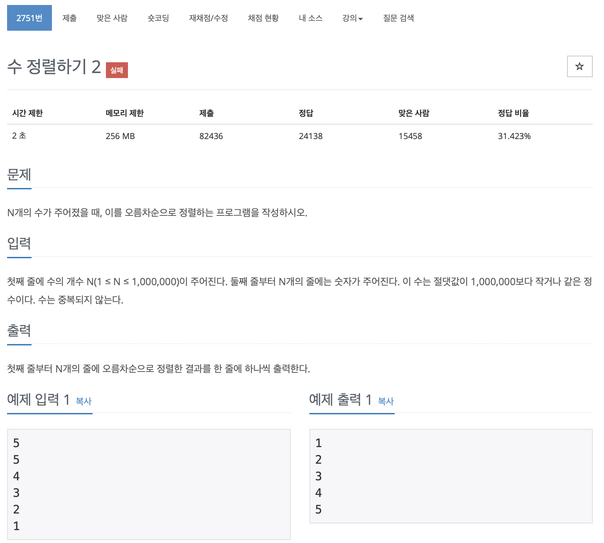

# BOJ 2751

## 수 정렬하기 2

### 문제



</br> 

- 문제에서 데이터의 개수가 1,000,000 이하 이므로 **`O(N * logN)`**의 시간복잡도가 제한된다.

  - **` O(N * logN)`**을 가지는 정렬 알고리즘

    1. 힙정렬

    2. 퀵정렬

       *: 하지만, 최악의 경우 O(n^2) 의 경우가 나오기 때문에 제출 시 시간초과 오류가 뜬다*

    3. 병합정렬

</br> 

- ### 퀵 정렬로 정렬

  ```c++
  #include <stdio.h>
  
  int number, data[1000001];
  
  void quick(int *data, int start, int end)
  {
  
      if (start >= end)
      {
          return;
      }
      int key = start;
      int i = start + 1;
      int j = end;
      int temp;
  
      while (i <= j)
      {
          while (data[i] <= data[key])
          {
              i++;
          }
          while (data[j] >= data[key] && j > start)
          {
              j--;
          }
  
          if (i > j)
          {
              temp = data[j];
              data[j] = data[key];
              data[key] = temp;
          }
          else
          {
              temp = data[i];
              data[i] = data[j];
              data[j] = temp;
          }
      }
  
      quick(data, start, j - 1);
      quick(data, j + 1, end);
  }
  int main()
  {
  
      scanf("%d", &number);
      for (int i = 0; i < number; i++)
      {
          scanf("%d", &data[i]);
      }
  
      quick(data, 0, number - 1);
  
      for (int i = 0; i < number; i++)
      {
          printf("%d\n", data[i]);
      }
  
      return 0;
  }
  ```

  </br> 

- ### 알고리즘 STL 라이브러리 사용

  - **`sort()`** 함수로 사용 

    :  `sort()` 함수는 <u>퀵정렬</u>을 기본으로 하고 , 최악의 경우에도 **`O(logN *N)`** 을 보장한다.

  ```c++
  #include <stdio.h>
  #include <algorithm>
  
  int number, data[1000000];
  int main()
  {
  
      scanf("%d", &number);
      for (int i = 0; i < number; i++)
      {
          scanf("%d", &data[i]);
      }
  
      std::sort(data, data + number);
  
      for (int i = 0; i < number; i++)
      {
          printf("%d\n", data[i]);
      }
  
      return 0;
  }
  ```

  