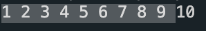
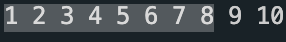
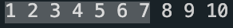

# Bubble Sort

- <u>**옆에 있는 값과 비교해서 더 작은 값을 앞으로**</u>

- 구현하기는 쉬우나
  효율성은 가장 떨어지는 알고리즘. 

</br> 

## 시간복잡도

Selection Sort와 동일하다

**`O(n^2)`** 

</br> 

```c
#include <stdio.h>

int main()
{

    int i, j, temp;

    int arr[10] = {1, 10, 5, 8, 7, 6, 4, 3, 2, 9};

    for (int i = 0; i < 10; i++)
    {
        for (int j = 0; j < 9 - i; j++)
        {
            if (arr[j] > arr[j + 1])
            {
                temp = arr[j];
                arr[j] = arr[j + 1];
                arr[j + 1] = temp;
            }
        }
    }

    for (int i = 0; i < 10; i++)
    {
        printf("%d ", arr[i]);
    }
}
```

- 두번째 for문에서 9- i 인 이유는 ?

  첫번째 Loop

  

  </br> 

  두번째 Loop

  

  </br> 

  세번째 Loop

  

   

  이럼 **뒤에서부터** 차례대로 정렬이 되기 때문이다.

  

  

  