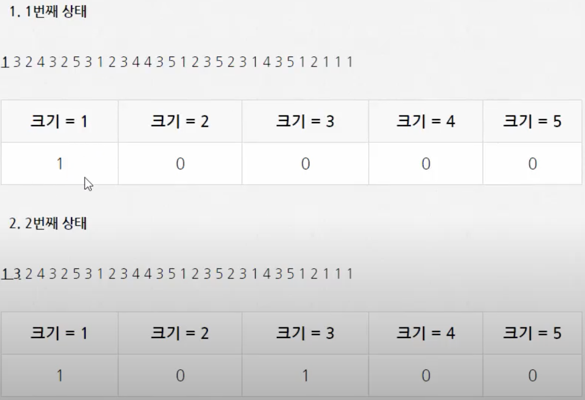
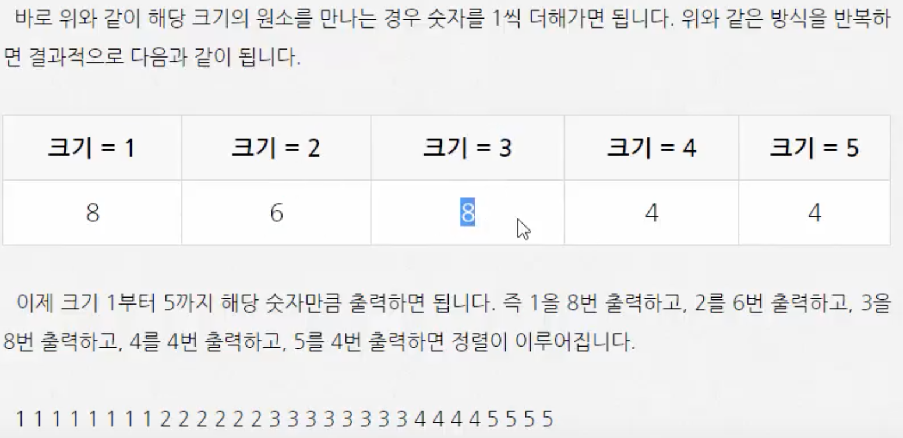

# Counting Sort (계수 정렬)

</br> 

- **Counting** : **크기**를 기준으로 갯수를 세는 개념
- <u>*정렬 시 **조건**이 있는 경우 매우 빠른 알고리즘*</u>

- 기존 힙, 병합, 퀵정렬은 위치를 바꾸는 알고리즘이지만, 계수 정렬은 **갯수를 세어주면 되기 때문에 위치를 바꿀 필요없다.**

- 한계점 : 데이터 크기에 매우 의존적이다. 
  			*( 1,2,4, ... 숫자만 있다가 하나라도 10000이 있다면 배열 크기 또한 10000으로 늘려주어야 하기 때문 )*

</br> 

### 시간복잡도 

:**` O(N)`** 

</br> 

### 과정

1. 1인거에 한해서 1의 숫자를 세고

2. 다음 3인거에 한해서 3의 숫자를 세고

3. 다음 2인거에 한해 2의 숫자를 세고 ....

   

   *예시 ) 크기를 5로 가정*






</br> 

### 코드

```c++

#include <stdio.h>

int main()
{

    int temp;
    int count[5];
    int array[30] = {1, 3, 2, 4, 3, 2, 5, 3, 1, 2,
                     3, 4, 4, 3, 5, 1, 2, 3, 5, 2,
                     3, 1, 4, 3, 5, 1, 2, 1, 1, 1};

    for (int i = 0; i < 5; i++)
    {
        count[i] = 0;
    }

    for (int i = 0; i < 30; i++)
    {
        count[array[i] - 1]++;
    }

    for (int i = 0; i < 5; i++)
    {
        if (count[i] != 0)
        {
            for (int j = 0; j < count[i]; j++)
            {
                printf("%d ", i + 1);
            }
        }
    }

    return 0;
}


// 결과
// 1 1 1 1 1 1 1 1 2 2 2 2 2 2 3 3 3 3 3 3 3 3 4 4 4 4 5 5 5 5
```

