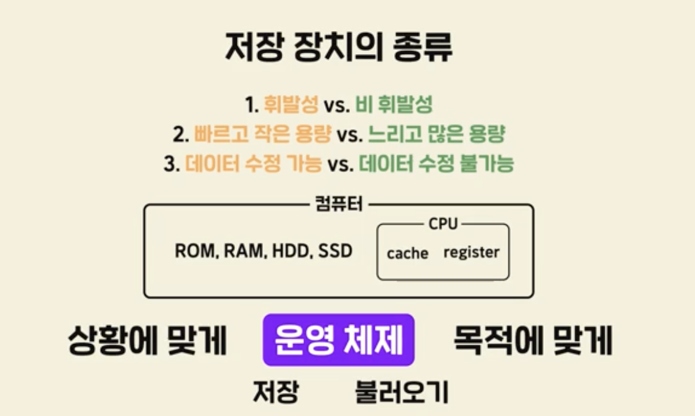
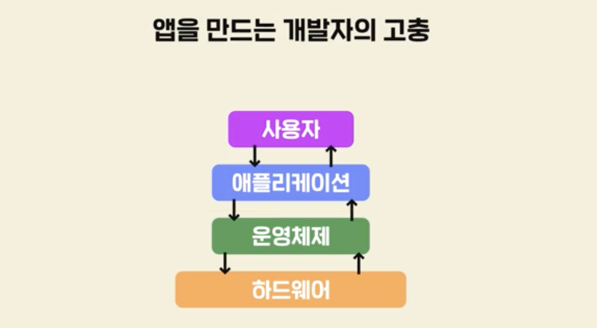
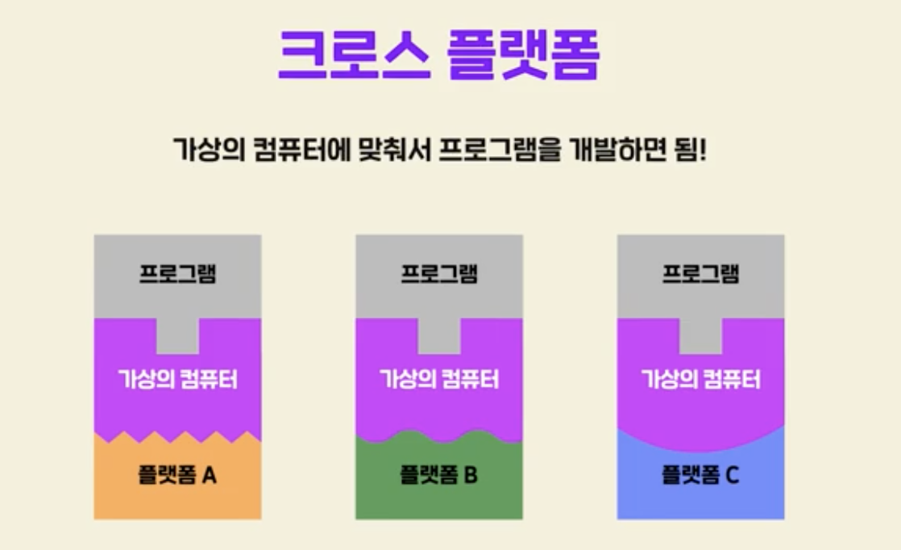
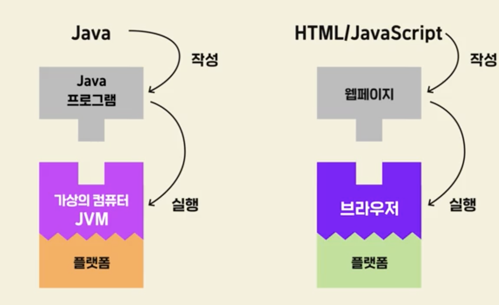
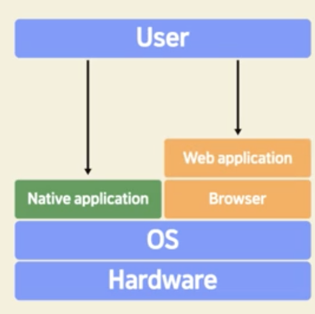
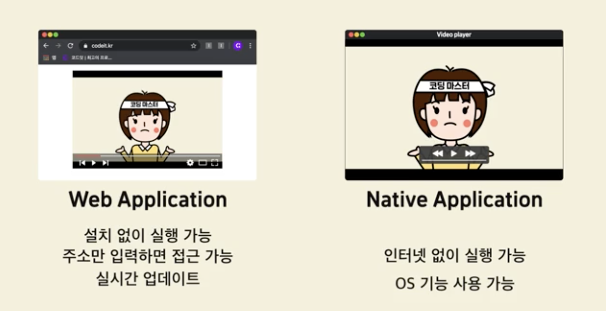

구조화가 잘된 코드

객체지향 프로그래밍

### 디자인패턴

>  오류가 자주나는 패턴을 정형화 시킨 것.

 

### 라이브러리 VS 프레임워크

#### 라이브러리

> 자주 쓰일법한 코드를 이미 누가 만든 도구들을 그대로 가져와 사용하는 것. 
>
> 개인카페 운영 시 리즈한 커피 머신

#### 프레임워크

> 뼈대가 이미 준비되어 있다. 틀이 짜여 있음. -> 미처 생각하지 못한 부분도 구성이 되어 있기 때문에 견고한 프로그램 만드는데에도 도움.
>
> 스타벅스 가맹점

 

### 소프트웨어 공학

- 개발 프로세스

  

 

### 프로세스 관리

1. #### 폭포수방식 (Waterfall)

   

   - 단점 : 각 단계를 완벽하게 끝내기 힘들 수 있다.

   - 각 단계가 복잡하지 않다면 유용할 수 있다.

     

 

####   2. 애자일 (Agile)

> 적당하게 빠르게 만들고 소통을 통해 개선해나간다.
>
> scrum, kanban 방식

 

3. #### 애자일 VS 폭포수

 

### 테스트 프로세스

- 버그 관리 툴 활용 (이슈 트래킹 툴)
  - Jira
  - Asana 등등..

 

- 이슈의 상태
  - Open : 이슈가 생김
  - In-Progress : 개발자가 객선 작업 진행
  - Resolved : 문제 해결
  - Closed : 테스트 결과 버그가 잘 해결됨
  - Reopen : 추가적인 문제 발생시 다시 Open으로 돌아감
    - 각 단계에서 담당자를 지정 : Assign. 

 

### IDE

- intelliJ
- Eclipse
- VisualStudio Code

 

***

### 트렌드를 읽는 방법 1. (활발한 기술) 

- 언어 기술 선택 기준 

  : 많은 사용자가 있는지, 활발한지 --> 고민 해결에 유리하다.

  > Redmonk 통계

  

 

 

### 트렌드를 읽는 방법 2. (인정받는 기술).  

 

### 트렌드를 읽는 방법 3. (유망한기술)

> 가트너 발표 자료

​		

 

---

 

## 3. 컴파일러와 인터프리터

### 3-1. 다양한 애플리케이션

>  	사용자 (End-User) 가 사용.

 

#### 3-2. 프로그래밍 언어의 번역기, 컴파일러

> 프로그래밍 언어의 번역기

- 고급언어 -> Compiler -> 머신코드

- 컴파일러의 단점
  - 작성한 코드가 잘 되는지 확인하고 싶을 때마다 컴파일을 해주어야 한다.
  - 빠르게 개발하기 어렵다.
  - 이러한 단점을 보완한 것이 **인터프리터**

 

#### 3-3. 실시간 코드 실행기, 인터프리터

> 한줄씩 즉시 실행, 번역기가 아닌 실행기. 번역 없이 실행 가능하다.
>
> 코드 자체를 사용자 컴퓨터에 보내준다. 

- 실행속도는 컴파일러보다 떨어지고, 코드누출의 위험성 존재
- 저수준의 언어로 번역될 수록 코드 길이가 길다.
- 고수준 언어 그대로 전달하는 인터프리터 방식 프로그램 용량이 더 작다.

---

 

## 4. 운영체제 개요

### 	4-1. 운영체제 개요

1. #### 애플리케이션을 도와주는 프로그램, 운영체제 (Operating System, OS)

2. #### 운영체제의 역할 I . (입력과 출력)

    

3. #### 운영체제의 역할 II . (저장과 불러오기)

   1. #### 저장장치의 종류

      1. 휘발성(RAM) vs 비휘발성(하드디스크)

      2. 빠르고 작은 용량 vs 느리고 많은 용량

         1. 읽고 쓰는 속도에도 차이가 있는데 운영체제는 상황에 따라 어떻게 다룰 것인지 판단한다.

      3. 수정 불가 (Read Only Memory, ROM) vs 데이터 수정 가능

         

4. #### 운영체제의 역할 III . (여러 프로그램 동시에 빠르게 실행하기) 

   

### 4-2. 운영체제의 종류	
1. 데스크탑
   1. Windows, MacOS, Linux , ...
2. 모바일
   1. Android, IOS, ...
3. 서버
   1. Ubuntu, Unix, CentOS, ...
4. 임베디드
   1. 컴퓨터가 아닌 다른 기기들에 들어가는 OS
   2. 종류와 환경이 다양해서 매우 많은 운영체제가 존재함
   3. 실시간 운영체제 (RTOS, Real Time Operating System)

 

### 4-3. 운영체제의 발전 역사
1. **UNIX**로부터 시작됨

   1. 1970년 개발, ,대부분 C언어로 작성, 다른컴퓨터에 수정해서 적용이 쉬움

   2. 유닉스 모방 운영체재 대거 등장 POSIX 표준 생김

      1. 인증시 공식 UNIX로 인정.

   3. GNU (GNU is Not Unix)

      : Unix의 코드를 한줄도 사용하지 않고 만든 Unix와 유사한 OS

   4. GNU + Linux Kernel : GNU/Linux -> **Linux** since 2015 (with Git)

   5. Linux

      ; 누구나 사용, 누구나 변형 + <u>반드시 코드 공개</u>  

      *공유의 가치 , 오픈소스의 힘*

      수많은 Linux 기반 OS가 생겨남

       

---

 

## 5. 네이티브 애플리케이션과 웹 애플리케이션

### 5-1. 플랫폼의 파편화

- 플랫폼

> 프로그램이 실행되는 하드웨어, 실행환경

- 플랫폼 의존성

  : 앱을 만드는 개발자의 고충

  ​	런칭 또는 수정할 때마다 버전에 맞게 모든 환경들을 일일이 수정해야 하는 문제가 발생함.

  

   

  

### 5-2. 표준화의 필요

 

### 5-3. 크로스 플랫폼 (가상 머신)

> 여러 OS, 여러 CPU에서 동일하게 실행할 수 있도록 한 환경

- 이를 실행한 언어 : **Java** 
  - 그 가상의 머신이 **JVM**
  - Write Once, Run Everywhere
  - 이식성, 범용성이 높다.

 

### 5-4. 크로스 플랫폼 (Web)

- 웹 규격에 맞춰 제작
- 국제 표준화 기구 ISO
- 웹의 단점 : <u>브라우저 호환성 문제</u>

 

### 5-5. 네이티브 애플리케이션과 웹 애플리케이션

- 웹 애플리케이션 : 웹을 활용해 애플리케이션을 동작
  - 설치 및 배포 과정이 필요 없다. 접근성이 더 좋음
  - 적은 투자와 노력으로 서비스 런칭 가능

 

- 네이티브 : 기기의 OS에서 바로 실행할 수 있는 애플리케이션
  - 장점 
    - OS와 기기에 내장된 여러 기능 활용 가능
    - 컴퓨터에 설치,인터넷 연결 필요 없음
  - 단점
    - <u>설치</u>와 <u>배포</u> 과정이 필수

 

### 5-6. 웹을 활용하는 여러가지 방법

1. Single-page Application

   > 여러가지 페이지가 아닌 하나의 페이지
   >
   > 페이지 이동이 없다.
   >
   > > Facebook, Google Map, ...

2. Hybrid Web Application

   >일반적인 네이티브 애플리케이션을 일부를 웹으로 대체

   

   

   

   

3. Progressive Web Application (PWA)

   > 웹의 장점 + 네이티브 앱의 장점

   

   

