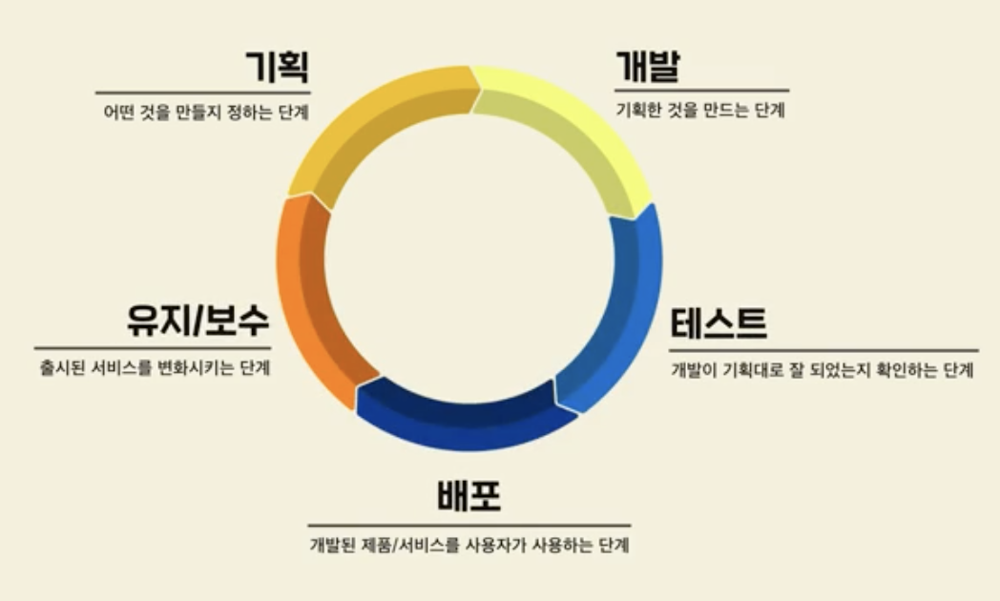
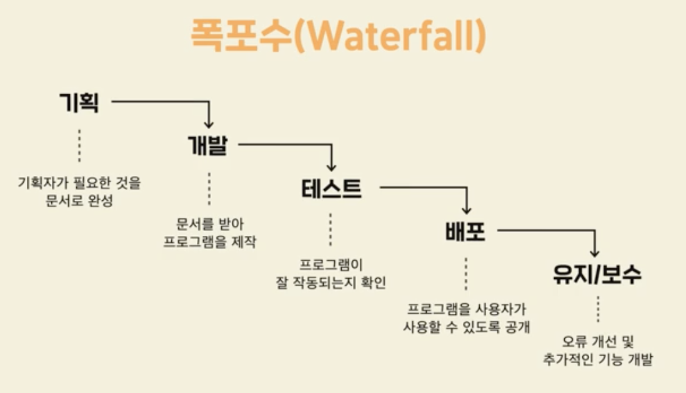
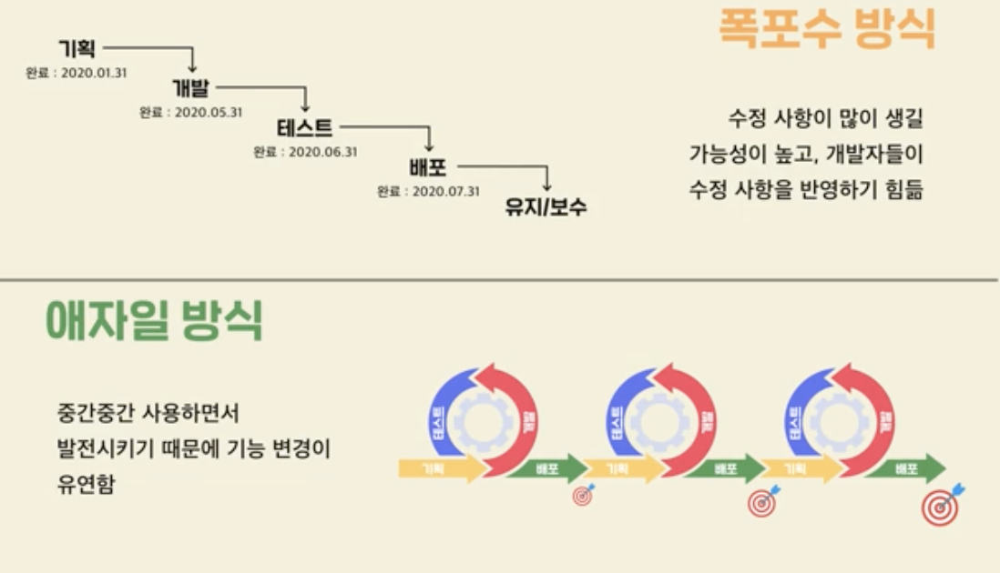

구조화가 잘된 코드

객체지향 프로그래밍

### 디자인패턴

>  오류가 자주나는 패턴을 정형화 시킨 것.

### 라이브러리 VS 프레임워크

#### 라이브러리

> 자주 쓰일법한 코드를 이미 누가 만든 도구들을 그대로 가져와 사용하는 것. 
>
> 개인카페 운영 시 리즈한 커피 머신

#### 프레임워크

> 뼈대가 이미 준비되어 있다. 틀이 짜여 있음. -> 미처 생각하지 못한 부분도 구성이 되어 있기 때문에 견고한 프로그램 만드는데에도 도움.
>
> 스타벅스 가맹점

### 소프트웨어 공학

### 프로세스 관리

1. #### 폭포수방식 (Waterfall)

   

   - 단점 : 각 단계를 완벽하게 끝내기 힘들 수 있다.

   - 각 단계가 복잡하지 않다면 유용할 수 있다.

     

2. #### 애자일 (Agile)

> 적당하게 빠르게 만들고 소통을 통해 개선해나간다.
>
> scrum, kanban 방식

3. #### 애자일 VS 폭포수

### 테스트 프로세스

- 버그 관리 툴 활용 (이슈 트래킹 툴)
  - Jira
  - Asana 등등..

- 이슈의 상태
  - Open : 이슈가 생김
  - In-Progress : 개발자가 객선 작업 진행
  - Resolved : 문제 해결
  - Closed : 테스트 결과 버그가 잘 해결됨
  - Reopen : 추가적인 문제 발생시 다시 Open으로 돌아감
    - 각 단계에서 담당자를 지정 : Assign

- 

