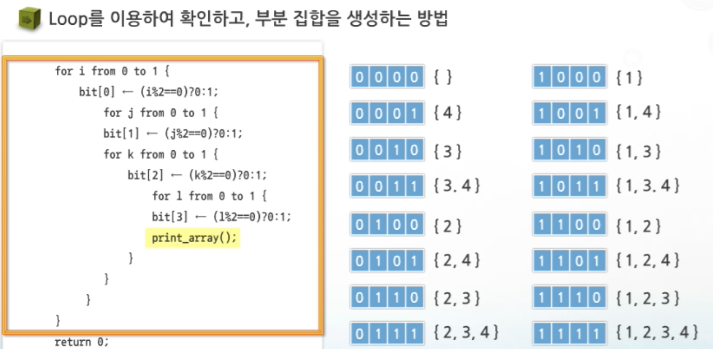
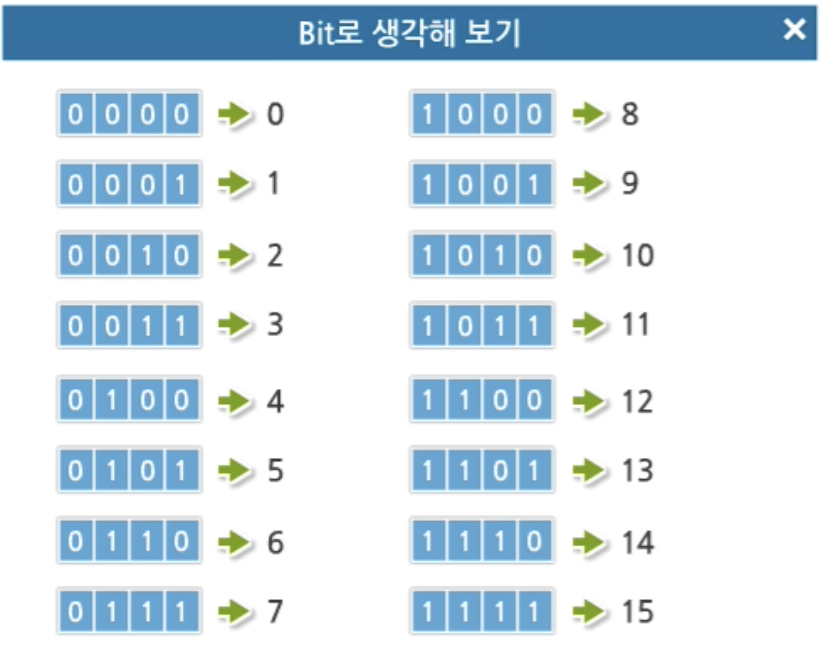

## Array

### Array순회

- N x M 행렬의 원소를 빠짐없이 조사하는 방법

  1. 행 우선 선회

     - 행을 우선으로 Array의 원소를 조사하는 방법

       가로로 쭈우우우우욱

  2. 열 우선 선회

     - 열을 우선으로 Array의 원소를 조사하는 방법

       세로로 쭈우우우우욱

  3. 지그재그 순회

     - 첫행은 우측, 다음행은 좌측으 조사

     - ```c
       int i; // 행으 좌표
       int j; // 열의 좌표
       
       for i from 0 to n-1
         for j from - to m-1
           Array[i][j+(m-1-2*j) *(i %2)];
       
       ```

### 델타를 이용한 2차 Array탐색

- 2차 Array의 한 좌표에서 네 방향의 인접 Array 요소를 탐색할  때 사용하는 방법

- **델타값** ; 한 좦에서  네 방향의 자표와 x, y의 차이를 저장한 Array

- 델타값을 이용해 특정 원소의 상하좌우에 위치한 원소에 접근

- ```c
  dx[] <- {0,0,-1,1};
  dy[] <- {-1,1,0,0};
  
  for x,y from 0. to n-1
    for i from.0 to 3{
      testX <- x + dx[mode];
      testY <- y + dy[mode];
      test(ary[testX][testY]);
    }
  ```


### 전치 행렬

- 행과 열의 값이 반대인 행렬

- ```c
  int arr[3][3];
  int i;
  int j;
  
  for i from 0 to 2
    for j from 0 to 2
      if(i<j)
        swap(arr[i][j], arr[j][i]);
  ```

- 모든 좌표에 대해 행과 열의 값을 바꾸면 원래상태로 돌아온다.!


## 부분집합

### 부분집합의 합 문제

> 집합 안의 원소를 모두 더한 값이 0 이 되는 경우가 있는지 조사하는 문제

- 모든 부분집합을 생성한 후 , 각 부분집합의 합을 계산

  - 주어진 **부분집합을 생성하는 방법** 생각하는게 우선

  - 원소가 집합의 원소로 포함되어 있는지 확인

    1. for문 확인

       ```c
       main(void){
         i,j,k,l;
         for i from 0 to 1{
           bit[0] <- (i%2==0)? 0:1; 	//0번째원소
           	for j from.0 to 1{
               bit[1] <-(j%2==0)?0:1;	//1번째원소
               	for k from 0 to 1{
                   bit[2] <- (k%2==0)? 0: 1;	//2번째원소
                   	for l from 0 to 1{
                       bit[3] <- (l%2 ==0) ? 0:1;	//3번째원소
                       print_array();
                     }
                 }
             }
         }
       }
       ```

       원소가 3개면 `2^3 = 8`, 4개면 `2^4=16` 즉, 중첩for문 수가 많아지는 비효율 발생.

       </br>

       

    2. 비트 연산자 이용

       ```c
       #include <stdio.h>
       
       int main(void){
           int i, j;
           int arr[] = {3,6,7,1,5,4};
       
           int n = sizeof(arr) /sizeof(arr[0]);
       
           for ( i = 0; i < (1<<(n)); i++)
           {
               for ( j = 0; j < n; j++)
               {
                   if(i&(1<<j)){
                       printf("%d, ", arr[j] );
                   }
               }
               
               printf("\n");
           }
       
        return  0;   
       }
       ```

       

  - 출력 여부를 가리키는 비트Array를 이용한다.

  - 

    </br>

    </br>

    

  - *비트로 생각해보면?*

    


## 검색

> 원하는 항목(목적하는 **탐색키** (자료를 구별하여 인식할 수 있는 키)를 가진 항목)을 찾는 작업 

### 종류

1. 순차검색
2. 이진검색
3. 인덱싱

### 순차검색

> 일렬로 된 자료를 순서대로 검색하는 방법
>
> <u>Array, 연결리스트</u> 등 순차구조로 구현된 자료구조에서 <u>유용</u>하다.

- 검색 대상이 많으면 수행시간이 급격히 증가해 비효율적

</br>


- 정렬되어 있는 경우
  - *오름차순*으로 정렬되어 있을 때,
    - 순차적으로 검색, 원소의 키 값이 검색하고 있는 값보다 크면 검색 종료
    - <u>평균 비교 횟수가 **반**으로 줄어든다</u>
    - 시간 복잡도 : O(n)

</br>

- 정렬되어 있지 않은 경우
  - 검색대상과 키 값이 같은 원소가 있는지 비교
  - 키 값이 있으면 인덱싱 반환 
  - 원소의 순서에 따라 비교 횟수가 결정된다.---> 평균 비교 횟수 : `(n+1)/2` 회
  - 시간 복잡도 : O(n)

### 이진검색

> 순차보다 효율적, **자료의 가운데**에 있는 키 값과 비교 후 다음 검색위치를 결정
>
> 목적키를 찾을 때 까지, 이진 검색을 순환적으로 반복수행
>
> 자료가 **정렬된 상태**여야한다.

- 과정
  1. 자료 중앙 원소 선택
  2. 중앙원소 값과 목표값 비교
  3. 목표값<중앙원소값 : 왼쪽 반에 대해 새로 검색 수행
     목표값>중앙원소값 : 오른쪽 반에 대해 새로 검색 수행
- 검색범위의 **시작점**과 **종료점**을 이용
- 자료 삽입 또는 삭제가 되면 항상 정렬을 다시 해줘야함

### 인덱스

> DB에서 유래
>
> 테이블에 대한 동작속도를 높여주는 자료 구조
>
> 데이터베이스 부냥가 아닌 곳에서는 Look up table등의 용어를 사용하기도 한다.

- 저장공간
  - 저장하는데 필요한 디스크 공간보다 작음
  - Only **키 - 필드**, 다른 세부항목은 없음
  - **배열**을 사용 

</br>

</br>

</br>


## 정렬

- **셀렉션 알고리즘**

> 저장된 자료로 보투 k번째로 큰 혹은 작은 원소를 찾는 방법
>
> 최소값, 최대값 혹은 중간값을 찾는 알고리즘을 의미

- 과정
  1. 정렬 알고리즘을 이용하여 자료 정렬
  2. 원하는 순서에 있는 원소 가져오기

### 선택정렬

- 시간 복잡도 : O(n^2)
- 셀렉션 알고리즘 적용
- 최솟값을 선정하고 처음 기준위치부터 차례대로 비교하면서 교환한다.


## String

- 숫자로 이루어진 문자열 <-> 숫자로
  - `itoa()`
  - `atoi()`

 

## DP (동적계획법) Dynamic Programming

​    \- 그리디 알고리즘 설계기법과 같이 최적화 문제를 해결하는 알고리즘 설계 기법

​    \- 입력크기가 작은 부분들을 모두 해결하고 그 해들을 이용해 보다 큰 크기의 문제들을 해결하는 방법


1) 문제를 부분문제로 분할

2) 가장 작은 부분 문제부터 해를 구함

3) 그 결과를 테이블에 저장 후 테이블에 저장된 부분 문제의 해를 이용해 상위문제를 해결한다.


구현방식

1. recursive방식

​    \- 내부에 시스템 호출 Stack을 사용하는 overhead가 발생할 수 있다.

2. 반복문 iterative방식

​    \- 재귀보다 성능면에서 보다 효율적


### Memoization

메모리에 넣기

\- 이전 계산 값을 메모리에 저장해 매번 다시 계산하지 않도록해 실행속도를 빠르게 하는 기술

\- DP(동적계혹)의 핵심이 되는 기술


## DFS (깊이우선탐색)

\- 비선형적 구조인 그래프 구조는 그래프로 표현된 모든 자료를 빠짐없이 검색하는 것이 중요하다.

\- 깊이우선탐색(DFS)

\- 너비우선탐색(BFS)


한 방향으로 갈 수 있는 경로가 있는곳까지 깊이 탐색

다시 되돌아오기 위해 Stack을 사용했다.