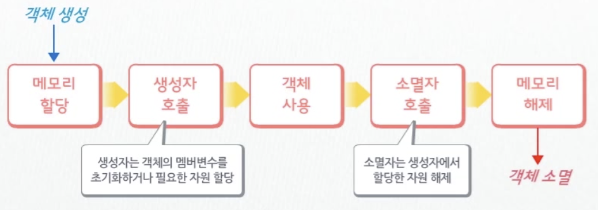

# C++ 객체 프로그래밍


</br>

## 객체지향 프로그래밍

> 객체 (처리해야 할 대상을 표현 )들을 모아 하나의 프로그램을 완성하는 것


</br>

- ### 장점

  - 객체 안에 문제 발생 시 다른 객체에 영향 X

    - 모듈간 **독립성** 보장

  - 객체로 접근 시 이용하는 **인터페이스의 변경 없이** 객체 내부를 변경, 확장

    - 프로그램 **수정**이 용이함.

  - 기존의 크도를 최대한 **재사용**

    - 생산성 향상

    </br>

- ### 소스파일과 헤더파일

  

  </br>

  - 여러개를 만들면 *중복될 수 있기 때문에 이를 방지*하기 위해,

    - 헤더파일 `(~.h)`

      ```c++
      #ifndef_SAMPLE_H : 개발자가 임의 지정
      #define _SAMPLE_H
      	함수선언
        구조체선언
        클래스선언
      #endif
      ```

      - `#ifndef_SAMPLE_H `: 개발자가 임의 지정
      - `#define _SAMPLE_H` : 동일하게 적용해야 함.

      </br>

    - 소스파일 `(~.cpp`)

      ```c++
      #include "sample.h"  
      #include <iostream>
      ```

      - `#include "sample.h"  ` : 사용자가 생성한 헤더파일은  `""` 이용
      - `#include <iostream> ` : 컴파일러에서 제공하는 헤더파일 : `< >` 이용

      </br>

- 가장 먼저 **설계도 (클래스) 정의**

  - 구성요소들을 **모델링**하여 **클래스의 멤버**로 구성하는것
    - *새로 만들거나 기존에 개발된 클래스 이용 가능*


### 클래스

> 객체를 표현하기 위해 필요로 하는 속성들을 파악한 후 불필요한 요소들을 제거하고 **모델링**하여 만든 일종의 **설계도**

- 클래스 작성 방법은 구조체와 유사한 구조
  - *구조체*는 프로그램 내의 어떤 함수에서도 **접근 가능**
  - *클래스*는 **접근 제한**을 둘 수 있어 정보를 보호할 수 있다.

</br>

- #### 구성요소

  - **원칙**

    - **멤버변수**

      : 정보(데이터), 객체의 상태 => **`private, protected` 로 지정**

    - **멤버함수**

      : 연산, 처리 등의 동작 => **`public` 으로 지정**

    - 멤버 함수를 통해서만 멤버변수들 접근

    - 외부에서 멤버변수를 직접 접근할 수 없도록 함

  - **주의**
    - 접근지정자를 지정하지 않으면 기본 지정자는 `private` 이다. 멤버함수도 이용할 수 없다.

  #### 형식

  ```c++
  class 클래스명{
    [private:	// 클래스 내부에서만 접근 가능(외부 접근 불가)
    protected: // 클래스 내부 or 이 클래스로부터 파생한 클래스 내부에서만 접근 가능
    public:]	// 클래스 내외 모두 접근 가능
    [멤버변수 선언;]
  };
  ```

  *예*

  ```c++
  class Point{
    private:
    //멤버변수로 x,y 설계
    int x;	
    int y;
    
    public:
    // 멤버함수로 Print설계
    void Print();	
  }
  ```

  - Point클래스로 생선된 객체에서는 **Print멤버 함수만 이용 가능**하다.(`public`)


</br>

#### 멤버함수

> 주로 멤버변수의 참조나 변경 등을 처리하는 함수 => **`메서드` 라고도 한다.**

- 멤버함수의 정의는 클래스 선언문 안에 함께 기술하기도 하나 일반적으로 **외부에 따로 정의**한다.

- 형식

  - 일반함수 정의와 동일한 방법으로 정의
  - `::` 클래스 앞에서만을 의미

  ```c++
  리턴자료형 클래스명::멤버변수형([자료형 매개변수], ...)
  { 
  [명령문;]
  }
  ```

  

- *예*

  - **Point클래스 선언**

  ```c++
  class Point{
    
    private:
    int x;
    int y;
    
    public:
    void Print();
  };
  ```

  - **멤버함수 정의**

  ```c++
  void Point::Print(){
    cout<<"x = " << x<< ", y = "<< y << endl;
  }
  ```

  - **멤버함수의 정의**는 일반적으로 **소스파일**에 작성
    - <u>클래스의 구현파일</u>
    - 각 클래스마다 헤더파일과 소스파일이 한 세트씩 존재

</br>


#### 객체선언

- 클래스 선언 ->   멤버함수. 정의.              ->  프로그램 사용 불가

  사용자 정의 ->   객체(자료형의 변수) 생성. ->. 프로그램 사용 가능

- 객체 선언 형식
  - `클래스명 객체명;`
  - 객체를 선언하면 **메모리**를 할당 받음
- 객체(자료형의 변수) 생성 -> 멤버변수,, 멤버함수를 접근해서 객체의 제어 가능
  - 멤버 사용형식
    - `객체명. 멤버변수(함수())` : 구조체에서 멤버를 표현하는 방법과 같다.
    - `Point p;  ` (객체선언)  ==> `p.Print();` , `p.SetX(10);` ( 멤버사용)

- 객체 초기화 방법

  1. 중괄호

     `Point obj ={10,10};` 

     : 클래스의 멤버변수가 `public` 영역에 선언되어 있을때만 가능 (private영역에 선언되어 있을 때는 불가)

  2. 생성자

     : **클래스 안**에 정의되는 함수이므로 `private`영역에 설정된 멤버변수도 접근 가능

</br>

### 생성자와 소멸자

- 객체 생성과 소멸 과정

  

- **자동**으로 호출되는 함수

- 모두 리턴값이 없는 함수, void자료형도 사용 X

</br>

- **생성자**
  - 객체 준비 함수
  - 클래스 이름과 동일한 이름의 함수명
  - 인자를 가질 수 있음
- **소멸자** 
  - 객체 정리 함수
  - 클래스이름과 동일한 이름 앞에 `~` 를 붙임
  - 인자를 가질 수 없다.


</br>

#### 생성자 함수의 종류

1. 디폴트 생성자

   > **인자 없이** 호출되는 생성자

2. 인자 있는 생성자

   > 객체 생성 시 **전달하는 인자**에 의해 호출되는 생성자

3. 복사 생성자

   > 이미 생성된 다른 객체의 값을 이용하여 초기화하는 생성자

</br>

- 디폴트 생성자의 형식과 예시

  ```c++
  Point::Point(){
    x = 0;
    y = 0;
  }
  
  Point p; // 디폴트 생성자 호출
  ```

  - 클래스 선언 시 생성자 함수는 멤버변수와 마찬가지로 **`public` 접근 지정자**로 지정
    - `private`, `protected`로 하면 객체 생성을 할 수 없기 때문

</br>

- 인자 있는 생성자의 형식과 예시

  ```c++
  // 인자 있는 생성자 함수 정의
  Point::Point(int xpos, int ypos)
  {
    
    x = xpos;
    y = ypos;
  }
  
  // 객체 생성시 인자있는 생성자 함수 호출
  Point obj(5,10);
  ```

  - 멤버함수에 디폴트 매개변수를 지정할때는 멤버함수의 선언부분에서 지정

    ```c++
    public:
    	
      //디폴트 생성자 ==> 제거
    	Point();
    
      //디폴트 매개변수 함수 ==> 생성자 함수로 이용
    	Point(int x = 0, int y = 0);
    
    ```

    - 동시이 함께 정의되어 있으면 호출되어야 할 함수가 불명확 --> 컴파일 에러

    - **디폴트 생성자를 없애햐 한다.**   생성자 함수를 중복정의(오버로딩) 시 명확하게 정의해야 함.

      

- 복사생성자

  - 얕은 복사 VS 깊은 복사
    - 객체 복사시 객체의 멤버를 1:1로 복사한다.
  - 얕은 복사
    - 동적 메모리가 할당된 경우 문제 발생 가능
  - 깊은 복사
    - 완전한 형태의 복사
    - 메모리를 공유하는 문제가 없다
  - 인자로 전달된 객체의 멤버변수에 있는 값을 **현재 객체의 멤버변수에 복사**
  - 개발자가 따로 작성하지 않으면 복사 **생성자는 컴파일러에 의해 자동으로 생성** (디폴트 복사 생성자)

  ```c++
  // Point 클래스의 복사 생성자
  Point::Point(const Point& p){
    x = p.x;
    y = p.y;
  }
  ```

  

