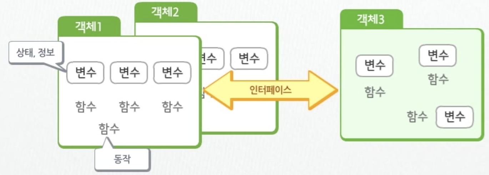
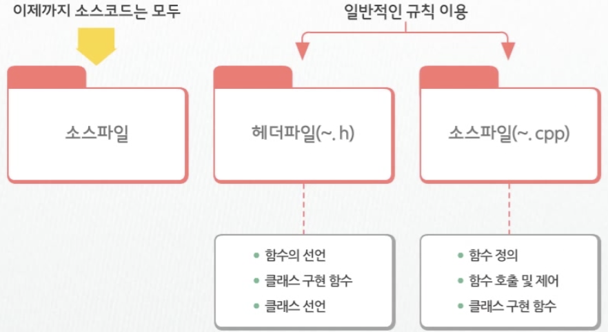
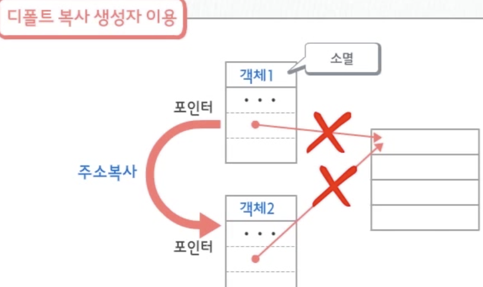

# C++ 객체 프로그래밍


</br>

## 객체지향 프로그래밍

> 객체 (처리해야 할 대상을 표현 )들을 모아 하나의 프로그램을 완성하는 것



</br>

- ### 장점

  - 객체 안에 문제 발생 시 다른 객체에 영향 X

    - 모듈간 **독립성** 보장

  - 객체로 접근 시 이용하는 **인터페이스의 변경 없이** 객체 내부를 변경, 확장

    - 프로그램 **수정**이 용이함.

  - 기존의 크도를 최대한 **재사용**

    - 생산성 향상

    </br>

- ### 소스파일과 헤더파일

  

  </br>

  - 여러개를 만들면 *중복될 수 있기 때문에 이를 방지*하기 위해,

    - 헤더파일 `(~.h)`

      ```c++
      #ifndef_SAMPLE_H : 개발자가 임의 지정
      #define _SAMPLE_H
      	함수선언
        구조체선언
        클래스선언
      #endif
      ```

      - `#ifndef_SAMPLE_H `: 개발자가 임의 지정
      - `#define _SAMPLE_H` : 동일하게 적용해야 함.

      </br>

    - 소스파일 `(~.cpp`)

      ```c++
      #include "sample.h"  
      #include <iostream>
      ```

      - `#include "sample.h"  ` : 사용자가 생성한 헤더파일은  `""` 이용
      - `#include <iostream> ` : 컴파일러에서 제공하는 헤더파일 : `< >` 이용

      </br>

- 가장 먼저 **설계도 (클래스) 정의**

  - 구성요소들을 **모델링**하여 **클래스의 멤버**로 구성하는것
    - *새로 만들거나 기존에 개발된 클래스 이용 가능*


### 클래스

> 객체를 표현하기 위해 필요로 하는 속성들을 파악한 후 불필요한 요소들을 제거하고 **모델링**하여 만든 일종의 **설계도**

- 클래스 작성 방법은 구조체와 유사한 구조
  - *구조체*는 프로그램 내의 어떤 함수에서도 **접근 가능**
  - *클래스*는 **접근 제한**을 둘 수 있어 정보를 보호할 수 있다.

</br>

- #### 구성요소

  - **원칙**

    - **멤버변수**

      : 정보(데이터), 객체의 상태 => **`private, protected` 로 지정**

    - **멤버함수**

      : 연산, 처리 등의 동작 => **`public` 으로 지정**

    - 멤버 함수를 통해서만 멤버변수들 접근

    - 외부에서 멤버변수를 직접 접근할 수 없도록 함

  - **주의**
    
  - 접근지정자를 지정하지 않으면 기본 지정자는 `private` 이다. 멤버함수도 이용할 수 없다.
  
#### 형식

  ```c++
  class 클래스명{
    [private:	// 클래스 내부에서만 접근 가능(외부 접근 불가)
    protected: // 클래스 내부 or 이 클래스로부터 파생한 클래스 내부에서만 접근 가능
    public:]	// 클래스 내외 모두 접근 가능
    [멤버변수 선언;]
  };
  ```

*예*

  ```c++
  class Point{
    private:
    //멤버변수로 x,y 설계
    int x;	
    int y;
    
    public:
    // 멤버함수로 Print설계
    void Print();	
  }
  ```

  - Point클래스로 생선된 객체에서는 **Print멤버 함수만 이용 가능**하다.(`public`)


</br>

#### 멤버함수

> 주로 멤버변수의 참조나 변경 등을 처리하는 함수 => **`메서드` 라고도 한다.**

- 멤버함수의 정의는 클래스 선언문 안에 함께 기술하기도 하나 일반적으로 **외부에 따로 정의**한다.

- 형식

  - 일반함수 정의와 동일한 방법으로 정의
  - `::` 클래스 앞에서만을 의미

  ```c++
  리턴자료형 클래스명::멤버변수형([자료형 매개변수], ...)
  { 
  [명령문;]
  }
  ```

  

- *예*

  - **Point클래스 선언**

  ```c++
  class Point{
    
    private:
    int x;
    int y;
    
    public:
    void Print();
  };
  ```

  - **멤버함수 정의**

  ```c++
  void Point::Print(){
    cout<<"x = " << x<< ", y = "<< y << endl;
  }
  ```

  - **멤버함수의 정의**는 일반적으로 **소스파일**에 작성
    - <u>클래스의 구현파일</u>
    - 각 클래스마다 헤더파일과 소스파일이 한 세트씩 존재

</br>


#### 객체선언

- 클래스 선언 ->   멤버함수. 정의.              ->  프로그램 사용 불가

  사용자 정의 ->   객체(자료형의 변수) 생성. ->. 프로그램 사용 가능

- 객체 선언 형식
  - `클래스명 객체명;`
  - 객체를 선언하면 **메모리**를 할당 받음
- 객체(자료형의 변수) 생성 -> 멤버변수,, 멤버함수를 접근해서 객체의 제어 가능
  - 멤버 사용형식
    - `객체명. 멤버변수(함수())` : 구조체에서 멤버를 표현하는 방법과 같다.
    - `Point p;  ` (객체선언)  ==> `p.Print();` , `p.SetX(10);` ( 멤버사용)

- 객체 초기화 방법

  1. 중괄호

     `Point obj ={10,10};` 

     : 클래스의 멤버변수가 `public` 영역에 선언되어 있을때만 가능 (private영역에 선언되어 있을 때는 불가)

  2. 생성자

     : **클래스 안**에 정의되는 함수이므로 `private`영역에 설정된 멤버변수도 접근 가능

</br>

### 생성자와 소멸자

- 객체 생성과 소멸 과정

  

- **자동**으로 호출되는 함수

- 모두 리턴값이 없는 함수, void자료형도 사용 X

</br>

- **생성자**
  - 객체 준비 함수
  - 클래스 이름과 동일한 이름의 함수명
  - 인자를 가질 수 있음
- **소멸자** 
  - 객체 정리 함수
  - 클래스이름과 동일한 이름 앞에 `~` 를 붙임
  - 인자를 가질 수 없다.


</br>

#### 생성자 함수의 종류

1. 디폴트 생성자

   > **인자 없이** 호출되는 생성자

2. 인자 있는 생성자

   > 객체 생성 시 **전달하는 인자**에 의해 호출되는 생성자

3. 복사 생성자

   > 이미 생성된 다른 객체의 값을 이용하여 초기화하는 생성자

</br>

- ##### 디폴트 생성자의 형식과 예시

  ```c++
  Point::Point(){
    x = 0;
    y = 0;
  }
  
  Point p; // 디폴트 생성자 호출
  ```

  - 클래스 선언 시 생성자 함수는 멤버변수와 마찬가지로 **`public` 접근 지정자**로 지정
    - `private`, `protected`로 하면 객체 생성을 할 수 없기 때문

</br>

- ##### 인자 있는 생성자의 형식과 예시

  ```c++
  // 인자 있는 생성자 함수 정의
  Point::Point(int xpos, int ypos)
  {
    
    x = xpos;
    y = ypos;
  }
  
  // 객체 생성시 인자있는 생성자 함수 호출
  Point obj(5,10);
  ```

  - 멤버함수에 디폴트 매개변수를 지정할때는 멤버함수의 선언부분에서 지정

    ```c++
    public:
    	
      //디폴트 생성자 ==> 제거
    	Point();
    
      //디폴트 매개변수 함수 ==> 생성자 함수로 이용
    	Point(int x = 0, int y = 0);
    
    ```

    - 동시이 함께 정의되어 있으면 호출되어야 할 함수가 불명확 --> 컴파일 에러
    - **디폴트 생성자를 없애햐 한다.**   생성자 함수를 중복정의(오버로딩) 시 명확하게 정의해야 함.
  
  </br>
  
- **디폴트 생성자, 인자 있는 생성자** => 멤버변수 초기화 문제로 **직접 작성**

  - 생성자를 만들지 않아도 얼마든지 객체 생성 가능하지만, 

    - 생성자 함수가 없는 경우에는 컴파일러가 **자동으로 생성**함.

    - *자동 생성된 생성자 함수는 아무 명령도 없는 **빈 함수**로 만들어진다*

      </br>

  - 멤버변수에 **const, 레퍼런스형**이 있다면?

    - **반드시 생성자 함수가 있어야 객체 생성 가능하다.**

      - *`const` 나 레퍼런스는 **선언**과 동시에 **초기화** 되어야 하기 때문이다*

      

      - ```c++
        Point::Point(int xpos,int ypos)
         :x(xpos), y(ypos) //const나 레퍼런스가 있어도 생성자 함수에서 초기화 가능
          {
          }
        ```

        

</br>


- ##### 복사생성자

  - 얕은 복사 VS 깊은 복사
    - 객체 복사시 객체의 멤버를 1:1로 복사한다.
  - 얕은 복사
    - 동적 메모리가 할당된 경우 문제 발생 가능
  - 깊은 복사
    - 완전한 형태의 복사
    - 메모리를 공유하는 문제가 없다
  - 인자로 전달된 객체의 멤버변수에 있는 값을 **현재 객체의 멤버변수에 복사**
  - 개발자가 따로 작성하지 않으면 복사 **생성자는 컴파일러에 의해 자동으로 생성** (디폴트 복사 생성자)

  ```c++
  // Point 클래스의 복사 생성자
  Point::Point(const Point& p){
    x = p.x;
    y = p.y;
  }
  Point p1(10,20);
  Pint p2(p1); //디폴트 복사 생성자를 이용해 객체를 초기화 하는 경우 
  (Point p2 = p1;)
  ```

  


#### 소멸자 함수

- 중복정의 불가, **오직 한개만 작성**


</br>

</br>

### 멤버와 클래스의 활용

1. #### 정적멤버변수

   - 멤버변수는 *객체마다 메모리를 따로 할당 받아 사용*하지만, 
   - **정적멤버 변수**는 **클래스 내 오직 하나만 존재**하므로 **모든 객체가 공동으로 사용 가능하다.**

   - `static 자료형 멤버변수명;`

   - 프로그램 실행시 생성, 종료시 소멸, 객체 생성되지 않아도 사용 가능

   - **클래스 외부에서 전역변수로 정의**

     - `자료형 클래스명::멤버변수명[=초기값];` 
     - 정적멤버 변수는 특정 객체의 소유가 아니라 **클래스 자체의 소유**
     - 정적멤버 변수는 **클래스 자체, 객체 전체에 관한 정보를 저장**하는 용도로 사용

     ```c++
     class Point{
       private:
       int x, y;
       public:
       ...
       // 정적멤버변수 선언
       static int pointCount;
     };
     
     //정적멤버 변수 정의
     int Point::pointCount = 0;
     point::Point()
     {
       pointCount++;
     }
     
     int main(){
       cout<<Point::pointCount<<endl;
     }
     ```


   </br>

2. #### 정적멤버함수

   > **정적멤버 변수에 접근**하는 함수로 객체와 무관하게 **언제든지 호출 가능한 함수**

   

   </br>
   
3. #### const객체

   - `const Point p(1,20);` 
     -  객체 p는 상수로 값을 변경할 수 없다.
     - 상수객체의 멤버함수도 전혀 호출할 수 없다.
       - 멤버함수에서 값이 변경될 수 있기 때문.

   - `p.Print();` 

     - 컴파일 시 오류 , 컴파일 중단
     - **멤버함수를 `const` 함수로** 만들면 `const` 객체에서 사용 가능

     </br>

4. #### const함수 

   > 멤버변수의 값을 변경하지 않는 함수, 멤버함수의 잘못된 접근이 일어나지 않도록 해준다

   ```c++
   class Point{
     ...
       public:
     		Print() const; //Print함수를 const로 변경
     		...
   };
   
   void Print::Print() const
   {
     ...	// 함수 안에서 멤버들이 변경되지 않음
       	// const객체의 멤버 함수 호출 가능
   }
   ```

   

</br>

</br>

### 객체배열과 동적 객체

- 객체 배열
- 동적객체
- 동적객체 배열

#### 객체 배열

배열을 이용하면 다수의데이터를 쉽게 처리 가능.

> 객체배열을 이용하면 동일한 클래스의 객체들을 쉽게 관리 가능 ==> **원소를 객체 단위로 처리**

- `Point  array[3];` 
  - Point 객체 3개 생성
  - 별도의 초기화 없으면 **디폴트 생성자 호출**
- `Point array[3] = {Point(5,5), Point(10,10), Point(20,10)};`
  -  각각 인자 있는 생성자 호출
  - 첨자를 통해 각 객체로 접근 가능
  - 원소 접근 시 하나의 객체와 동일
  - `array[0].Print();` => `x =5, y = 5`출력
  - `array[1].setY(0);` => `y = 0` 으로 설정
  - `cout<< array[2].GetX();` => 20출력

</br>

#### 동적객체

- 프로그램 실행시 메모리의 동적 할당을 위해 `new` 연산자 이용 => 객체의 동적 할당을 위해 `new` 연산자 이용

- `클래스명* 객체포인터명 = new 클래스명;` //디폴트 생성자

  `클래스명* 객체포인터명 = new 클래스명(인자 목록);` //인자있는 생성자

- 구조체 포인터 

  - 객체포인터를 통해 멤버에 접근할 때에는 **`->`** 연산자 이용

- 동적객체를 더이상 사용하지 않으면 `delete` 연산자로 해제

  - `delete 객체포인터명;` 

  - ```c++
    Point*ptr1 = new Point;
    Point*ptr2 = new Point(10,20);
    
    ptr1 -> Print();
    ptr2 -> GetY();
    
    delete ptr1;
    ptr1 = NULL;
    delete ptr2;
    ptr2 = NULL;
    ```

    

- *Example*

  ```c++
  cin >> size;
  Point *ptr = new Point[size];
  
  for(int i = 0; i< size; i++){
    ptr[i]. Print();
  }
  
  delete[] ptr;
  ```

  - `new` 연산자로 동적 객체 배열 생성
  - `[ ]`로 원소에 접근
  - 원소 하나하나는 동적 객체와 동일하게 다룰 수 있음.
  - `delete[]` 로 해제
  - **동적 객체 배열은 항상 디폴트 생성자로 초기화**해야 한다.

</br>

### this 포인터 변수와 복사 생성자

#### this포인터 변수

> ​	멤버함수를 호출한 **객체 자신에 대한 주소를 보관**하는 변수로 **컴파일러에 의해 자동으로 생성**

- `this -> 멤버변수` : 현재 실행중인 객체의 특정 멤버변수

- `*this` : 현재 실행중인 객체의 모든 멤버변수

- *Example*

  ```c++
  void Point::SetX(int xpos){
    x.= xpos;
  }
  // 매개변수와 멤버변수의 이름이 동일한 경우 혼돌될 수 있어 서로 변수명을 다르게 구성
  
  
  void Point::SetX(int x){
    this -> x = x;
    //  멤버변수x = 매개변수x
  }
  ```

  </br>

- 모든 멤버함수에서 이용 가능

- 정적 멤버함수에서는 사용 불가

  - 여러 객체가 공유하는 함수이기 때문

- *Point객체의 경우 컴파일러에 의해 자동 생성되는 복사 생성자 이용하면 되지만*

  **클래스 내 포인터 멤버변수가 동적 메모리를 참조**할 경우 직접 복사 생성자를 정의해야 한다.

- 객체1의 메모리를 해제할 경우 아래 그림처럼 객체2도 해제가 되어 사용하지 못하게 되기 때문이다.

  

  </br>

- 복사 생성자 외에도 **대입연산자, 소멸자 등도 직접 정의**해야 한다.

  

  </br>

- *Example*

  - *Header 파일*

    ```c++
    #ifndef PERSON_H
    #define PERSON_H
    
    class Person
    {
    private:
        char *name; // 멤버변수 name은 포인터변수 (동적메모리를 할당받아 사용하는 멤버)
        int age;
    
    public:
        Person();
        Person(const char *name, int age);
        Person(const Person &arg);
        ~Person();
        void Show() const;
    };
    
    #endif
    ```

    </br>

  - *cpp파일*

    ```c++
    #include "thisPointer.h"
    #include <iostream>
    #include <cstring>
    
    using namespace std;
    
    // 디폴트 생성자
    Person::Person()
    {
        name = new char[20];
        strcpy(name, "");
        age = 0;
        cout << "디폴트 생성자" << endl;
    }
    
    // 인자있는 생성자
    Person::Person(const char *name, int age)
    {
        this->name = new char[20];
        strcpy(this->name, name);
        this->age = age;
        cout << "인자 있는 생성자" << endl;
    }
    
    //복사 생성자
    Person::Person(const Person &arg)
    {
    
        // 동적 메모리 할당 받음 (new)
        name = new char[20];
    
        // 메모리 복사, 주소 복사가 아닌 메모리의 내용이 복사됨
        strcpy(name, arg.name);
        age = arg.age;
        cout << "복사 생성자" << endl;
    }
    
    Person::~Person()
    {
        //메모리 해제
        delete[] name;
        cout << "소멸자" << endl;
    }
    
    void Person::Show() const
    {
        cout << "name : " << name << ", age : " << age << endl;
    }
    
    int main()
    {
        Person p1("홍길동", 24);
    
        Person p2(p1); //Person p2 = p1; // 복사 생성자로 객체 생성
        p2.Show();
    
        Person *ptr1 = new Person("허균", 59);
        Person *ptr2 = new Person(*ptr1); // 복사 생성자로 객체 생성
    
        ptr2->Show();
    
        delete ptr1;
        delete ptr2;
    
        return 0;
    }
    ```

    </br>

  - *결과*

    ```
    인자 있는 생성자
    복사 생성자
    name : 홍길동, age : 24
    인자 있는 생성자
    복사 생성자
    name : 허균, age : 59
    소멸자
    소멸자
    소멸자
    소멸자
    ```

    

</br>

</br>

### String 클래스

- 연산자를 이용해 **문자열 복사, 추가**등을 자유롭게 수행

- 다양한 멤버함수들을 이용한 문자열 처리가 매우 용이함.

- `#include <string>`

- 기능

  - `size(), length()` : 문자열 길이
  - `c_str()` : C 스타일 문자열로 변환
  - `substr`: 문자열 중 일부 추출
  - `find()` : 문자열 검색
  - `erase()` : 문자열 삭제
  - `>>` , ``getline()` : 스트림으로부터 문자열 입력, 공백 문자 포함 입력은 `getline`함수 이용
  - `<<` : 스트링으로 문자열 출력
  - `[]` : 첨자 위치의 문자로 접근

- *Example*

  ```c++
  #include <iostream>
  #include <string>
  #include <cstring> //strcpy 사용
  
  using namespace std;
  
  int main()
  {
  
      //string 객체 생성
      string s1, s2;
  
      cout << "문자열을 입력하세요 : ";
      getline(cin, s1);
      cout << "문자열을 입력하세요 : ";
      cin >> s2;
  
      if (s1 == s2)
      {
  
          cout << "두 문자가 동일합니다" << endl;
      }
      else
      {
          cout << "두문자가 다릅니다" << endl;
      }
  
  //  결합
      cout << "s1 + s2 : " << s1 + s2 << endl;
   
  // 대입
      s1 = s2;
      cout << "s1 = s2 : " << s1  << endl;
  
      char *ptr = new char[s1.size() + 1];
      strcpy(ptr, s1.c_str());
      cout << "ptr : " << ptr << endl;
  
      cout << "ll 단어의 시작 위치 " << s1.find("i") << endl;
      cout << "before s2 : " << s2 << endl;
  
      s2.erase();
      s2 = s2 + "C++";
      cout << "after s2 : " << s2 << endl;
  
      return 0;
  }
  
  
  문자열을 입력하세요 : hello c++
  문자열을 입력하세요 : hi
  두문자가 다릅니다
  s1 + s2 : hello c++hi
  s1 = s2 : hi
  ptr : hi
  ll 단어의 시작 위치 1
  before s2 : hi
  after s2 : C++
  ```

  