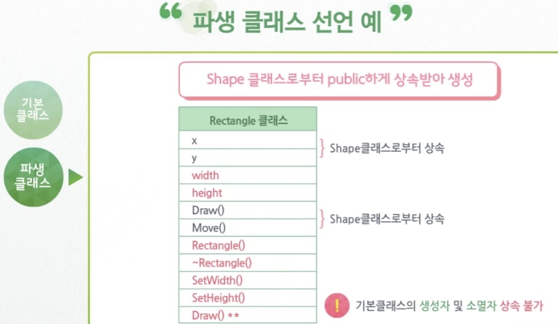

# 상속 & 도약

> 객체지향 프로그램의 핵심요소

1. [클래스상속](#inheritance)
2. 상속과 다형성
3. 추상 클래스
4. 다중 상속

</br>

## inheritance

> 기존에 정의된 클래스 멤버(변수, 함수)를 상속받아 새로운 멤버를 추가할 수 있는 기능

- 효율적 **유지보수** 가능

- 구성

  - 기본클래스 (상속해주는)
  - 파생클래스 (상속받는)

- #### 파생 클래스 선언 형식

  ```c++
  class 파생클래스명 [접근변경자] 기본클래스명 {
    [추가할 멤버 선언;]
    // 1. 상속받는 멤버
    // 2. 재정의한 멤버함수
    // 3. 새로 추가한 멤버 
  }
  ```

- 파생클래스 선언 예

  

  </br>

- #### 상속에서의 생성자 및 소멸자 호출 순서

  1. 기본 클래스 생성자
     - 기본 클래스로부터 상속 받은 멤버의 초기화 
  2. 파생 클래스 생성자
     - 추가된 멤버변수 초기화
     - 파생클래스 객체 생성 및 소멸 시 기본 클래스 생성자 및 소멸자의 호출은 가능하지만 상속은 불가능
  3. 파생클래스 소멸자
  4. 기본클래스 소멸자

</br>

- #### 인자를 필요로 하는 기본 클래스의 생성자 호출

  - 파생 클래스 생성자의 인자 전달 방법

    ```c++
    파생클래스명::파생클래스명(매개변수 목록)
      : 기본 클래스명(인자)
      {
        ...
      }
    ```

  - 기본 클래스 생성자의 인자 전달 방법

    ```c++
    기본클래스명::기본클래스명(매개변수 목록)
      :멤버변수(매개변수), ...
      {
        ...
      }
    ```

    - *초기화 리스트로 하지 않을 경우* 기본 클래스의 **디폴트 생성자**가 호출된다.
    - 직접 기본 클래스의 생성자 호출은 **객체의 임시 생성**에 불과하다.

</br>

- #### **접근 변경자**를 통한 세가지 형식의 상속

  ```c++
  class 파생클래스명:[접근변경자] 기본클래스명{
    [추가할 멤버 선언;]
  };
  ```

  - 상속에서의 접근 변경자 

    - `private`, `protected, ` `public`

      
